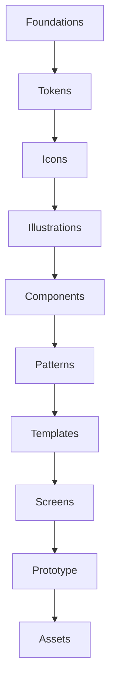

# FIGMA-01 — FOUNDATION & FILE ARCHITECTURE

*Translates the Product Bible (Modules 1–25) and Design Guide (DG01–DG05) into a buildable Figma file structure. This document makes no product decisions — every rule here exists to make an existing decision unambiguous to implement.*

---

## 1. Figma Project Architecture

One Figma **project**: `BeaconVie`. Within it, a small number of **files**, each containing multiple **pages**. Files are split by update cadence and audience, not by feature, so that a fast-moving Screens file doesn't force reviewers to wade through a slow-moving Foundations file.



| File | Contains | Update cadence | Owner |
|---|---|---|---|
| `BeaconVie / Foundations` | Tokens, Icons, Illustrations, Grid/Breakpoint specimens | Rare — requires Design Director sign-off (DG05) | Design System lead |
| `BeaconVie / Components` | All primitive components (FIGMA-03) and composite Patterns (FIGMA-04) | Moderate — requires dual Design+Frontend sign-off for the four flagged shared components (Memory Card, Insight Card, Report Timeline, AI Message) | Design System lead |
| `BeaconVie / Templates & Screens` | Screen templates and every finished screen (FIGMA-05/06/07) | Frequent — normal design review | Feature design leads |
| `BeaconVie / Prototype` | Linked, clickable prototype assembled from Screens file instances | Frequent, non-source-of-truth (never edit components here) | Feature design leads |
| `BeaconVie / Assets` | Export-ready marketing assets, app store assets, static illustration exports | As needed | Brand/Marketing design |

**Why five files and not one**: a single monolithic file becomes slow to load and creates merge-conflict-style contention between the small group maintaining Foundations/Components and the larger group building Screens day to day — this split mirrors Module 24's engineering module-boundary discipline applied to the design tool itself.

---

## 2. Page Structure (within each file)

### `Foundations`
```
Foundations
├── 📄 Cover (file purpose, version, changelog)
├── 🎨 Color Tokens
├── 🔤 Typography Tokens
├── 📐 Spacing & Radius Tokens
├── 🌗 Elevation & Shadow Tokens
├── 📱 Grid & Breakpoints
├── 🎬 Motion Tokens (specimen frames, not live animation)
├── ♿ Accessibility Tokens
└── 🖼️ Icon Set (full grid, all icons)
└── 🌌 Illustration Library (Constellation Thread density variants, empty-state motifs)
```

### `Components`
```
Components
├── 📄 Cover
├── 🧱 Primitives (Button, Input, Checkbox, Radio, Switch, Select, Avatar, Badge, Chip, Tag, Tooltip, Toast, Progress)
├── 🗂️ Containers (Card, Dialog, Drawer, Bottom Sheet, Table, Calendar)
├── 🧭 Navigation (Sidebar, Topbar, Tabs, Global Nav, Search Box, Pagination)
├── 📊 Data Display (Timeline, Notification, List)
├── 🕳️ System States (Empty State, Loading State, Error State, Skeleton)
├── 🌌 AI & Relationship Patterns (Memory Card, Insight Card, Report Card, AI Message, Typing Indicator, Companion Bubble, Journal Entry, Reflection Card, Discovery Card, Premium Card)
└── 🧪 Sandbox (WIP components — never referenced by Screens)
```

### `Templates & Screens`
```
Templates & Screens
├── 📄 Cover
├── 📐 Templates (Section 5 — reusable page skeletons)
├── 🌐 Landing
├── 🔐 Authentication
├── 👋 Onboarding
├── 🏠 Dashboard
├── 💬 Companion / Conversation
├── 🌌 Memory
├── ✍️ Journal / Reflection
├── 📖 Reports
├── 🔮 Discovery (Tarot / Natal Chart / Eastern Horoscope / Numerology)
├── 🫂 Community (Groups / Posts)
├── 🔔 Notifications
├── 👤 Profile
├── ⚙️ Settings
├── 🛡️ Trust Center
├── 💎 Premium / Subscription
└── 🛠️ Admin
```

### `Prototype`
One page per major flow (Section 5 of the prototype phase, FIGMA-08). Each page contains only **instances** of Screens-file frames, wired with prototype connections — never original artwork.

### `Assets`
```
Assets
├── App Icon (all platform sizes)
├── Favicon
├── Marketing Exports (Landing hero, social share images)
└── Store Listing Assets
```

---

## 3. Naming Conventions

Consistency here is what lets a frontend engineer or a new designer predict a name before searching for it — the Figma-tool equivalent of Module 24, Section 20's "one way to do a given kind of thing."

### File & Page Naming
`BeaconVie / [FileName]` for files. Pages use a leading emoji + Title Case for quick visual scanning in a long page list (as shown in Section 2). Emoji are decorative wayfinding only — never relied on as the sole identifier in written references (always pair with the text name).

### Frame Naming (screens)
`[Module]/[ScreenName]/[State]` — e.g., `Dashboard/Home/Default`, `Dashboard/Home/Loading`, `Dashboard/Home/Empty-NewUser`, `Companion/Conversation/Error-Timeout`. State suffixes match Module 4's standing state vocabulary (Default, Loading, Empty, Error, Success) so a state name in Figma always matches the state name used in the Product Bible and in frontend error-handling code (Module 24, Section 6).

### Component Naming
`[Category]/[ComponentName]` at the top level, with **variants**, not separate components, for every state/size/type permutation — e.g., one `Primitives/Button` component with variant properties `type` (Primary/Secondary/Ghost), `state` (Default/Hover/Active/Disabled/Loading), `size` (Standard/Compact). Never `Button-Primary`, `Button-Secondary` as separate top-level components — that pattern breaks the moment a shared property (like padding) needs to change everywhere at once.

### Variant Naming
Property names are lower-case, single-word where possible (`type`, `state`, `size`); values are Title Case (`Primary`, `Default`, `Compact`). Boolean properties (e.g., `hasIcon`) use `has`/`is`/`show` prefixes so their meaning is unambiguous in the Figma properties panel without opening documentation.

### Layer Naming
Every layer inside a component or frame is named for what it *is*, never what it *looks like* — `Label`, `HelperText`, `IconLeading`, never `Text 1`, `Text 2`, `Rectangle 14`. This is what makes Dev Mode inspection usable without a designer present to explain it.

### Asset Naming
Exported assets: `[category]-[name]-[size].{svg|png}` — e.g., `icon-companion-24.svg`, `illustration-constellation-hero-2x.png`. Lowercase, hyphenated, no spaces — matches standard frontend asset-pipeline conventions (Module 24, Section 10).

---

## 4. Variant Strategy

Every primitive and pattern component (FIGMA-03/04) is built as **one component with variant properties**, not a family of loosely related separate components. Variant axes are limited to what the Product Bible and Design Guide actually specify — no speculative variants added "in case" a future need arises (Module 24, Section 20's simplicity principle, applied to the design tool).

**Standard variant axes across the system**:
| Axis | Typical values | Applies to |
|---|---|---|
| `type` | Primary / Secondary / Ghost | Button and similar action components |
| `state` | Default / Hover / Focus / Active / Disabled / Loading / Error | Interactive components |
| `size` | Standard / Compact | Where a component genuinely needs density flexibility (rare — most components have one size, per DG01's minimal-variation philosophy) |
| `theme` | Dark / Light | Every component, resolved via Variables (Section 6), not a manual variant where possible |

A component needing a variant axis outside this table is a signal to revisit the design against DG03 before adding one.

---

## 5. Auto Layout Usage

Every component and screen frame uses **Auto Layout** — no fixed/absolutely-positioned elements anywhere in the production libraries (Sandbox exempted). This is non-negotiable because:
1. It's the only way Figma spacing directly maps to the 4px token scale (Module 4/22) rather than being eyeballed.
2. It's what makes Dev Mode's generated spacing values trustworthy for frontend implementation.
3. It's what allows text-resize and localization text-expansion (DG05's Localization Checklist) to be tested directly in Figma rather than only in code.

**Rules**:
- Padding values are always a token (`space-2`, `space-4`, etc., Section 6) — never an arbitrary pixel value typed into the Auto Layout panel.
- Gap between children uses the same token scale.
- Resizing behavior is set explicitly per element (`Fill`, `Hug`, `Fixed`) — never left at a default that happens to look right at one viewport width.
- Nested Auto Layout frames are named for their structural role (`Content`, `Actions`, `Meta`), consistent with Section 3's layer-naming rule.

---

## 6. Variables

Figma **Variables** (not Styles) are the source of truth for every token in Section 2 of FIGMA-02 — color, spacing, radius, and where supported, typography. Styles are used only for the small set of properties Variables don't yet cover in Figma (e.g., certain text-style composites), and are documented as the deliberate exception, not the default.

**Collections**:
| Collection | Modes | Purpose |
|---|---|---|
| `Color` | Dark (default), Light | Every color token in DG01, Section 17 |
| `Spacing` | — (single mode) | The 4px-based scale, Module 4/22 |
| `Radius` | — (single mode) | `radius-sm/md/lg/xl` |
| `Typography` (size/line-height pairs) | — (single mode) | The type scale, DG01 Section 22 |
| `Motion` | — (single mode) | Duration/easing reference values, used for developer-note annotation since Figma cannot natively preview real easing curves |

**Mode-switching**: every screen frame in the Templates & Screens file has a top-level `Dark`/`Light` mode toggle wired to the `Color` collection — a reviewer switches the frame's mode and every nested component using Color variables updates automatically, with zero manual re-styling. A component that doesn't update correctly on mode switch is a build defect, flagged in QA (FIGMA-10).

---

## 7. Component Properties

Beyond variants (Section 4), components expose **Instance-swap** and **Boolean/Text** properties for the specific content slots the Product Bible and Design Guide define as real, existing states — e.g., the `AI Message` component (FIGMA-04) exposes a Boolean `showMemoryCard` property and an Instance-swap slot for which Memory Card content to nest, rather than requiring a designer to manually delete/duplicate layers to represent "a message with a memory reference" versus "a message without one."

Every exposed property is documented in the component's own Figma description field with: what it represents, which Product Bible section governs its behavior, and which values are valid — so opening the component in isolation, without this document open, still tells a designer what they're allowed to do with it.

---

## 8. Styles vs. Variables — When Each Is Used

| Use | Mechanism |
|---|---|
| Color | Variable (Section 6) |
| Spacing/Radius | Variable |
| Text (font family, size, weight, line-height as one applied style) | Text Style, referencing underlying Typography variables where Figma's style system allows nested variable references; documented per-style which underlying tokens it composes |
| Effects (the single `shadow-sm` value, DG01 Section 28) | Effect Style |
| Grid | Layout Grid Style (Section 9) |

Nothing in the production libraries uses a raw, undocumented hex/px/font value — every property traces to a named Variable or Style, which is the Figma-side enforcement of DG01, Section 39's "no hardcoded values" rule.

---

## 9. Grid & Breakpoint Frames

Base frames exist in `Foundations / Grid & Breakpoints` at three canonical widths — **Mobile (390px)**, **Tablet (834px)**, **Desktop (1280px)** — matching Module 4, Section 6's breakpoint tokens. Every screen frame in Templates & Screens is built at these three widths as three separate, linked frames (never one frame with a "resize and hope" approach), consistent with Module 22, Section 7's rule that structure stays constant and only density/column-count adapts.

---

**Continue to FIGMA-02.**
