# FIGMA-08 — PROTOTYPE FLOWS

*Each flow below corresponds to a page in the `Prototype` file (FIGMA-01, Section 2). Every page contains only instances of frames from `Templates & Screens` — never original artwork — wired with prototype connections matching the transitions shown here.*

---

## Guest

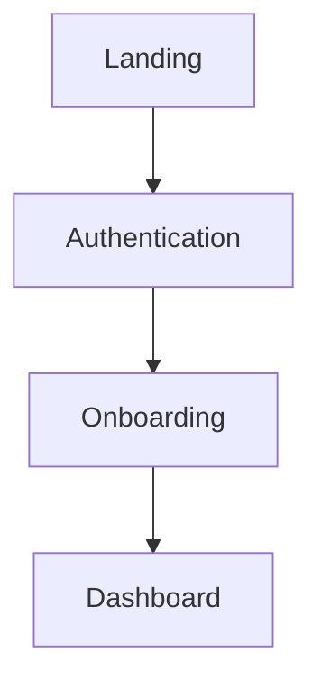
Prototype connections: Landing's Primary CTA → Authentication frame; Authentication's success state → Onboarding frame; Onboarding's Activation state → Dashboard frame. Smart Animate used for the Landing→Auth transition only where both frames share matching layer names (background), per FIGMA-01 Section 3's layer-naming discipline.

## Returning User

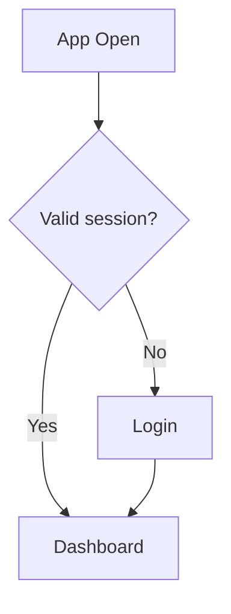
Prototype connections: an "App Open" trigger frame branches to either the Dashboard/Default frame or the Authentication/Login frame — represented in Figma as two separate prototype starting points, since Figma prototypes cannot branch on real session state; both paths are documented explicitly for developer reference.

## Premium (Upgrade Journey)

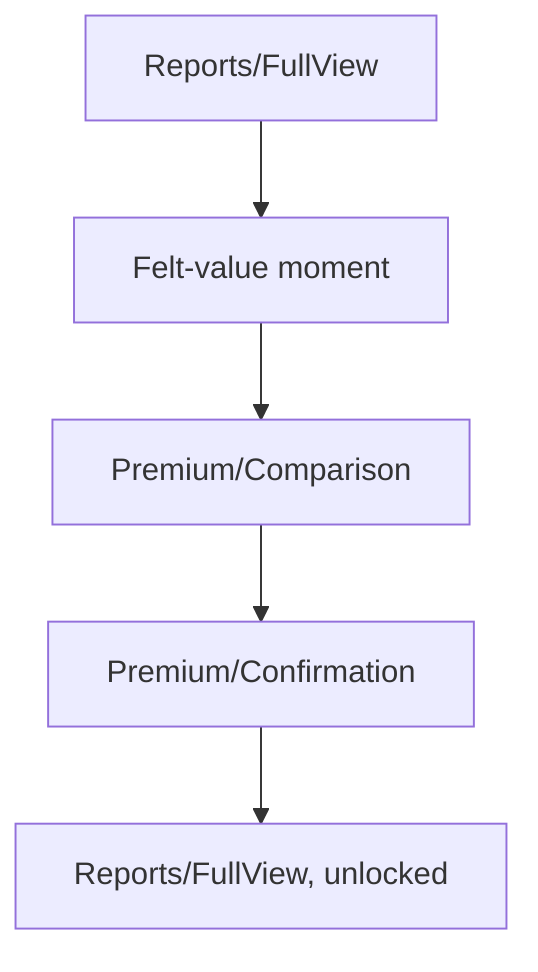
Prototype connections: Reports frame's "See what Premium adds" link → Premium/Comparison frame → (on Button press) Premium/Confirmation → returns to the originating Reports frame, now showing the Unlocked Report Card variant. This loop-back is deliberate: the prototype should demonstrate that upgrading returns the user to where they were, not to a new "welcome to Premium" destination.

## Offline

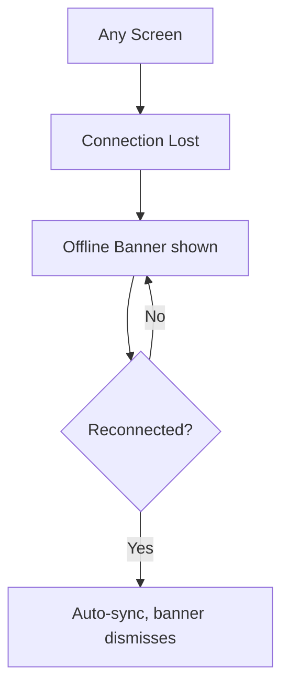
Prototype connections: an Offline Banner overlay component is prototyped as an overlay on top of every core screen frame (Dashboard, Companion, Journal), triggered from a dedicated "simulate offline" hotspot for demo purposes, since Figma cannot detect real network state.

## Network Failure (mid-action)

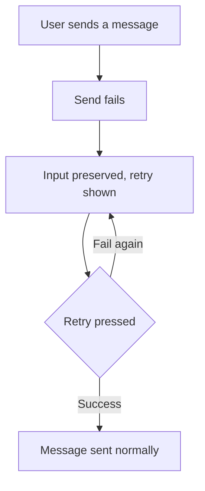
Prototype connections: Companion/Conversation frame with a `state=Error-SendFailed` variant, showing the input bar still populated with the unsent text and a retry affordance — this variant must be built from the same base frame as `Default`, never a separately drawn error screen, so any content update propagates to both.

## Memory Disabled / Unavailable

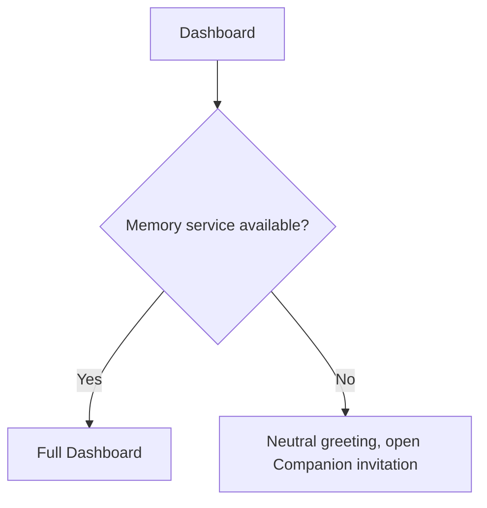
Prototype connections: Dashboard/Error-MemoryUnavailable frame variant, visually near-identical to the Empty/NewUser state (both show a neutral, Companion-forward layout) but documented separately for developer reference since their trigger conditions differ.

## Notification

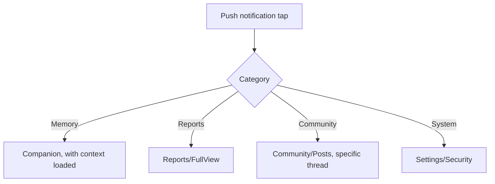
Prototype connections: a single Notification Center list item frame with hotspots to each of the four destination frames above, demonstrating that tapping always routes directly into full relevant context, never a generic app-open landing on Dashboard.

## Search

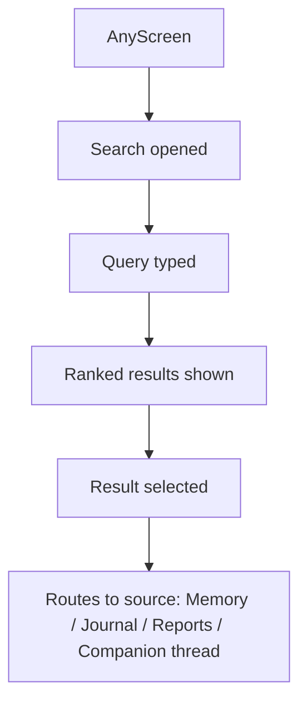
Prototype connections: Search Box component's `state=Results` variant links each result-row hotspot to the corresponding source screen frame, demonstrating the shared-retrieval principle (FIGMA-03, Search entry) visually.

## Community

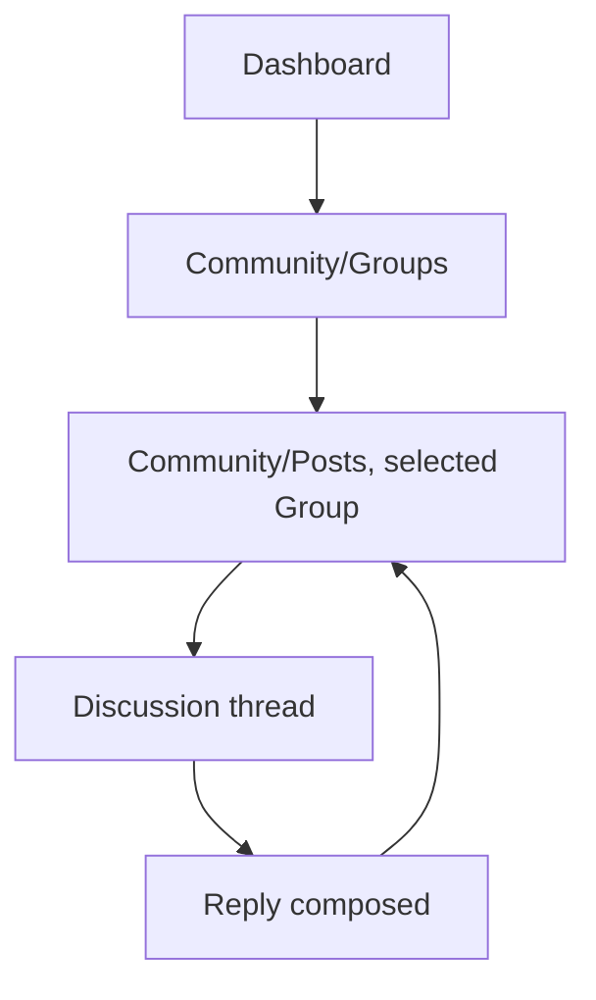
Prototype connections: standard forward/back navigation; no "infinite scroll" simulation is built, since Pagination controls are the real, final pattern (FIGMA-03).

## Subscription (Downgrade/Cancel)

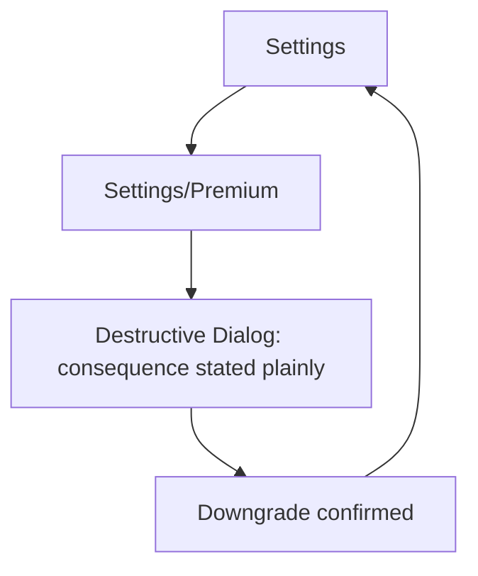
Prototype connections: the Destructive Dialog variant here uses identical friction (one Dialog, one confirm action) to the Upgrade flow's single-CTA simplicity — demonstrated by placing both prototype paths on the same page for side-by-side reviewer comparison.

## Deletion (Memory / Account)

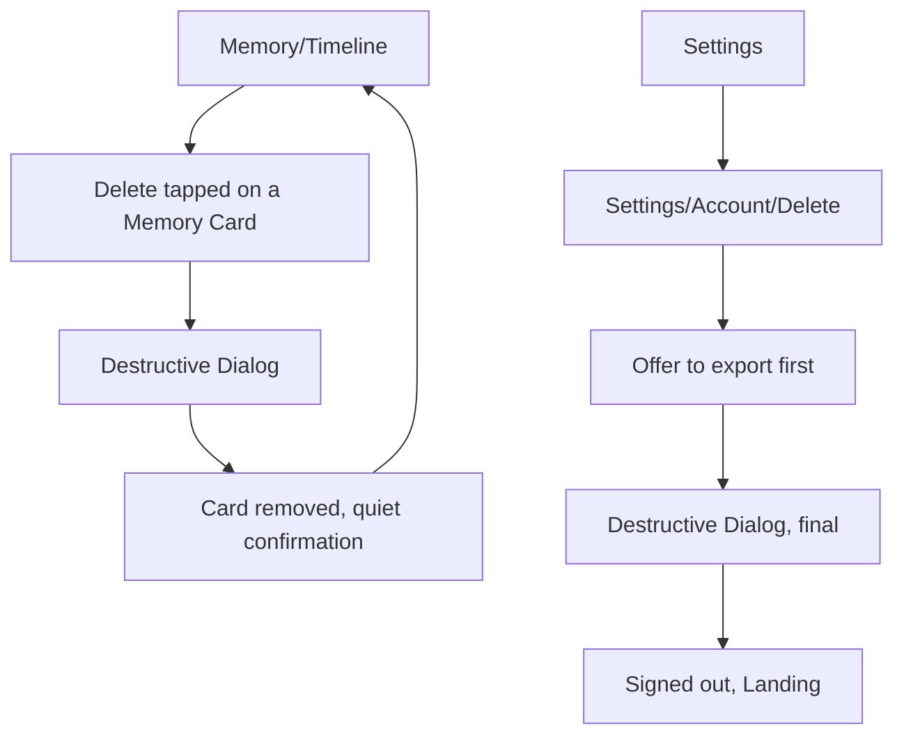
Prototype connections: two related but distinct paths on one page — single-item Memory deletion (fast, immediate) and full Account deletion (slower, with an explicit export-first offer) — built to visually demonstrate they use the same Dialog component at different stakes levels, never a different, more alarming visual treatment for the larger action.

## Export

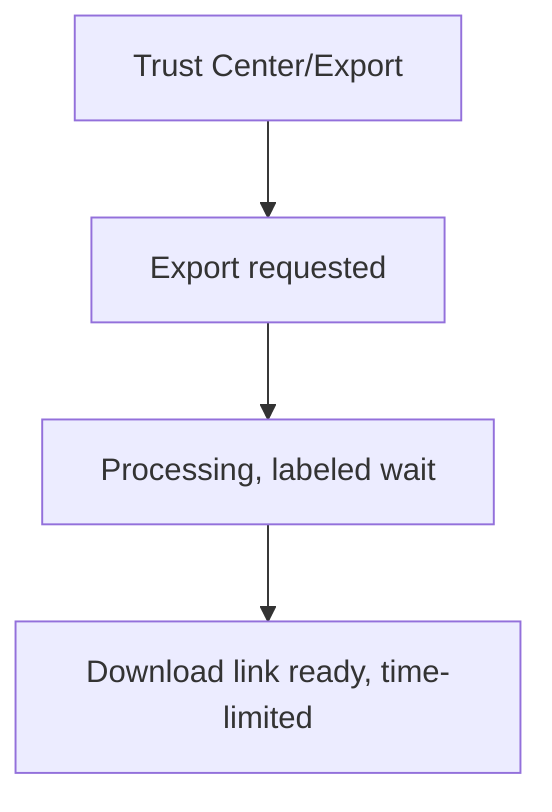
Prototype connections: Processing frame uses the standard labeled Progress component (FIGMA-03), never a generic spinner — demonstrated explicitly since export is a genuine trust-verification moment (Product Bible Module 21, Section 12).

---

**Continue to FIGMA-09.**
