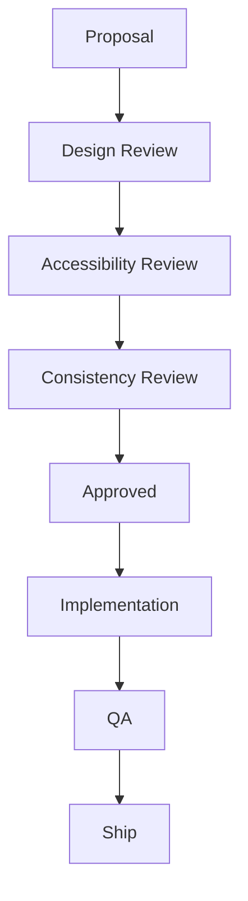

# THE BEACONVIE DESIGN GUIDE

*A practical bridge from the Product Bible (Modules 1–25) to Figma, the design system, and frontend implementation. This document translates product principles into design decisions — it does not restate the philosophy behind them.*

**Note on scope**: DG02 and DG04's source template listed language-learning-app patterns and screens (Course, Lesson, Reading/Listening/Speaking/Writing, Grammar, Vocabulary, Arena, Leaderboard, Club) that don't exist in BeaconVie. Those sections below are built around BeaconVie's actual product surface (Companion, Discovery systems, Journal, Memory, Reports, Community, Settings, Trust Center, Premium) instead.

---

# DG01 — BRAND & VISUAL GUIDE

### 1. Brand Philosophy
Design exists to disappear behind the relationship. Every visual decision is judged by one question: does this help someone feel calm, understood, and unhurried, or does it compete for their attention?

### 2. Brand Personality
| Trait | Expression |
|---|---|
| Warm | Never cold or clinical |
| Curious | Invites, doesn't conclude |
| Calm | Never urgent |
| Honest | Never oversells |
| Steady | Consistent across every screen and session |

### 3. Brand Archetype
Primary: **The Sage** (wisdom, understanding, guidance without authority). Secondary influence: **The Caregiver** (attentiveness, warmth). Explicitly not: The Jester (playful/entertaining), The Ruler (authoritative/directive), The Magician (spectacle/transformation-through-power).

### 4. Brand Voice
First-person when the Companion speaks; plain, specific, second-person ("you") elsewhere. Never third-person about the user ("the user will..."). Never royal-we marketing voice ("We're thrilled to announce...").

### 5. Tone of Voice
| Context | Tone |
|---|---|
| Companion conversation | Warm, curious, one question at a time |
| Onboarding | Honest about current limits, welcoming |
| Errors | Calm, specific, blame-free |
| Settings/Privacy | Plain, factual, respectful |
| Marketing/Landing | Confident but understated; never hype |
| Notifications | Specific, never generic |

### 6. Emotional Design
Every screen should be evaluated against: *does this reduce anxiety or add to it? does this feel like a considered pause or a demand for action?* Emotional register never varies by tier (free vs. Premium) or by module.

### 7. Brand Promise
*"An AI that actually remembers you."* Every design decision must be checkable against this promise: does this visual choice make memory and continuity feel real, or does it distract from it?

### 8. Brand Keywords
Calm · Warm · Honest · Considered · Continuous · Quiet confidence · Presence

### 9. Words We Never Use
"Unlock," "Journey," "AI-powered," "Revolutionary," "Seamless," "Supercharge," "Game-changing," "Limited time," "Don't miss out," "Streak," "Level up," "Powerful," "Destiny," "Guaranteed"

### 10. Words We Always Use (when applicable)
"Remember(s)," "Notice(d)," "Worth noticing," "Reflect," "Consider," "Whenever you're ready," "One way to see it," "You mentioned"

### 11. Logo Principles
The Companion's mark is the Constellation glyph — abstract, never figurative. It represents connection across time, not a mascot or character. It should read equally well as a small favicon and a large mark, without needing detail added at scale.

### 12. Logo Usage
Always on the dusk canvas or an equivalent dark, warm-neutral background by default. Never placed on a busy photographic background. Never recolored outside the approved token set (Section 18–20).

### 13. Safe Area
Minimum clear space around the mark equal to the height of the mark itself, on all sides, in any application (app icon, favicon, marketing).

### 14. Minimum Size
16px (favicon/UI) / 24px (in-app header) minimum — below this, use the simplified glyph-only mark, never the full lockup with wordmark.

### 15. Incorrect Usage
| Don't | Why |
|---|---|
| Add a drop shadow or bevel to the mark | Contradicts the flat, quiet visual system |
| Place on a bright/high-saturation background | Breaks contrast and the dusk-first identity |
| Rotate, skew, or distort | The constellation geometry is fixed |
| Add a tagline directly into the lockup | Taglines are set separately, in body type |

### 16. Color Philosophy
Color is meaning, not decoration. The palette is almost entirely neutral; the one saturated accent (Insight gold) is reserved exclusively for genuine memory/insight moments. See Product Bible Module 4, Section 4 for full token rationale — this guide states usage rules, not the rationale again.

### 17. Color Roles
| Role | Token | Use |
|---|---|---|
| Canvas | `color.bg.canvas` | Primary app background |
| Surface | `color.bg.surface` | Cards, panels |
| Surface Raised | `color.bg.surface-raised` | Modals, sheets |
| Text Primary | `color.text.primary` | Body copy |
| Text Secondary | `color.text.secondary` | Meta/supporting text |
| Insight Accent | `color.accent.insight` | Genuine memory/insight moments only |
| Reflection Accent | `color.accent.reflection` | Journal-specific UI |
| Trust Accent | `color.accent.trust` | Confirmation/success |
| Caution Accent | `color.accent.caution` | Warnings/errors |
| Border | `color.border.subtle` / `color.border.focus` | Dividers, keyboard focus |

### 18. Primary Palette
Dusk indigo-plum canvas family (`#161428` → `#2A2645`), warm off-white text family (`#F1ECE4` → `#6E6785`). Full hex values live in the design-tokens file (Section 39 references it); this guide governs usage, not source-of-truth values.

### 19. Secondary Palette
The four accent colors (Section 17) are the entire secondary palette — deliberately no additional decorative colors exist. A designer needing a "new" color for a new feature should treat that need as a signal to reconsider the design, not a reason to extend the palette.

### 20. Semantic Colors
| Meaning | Token |
|---|---|
| Success | `color.accent.trust` (sage) |
| Warning/Error | `color.accent.caution` (muted rust) |
| Insight/Significant | `color.accent.insight` (gold) |
| Neutral/Informational | `color.text.secondary` |

No bright red, no bright green — every semantic color stays within the muted, warm-dark register.

### 21. Typography Philosophy
Three typefaces, three jobs: Fraunces (the Companion's spoken voice), Karla (structure/UI), IBM Plex Mono (precise data). A fourth typeface is never introduced for a new module.

### 22. Typography Scale
| Token | Size | Use |
|---|---|---|
| `display-xl` | 3.5rem | Landing hero only |
| `display-lg` | 2.5rem | Section heroes |
| `heading-lg` | 1.75rem | Screen titles |
| `heading-md` | 1.375rem | Section headers |
| `body-lg` | 1.125rem | Emphasized body copy |
| `body-md` | 1rem | Default body |
| `body-sm` | 0.875rem | Meta text |
| `caption` | 0.75rem | Timestamps, labels |

### 23. Font Pairing
Fraunces (display/voice) + Karla (UI/body) + IBM Plex Mono (data). Never pair Fraunces with anything other than Karla for body text — the contrast between the two is a deliberate, load-bearing part of the system (distinguishing "the Companion speaking" from "the interface structure").

### 24. Reading Experience
Long-form content (Reports, Journal) caps at a 720px content column, generous line-height, Fraunces for first-person Companion narrative, Karla for the user's own writing.

### 25. Shape Language
Soft, rounded, never sharp. Radius scales with element size (small elements get smaller radii, large surfaces get larger radii) — see Section 26.

### 26. Corner Radius Philosophy
| Token | Value | Use |
|---|---|---|
| `radius-sm` | 8px | Chips, badges |
| `radius-md` | 12px | Buttons, inputs |
| `radius-lg` | 20px | Cards |
| `radius-xl` | 28px | Sheets, modals |

Never 0px (reads as clinical/corporate). Never fully circular except avatars and icon-only buttons.

### 27. Elevation
Expressed through background-lightness steps (canvas → surface → surface-raised), not heavy shadow stacking. Elevation communicates "how foregrounded is this," not decoration.

### 28. Shadow Language
One shadow token only (`shadow-sm`: soft 8px blur, 20% opacity). No multi-layer shadow systems. Shadow appears on drag/lift states and modals only, never as a default card treatment.

### 29. Icon Language
Single rounded-stroke set, 2px stroke, rounded caps/joins. Outlined by default; filled reserved for active/selected states only.

### 30. Illustration Language
Abstract, celestial, line-based. The Constellation Thread motif is the one signature, expressive motion/illustration element — reserved for genuine memory-connection moments (Hero, Memory Recall, Insight, Report Timeline). Never used decoratively elsewhere.

### 31. Mascot Principles
BeaconVie has no mascot and no anthropomorphic Companion avatar. The Companion's presence is carried by typography (Fraunces) and behavior (memory, voice), never a rendered face or character. This is a permanent rule, not a style preference — see Product Bible Module 22, Section 10.

### 32. Photography Style
Not used in core product UI. Reserved for Landing/marketing only — natural light, unposed, genuinely diverse, never stock-photo "mystical" imagery (crystal balls, dramatic tarot spreads).

### 33. Empty State Style
Low-density Constellation motif + one calm, invitation-framed line of copy + (if applicable) one soft CTA. Never a "sad face" or generic stock illustration. Never implies deficiency.

### 34. Loading Style
Always labeled, never a bare spinner. Skeleton loading matches final content shape, no shimmer animation. Companion "Thinking" state uses labeled circular progress with specific copy ("thinking about what you shared…").

### 35. Motion Personality
Slow and organic for significant moments (Card Reveal, Memory Recall, Insight forming — 600–900ms), fast and quiet for routine UI (200–250ms). No bounce, no elastic easing, no shake-based error feedback, no confetti/celebration sequences anywhere in the product.

### 36. Light Theme
Cool lavender-white canvas (`color.bg.canvas.light`), deliberately not a cream/parchment tone. Same emotional register as dark mode — calm, warm, considered — never brighter or more "energetic" in feel.

### 37. Dark Theme
The default. Dusk indigo-plum canvas. Every component must be designed dark-first, with light mode as the validated alternate, never the reverse.

### 38. Accessibility Color Rules
WCAG AA contrast minimum for all text/background pairs. Insight-gold text is restricted to large text/icon use on light-mode surfaces where contrast is marginal (verify per component). Color is never the sole carrier of meaning — pair with icon, label, or shape.

### 39. Visual Consistency Rules
One shared component library, consumed by every module — no module-specific visual variants of shared components (Memory Card, Insight Card, Report Timeline, AI Message are the four highest-risk-of-drift components; audit these first in every review). Design tokens are the single source of truth; no hardcoded hex/px values in any Figma file or frontend component.

### 40. Brand QA Checklist
- [ ] No color used outside the defined token set
- [ ] No typeface outside Fraunces/Karla/IBM Plex Mono
- [ ] No word from the "never use" list (Section 9) anywhere in copy
- [ ] No shadow beyond `shadow-sm`
- [ ] Constellation Thread motif used only for genuine memory/insight moments — check per-release usage count
- [ ] Light and dark mode both reviewed for identical emotional register, not just contrast compliance
- [ ] No celebratory/gamified animation (confetti, badges, streak counters) anywhere

---

# DG02 — UX PATTERN GUIDE

*Patterns below are built around BeaconVie's actual product surface.*

## Navigation

| Field | Detail |
|---|---|
| Purpose | Move between the four Global destinations without ever feeling lost |
| User Goal | Get to Dashboard, Companion, Journal, or Discovery in ≤2 taps |
| Information Hierarchy | Global Nav (persistent) > Context Nav (contextual jump-links) > Search |
| Primary CTA | The active destination |
| Secondary CTA | Search (global entry point) |
| Interaction Rules | Max 2-tap depth to any feature; no nested hamburger menus |
| Loading | N/A (navigation shell persists) |
| Empty State | N/A |
| Error State | Graceful fallback to Dashboard if a route fails to resolve |
| Success State | N/A |
| Responsive Notes | Sidebar (desktop) → top bar (tablet) → bottom bar (mobile) |
| Accessibility Notes | Full keyboard tab order; ARIA landmarks per nav region |
| Common Mistakes | Adding a 5th+ Global Nav item; reserving a nav slot for an unshipped feature |
| Best Practices | Nav item count stays at 4 + Settings; new modules nest under an existing destination until proven to need their own slot |

## Dashboard

| Field | Detail |
|---|---|
| Purpose | Answer "what's most meaningful right now" once per day |
| User Goal | See one clear next action, take it or not, move on |
| Information Hierarchy | Hero greeting > Companion Panel > at most one each of Memory Highlight / Discovery Suggestion / Journal Prompt / Report-ready |
| Primary CTA | The single Hero-level recommendation |
| Secondary CTA | Companion Panel's "resume conversation" |
| Interaction Rules | Never show more than one item per optional panel type |
| Loading | Skeleton matching final section layout |
| Empty State | New-user variant: Companion Panel prioritized, all optional sections absent (not empty-placeholder) |
| Error State | Degrade to neutral greeting + open Companion invitation if Memory/AI unavailable |
| Success State | N/A (Dashboard has no "success" moment of its own) |
| Responsive Notes | Same structural template at every breakpoint; density/padding adapt only |
| Accessibility Notes | Conditional panels absent from DOM when not shown, not hidden-but-present |
| Common Mistakes | Adding a widget grid; showing a report backlog; showing all four Discovery systems at once |
| Best Practices | Server-side resolution to exactly one recommendation per panel before the client ever renders |

## Home / Onboarding

| Field | Detail |
|---|---|
| Purpose | Reach the Activation event (first memory-referencing Companion message) within ~5 minutes |
| User Goal | Feel met by something real, not filling out a form |
| Information Hierarchy | Companion greeting > one open question > 2–3 exchanges > Reflection moment > one Discovery offer (optional) > Activation |
| Primary CTA | Reply to the Companion |
| Secondary CTA | "Maybe later" (skip Discovery offer) |
| Interaction Rules | Never more than one question per Companion message; no required form fields beyond auth |
| Loading | Standard AI Thinking state |
| Empty State | N/A |
| Error State | Preserve typed input on failure; calm retry |
| Success State | Quiet Memory Card reveal, no celebratory animation |
| Responsive Notes | Identical flow, no reduced "mobile-lite" version |
| Accessibility Notes | Full screen-reader support for streaming Companion text |
| Common Mistakes | Multi-screen wizard; collecting birth data before Discovery-system selection; forced Discovery step |
| Best Practices | Skip is always available with zero penalty; Companion picks up naturally later |

## Authentication

| Field | Detail |
|---|---|
| Purpose | Establish identity in under 60 seconds |
| User Goal | Get to the Companion, not fill out an account form |
| Information Hierarchy | Method buttons (Google/Apple/Facebook) > email/password fallback |
| Primary CTA | Chosen sign-in/sign-up method |
| Secondary CTA | Switch method |
| Interaction Rules | No fields beyond email + password; no birth data, no username, no profile fields |
| Loading | Labeled per-method ("Connecting to Google…") |
| Empty State | N/A |
| Error State | Specific per failure type (wrong password vs. account-not-found vs. network) |
| Success State | Brief (<1s) auto-continuing confirmation, no dedicated "Welcome!" screen |
| Responsive Notes | Identical single-column card at every breakpoint |
| Accessibility Notes | Visible labels always (never placeholder-only); full keyboard support |
| Common Mistakes | Blocking on email verification; adding "Remember me" as a separate decision |
| Best Practices | Long-lived sessions by default; silent refresh on app open |

## Companion (AI Chat)

| Field | Detail |
|---|---|
| Purpose | The core relationship surface |
| User Goal | Feel heard, occasionally reflected back to, never processed |
| Information Hierarchy | Message thread > input bar > "+ New Topic" floating action |
| Primary CTA | Send message |
| Secondary CTA | Tap a Memory Card to jump to its source |
| Interaction Rules | Exactly one question per Companion turn max; streaming, never instant-dump |
| Loading | Labeled Thinking state, no separate "typing…" indicator |
| Empty State | Open, warm invitation ("Say hello whenever you're ready") |
| Error State | Preserve user message; honest timeout copy with retry |
| Success State | N/A (ordinary flow, not a discrete success moment) |
| Responsive Notes | Same thread layout at every breakpoint |
| Accessibility Notes | Streaming text announced once complete, not word-by-word |
| Common Mistakes | Adding a bot avatar/icon per message; numeric confidence scores |
| Best Practices | Memory Cards always visually distinct from generated text |

## Discovery (Tarot / Natal Chart / Eastern Horoscope / Numerology)

| Field | Detail |
|---|---|
| Purpose | Low-friction reflective ritual that bridges into Companion conversation |
| User Goal | A quick, meaningful moment of reflection, never a standalone destination |
| Information Hierarchy | Reveal (card/chart/profile) > interpretation > one closing question > Companion bridge |
| Primary CTA | Continue to Companion |
| Secondary CTA | "Learn more" (traditional meaning layer) |
| Interaction Rules | One Discovery system recommended at a time, never all four presented as a menu |
| Loading | Deliberate slow reveal (600–900ms) for the reveal moment only |
| Empty State | First-visit variant offers a single, low-pressure first suggestion |
| Error State | Falls back to static traditional meaning if personalized interpretation fails |
| Success State | N/A |
| Responsive Notes | Full-width visual reveal, text below, consistent across breakpoints |
| Accessibility Notes | Descriptive alt text for symbolic imagery; reduced-motion fallback for reveal |
| Common Mistakes | Predictive/declarative language; personality-typing (esp. Numerology); fear-based framing of "difficult" symbols |
| Best Practices | Interpretation always grounded in a fixed, curated reference database, never freely generated |

## Journal (Reflection)

| Field | Detail |
|---|---|
| Purpose | A quiet, private space where writing itself produces clarity |
| User Goal | Write without pressure, without an AI hovering |
| Information Hierarchy | Open text field > (optional) single prompt line above it |
| Primary CTA | Implicit — writing itself; "mark done" only if a distinct completion action exists |
| Secondary CTA | View past entries |
| Interaction Rules | Zero live AI presence during typing; autosave only, no manual Save button |
| Loading | Entirely invisible (autosave) |
| Empty State | Invitation-framed ("Write your first entry — there's no wrong way to start") |
| Error State | Draft always recoverable; no data loss on any failure path |
| Success State | Quiet Reflection Engine response *or* silence — silence is the plurality, expected outcome |
| Responsive Notes | Same distraction-minimal single-column surface everywhere |
| Accessibility Notes | Full text-resize and screen-reader support in the writing surface itself |
| Common Mistakes | Word-count goals, streaks, inline AI suggestions while typing |
| Best Practices | Default response mode is silence or brief acknowledgment, not guaranteed reflection |

## Memory

| Field | Detail |
|---|---|
| Purpose | Full transparency into what's remembered |
| User Goal | See, verify, and if needed delete what the Companion knows |
| Information Hierarchy | Timeline (reverse-chronological) > filters (type/date) > Memory Card detail |
| Primary CTA | Delete (the only direct-write action available on Memory) |
| Secondary CTA | Export |
| Interaction Rules | Memory is never directly editable — only deletable |
| Loading | Standard skeleton |
| Empty State | "We're just getting to know each other" |
| Error State | Graceful degrade to cached/last-known state if retrieval fails |
| Success State | Quiet confirmation on deletion |
| Responsive Notes | Timeline collapses to single column on mobile |
| Accessibility Notes | Full text-equivalent for every Memory Card, not just visual |
| Common Mistakes | Offering a misleading "edit" text field |
| Best Practices | Every card states what/when/why plainly, with a source link |

## Search

| Field | Detail |
|---|---|
| Purpose | One global entry point across Memory, Journal, Reports, Conversations |
| User Goal | Find something without remembering which module it lives in |
| Information Hierarchy | Single input > ranked results (significance + relevance, not just keyword) |
| Primary CTA | Select a result |
| Secondary CTA | Refine query |
| Interaction Rules | Never surfaces another user's content |
| Loading | Standard, brief |
| Empty State | Plain restatement of query + suggestion to try different words |
| Error State | N/A |
| Success State | N/A |
| Responsive Notes | Full-screen on mobile, inline panel on desktop |
| Accessibility Notes | Full keyboard operability, results announced to screen readers |
| Common Mistakes | Keyword-only matching (misses thematically-similar, differently-worded content) |
| Best Practices | Shares the same embedding index as Companion's own memory retrieval |

## Notifications

| Field | Detail |
|---|---|
| Purpose | Occasionally reconnect the user with something genuinely meaningful |
| User Goal | Feel remembered, never nagged |
| Information Hierarchy | Notification Center list, grouped by relative time |
| Primary CTA | Open (routes directly into relevant context) |
| Secondary CTA | Dismiss |
| Interaction Rules | No unread-count red badge; no forced acknowledgment |
| Loading | Standard skeleton |
| Empty State | Calm, unremarkable — no CTA needed |
| Error State | Guaranteed in-app fallback if push delivery fails |
| Success State | N/A |
| Responsive Notes | Platform-native push conventions, no custom attention-grabbing treatment |
| Accessibility Notes | Full screen-reader labeling for both push and in-app content |
| Common Mistakes | Generic "come back!" copy; streak-based urgency |
| Best Practices | Default output is "send nothing"; every notification traces to a specific memory-based reason |

## Settings

| Field | Detail |
|---|---|
| Purpose | The relationship control center |
| User Goal | Understand and change anything the product does with their data |
| Information Hierarchy | Categorized list (Profile/Companion/Memory first, Account/Security later) > search |
| Primary CTA | The relevant toggle/action |
| Secondary CTA | "What does this mean?" expansion |
| Interaction Rules | Immediate effect, no separate Save button |
| Loading | Standard, brief |
| Empty State | N/A |
| Error State | Revert to last known-good state on failed save, with a clear message |
| Success State | Quiet checkmark/confirmation |
| Responsive Notes | Two-pane (desktop) → single-pane drill-down (mobile) |
| Accessibility Notes | Highest accessibility bar in the product — full keyboard/screen-reader across every category |
| Common Mistakes | Pre-checked consent boxes; asymmetric friction between opt-in and opt-out |
| Best Practices | Every consent defaults to the private/conservative option |

## Profile

| Field | Detail |
|---|---|
| Purpose | Minimal identity representation |
| User Goal | Confirm who they are, adjust display name/avatar |
| Information Hierarchy | Display name > avatar > (if set up) Discovery-system birth data summary |
| Primary CTA | Edit display name |
| Secondary CTA | Manage birth data (routes to relevant Discovery module) |
| Interaction Rules | No username, no public handle, no follower/following anywhere |
| Loading | Standard, brief |
| Empty State | Initials-on-color-token avatar by default |
| Error State | Standard save-failure handling |
| Success State | Quiet confirmation |
| Responsive Notes | Simple, single-column at all breakpoints |
| Accessibility Notes | Standard form accessibility |
| Common Mistakes | Adding a "profile completion %" bar |
| Best Practices | Keep this screen genuinely minimal — most personalization lives in Memory, not a profile form |

## Community

| Field | Detail |
|---|---|
| Purpose | Pseudonymous, opt-in mutual support space |
| User Goal | Feel belonging, never performance pressure |
| Information Hierarchy | Groups/Circles > paginated Feed within a Group > Discussion thread |
| Primary CTA | Post / reply |
| Secondary CTA | React (supportive reactions only, no like-count-as-status) |
| Interaction Rules | No follower/following; no infinite scroll; pagination only |
| Loading | Standard skeleton |
| Empty State | "Patterns from others will show up here as the community grows" |
| Error State | Standard moderation/report handling with transparent explanation |
| Success State | Quiet post-confirmation |
| Responsive Notes | Groups-first navigation at every breakpoint, never a single global feed default |
| Accessibility Notes | Full keyboard/screen-reader support for posting/reply/report |
| Common Mistakes | Follower counts, leaderboards, real-identity profiles |
| Best Practices | Pseudonymous identity distinct from the user's core account, enforced at the schema level |

## Reports

| Field | Detail |
|---|---|
| Purpose | Periodic narrative synthesis — the Life Story Engine |
| User Goal | See genuine change and growth over time |
| Information Hierarchy | Overview list > individual report (progressive sectioned reveal) > Deep Dive evidence trail |
| Primary CTA | "Discuss this with your Companion" |
| Secondary CTA | Deep Dive (evidence trail) |
| Interaction Rules | Never generated without sufficient evidence density |
| Loading | Labeled, progressive, sectioned reveal |
| Empty State | "Your first Report will appear once we've gotten to know you a bit" — no countdown |
| Error State | Queue and retry rather than show a partial/degraded narrative |
| Success State | N/A |
| Responsive Notes | Book-like single-column reading layout at every breakpoint |
| Accessibility Notes | Full screen-reader support for narrative and evidence trail |
| Common Mistakes | Statistics-led framing; triumphant "overcame it!" language not supported by evidence |
| Best Practices | Every narrative claim traceable to a specific evidence item |

---

# DG03 — COMPONENT GUIDE

| Component | Purpose | Variants | States | Behavior | Accessibility | Spacing | Responsive | Animation | Do | Don't |
|---|---|---|---|---|---|---|---|---|---|---|
| **Button** | Trigger one clear action | Primary, Secondary, Ghost | Default/Hover/Active/Disabled/Loading | Primary reserved for high-commitment actions only | Focus ring in Insight-gold; label always visible | `space-3` internal padding | Full-width on mobile for Primary | Subtle lightness shift on hover, no bounce | Use one Primary per screen | Stack multiple Primary buttons |
| **Input** | Single-line data entry | Text, Email, Password, Date | Default/Focus/Error/Disabled | Label always above, never placeholder-only | Programmatic label association | `space-2` label-to-field gap | Full-width on mobile | Border color shift on focus/error | Show helper text for non-obvious fields | Use placeholder as the only label |
| **Text Area** | Multi-line entry (Journal) | Standard, Draft (autosave) | Default/Focus | No live AI suggestions while typing | Full resize/screen-reader support | Generous internal padding | Expands to fill available height | None during typing | Autosave silently | Show a visible "Save" button |
| **Checkbox** | Multi-select | Standard | Checked/Unchecked/Disabled | Immediate state change | Keyboard togglable, labeled | `space-2` label gap | Same across breakpoints | Quiet check-mark fade | Use for genuinely independent options | Use where only one choice is valid (use Radio) |
| **Radio** | Single-select from a set | Standard | Selected/Unselected/Disabled | Immediate state change | Grouped with `role="radiogroup"` | `space-2` between options | Same across breakpoints | Quiet fill transition | Use for mutually exclusive choices | Use for more than ~5 options (use Dropdown) |
| **Switch** | Binary on/off (Settings) | Standard | On/Off/Disabled | Immediate effect, no Save step | Labeled, keyboard togglable | `space-2` label gap | Same across breakpoints | Quiet slide, sage accent when on | Reflect actual backend state instantly | Show a toggle whose visual state can drift from reality |
| **Dropdown** | Select from a longer list | Standard | Closed/Open/Selected/Disabled | Keyboard navigable | Full ARIA combobox pattern | Matches Input padding | Full-screen sheet on mobile | Standard reveal timing | Use for 6+ options | Use for binary choices (use Switch) |
| **Card** | Base content container | Standard, Memory, Insight, Report, Notification | Default/Hover (rare)/Selected | One clear piece of content per card | Landmark/heading structure inside | `radius-lg`, internal `space-4` | Reflows to single column on mobile | No shadow by default | Reuse the same Card everywhere it applies | Invent a module-specific card shape |
| **Dialog** | Interrupt for a consequential decision | Confirm, Destructive | Open/Closed | Reserved for genuinely consequential actions | Focus-trapped, labeled, Escape closes | `radius-xl`, generous padding | Full-screen on mobile | Standard fade/scale-in | State the actual consequence plainly | Use for routine confirmations |
| **Bottom Sheet** | Mobile secondary content/actions | Standard, Draggable-expand | Open/Closed | Primary mobile pattern for Quick Actions | Focus-trapped | `radius-xl` top corners | Mobile-primary; becomes Drawer on desktop | Slide-up, standard timing | Use for Quick Actions | Nest a sheet inside a sheet |
| **Navigation (Global)** | Persistent top-level wayfinding | Sidebar (desktop), Bottom bar (mobile) | Active/Inactive | 4 destinations + Settings | Full keyboard tab order | Fixed width/height per platform convention | Sidebar → bottom bar | None | Keep to 4 core destinations | Add a 5th without a validated need |
| **Sidebar** | Desktop navigation | Standard | Expanded (no collapse variant needed at current IA depth) | Persistent | Landmark region | Fixed width | Desktop-only | None | Match Global Nav exactly | Duplicate items already in Global Nav |
| **Top Bar** | Screen title + context actions | Standard | Default | Houses title, search, settings icon | Landmark region | Fixed height | All breakpoints | None | Keep to title + 1–2 icons | Overload with many icons |
| **Tabs** | Peer-level navigation within a module | Segmented | Active/Inactive | Max 4 tabs per row | Full keyboard/arrow-key nav | Equal-width segments | Horizontal scroll if >4 on mobile | Underline/fill slide | Use for genuinely equal-weight peer content | Use to hide a hierarchy (use Drawer/nested screen) |
| **Accordion** | Progressive disclosure of dense content | Standard | Collapsed/Expanded | Default collapsed | ARIA expanded state | `space-3` internal padding | Same across breakpoints | Standard expand/collapse | Default-collapse non-essential sections | Default-expand more than one at a time |
| **Timeline** | Chronological memory/insight display | Standard, Compact | Static | Core visual metaphor for memory-over-time | Full text equivalent, not visual-only | `space-4` between entries | Compact variant on Dashboard/mobile | Quiet connecting-line draw | Use consistently across Reports/Memory | Reinvent per module |
| **Toast** | Brief, non-blocking confirmation | Success, Error | Appearing/Dismissing | Auto-dismiss after a few seconds | Announced via ARIA live region | Fixed position, safe-area aware | Same across breakpoints | Quiet fade, no bounce | Use for routine confirmations | Use for anything requiring a decision (use Dialog) |
| **Tooltip** | Brief clarifying info | Standard | Visible/Hidden | Triggered by focus or hover, rarely by tap | Accessible via keyboard focus | Small, `space-1` padding | Tap-triggered on touch devices | Quiet fade | Use only for genuinely non-obvious icons | Use to explain core interaction patterns |
| **Badge** | Small status indicator | Neutral, Insight (gold), New | Static | Insight badge reserved for memory-derived content | Text-equivalent, not color-only | Small, inline | Same across breakpoints | None | Use sparingly | Badge routine updates |
| **Avatar** | User identity representation | Initials-on-color, (optional) photo | Default | No forced photo upload | Alt text if photo used | Circular, fixed sizes per context | Same sizes scaled per context | None | Default to initials | Force a mascot-style avatar |
| **Progress** | Loading/multi-step indication | Linear, Circular | Indeterminate/Determinate | Always labeled | Announced via ARIA | Contextual | Same across breakpoints | Quiet, honest pacing | Pair with a specific label always | Imply false precision with a % for unknowable waits |
| **Table** | Structured tabular data (mostly Admin) | Standard | Default | Reserved almost entirely for Admin | Full row/column header semantics | Standard row height | Horizontal scroll on mobile if needed | None | Use in Admin | Use in consumer-facing Companion/Journal/Reports |
| **List** | Sequential content | Standard, Timeline | Default | Grouped by relative time where chronological | Full keyboard nav | `space-3` between items | Same across breakpoints | Standard reveal on scroll-into-view | Group by time (Today/This Week/Earlier) | Use unstyled infinite scroll |
| **Calendar** | Date selection, date-grid browsing | Standard | Default/Selected | Used for birth-data entry and Discovery-history browsing | Full keyboard date navigation | Standard grid spacing | Full-screen sheet on mobile | None | Use for genuine date needs | Use as decoration |
| **Tag** | Derived category label | Standard | Static | Auto-derived from classification, never manually authored (except Community) | Text-equivalent | Small, inline | Same across breakpoints | None | Use for auto-derived Life Domain/Theme labels | Introduce manual user-tagging (adds productivity-app overhead) |
| **Chip** | Selectable/filter tag | Standard, Removable | Selected/Unselected | Used in Discovery tabs, Search filters | Keyboard selectable | Small, inline | Horizontal scroll if many | Quiet select transition | Keep to short, single-line labels | Use for multi-line text |
| **Pagination** | Bounded list navigation (Community Feed) | Standard | Default | Never infinite scroll | Keyboard navigable | Standard control sizing | Simplified (prev/next only) on mobile | None | Use for Community Feed | Replace with infinite scroll |
| **Search Box** | Global content search | Standard | Default/Focus/Results | Single global entry point | Full keyboard operability | Prominent, top-of-screen | Full-screen on mobile | Standard reveal for results | Share one search across Memory/Journal/Reports/Conversations | Duplicate search per module |

---

# DG04 — SCREEN LIBRARY

## Landing

| Field | Detail |
|---|---|
| Purpose | Convert visitors into activated users with the correct mental model |
| User Story | As a visitor, I want to understand what BeaconVie is before I sign up |
| Main Sections | Hero, Problem/Solution, How It Works, Discovery Systems, Companion, Memory, Testimonials, Pricing, FAQ |
| Primary Components | Hero illustration, Card (Discovery preview), AI Message (static example), Report Card (pricing) |
| Loading | SVG-first, fast LCP |
| Empty | N/A |
| Error | Calm offline state if load fails |
| Responsive | Single-column stack on mobile, multi-column sections on desktop |
| Accessibility | Single `<h1>`, sequential headings, full contrast compliance |
| Navigation Entry | Organic search, paid, referral, social share |
| Navigation Exit | Authentication (sign-up) |

## Authentication

| Field | Detail |
|---|---|
| Purpose | Establish identity |
| User Story | As a visitor, I want to create an account or log in in under a minute |
| Main Sections | Method selection, email/password fallback, verification (non-blocking) |
| Primary Components | Button (method), Input (email/password) |
| Loading | Labeled per-method |
| Empty | N/A |
| Error | Specific per failure type |
| Responsive | Single centered card at every breakpoint |
| Accessibility | Full keyboard/screen-reader support |
| Navigation Entry | Landing CTA, deep link |
| Navigation Exit | Onboarding (new) or Dashboard (returning) |

## Dashboard

| Field | Detail |
|---|---|
| Purpose | Daily home; resolves to one recommendation |
| User Story | As a returning user, I want to know what's worth my attention today |
| Main Sections | Hero greeting, Companion Panel, (conditional) Memory Highlight, Discovery Suggestion, Journal Prompt, Report-ready |
| Primary Components | Card, AI Message preview, Badge |
| Loading | Skeleton matching final layout |
| Empty | New-user variant, Companion-forward |
| Error | Degrade to neutral greeting |
| Responsive | Same structure, vertical stack at all sizes |
| Accessibility | Conditional panels absent, not hidden, from DOM |
| Navigation Entry | App open (always default landing screen) |
| Navigation Exit | Companion, Discovery, Journal, Reports |

## Companion (AI Chat)

| Field | Detail |
|---|---|
| Purpose | Core relationship surface |
| User Story | As a user, I want to talk with something that remembers me |
| Main Sections | Message thread, input bar, floating "+ New Topic" |
| Primary Components | AI Message, Memory Card, Input |
| Loading | Labeled Thinking state |
| Empty | Open invitation |
| Error | Preserve message, honest timeout retry |
| Responsive | Same thread layout everywhere |
| Accessibility | Streaming announced once complete |
| Navigation Entry | Dashboard, Discovery bridge, Notification |
| Navigation Exit | Journal (via prompt), Discovery (via suggestion), back to Dashboard |

## Discovery Hub (Tarot / Natal Chart / Eastern Horoscope / Numerology)

| Field | Detail |
|---|---|
| Purpose | Low-friction reflective rituals bridging into Companion |
| User Story | As a user, I want a quick, meaningful reading connected to my life |
| Main Sections | Segmented tabs (4 systems), reveal, interpretation, Companion bridge |
| Primary Components | Card, Timeline (chart/profile visualization), AI Message |
| Loading | Deliberate slow reveal for the ritual moment |
| Empty | First-visit single suggestion |
| Error | Static fallback meaning if AI interpretation fails |
| Responsive | Full-width reveal, text below, all breakpoints |
| Accessibility | Descriptive alt text, reduced-motion fallback |
| Navigation Entry | Dashboard suggestion, Companion offer, direct nav |
| Navigation Exit | Companion (primary), Journal |

## Journal

| Field | Detail |
|---|---|
| Purpose | Private reflective writing space |
| User Story | As a user, I want to write without being watched or interrupted |
| Main Sections | Composer (draft), entry list (grouped by time) |
| Primary Components | Text Area, List |
| Loading | Invisible (autosave) |
| Empty | Invitation-framed |
| Error | Draft always recoverable |
| Responsive | Single quiet column everywhere |
| Accessibility | Full resize/screen-reader in writing surface |
| Navigation Entry | Dashboard, Companion prompt, direct nav |
| Navigation Exit | Companion (rare, only if genuinely warranted), back to Dashboard |

## Memory Timeline

| Field | Detail |
|---|---|
| Purpose | Full transparency into stored memory |
| User Story | As a user, I want to see, verify, and control what's remembered |
| Main Sections | Timeline, filters (type/date), Memory Card detail |
| Primary Components | Timeline, Memory Card, Search Box |
| Loading | Standard skeleton |
| Empty | "We're just getting to know each other" |
| Error | Degrade to cached/last-known state |
| Responsive | Single column on mobile |
| Accessibility | Full text-equivalent per card |
| Navigation Entry | Settings, Dashboard, Companion (tap-through) |
| Navigation Exit | Companion (source link), Settings (delete/export) |

## Reports

| Field | Detail |
|---|---|
| Purpose | Periodic narrative synthesis |
| User Story | As a long-tenured user, I want to see how I've changed |
| Main Sections | Overview list, individual report (sectioned), Deep Dive |
| Primary Components | Report Card, Timeline, AI Message (narrative voice) |
| Loading | Progressive, sectioned reveal |
| Empty | "Your first Report will appear once we've gotten to know you" |
| Error | Queue/retry rather than show partial narrative |
| Responsive | Book-like single column everywhere |
| Accessibility | Full screen-reader support for narrative + evidence |
| Navigation Entry | Dashboard notice, Notification |
| Navigation Exit | Companion ("discuss this"), Premium (if locked-tier preview) |

## Community

| Field | Detail |
|---|---|
| Purpose | Pseudonymous mutual-support space |
| User Story | As a user, I want to feel less alone without giving up privacy |
| Main Sections | Groups/Circles, paginated Feed, Discussion thread |
| Primary Components | Card, List (paginated), Chip |
| Loading | Standard skeleton |
| Empty | "Patterns from others will show up here as the community grows" |
| Error | Transparent moderation-action explanation |
| Responsive | Groups-first nav everywhere |
| Accessibility | Full keyboard/screen-reader for posting/reply/report |
| Navigation Entry | Dashboard, direct nav, Reports pattern-mention |
| Navigation Exit | Back to Dashboard or referenced Discovery module |

## Settings

| Field | Detail |
|---|---|
| Purpose | Relationship control center |
| User Story | As a user, I want to understand and change anything the product does with my data |
| Main Sections | Categorized list, Search |
| Primary Components | List, Switch, Dialog |
| Loading | Standard, brief |
| Empty | N/A |
| Error | Revert to last known-good state |
| Responsive | Two-pane (desktop) → drill-down (mobile) |
| Accessibility | Highest bar in the product |
| Navigation Entry | Global Nav, in-context settings icons |
| Navigation Exit | Back to originating module |

## Trust Center

| Field | Detail |
|---|---|
| Purpose | Consolidated, plain-language privacy/trust verification |
| User Story | As a user, I want to verify, in one place, what's true about my privacy |
| Main Sections | Privacy Dashboard, Permission Center, Activity History, Export/Delete Center, Transparency Report, Security Overview |
| Primary Components | Card, List, Dialog |
| Loading | Standard skeleton |
| Empty | N/A |
| Error | Standard, calm error handling |
| Responsive | Same structure as Settings |
| Accessibility | Same bar as Settings |
| Navigation Entry | Settings, dedicated entry point |
| Navigation Exit | Deep-links into Settings for any adjustable control |

## Premium / Subscription

| Field | Detail |
|---|---|
| Purpose | Transparent, non-pressured upgrade surface |
| User Story | As a user who's felt real value, I want to deepen the relationship |
| Main Sections | Felt-value recap (real Insight/Memory Card), plan comparison, single CTA |
| Primary Components | Card, Report Card visual language reused |
| Loading | Standard, no special celebratory flourish |
| Empty | N/A |
| Error | Clear, specific payment-failure messaging |
| Responsive | Same simple layout everywhere |
| Accessibility | Full keyboard/screen-reader support |
| Navigation Entry | Contextual triggers only (Report, Insight moment) + Settings — never ambient |
| Navigation Exit | Back to triggering module, now unlocked |

## Notifications (Center)

| Field | Detail |
|---|---|
| Purpose | Chronological record of past notifications |
| User Story | As a user, I want to review what I've been notified about |
| Main Sections | List grouped by relative time |
| Primary Components | Notification Card, List |
| Loading | Standard skeleton |
| Empty | Calm, unremarkable, no CTA |
| Error | N/A |
| Responsive | Same list structure everywhere |
| Accessibility | Full screen-reader labeling |
| Navigation Entry | Global Nav / push tap |
| Navigation Exit | Routes directly into referenced module with context loaded |

## Admin

| Field | Detail |
|---|---|
| Purpose | Internal trust & safety, content curation, system health |
| User Story | As an internal staff member, I want dense, clear operational tooling |
| Main Sections | Content curation, moderation queue, audit log, system health dashboards |
| Primary Components | Table, List |
| Loading | Standard |
| Empty | N/A |
| Error | Standard technical error handling |
| Responsive | Desktop-primary; not optimized for mobile |
| Accessibility | Standard internal-tool bar (not the consumer product's elevated bar, but still genuinely accessible) |
| Navigation Entry | Internal staff authentication only |
| Navigation Exit | N/A (internal tool) |

---

# DG05 — DESIGN QA & GOVERNANCE

### Design Review Checklist
- [ ] Matches Section 39 (DG01) visual consistency rules
- [ ] Uses only existing tokens/components; any new token/component justified against DG01/DG03
- [ ] One Primary CTA per screen
- [ ] Copy checked against DG01 Sections 9–10 (never-use / always-use word lists)

### Accessibility Checklist
- [ ] WCAG AA contrast verified for every new color pairing
- [ ] Full keyboard operability
- [ ] Screen-reader labels for every icon-only control
- [ ] `prefers-reduced-motion` fallback for any new animation
- [ ] Text resize respected in every new component

### Responsive Checklist
- [ ] Structure identical across breakpoints; only density/padding/column-count adapts
- [ ] No feature hidden on mobile that exists on desktop
- [ ] Touch targets ≥44×44px

### Motion Checklist
- [ ] Duration matches significance (routine = fast, memory/insight = slow)
- [ ] No shake, bounce, or celebratory animation introduced
- [ ] Constellation Thread motif usage counted and reviewed for overuse

### Dark Mode Checklist
- [ ] Component designed dark-first
- [ ] Light-mode variant validated for identical emotional register, not just contrast

### Localization Checklist
- [ ] Copy re-evaluated for tone in target locale, not literally translated
- [ ] Fraunces/Karla character-set support confirmed for target script
- [ ] Layout tested for text-expansion (some languages run 30%+ longer)

### Performance Checklist
- [ ] SVG-first assets where applicable
- [ ] No layout shift from late-loading fonts/images
- [ ] Core Web Vitals targets met on the affected screen

### Consistency Checklist
- [ ] Memory Card / Insight Card / Report Timeline / AI Message components reused, not re-implemented
- [ ] No module-specific icon or illustration style introduced

### Design Versioning
Every shared token or component change is versioned; consuming modules pin to a version and upgrade deliberately, never silently inherit a breaking change. Safety/Trust-adjacent components (Memory Card, AI Message) require dual sign-off (Design + Frontend) on any change, per Product Bible Module 4, Section 17.

### Design Approval Process

Ordinary component/pattern changes are approved by Design + Frontend leads. Any change to a token, to the four flagged shared components, or to anything AI-visual-language-adjacent (Product Bible Module 22, Section 12) requires Design Director sign-off before implementation begins, not just before ship.

### Design Governance
This guide is the accountable reference for any design decision below the Product Bible's Constitutional layer (Module 25) and Design Constitution (Module 22). A proposal that conflicts with this guide is either revised to comply, or is escalated as a proposed *change to this guide itself* — never quietly shipped as an exception.

### Future Evolution Rules
Visual identity (palette, type, motion signature) does not rotate with trends (Product Bible Module 22, Section 2's Timeless-over-trendy principle). New modules extend this guide's existing patterns before introducing new ones. Any proposed new pattern is checked first against DG02/DG03 for an existing equivalent.

---

**This Design Guide is a living document subordinate to the Product Bible (Modules 1–25). Where any conflict exists, the Product Bible governs, and this guide is corrected to match it — never the reverse.**
