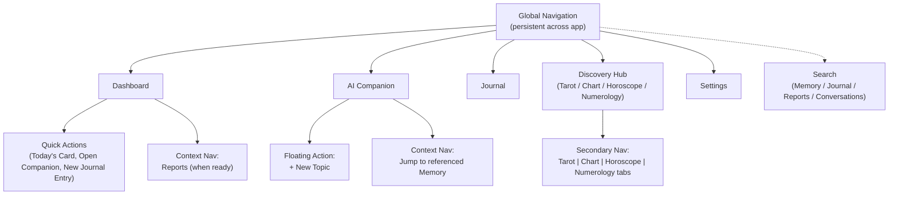
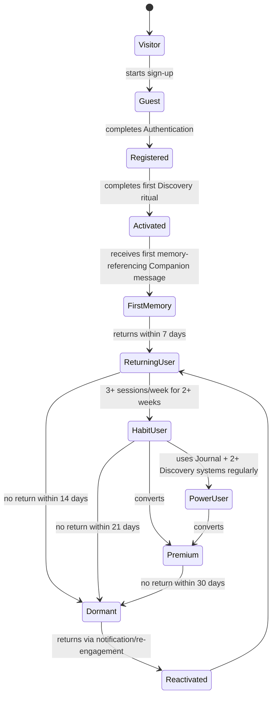
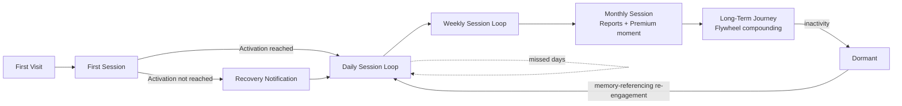
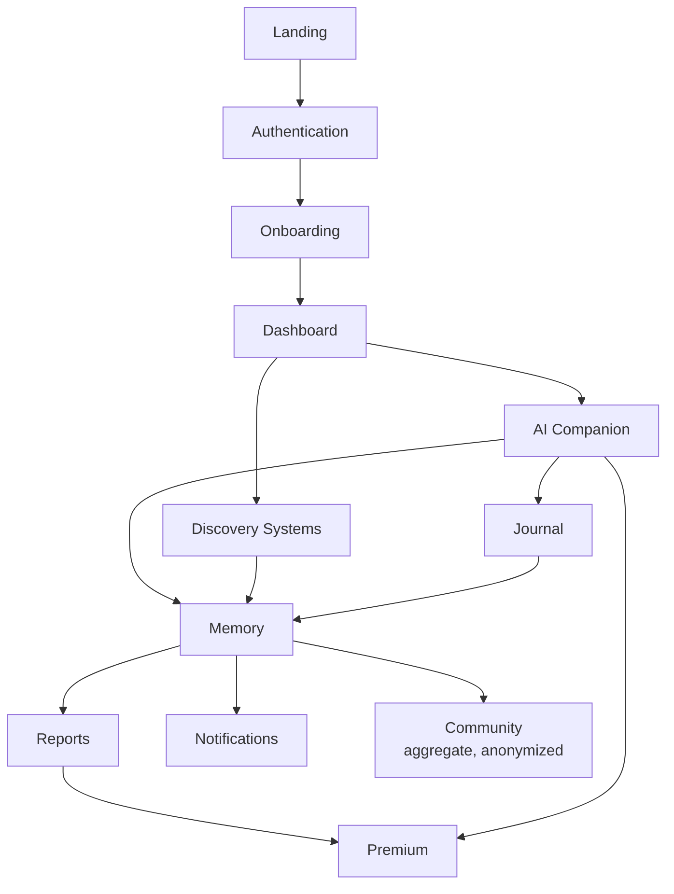
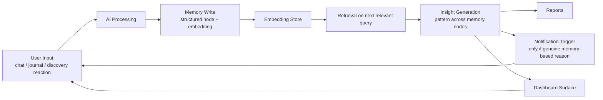
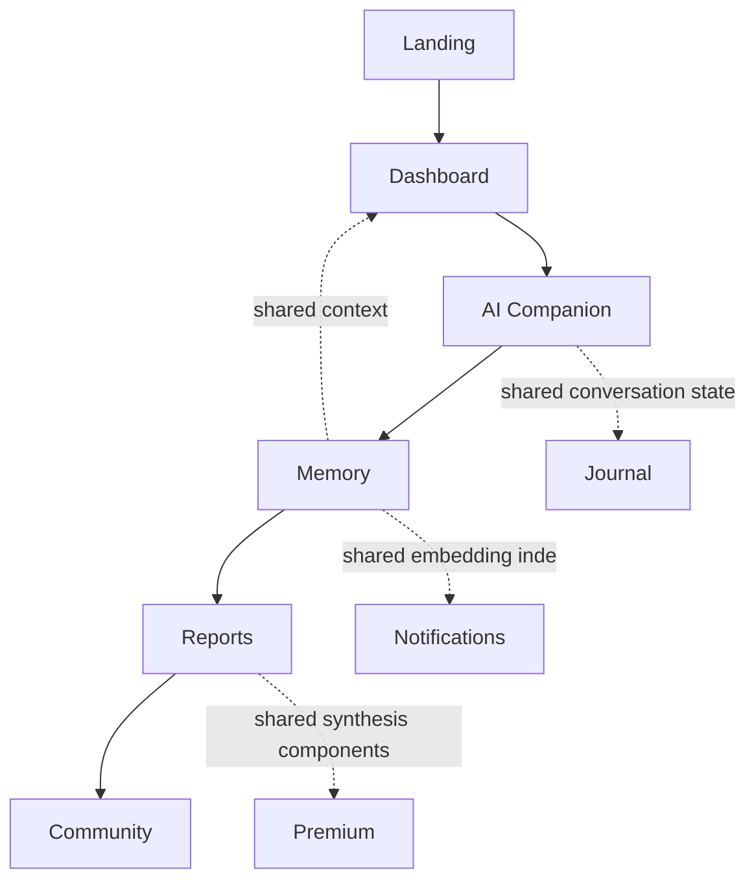
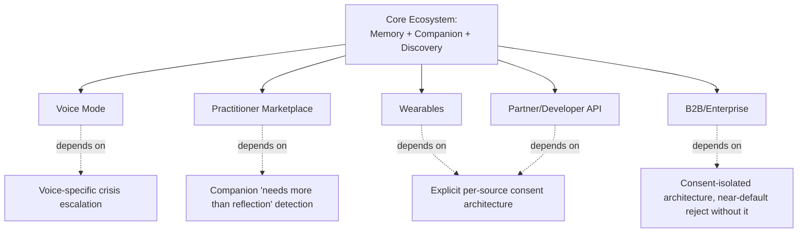

# MODULE 3 — PRODUCT INFORMATION ARCHITECTURE

---

## 1. Executive Summary

**Purpose**
Module 1 defined why the product exists and what may never change. Module 2 defined how the business runs and how the 16 modules relate as an ecosystem. Module 3 converts both into the literal structural blueprint — hierarchy, navigation, states, dependencies, data ownership, and permissions — that UX, UI, Engineering, AI, QA, and Growth build directly from.

**Scope**
This module covers the platform hierarchy, the complete product tree, navigation architecture, the user state machine, journey architecture, feature dependencies, information flow, data ownership, cross-module relationships, permissions, search, notifications, scalability of the IA itself, and standing UX architecture rules.

**Relationship with Module 1**
Every structural decision below is checked against the Product Principles (a module/feature must create, use, or improve memory) and the Decision Framework (Trust > Memory > User Value > Retention > Revenue > Engagement). Where an IA choice would violate a Guardrail (e.g., a navigation pattern that traps a user to force engagement), the Module 1 ranking wins by default — this module introduces no competing authority.

**Relationship with Module 2**
The Product Tree below is the Module 2 Ecosystem table (Section 3) made structural — every module's Purpose and memory-test justification from Module 2 is preserved here, extended with entry points, exit points, and dependencies. The Core Product Loop (Module 2, Section 4) is the backbone of the User Journey Architecture (Section 6 below).

---

## 2. Product Structure

```
Platform
   └── Systems        (e.g., Discovery System, Relationship System, Growth System)
         └── Modules   (e.g., Tarot, AI Companion, Notifications)
               └── Features        (e.g., Daily Card Pull, Companion Chat Thread)
                     └── Sub-Features   (e.g., Card Reveal Animation, Message Memory Tag)
                           └── Components  (e.g., CardFlip component, MemoryChip component)
```

**Why this hierarchy exists**: A flat module list (as in Module 2) is sufficient for business/strategic reasoning but insufficient for engineering and design, which need to know at what level a change is scoped. A change to "how a memory reference is visually flagged" is a **Component**-level change that may touch many Features across many Modules — without this hierarchy, teams cannot correctly estimate blast radius. The hierarchy also enforces Module 1's Product Principles top-down: a **System** groups modules that share a memory-test rationale (e.g., all of Tarot, Natal Chart, Numerology, Eastern Horoscope sit under one "Discovery System" because they share the same purpose — low-friction memory-creating rituals), which keeps the memory-test discipline visible at every level, not just at the top.

**The three Systems**:
1. **Discovery System** — Tarot, Natal Chart, Eastern Horoscope, Numerology (all *create* memory)
2. **Relationship System** — AI Companion, Memory, Journal, Reports (all *use and improve* memory)
3. **Growth & Operations System** — Landing, Authentication, Dashboard, Premium, Community, Notifications, Settings, Admin (support acquisition, monetization, and safe operation of the two systems above)

---

## 3. Complete Product Tree

```
Platform
├── Landing                         [Growth & Operations]
├── Authentication                  [Growth & Operations]
├── Dashboard                       [Growth & Operations]
├── AI Companion                    [Relationship]
├── Memory                          [Relationship — infrastructure]
├── Journal                         [Relationship]
├── Tarot                           [Discovery]
├── Natal Chart                     [Discovery]
├── Eastern Horoscope               [Discovery]
├── Numerology                      [Discovery]
├── Reports                         [Relationship]
├── Premium                         [Growth & Operations]
├── Community                       [Growth & Operations]
├── Notifications                   [Growth & Operations]
├── Settings                        [Growth & Operations]
└── Admin                           [Growth & Operations — internal only]
```

**Per-module detail:**

**Landing**
- Purpose: correctly frame the product as a Companion relationship, not a horoscope app, before signup (Module 1 Brand Positioning).
- Entry points: organic search, paid acquisition, referral link, social share of a discovery-system moment.
- Exit points: Authentication (sign-up), or bounce.
- Dependencies: none upstream; hard dependency for Authentication downstream.

**Authentication**
- Purpose: establish the persistent identity anchor all memory attaches to.
- Entry points: Landing CTA, deep link from referral/share, app-open with expired session.
- Exit points: Onboarding (new user) or Dashboard (returning user).
- Dependencies: hard dependency on Landing (or direct deep link); hard dependency for every other module.

**Dashboard**
- Purpose: daily entry ritual; surfaces today's discovery content and Companion entry point.
- Entry points: post-auth landing, app open, notification tap.
- Exit points: Companion, any Discovery module, Journal, Settings.
- Dependencies: hard dependency on Authentication; soft dependency on Memory (richer once memory exists, functional without it for new users).

**AI Companion**
- Purpose: the core relationship surface; the product itself.
- Entry points: Dashboard, Discovery module post-reading prompt, Notification, direct nav.
- Exit points: Journal (from a "want to write more about this?" prompt), Reports (from a synthesis prompt), back to Dashboard.
- Dependencies: hard dependency on Memory (even session-only memory in MVP); soft dependency on every Discovery module for context richness.

**Memory**
- Purpose: the structured persistent data layer; infrastructure module with no direct UI surface of its own beyond Settings (data controls).
- Entry points: none direct (it is written to by every other module, not navigated to).
- Exit points: none direct; is read by Companion, Reports, Dashboard, Notifications.
- Dependencies: hard dependency on Authentication (identity anchor); is itself a hard dependency for Companion, Reports, and memory-based Notifications.

**Journal**
- Purpose: highest-richness freeform memory input.
- Entry points: Dashboard, Companion prompt, direct nav.
- Exit points: Companion (Companion may respond to an entry), Reports (entries feed synthesis).
- Dependencies: hard dependency on Authentication; soft dependency on Companion (functions standalone, but richer when Companion references entries).

**Tarot / Natal Chart / Eastern Horoscope / Numerology** (Discovery System — structurally identical pattern)
- Purpose: low-friction, memory-creating rituals, each with a different setup cost and cadence (Numerology fastest, Natal Chart richest, Eastern Horoscope annual cadence, Tarot daily cadence).
- Entry points: Dashboard, direct nav, Companion suggestion ("want to check your chart on this?").
- Exit points: Companion (post-reading reflection prompt), Journal.
- Dependencies: hard dependency on Authentication; each is otherwise independent of the others (no Discovery module requires another to function) — this is a deliberate **optional dependency** design so any one can be added standalone by a user.

**Reports**
- Purpose: periodic synthesis across Memory, Journal, and Discovery history.
- Entry points: Dashboard (scheduled availability), Notification, Premium upsell moment.
- Exit points: Companion (discuss the report), Premium (if free-tier preview).
- Dependencies: hard dependency on Memory reaching a minimum density threshold (Module 2, Section 7); soft dependency on Journal/Discovery breadth for report richness.

**Premium**
- Purpose: monetize relationship depth (Module 2, Section 8).
- Entry points: paywall moment triggered by an experiential trigger (post-Insight, per Module 1 Optimization), Settings, Reports preview.
- Exit points: back to whichever module triggered the upsell, now unlocked.
- Dependencies: hard dependency on Authentication; soft dependency on Companion/Reports (the felt value that justifies the upsell).

**Community**
- Purpose: anonymized, pattern-based peer layer (never a social feed, per Module 1 Guardrails).
- Entry points: Dashboard, Reports (a pattern surfaced), direct nav.
- Exit points: back to Dashboard or Discovery module referenced in a pattern.
- Dependencies: soft dependency on aggregate Memory corpus (Module 2, Network Effects); optional for any individual user.

**Notifications**
- Purpose: memory-triggered re-engagement only (no generic/urgency pushes, per Guardrails).
- Entry points: none (system-initiated); tapping one is the entry point into another module.
- Exit points: Dashboard, Companion, Journal, Reports — whichever module the memory trigger concerns.
- Dependencies: hard dependency on Memory (a notification requires a genuine memory-based reason to exist).

**Settings**
- Purpose: user control over memory retention, export, deletion (Privacy value made concrete).
- Entry points: Dashboard, any module's settings icon.
- Exit points: back to originating module, or Authentication (account deletion flow).
- Dependencies: hard dependency on Authentication; hard dependency on Memory (for export/delete controls to have something to act on).

**Admin**
- Purpose: internal trust & safety review, content curation, memory-pipeline monitoring. Not user-facing.
- Entry points: internal staff auth only.
- Exit points: n/a (internal tool).
- Dependencies: reads from every module; writes only to content/curation and moderation flags, never directly to a user's personal memory graph without an auditable reason (Privacy Guardrail).

**No orphan modules**: every module above has at least one hard or soft dependency connecting it to Authentication (identity) and either Memory directly or a module that itself depends on Memory — satisfying the requirement that every module connects back to AI Companion or Memory.

---

## 4. Navigation Architecture



**Global Navigation**: persistent, four destinations only — Dashboard, Companion, Journal, Discovery Hub, plus Settings tucked into a corner affordance. Kept to four+one deliberately: Module 1's Design Philosophy calls for calm, unhurried UI; a crowded tab bar contradicts that and adds decision fatigue that works against habit formation.

**Primary Navigation**: the Global Nav bar itself.

**Secondary Navigation**: within Discovery, a tab/segmented control across the four systems — these are peers (optional dependencies on each other, Section 3), so a flat tab structure is correct rather than nesting one inside another.

**Context Navigation**: surfaces contextually, e.g., a Companion message that references a past Journal entry offers a direct jump-link to it; a Dashboard card offers a direct link into a freshly-ready Report. Context nav is how "Memory always accessible" (Section 15) is implemented structurally, not just as a principle.

**Quick Actions**: Dashboard-level shortcuts to the highest-frequency actions (today's card, open Companion, new Journal entry) — chosen because these three map directly to the Discovery → Conversation → Journal early stages of the Core Product Loop (Module 2, Section 4).

**Floating Actions**: within Companion, a persistent "+ New Topic" affordance, since conversation is open-ended and benefits from an explicit way to shift context without scrolling back.

**Search**: a single global search surface (Section 12), not fragmented per-module search bars — consistent with minimal navigation depth (Section 15).

**Why users move this way**: navigation is structured around the Core Product Loop stages, not around the org chart of 16 modules — a user should never need to know "which module" something lives in to get to it; they should be able to move along the loop (see today's ritual → talk to Companion → write in Journal → eventually see a Report) via Quick Actions and Context Nav without deep menu-diving.

---

## 5. User State Machine



| State | Goals | Available Features | Restrictions | Success Criteria | Transition Trigger |
|---|---|---|---|---|---|
| **Visitor** | Understand what this product is, distinct from a horoscope app | Landing only | No account, no Companion access | Clicks sign-up | Starts Authentication |
| **Guest** | Complete sign-up with minimal friction | Authentication forms | No Discovery/Companion access yet | Completes account creation | Account created |
| **Registered** | Reach first Discovery ritual fast | Onboarding, fastest-setup Discovery system (Numerology) offered first | Natal Chart gated behind optional exact-birth-time step (can defer) | Completes at least one Discovery reading | Discovery ritual completed |
| **Activated** | Experience the Activation event (Module 1) | Full Discovery access, Companion chat (session memory) | Cross-session memory not yet meaningful (MVP) / present but shallow (V1+) | Receives a Companion message referencing something just said | Companion references current-session input |
| **First Memory** | Return and discover memory persists | All free-tier features | Premium features locked | Returns and Companion references prior-session content | Returns within 7 days |
| **Returning User** | Build a rhythm (Discovery + Companion + occasional Journal) | All free-tier features | Premium locked | 2+ sessions in following week | 3+ sessions/week sustained 2 weeks |
| **Habit User** | Deepen via Journal and multiple Discovery systems | All free-tier features, Reports preview once density threshold met | Full Reports / persistent deep memory locked behind Premium | Adopts Journal and 2+ Discovery systems | Sustained multi-system usage |
| **Power User** | Full multi-system engagement | Everything free-tier offers, sees Premium paywall at natural Insight moments | Same as Habit User | Reaches a genuine Insight moment (Module 1) | Insight moment reached |
| **Premium** | Deepen relationship without memory/session limits | Everything, including persistent memory, full Reports, priority Discovery access | None beyond usage-appropriate rate limits on Credits-metered deep actions | Renews subscription | Successful conversion |
| **Dormant** | n/a (inactive) | All previously unlocked features remain available on return | No new memory generated while dormant | Opens app again | Notification tap or organic return |
| **Reactivated** | Re-establish rhythm | Same as prior tier | None beyond tier | Returns to Returning User state within a session or two | First post-return session completed |

**Note**: Premium can be reached from Habit User or Power User (not gated to Power User only) — a Habit User who hasn't yet reached full multi-system engagement can still convert if they've had a genuine Insight moment, since Insight (not usage volume) is the true conversion trigger per Module 2, Section 8.

---

## 6. User Journey Architecture

**First Visit**: Entry via Landing (organic/paid/referral). Exit: sign-up start or bounce. No loop yet.

**First Session**: Entry via Authentication completion → Onboarding (fastest Discovery system first) → first Companion interaction. Exit: Activation event reached, or session ends before it (recovery: Notification within 24–48 hours referencing the started-but-incomplete ritual, never a generic "come back!" push).

**Daily Session**: Entry via Dashboard (today's card/notification). Loop: Discovery touch → optional Companion chat → optional Journal entry → exit back to daily life. Recovery: if a day is missed, no streak-shaming (Guardrail) — next open simply continues where memory left off.

**Weekly Session**: Entry via a memory-triggered notification ("last week you mentioned X — how's that going?") or organic return. Loop: deeper Companion conversation, possible multi-Discovery-system check (e.g., weekly horoscope + tarot). Exit: Journal entry or simple close.

**Monthly Session**: Entry via Reports availability notification (once density threshold met) or Premium upsell surfaced at a natural Insight moment. Loop: Report review → Companion discussion of the report → possible Premium conversion. Exit: renewed rhythm or Premium upgrade.

**Long-Term Journey**: the Business Flywheel (Module 2, Section 5) played out at the individual level — increasing memory density, increasing trust, decreasing likelihood of switching to a competitor, periodic Reports marking visible progress. Re-engagement for Dormant users at this stage should reference the single most emotionally significant stored memory thread available, not a generic win-back offer — this is the only re-engagement message type consistent with Module 1's Trust and Guardrail constraints.



---

## 7. Feature Dependency Map



**Hard Dependency**: Authentication → everything (no module functions without identity). Memory → Reports and memory-based Notifications (these cannot exist without underlying memory data — not a design choice, a functional requirement).

**Soft Dependency**: Dashboard → Memory (Dashboard functions for a brand-new user with zero memory, just less richly); Companion → any single Discovery system (Companion works with none, but is more contextually rich with more).

**Optional Dependency**: any one Discovery system → any other Discovery system (a user may use only Tarot forever and never touch Natal Chart — fully valid).

**Future Dependency**: Voice mode → Companion + a voice-specific crisis-escalation implementation (Module 1, AI Philosophy rule 8) that does not yet exist; Marketplace → Companion's ability to recognize and flag "needs more than reflection" moments, which itself depends on mature Memory.

---

## 8. Information Flow



**Stage explanation**:
- **User Input**: any Companion message, Journal entry, or reaction to a Discovery reading. This is the only stage a human directly produces.
- **AI**: processes input in context, generates a response, and identifies what (if anything) is memory-worthy — not every message becomes a stored memory node; triviality filtering happens here (an AI Philosophy-consistent behavior: the Companion shouldn't hoard noise, only what's genuinely reflective).
- **Memory**: the structured write — what was said, an emotional/thematic tag, timestamp, source module.
- **Embeddings**: vector representation enabling thematic retrieval later (e.g., "stressed about my mom" and "family tension again" cluster together, per Module 2's Data Architect rationale).
- **Insights**: cross-time pattern recognition run against the embedding store — this is where Module 1's "Insight" stage of the Core Product Loop is computed.
- **Reports**: periodic, user-facing synthesis of accumulated Insights.
- **Notifications**: a re-engagement trigger fires only when Insight generation produces something genuinely worth surfacing — never on a fixed schedule alone (Guardrail-consistent).
- **Dashboard**: the passive, always-available surface for the freshest relevant Insight or Discovery ritual.
- **Loop closure**: both Notifications and Dashboard lead back to new User Input, closing the Core Product Loop structurally, not just conceptually.

---

## 9. Data Ownership

| Module | Source of Truth | Read | Write | Update | Delete | Sync | Cache |
|---|---|---|---|---|---|---|---|
| **Memory** | Memory service (Postgres, structured nodes + embedding refs) | Companion, Reports, Notifications, Dashboard | AI processing pipeline only (never direct user UI write) | AI pipeline (re-tagging, re-embedding on correction) | User-initiated via Settings only (hard requirement) | Async via BullMQ from every source module | Hot recent-memory cache in Redis for Companion low-latency retrieval |
| **Journal** | Journal service (Postgres) | User (own entries only), AI pipeline (feeds Memory) | User (create entry) | User (edit own entry) | User (delete own entry) — cascades a deletion request to any derived Memory nodes | Immediate on write; async downstream Memory extraction | Draft-entry local cache only |
| **Tarot** (representative of all Discovery modules) | Discovery-reading service (deterministic draw logic + Postgres log) | User (own history), AI pipeline | System (generates draw), User (reaction/note) | Not applicable (a past reading is immutable) | User (delete a reading's log entry; underlying derived Memory node deletion follows Memory's own rule) | Immediate | Today's-reading cache for fast Dashboard load |
| **AI Companion** | Conversation service (Postgres, message log) + Memory service (context) | User (own conversation), AI pipeline | User (message), AI (response) | Not applicable (messages immutable once sent) | User (delete conversation; does not retroactively delete already-derived Memory nodes without separate explicit action, to avoid silent Companion "amnesia" without clear user intent) | Real-time | Active session context cache |
| **Settings** | Settings service (Postgres) | User only | User | User | User (account-level deletion cascades per legal/privacy spec) | Immediate | None (low-frequency reads, no caching benefit) |

**Governing rule**: Memory is never directly writable by a user action — it is always derived by the AI pipeline from Journal, Companion, or Discovery input, and its *deletion* is the one Memory operation users can always trigger directly via Settings. This asymmetry (derived write, direct delete) is a deliberate Privacy-value implementation: users cannot corrupt the memory graph with direct edits, but can always exercise the right to remove themselves from it.

---

## 10. Cross-Module Relationships



**Shared Data**: the Memory embedding index is the single shared data asset read by Companion, Reports, and Notifications — there is exactly one embedding store, not per-module duplicates, to avoid drift between what the Companion "knows" and what a Report "knows."

**Shared State**: active conversation state (what's currently being discussed) is shared between Companion and Journal, so a Companion prompt like "want to write more about this?" can pre-populate a Journal draft with context, rather than starting the user from a blank page.

**Shared Components**: Report synthesis UI components (the visual pattern/timeline elements) are shared with the Premium upsell surface, so the paywall moment literally reuses the same visual language as a felt Insight, rather than introducing a jarring, separate "sales screen" aesthetic — consistent with Module 1's Design Philosophy.

**Shared Context**: Dashboard reads shared context from Memory (what's freshest/most relevant right now) without owning any memory data itself — Dashboard is a presentation layer over Memory + Discovery-system state, not a separate data owner, which avoids the classic IA mistake of a "homepage" silently becoming its own inconsistent source of truth.

---

## 11. Permission Architecture

| Tier | Accessible Modules | Restricted Modules | Upgrade Path |
|---|---|---|---|
| **Guest** | Landing, Authentication | Everything else | Complete Authentication → Registered |
| **Registered/Free** | Dashboard, Companion (session memory), Journal, all four Discovery modules, Settings, Community (read/participate anonymized), Notifications | Persistent cross-session Companion memory, full Reports, priority Discovery access | Convert at an Insight-moment paywall trigger → Premium |
| **Premium** | Everything Free has, plus persistent memory, full Reports, priority access, higher Credits allotment | Admin only | n/a (top consumer tier) |
| **Moderator** | Community moderation tools within Admin, read access to flagged (never full personal) content | Full Memory graphs of individual users (never accessible even to Moderators, per Privacy Guardrail) | Internal role assignment, not a purchasable tier |
| **Admin** | Full Admin module: content curation, aggregate trust & safety dashboards, system health | Individual user's raw Journal/Companion conversation content, accessible only via an audited, logged, reason-required override process — never ambient access | Internal role assignment |
| **Super Admin** | Everything Admin has, plus user/role management and the audited override process itself | n/a | Internal role assignment, most restricted headcount |

**Why this shape**: The strictest rule in this whole table is that even Admin/Moderator roles do not get ambient access to an individual's personal memory content — this directly implements the Privacy value and Trust-first Decision Framework ranking at the permission-architecture level, not just as a policy statement. Any future feature proposing broader internal visibility into personal memory content must be treated as a Guardrail violation by default.

---

## 12. Search Architecture

**What's searchable**: Journal entries, Companion conversation history, Reports, and Discovery reading history (e.g., "find that reading about my job change").

**Search Scope**: personal only — a user's search never returns another user's content, even anonymized Community patterns (Community has its own separate, non-personal browse/discovery surface, not unified into personal search).

**Ranking**: recency-weighted combined with embedding-similarity relevance (the same embedding index from Section 9) — a literal keyword match and a thematically-similar-but-differently-worded entry should both surface, consistent with the Data Architect's embeddings rationale in Module 1.

**Future Semantic Search**: natural-language queries like "when did I last feel this way about work" should resolve via the same embedding retrieval mechanism that powers Companion memory recall (Section 8) — search and Companion memory retrieval should share one underlying retrieval service, not be built as two parallel systems, to avoid the same drift risk flagged in Section 10's Shared Data principle.

---

## 13. Notification Architecture

| Trigger source | Example | Priority | Grouping | Scheduling |
|---|---|---|---|---|
| **Memory** | "Three weeks ago you mentioned starting a new job — curious how it's going" | High | Standalone (never bundled — memory-based notifications should feel individually considered) | Sent at a contextually reasonable time of day for the user, not a fixed global send time |
| **Journal** | Companion follow-up prompt on a previous entry's open thread | Medium | Standalone | Within 24–72 hours of the original entry, whichever feels least like surveillance-speed follow-up |
| **Companion** | An unfinished conversation thread the Companion has a considered follow-up to | Medium | Standalone | Same-day-plus-one at the earliest |
| **Reports** | "Your monthly reflection is ready" | Medium | Standalone | Fixed cadence (monthly), but content is memory-derived, not templated |
| **Community** | An anonymized pattern relevant to the user's own recent activity | Low | Can batch with other low-priority items | Weekly digest cadence, opt-in only |
| **Premium** | A felt-Insight-moment-triggered upsell surfaced in-app, not as a push notification | N/A (in-product only) | N/A | Triggered by the Insight event itself, never a push |
| **System** | Security/account notices (e.g., new device login) | Highest (overrides all grouping) | Never batched | Immediate |

**Governing rule**: no notification category above is permitted to use urgency language, streaks, or FOMO framing (Guardrail, reaffirmed at this architectural layer) — Priority here refers to how promptly and prominently something is delivered, never to manufactured emotional pressure in the copy itself.

---

## 14. Scalability Architecture



**How new modules plug in**: every future expansion module (Voice, Marketplace, Wearables, API, Enterprise) attaches to the existing Core Ecosystem (Memory + Companion + Discovery) as a new **input or output surface**, never as a parallel memory store. This is the single IA rule that keeps the platform from fragmenting: Wearables would write biometric/mood signal into the same Memory service via a new ingestion path, not a separate "Wearables memory" — preserving the one-embedding-index principle from Section 9 as the platform scales.

**Consent architecture** is called out as a shared dependency for Wearables, API, and Enterprise specifically because each introduces a new party (a device, a third-party developer, an employer) with a structural incentive to see more than the user intends — the IA must treat consent as its own reusable service, not a per-feature checkbox, before any of these three ship.

---

## 15. UX Architecture Principles

1. **One purpose per screen.** Every screen maps to exactly one Core Product Loop stage (Discovery, Conversation, Journal, Insight/Reports). A screen that tries to do two (e.g., a Dashboard that's also a sales screen) dilutes both and contradicts the calm, unhurried Design Philosophy (Module 1).
2. **Minimal navigation depth.** No feature should be more than two taps from Global Navigation (Section 4) — deep nesting is a symptom of an IA that hasn't found the right System-level grouping (Section 2).
3. **Never trap users.** Every screen has a clear, always-visible way back or out — including mid-conversation with the Companion and mid-paywall. A trapped user is a Guardrail violation (manufactured dependency) regardless of intent.
4. **Progressive disclosure.** Natal Chart's exact-birth-time requirement, Reports' density threshold, and Premium's deeper features are all revealed only when they'd be genuinely usable — nothing is shown as a locked, teased feature purely to create FOMO (that would violate the artificial-scarcity Guardrail from Module 2).
5. **Memory always accessible.** Implemented structurally via Context Navigation (Section 4) and unified Search (Section 12) — a user should never feel they've "lost" something they told the Companion or wrote in Journal.
6. **Companion always reachable.** Global Navigation guarantees this; no flow (including Premium upsell or Settings) should be more than one tap from returning to Companion, since Companion is architecturally the center of the product, not a peer feature among sixteen.

---

## 16. IA Validation

**Founder**: The System-level grouping (Discovery / Relationship / Growth & Operations) is the right abstraction — it keeps 16 modules from feeling like 16 independent products, and it's the first place in the Bible where "everything connects back to Memory or Companion" becomes literally structurally true rather than just asserted.

**UX Architect**: Navigation depth is well controlled (Section 4, Section 15's two-tap rule), but Community's placement in Global Nav vs. buried in Discovery needs a decision — as currently specified it's in Global Nav, which may overweight its importance relative to its V1.5 (not MVP) status. Recommend Community enter Global Nav only once it ships, not reserve a permanent slot pre-launch.

**Engineering**: The Feature Dependency Map (Section 7) correctly isolates Memory as the one true hard dependency for Reports/Notifications — this matches Module 1's Technical Design and gives Engineering an unambiguous build order. No contradictions found.

**AI**: Information Flow (Section 8) correctly routes all memory-worthy content through a single AI triviality-filtering step before storage — this prevents memory-graph bloat with low-value nodes, which would otherwise degrade retrieval quality over time (a real risk not previously made explicit at this level of detail).

**Growth**: Notification Architecture (Section 13) is stricter than most competitors' — this is intentional per Guardrails, but Growth should be aware conversion/reactivation metrics will likely underperform generic-push-notification benchmarks, and that gap should be treated as expected, not as a signal to loosen the copy rules.

**QA**: The Data Ownership table's rule that Memory is never directly user-writable, only user-deletable, is a clean, testable invariant — recommend this become an explicit automated test (attempt a direct Memory write via any client path; it must fail) rather than only a code-review convention.

**Weaknesses identified**: Community's Global Nav placement is premature relative to its ship date; memory-graph bloat risk from low-value node accumulation needed explicit mention (now addressed in Section 8); no explicit versioning/migration strategy yet exists for Memory schema changes as the product evolves (flagged for Module 15, Technical Design, not resolved here).

**Bottlenecks identified**: none structural — the two-tap navigation rule and single-embedding-index principle prevent the most common IA bottlenecks (deep nesting, duplicated state) by design.

**Unnecessary complexity identified**: none found; the three-System grouping was deliberately chosen to avoid over-fragmenting 16 modules into more categories than necessary.

**Recommendations**: (1) Community joins Global Navigation only at its actual ship date, not reserved pre-launch. (2) Add an explicit AI triviality-filter QA check to prevent memory-graph bloat (ties to Module 1's release-blocking QA category for memory quality). (3) Flag Memory schema versioning as an open item for the Technical Design module.

---

## 17. Final Decisions

**Chosen IA**
Three-System grouping (Discovery / Relationship / Growth & Operations) over a flat 16-module list; navigation organized around Core Product Loop stages rather than module names; a single shared embedding index and single Memory source of truth across Companion, Reports, Search, and Notifications; strict never-direct-write/always-user-deletable rule for Memory; two-tap maximum navigation depth; Community held out of Global Navigation until it actually ships.

**Rejected IA**
- A flat, module-name-based navigation (a tab per module) — rejected because 16 tabs directly violates minimal navigation depth and calm Design Philosophy, and because it would organize the user's mental model around the org chart instead of around their own reflective practice.
- Per-module separate memory/embedding stores (e.g., "Tarot memory" vs. "Companion memory") — rejected because it would fragment the single most important asset in the business (Module 2's Memory Moat) and risk Companion/Reports/Search drifting out of sync with each other.
- Reserving a permanent Global Nav slot for Community pre-launch — rejected as overweighting a V1.5 module relative to its actual current value to users, and as a minor but real instance of the "reserve space to imply more than currently exists" pattern this Bible otherwise guards against.

**Trade-offs**
Two-tap navigation depth and a small Global Nav (four destinations plus Settings) mean some lower-frequency modules (Eastern Horoscope, Numerology) are one layer deeper (inside the Discovery tab) rather than each getting top-level billing — accepted because frequency of use, not module count, should drive nav prominence.

**Reasons**
Every choice above optimizes for the same thing: making "Memory First" and "Companion always reachable" structurally true, not just stated. An IA that required a user to know which of 16 modules something "belonged to" would silently reintroduce the org-chart-shaped mental model this entire Product Bible exists to avoid.

---

**Next module in sequence: Design System.**
