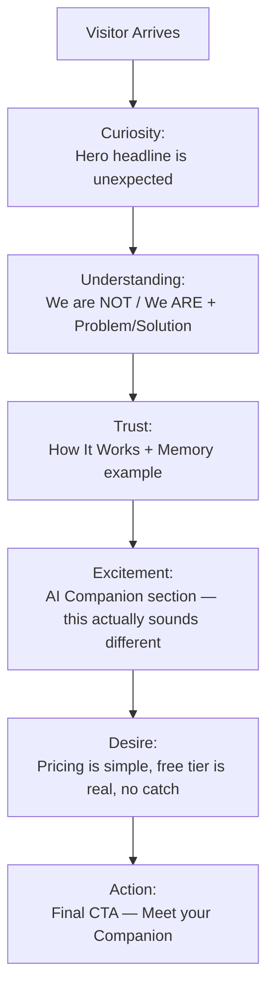

# MODULE 5 — LANDING EXPERIENCE
### BeaconVie

---

## 1. Product Goals

**Business Goals**: fund the acquisition engine cheaply via organic/shareable Discovery-system content (Module 2) while correctly setting the Companion-relationship expectation before signup, so early cohorts don't form the "just another horoscope app" mental model flagged as a business risk in Module 2, Section 11.

**UX Goals**: communicate what BeaconVie is, who it's for, and why it's different within the first screen, without a feature dump; keep the page calm and unhurried per Module 4's Experience Principles, even under conversion pressure.

**Conversion Goals**: the primary conversion event is not "signup" — it is reaching the Activation event (Module 1/3: first Companion message that references something the user just shared) as fast as possible after signup. The Landing's real job is to set up a visitor to *want* that moment, not just to click a button.

**Brand Goals**: land firmly on the "We are NOT / We ARE" positioning from Module 1 before a single feature is described — a visitor should be able to rule out "horoscope app," "generic chatbot," and "therapy app" within seconds of arriving.

**Activation Goals**: the fastest path from Landing to Activation should require the fewest possible decisions — the Landing should not present four Discovery systems as equal choices up front (that's an Onboarding decision, not a Landing one); it should build enough trust and curiosity that starting is the obvious next step.

---

## 2. Landing Strategy

**Purpose**: convert curiosity into a completed sign-up that carries the correct mental model into Onboarding — not just maximize raw sign-up count.

**Primary audience**: the Reflective Skeptic (Module 1, Persona A) — doesn't literally believe in astrology, uses it as a reflection framework, will bounce immediately if the page reads as mystical or gimmicky. This persona is the hardest to convert and the easiest to lose with one wrong word, so the Landing is written for them first.

**Secondary audience**: the Ritual Seeker (Persona B) and the Companion-First User (Persona C) — both are served by the same page as long as it doesn't over-correct toward dry/clinical in service of the Reflective Skeptic; the "We ARE" section and Discovery-system section (Section 6) are where Persona B finds enough specificity to feel this is legitimate, not watered-down.

**Pain points addressed**: generic, mass-produced horoscope content (Module 1); AI chatbots with no continuity; blank-page journaling anxiety.

**Desires addressed**: feeling known over time; a low-stakes, structured way to process big feelings; curiosity about self through an established framework.

**Objections to pre-empt**: "Is this just a horoscope app?" (answered by "We are NOT," Section 6); "Is my data safe / is this a data-harvesting operation?" (answered by Trust System, Section 11); "Will an AI actually remember me or is that a gimmick?" (answered by Memory section, Section 6, with a concrete example, not an abstract claim); "Is this therapy?" (explicitly answered no, Module 1 positioning).

**Expected emotions across the visit**: mild skepticism on arrival → recognition ("this isn't what I expected") within the hero → curiosity through the How It Works section → quiet trust by Memory/Security → a calm, confident decision to start, not a hyped impulse click.

---

## 3. Information Hierarchy

```
Hero
  ↓
Trust (brief, early — "We are NOT / We ARE")
  ↓
Problem (the two failed categories, Module 1)
  ↓
Solution (BeaconVie's actual mechanism)
  ↓
How It Works (3-step, concrete)
  ↓
Discovery Systems (Tarot / Chart / Horoscope / Numerology — brief, visual)
  ↓
AI Companion (the core differentiator, given the most space)
  ↓
Memory (the proof-of-continuity moment — a concrete example, not an abstract claim)
  ↓
Security & Privacy (folded into Trust System, not a separate wall of legal text)
  ↓
Pricing (transparent, simple — free-tier-forward per Module 2's monetization thesis)
  ↓
FAQ (objection-handling, Section 2)
  ↓
Final CTA
```

**Why this order**: Trust is placed early (right after Hero, before Problem/Solution) rather than at the traditional end-of-page position, because the Reflective Skeptic persona will not read far enough to reach a bottom-of-page trust section — the "We are NOT" framing has to do its skepticism-defusing work before the visitor has decided whether to keep scrolling at all. Memory is placed after Companion, not before, because Memory is only meaningful once the visitor understands there's a Companion to have a relationship with — leading with "we remember you" before establishing what's doing the remembering would be abstract and unconvincing. Pricing sits late and low-friction (per Module 2's free-tier-first thesis) rather than being hidden or, conversely, pushed aggressively — a Reflective Skeptic specifically distrusts pages that hide pricing.

---

## 4. Hero Section

**Headline**: *"An AI that actually remembers you."*

**Subheadline**: *"BeaconVie uses tarot, astrology, and numerology as a way to get to know you — then carries what it learns forward, conversation after conversation, so you're never starting over."*

**Why this headline**: it leads with the Companion/memory differentiator, not the Discovery-system content — directly matching Module 1's positioning ("the Companion is the core product") and pre-empting the "just another horoscope app" objection in the very first line, before a visitor can even form that assumption. It avoids "AI-powered," "unlock your potential," and every other category-generic phrase.

**Primary CTA**: *"Meet your Companion"* — chosen over "Sign up" or "Get started" because it names the actual first experience (Module 3's Activation event), setting an accurate expectation rather than a generic transactional one.

**Secondary CTA**: *"See how it works"* — a same-page anchor scroll to Section 6's How It Works, for visitors not ready to commit but wanting more before deciding; never a second competing signup path (per Section 12's single-clear-CTA requirement).

**Illustration**: the Constellation Thread motif (Module 4, Section 9) at moderate density — a few soft points slowly connecting, rendered large and quiet behind the headline. Chosen specifically because it visually is the metaphor in the headline ("remembers you" = points connecting over time) without resorting to literal mystical iconography (no tarot cards, no crystal ball, no zodiac wheel in the hero).

**Animation**: the constellation points connect slowly on load (600–900ms, Module 4's Card Reveal timing) — one deliberate, single animation, not a looping ambient effect, so the hero feels calm rather than busy.

**Expected emotion**: quiet recognition — "this is more considered than I expected," not excitement or hype.

---

## 5. Storytelling Flow



**How every section moves users forward**: Hero interrupts the expected pattern (an AI-memory claim instead of a horoscope hook), which produces Curiosity rather than the usual "another astrology app, skip" reflex. Understanding is delivered fast and plainly (the "We are NOT" section), converting Curiosity into a working mental model before any skepticism calcifies. Trust is earned specifically through the Memory section's concrete worked example (Section 6) rather than an abstract promise — abstract claims don't move a skeptical visitor, a specific, plausible example does. Excitement comes from the AI Companion section being given real space and specificity rather than being one bullet among many features — feature-dumping would flatten exactly the differentiator the whole page exists to communicate. Desire is built by pricing transparency (nothing hidden, no bait-and-switch) rather than urgency tactics, consistent with Guardrails. Action is a single, calm, accurately-named CTA — not a discount countdown or exit-intent pressure tactic.

---

## 6. Landing Sections

**Hero** — *(fully specified in Section 4)*

**Problem**
- Purpose: name the two failed categories (Module 1) without naming competitors, so the visitor recognizes their own past frustration.
- Content: two short paired statements — "Horoscope apps forget you the moment you close them. Chatbots don't have a reason to ask what really matters." 
- Components: two-column text block (desktop), stacked (mobile), no imagery — this section is deliberately visually quiet so the words carry it.
- CTA: none (this section's job is recognition, not conversion).
- Animation: simple fade-in on scroll, no parallax.
- Exit: scrolls directly into Solution.

**Solution**
- Purpose: state the actual mechanism plainly.
- Content: *"BeaconVie starts with a reading — a card, a chart, a number — and carries what you share forward. Every conversation adds to what your Companion knows. Nothing is lost between visits."*
- Components: single centered text block with the Constellation Thread motif reappearing at low density behind it, visually rhyming with the Hero.
- CTA: none.
- Animation: constellation motif drifts very subtly (ambient, slow, non-looping-obviously).
- Exit: How It Works.

**How It Works**
- Purpose: make the mechanism concrete in three steps.
- Content: "1. Start with a reading — tarot, your chart, your numbers, whichever you're drawn to. 2. Talk it through with your Companion. 3. Come back — it remembers, and the picture gets clearer."
- Components: three-step horizontal layout (desktop) / vertical stack (mobile), each step a simple icon (from Module 4's rounded-stroke icon set) plus one sentence — no numbered "01/02/03" markers with decorative styling, since Module 4's design skill guidance flags that pattern as meaningful only for genuine sequences; here it IS a genuine sequence, so plain numerals are used, without ornamental treatment.
- CTA: none.
- Animation: each step fades in as scrolled to, staggered slightly.
- Exit: Discovery Systems.

**Discovery Systems**
- Purpose: show the four entry rituals briefly, without making the page about them (per Module 1, discovery systems are the doorway, not the house).
- Content: four small cards — Tarot, Natal Chart, Eastern Horoscope, Numerology — one line each, no deep explanation (deep explanation belongs in-product, per Module 3's progressive disclosure).
- Components: four-card row (desktop) / horizontal scroll (mobile), using the standard Card component (Module 4, Section 5).
- CTA: none individually (clicking previews rather than commits, to avoid fragmenting the single primary CTA).
- Animation: simple reveal, no per-card flourish.
- Exit: AI Companion.

**AI Companion**
- Purpose: the core differentiator gets the most space and specificity on the page.
- Content: a real, short example exchange (a mock chat snippet, 2–3 messages) showing the Companion referencing something from an earlier (fictional, clearly illustrative) conversation — concrete beats abstract for a skeptical visitor.
- Components: a stylized AI Message component (Module 4, Section 5) rendered as static example content, using the Fraunces display type for the Companion's lines exactly as it would appear in-product, so the promise and the product visually match.
- CTA: none within the section (the emotional payoff here feeds the final CTA, not a mid-page one, avoiding CTA-dilution).
- Animation: the example messages stream in once on scroll-into-view (matching Module 4's real streaming behavior) rather than appearing instantly — this is a deliberate case of the marketing page literally demonstrating the actual product behavior.
- Exit: Memory.

**Memory**
- Purpose: prove continuity with one concrete, worked example rather than a claim.
- Content: *"Three weeks ago, someone told their Companion they were nervous about a job change. This week, without being asked, it brought it up again — because it remembered."* Paired with a Memory Card component (Module 4) shown exactly as it renders in-product.
- Components: Memory Card (real component, not a mockup graphic) + short caption.
- CTA: none.
- Animation: the Constellation Thread motif connects two points as the section enters view — the clearest single use of the signature motif on the whole page.
- Exit: Security/Trust (folded into pricing-adjacent trust content, see Section 11).

**Reports** *(brief mention, not a full section)*
- Folded into the Companion/Memory narrative as a single supporting line rather than a standalone section — Reports are a V1.5-tier proof point (Module 1 sequencing) and giving it equal section weight to Companion/Memory would overstate its role in the current release.

**Community** *(brief mention, not a full section)*
- Same treatment as Reports — a single line ("as more people reflect, patterns emerge — always anonymized, never a public feed") rather than a dedicated section, both because it's a later-sequenced module (Module 1) and because a full section risks implying a social/public product, contradicting the "We are NOT a social network" positioning.

**Security**
- Folded directly into the Trust System (Section 11) rather than a separate wall-of-text legal section — trust is built through specific statements ("your journal is private by default, and you can export or delete everything, anytime") placed near Pricing, where a converting visitor's guard is naturally still slightly up.

**Testimonials**
- Purpose: social proof, used sparingly and specifically.
- Content: 2–3 short, plausible, non-hyperbolic quotes focused on the "it remembered" moment specifically, not generic praise ("I didn't expect it to actually bring that up again" reads as credible; "This app changed my life!" does not, and is explicitly avoided).
- Components: simple text-forward cards, no forced 5-star graphics (a rating-badge visual would read as generic app-store marketing, off-brand for this page).
- CTA: none.
- Animation: simple fade, no carousel auto-rotation (auto-rotating carousels contradict Calm First).
- Exit: Pricing.

**Pricing**
- Purpose: transparent, simple, free-tier-forward (Module 2).
- Content: two tiers shown plainly — Free (full Discovery access, session-memory Companion) and Premium (persistent memory, full Reports) — no third "decoy" tier, no strikethrough fake-discount pricing.
- Components: two-column comparison card, using standard Card component.
- CTA: "Meet your Companion" (same primary CTA, reused — not a separate "Upgrade now" push, since Premium is earned in-product per Module 2's felt-value sequencing, not sold on the Landing).
- Animation: none beyond standard reveal.
- Exit: FAQ.

**FAQ**
- Purpose: handle the specific objections from Section 2 directly.
- Content: "Is this a horoscope app?" / "Is my data private?" / "Is this therapy?" / "What does Premium actually add?" — each answered in 1–2 plain sentences.
- Components: accordion (Module 4, Section 5).
- CTA: none individually; final item links to the primary CTA.
- Animation: standard accordion expand.
- Exit: Footer/Final CTA.

**Footer / Final CTA**
- Purpose: one last, calm invitation.
- Content: repeats the Hero headline's promise in one line, single CTA button, standard footer links (Privacy, Terms, Contact).
- Components: centered CTA block + standard footer link row.
- CTA: "Meet your Companion."
- Animation: none — the page should end as calmly as it began.
- Exit: sign-up flow (Authentication, Module 3).

---

## 7. Visual Layout

```
DESKTOP (≥1280px)                         MOBILE (<768px)
┌─────────────────────────────┐          ┌──────────────┐
│         Hero (full)          │          │  Hero (full) │
├─────────────────────────────┤          ├──────────────┤
│  Problem   |   Solution      │          │   Problem    │
├─────────────────────────────┤          ├──────────────┤
│      How It Works (3-col)    │          │   Solution   │
├─────────────────────────────┤          ├──────────────┤
│   Discovery Systems (4-col)  │          │  How It Works│
├─────────────────────────────┤          │  (stacked)   │
│      AI Companion (full)     │          ├──────────────┤
├─────────────────────────────┤          │  Discovery   │
│         Memory (full)        │          │  (h-scroll)  │
├─────────────────────────────┤          ├──────────────┤
│      Testimonials (3-col)    │          │  Companion   │
├─────────────────────────────┤          ├──────────────┤
│       Pricing (2-col)        │          │   Memory     │
├─────────────────────────────┤          ├──────────────┤
│           FAQ                │          │Testimonials  │
├─────────────────────────────┤          │  (stacked)    │
│          Footer              │          ├──────────────┤
└─────────────────────────────┘          │   Pricing    │
                                          │  (stacked)   │
                                          ├──────────────┤
                                          │     FAQ      │
                                          ├──────────────┤
                                          │   Footer     │
                                          └──────────────┘
```

**Desktop**: content capped at 1120px for section content (wider than the in-product 720px reading column, Module 4, since Landing sections mix visual and text content); generous vertical rhythm (`space-16`, Module 4) between sections.

**Tablet**: How It Works and Discovery Systems collapse from 3/4-column to 2-column grids; everything else matches desktop structure at reduced padding.

**Mobile**: fully stacked, single column; Discovery Systems becomes a horizontal-scroll card row (matching Module 4's mobile card-row pattern) rather than a 4-up grid, to avoid cramming.

**Spacing**: section-to-section spacing uses `space-16` (64px) minimum on desktop, `space-8` (32px) on mobile — generous by typical landing-page standards, deliberately, since density itself would contradict Calm First.

**Responsive rules**: no content is hidden on mobile that exists on desktop (a common anti-pattern where mobile visitors get a "lite" version) — only layout density changes.

**Scrolling rhythm**: consistent full-bleed-background-per-section alternation (canvas / surface, Module 4 tokens) so scroll position is always legible at a glance, without needing hard divider lines.

**Section transitions**: simple opacity/translate-Y reveal on scroll-into-view (Module 4's standard 200–250ms, except Companion/Memory sections which use the deliberate 600–900ms timing to match their in-product significance).

---

## 8. Interaction Design

**Hover**: CTA buttons use Module 4's standard subtle-lightness hover, nothing more — no scale-bounce, no shadow-pop, consistent with Calm First even in a conversion-critical context.

**Scroll**: standard native scroll; no scroll-jacking anywhere on the page (a common landing-page pattern that this brand explicitly avoids, per Module 4's Interaction System).

**Parallax**: used exactly once — the Constellation Thread background in the Hero drifts at a slightly different rate than foreground text on scroll, a restrained single instance rather than parallax throughout, consistent with the "spend boldness in one place" design principle.

**Reveal**: section-level fade/translate on scroll-into-view (Section 7); no per-word or per-letter text animation (a common but overused, gimmicky pattern that would read as generic-template rather than considered).

**CTA**: the Primary CTA ("Meet your Companion") appears in Hero, Pricing, and Footer only — never more than these three places, and never as a sticky/floating element that follows scroll (a floating CTA reads as pressure, contradicting Calm First and the Guardrail against manufactured urgency).

**Forms**: sign-up form itself lives past the CTA click (a modal or dedicated screen, Module 3's Authentication module) — the Landing page itself has no embedded lead-capture form, keeping the page's single job (build the case, then hand off) clean.

**Motion**: overall motion budget for the page is deliberately low — most sections use only fade/translate reveals; the two exceptions (Hero's constellation connect, Memory's constellation-thread-forms) are the only "special" animations, consistent with Module 4's "spend boldness in one place" principle applied at the page level.

**Micro-interactions**: FAQ accordion expand/collapse (standard), button press-state (standard) — nothing beyond what Module 4's Component System already specifies; the Landing introduces zero new interaction patterns of its own.

---

## 9. Illustration System

**Hero illustration**: Constellation Thread, moderate density, connecting on load (Section 4).

**Discovery illustration**: four small, distinct abstract glyphs (a simple card shape, a chart-wheel line-drawing, a lunar-cycle arc, a numeral motif) — consistent line weight with the rest of the platform's icon system (Module 4), deliberately not literal/ornate mystical iconography.

**Memory illustration**: two constellation points connecting with the signature thread animation (Section 6) — the clearest, most literal use of the metaphor on the page.

**AI illustration**: no separate illustration — the Companion section uses real, static-rendered product UI (the AI Message component) rather than an abstract "AI" graphic, since showing the actual product is more credible than an abstract robot/brain/network illustration cliché.

**Report illustration**: not used as a dedicated illustration (Reports is a supporting mention only, Section 6).

**Footer illustration**: a very low-density constellation, nearly still — bookending the page with the same visual language it opened with, reinforcing continuity even in the page's own structure.

**Illustration style overall**: abstract, celestial, line-based, restrained — a direct extension of Module 4's illustration philosophy, with zero literal fortune-teller iconography (no crystal balls, no ornate mystical borders, no zodiac-wheel-as-decoration) anywhere on the page.

---

## 10. Copywriting System

**Headline rules**: state the differentiator (memory/relationship) before the category (astrology/tarot); never use "unlock," "discover your destiny," "AI-powered," or "journey" — all flagged as category-generic or mystical-coded language to avoid.

**Subheadline rules**: one sentence, plain, names the actual mechanism (reading → Companion → memory) rather than a benefit-only abstraction.

**CTA rules**: name the actual next experience ("Meet your Companion"), never a generic verb alone ("Start," "Sign up," "Get started"); reused identically everywhere it appears (Section 8) — one CTA phrase, never varied for A/B novelty within a single page.

**Benefits copy**: always paired with a concrete example (the Memory section's worked example, Section 6) rather than adjective-stacking ("powerful," "seamless," "revolutionary" are avoided throughout).

**Features copy**: described in terms of what the user experiences, not how the system works ("your Companion remembers," never "our vector-embedding memory pipeline").

**FAQ copy**: direct, short, no hedging language, matching Module 4's error/content rules (specific, plain, never evasive).

**Errors** (sign-up form validation, etc.): follows Module 4's Content Design rules exactly — specific, plain, no blame.

**Empty states**: not applicable to Landing itself (Landing has no user-generated content), but the copy tone matches Module 4's empty-state voice for consistency into Onboarding.

**Premium copy**: transparent and simple ("Premium remembers across every conversation, not just today's") — never urgency-based, matching Module 2's monetization Guardrails.

**Brand voice check — "sounds like BeaconVie"**: every sentence on the page should pass this test — could this line appear on a generic AI-astrology-app landing page, or could only BeaconVie have written it because it's specific to the memory/relationship mechanism? Any copy that fails this test (i.e., could be copy-pasted onto a competitor's page unchanged) is rewritten before shipping.

---

## 11. Trust System

**Founder**: an optional, brief founder note ("why we built this") available via a secondary link near the footer, not forced into the primary scroll path — adds credibility for visitors who seek it without adding length to the primary conversion path.

**AI**: trust in the Companion is built through the concrete example (Section 6), not a claim of technical sophistication — visitors don't trust "advanced AI," they trust a specific, believable demonstration of it remembering something real.

**Privacy**: a plain, specific statement placed near Pricing ("your journal and conversations are private by default — you can export or delete everything, anytime") — directly answering the Objection from Section 2, in the visitor's own language, not legal boilerplate.

**Memory**: the single strongest trust-builder on the page (Section 6) — trust here is earned by specificity, not asserted by adjectives.

**Testimonials**: short, specific, focused on the memory/continuity moment (Section 6) — generic praise is explicitly avoided as it reads as inauthentic and contradicts Calm First.

**Security**: a simple, factual line ("encrypted, never sold, never used to train on without consent") rather than a security-badge wall — badges/certifications, if genuinely held, can appear in the footer, small and unobtrusive, never as a hero-level trust signal (which would read as compensating for a lack of confidence elsewhere).

**Transparency**: pricing shown plainly with no hidden tiers (Section 6); FAQ answers real objections directly rather than deflecting.

---

## 12. Conversion System

**Primary CTA**: "Meet your Companion" — appears exactly three times (Hero, Pricing, Footer), per Section 8.

**Secondary CTA**: "See how it works" — Hero only, a same-page anchor, not a second competing path to conversion.

**Sticky CTA**: explicitly not used — a sticky/floating CTA bar is a common conversion-optimization pattern this brand rejects, because it visually communicates urgency/pressure incompatible with Calm First and the Guardrail against manufactured urgency; the page's generous section rhythm is trusted to bring visitors to a CTA naturally instead.

**Exit Intent**: explicitly not used — exit-intent modals ("Wait! Before you go...") are a dark-pattern-adjacent convention explicitly rejected under Module 1's Guardrails (never use dark patterns), regardless of documented conversion lift elsewhere in the industry.

**Newsletter/Email capture**: not offered on the Landing page itself — a separate email-capture ask would fragment the single-CTA principle (Section 1); if desired at all, it belongs in a footer-level, clearly optional, low-emphasis link, not a primary ask.

**Social**: share icons are not placed on the Landing page itself (there's nothing yet to share pre-signup) — sharing is a Discovery-system, in-product behavior (Module 2, Growth Strategy), not a Landing mechanic.

**Referral**: not solicited on Landing — per Module 2, referral is sequenced after Trust is established in-product, so a Landing-page referral ask would be premature and mismatched to a first-time visitor.

**When to ask**: only for the one thing that matters (starting the Companion relationship) — every other conversion-adjacent ask (email capture, social share, referral) is deliberately deferred to the point in the product journey where it's contextually earned.

**When NOT to ask**: never ask for anything via urgency, scarcity, or exit-intent pressure; never present more than one primary decision per section.

---

## 13. SEO Architecture

**Title**: `BeaconVie — An AI Companion That Remembers You`

**Description**: `BeaconVie starts with tarot, astrology, or numerology, then remembers what you share — so every conversation builds on the last. A reflection practice with real memory.`

**Structured Data**: `SoftwareApplication` schema with name, description, and `applicationCategory: LifestyleApplication`; `Organization` schema for brand entity; `FAQPage` schema mirroring the on-page FAQ (Section 6) for rich-result eligibility.

**Open Graph**: `og:title` matching the page title; `og:description` matching the meta description; `og:image` featuring the Hero's Constellation Thread illustration (static render) rather than a screenshot-dense product image, to keep social previews on-brand and calm.

**Twitter Card**: `summary_large_image`, same asset as Open Graph, for consistency across sharing surfaces.

**Semantic HTML**: single `<h1>` (the Hero headline), sequential `<h2>` per major section (Section 6), `<section>` landmarks throughout, accordion FAQ using proper `<details>/<summary>` semantics or ARIA-equivalent for screen-reader and SEO crawlability alike.

**Performance**: Hero illustration and any above-the-fold assets ship as optimized SVG (matching Module 4's illustration format) rather than large raster images, keeping Largest Contentful Paint low without sacrificing the visual identity.

**Core Web Vitals**: target LCP < 2.0s (SVG hero, no heavy hero video), CLS near-zero (fixed-aspect illustration containers, no layout shift from late-loading fonts — font-display: swap with matched fallback metrics for Fraunces/Karla), INP kept low by avoiding heavy scroll-linked JavaScript (the single parallax instance, Section 8, is GPU-composited transform-only, not a layout-triggering scroll handler).

---

## 14. Analytics

**Events**: `hero_view`, `cta_click_hero`, `cta_click_pricing`, `cta_click_footer`, `secondary_cta_click`, `faq_expand` (per question), `section_view` (per major section, for scroll-depth funnel analysis).

**Funnels**: Landing View → Primary CTA Click → Authentication Start → Authentication Complete → First Discovery Ritual → Activation Event (first memory-referencing Companion message) — the funnel intentionally extends past sign-up into the product, since Module 1's Activation event, not sign-up, is the real success metric (Section 1).

**Heatmaps**: scroll-depth heatmap to validate the Information Hierarchy (Section 3) — specifically whether visitors reach the Memory section (the strongest trust-builder) before dropping off; if scroll-depth data shows most visitors don't reach it, that's a signal to reconsider section order, not to add urgency tactics to compensate.

**A/B Tests**: candidates include headline phrasing variants (always keeping the memory-first structure, never testing a mystical-coded alternative given Module 1's Guardrails) and CTA copy variants — testing is restricted to variations within the established Brand Positioning, not tests that would reintroduce category-generic framing "to see what converts better," since a version that converts by misrepresenting the product would fail Module 1's Trust-over-Engagement ranking even if it won a test.

**KPIs**: Activation rate (visitors reaching the Activation event, not just sign-up rate) is the primary Landing KPI, consistent with Module 1's Success Definition; sign-up-to-Activation drop-off is tracked as a distinct, closely watched metric separate from Landing-to-sign-up conversion.

**Bounce**: tracked per-section (via `section_view` events) rather than only as a single page-level bounce rate, so the team can see specifically where visitors disengage.

---

## 15. Edge Cases

**Returning users** (not logged in): Landing detects a prior-session cookie (if present, cookies allowed) and can adjust the primary CTA to "Continue with your Companion" instead of "Meet your Companion" — a small, honest personalization, not a hard requirement for launch.

**Premium users** arriving at Landing (e.g., via a shared link while logged in on another device): redirect straight to Dashboard rather than showing the marketing page, since a paying user has no reason to see the sales pitch again.

**Logged-in users** generally: same redirect-to-Dashboard behavior as Premium, for any authenticated session.

**Slow network**: SVG-first asset strategy (Section 13) keeps the page functional and readable even on slow connections; the constellation animations degrade gracefully to a static final-state render if animation assets are still loading, rather than blocking content render.

**Offline**: Landing is not designed to function offline (it's a pre-account marketing surface) — a simple, calm "you're offline" state is shown if the initial load fails, consistent with Module 4's Error Experience tone, rather than a broken blank page.

**Blocked cookies**: the page functions fully without cookies (no cookie-gated content) — only the Returning User personalization (above) is skipped; core Trust/Conversion content is never conditioned on cookie consent.

---

## 16. QA Checklist

- **Visual**: matches Module 4 tokens exactly (no off-palette colors introduced for "marketing flair"); Constellation Thread motif appears only in the two specified places (Hero, Memory) plus the muted Footer bookend — not overused (Module 4's flagged risk).
- **UX**: single primary CTA path verified; no sticky/exit-intent elements present; scroll rhythm matches Section 7 spacing spec.
- **Accessibility**: contrast-checked per Module 4, Section 12; FAQ accordion keyboard-operable; all illustrations have appropriate alt text or are marked decorative if purely ambient.
- **Performance**: Core Web Vitals targets (Section 13) verified in real-device testing, not just lab/simulated conditions.
- **SEO**: structured data validates without errors; single `<h1>`, sequential heading levels confirmed.
- **Analytics**: all events (Section 14) firing correctly and reaching the Activation-event funnel, not just sign-up.
- **Copywriting**: every line passes the "sounds like BeaconVie" test (Section 10); zero instances of "unlock," "journey," "AI-powered," "destiny," or similar flagged phrases.
- **AI**: the Companion example exchange (Section 6) is reviewed against Module 1's AI Philosophy (no false certainty, no manipulative framing) even though it's static marketing copy — the example must model the real product's behavior accurately, since it sets the expectation Onboarding then has to fulfill.

---

## 17. Future Expansion

**Localization**: headline/subheadline require careful re-translation, not literal translation, to preserve the "memory, not mysticism" positioning across languages/cultures — particularly important for Eastern Horoscope-led localized variants (Module 2, Scalability Strategy).

**Campaigns**: seasonal/campaign landing variants (e.g., New Year reflection framing) should reuse the same Information Hierarchy and Trust System, varying only Hero copy — never introducing urgency/scarcity mechanics unique to a campaign, which would violate Guardrails identically to the standing page.

**Seasonal Landing**: same constraint as above; a seasonal hook is allowed to change *what's said*, never *how* (no countdown timers, no "limited time" framing).

**Referral Landing**: a variant Hero acknowledging the referring friend ("so-and-so thought you might like this") is a plausible, low-risk personalization, consistent with Module 2's referral-after-trust sequencing, since by definition a referred visitor already carries some borrowed trust.

**Partner Landing**: co-branded variants (if a practitioner-marketplace partner, Module 1 Future Expansion, warrants one) should retain the full Trust System intact — a partner logo is additive, never a substitute for BeaconVie's own trust content.

**Enterprise Landing**: explicitly deferred and, per Module 2's Business Risks, should be revisited only alongside a consent-isolated architecture — an Enterprise landing page should not be built ahead of that architectural decision, since it would create sales-side expectations the product isn't yet built to honor safely.

---

## 18. Final Decisions

**Chosen Design**
A calm, memory-first Landing page that states the Companion/memory differentiator in the very first line, proves it with one concrete worked example (not adjectives), keeps discovery systems as a brief supporting mention rather than the headline feature, uses a single reused CTA phrase in exactly three places, and rejects every conventional urgency-based conversion tactic (sticky CTA, exit-intent, countdown, decoy pricing tier).

**Rejected Alternatives**
- Leading with a Discovery-system hook ("Get your free tarot reading") — rejected because it would reproduce exactly the "horoscope app" first impression Module 1's positioning exists to avoid, even though it likely tests well on raw click-through in isolation.
- A sticky/floating CTA bar — rejected as a Guardrail-adjacent urgency pattern, despite being a common, often-effective conversion convention elsewhere.
- Exit-intent modal — rejected outright as a dark pattern under Module 1's explicit Guardrails, not a case-by-case call.
- A three-tier pricing table with a "decoy" middle tier — rejected in favor of a simple two-tier comparison, consistent with Module 2's transparent, non-manipulative monetization stance.
- Leading trust-building with security badges/certifications — rejected as a compensatory pattern that would read as defensive rather than confident; specific plain-language trust statements were chosen instead.

**Trade-offs**
Deferring the strongest CTA impulses (urgency, sticky bars, exit-intent) likely costs some measurable short-term conversion-rate percentage points relative to industry-standard landing-page optimization playbooks — accepted deliberately, since Module 1's Decision Framework ranks Trust above Revenue/Engagement, and a page that converts via pressure would misrepresent the calm, trust-first relationship the entire product depends on delivering afterward.

**Reasons**
Every section, CTA placement, and copy rule above traces to a specific constraint already fixed in Modules 1–4 (Brand Positioning, Guardrails, Decision Framework, Design Philosophy, Component System) — nothing in this Landing module introduces a new conversion tactic or visual pattern that wasn't already implied or required by the standing constitution.

---

**Next module in sequence: Authentication.**
