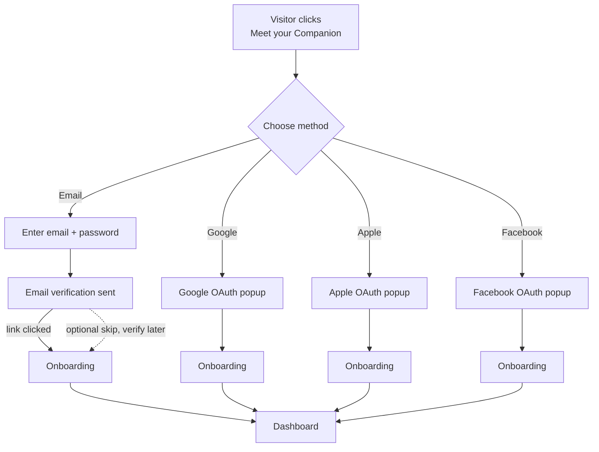
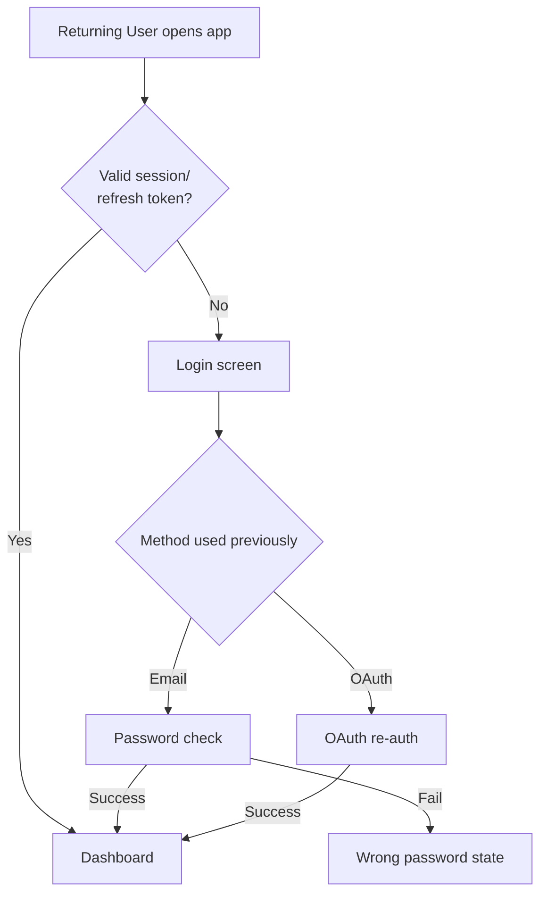
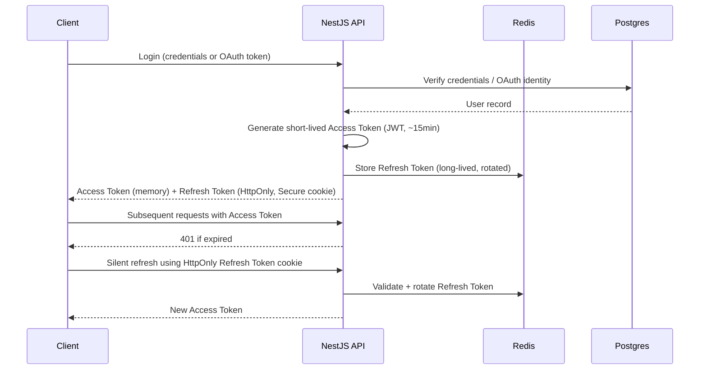

# MODULE 6 — AUTHENTICATION EXPERIENCE

---

## 1. Product Goals

**Business Goals**: get a visitor from "Meet your Companion" click to a verified, identified account in under 60 seconds, with the lowest possible drop-off, since every second of friction here directly taxes the Activation funnel established in Module 5.

**UX Goals**: make Authentication feel like the first moment of the relationship, not a gate in front of it — continuing the calm, considered emotional register Landing (Module 5) established, with zero tonal discontinuity.

**Security Goals**: industry-standard protection (hashed passwords, rate limiting, CSRF/XSS defense, secure session handling) implemented invisibly — security should be felt only as an absence of anxiety, never as a visible obstacle course.

**Trust Goals**: ask for the minimum information required to create a persistent identity (Module 3's hard dependency for Memory) and nothing more — every additional field requested here is a small trust withdrawal that Onboarding and beyond have to earn back.

**Activation Goals**: Authentication's only job is to get a user to Onboarding intact and unfrustrated — it is explicitly not the place to collect birth data, preferences, or anything else that belongs to a later, trust-earned moment (per the standing UX Requirement: never ask for birth data before trust exists).

---

## 2. Authentication Strategy

**Why authentication exists**: it is the single hard dependency (Module 3, Section 3) that establishes the identity anchor every Memory node attaches to — without it, nothing else in the product (Companion, Journal, Discovery history) can persist across a second visit.

**Why identity matters**: identity here is not a business/legal formality — it is the literal precondition for the Memory Moat (Module 2) to exist at all. A user without a stable identity is, structurally, a new person every session; Authentication is what makes "the same person, remembered" possible.

**Relationship with AI Companion**: the Companion cannot reference anything from a prior session without a persistent identity to key that memory to — Authentication is invisible infrastructure for the Companion relationship, and should be designed to disappear as quickly as possible so the user can get to the actual relationship.

**Relationship with Memory**: identical framing — Memory (Module 3) has a hard dependency on Authentication; this module's entire purpose, functionally, is to stand up that dependency with minimum friction and maximum trust.

**Relationship with Privacy**: because identity unlocks a system that will eventually hold emotionally sensitive data (Module 1), Authentication is the first place a user should feel — even briefly, even before any Journal entry exists — that this product takes their data seriously. This is why Privacy System (Section 9) content appears contextually here rather than being deferred entirely to Settings.

---

## 3. User Flows

**Why email verification is non-blocking**: the flow explicitly allows "verify later" as a soft path into Onboarding rather than blocking on it — per the standing requirement that Authentication take under 60 seconds, forcing a wait-for-email-click step before any product experience would tax the Activation funnel for a step whose security purpose (confirming a real, reachable email) doesn't require the user to be blocked, only reminded. Unverified accounts can proceed to Onboarding and even a first Companion interaction; verification is required only before Memory persists past the current device/session or before Premium purchase (both security-sensitive, retention-critical junctures) — this is detailed further in Section 15.

**Why OAuth flows skip verification entirely**: Google/Apple/Facebook have already verified the underlying email/identity — re-verifying would be redundant friction with no security benefit.

---

## 4. Authentication Methods

| Method | Advantages | Disadvantages | Priority | Future roadmap |
|---|---|---|---|---|
| **Email + Password** | Universal, no dependency on a third-party provider, works for privacy-conscious users who avoid social logins | Requires password creation/memory friction, requires verification step | P0 (MVP) | Move toward passwordless (Section 17) once product matures |
| **Google** | One-tap on most devices, pre-verified email, lowest friction for the majority of the target demographic | Ties identity to a third-party account; some privacy-conscious users deliberately avoid it | P0 (MVP) | Maintain indefinitely — highest expected usage share |
| **Apple** | Required for iOS App Store compliance if any social login is offered; privacy-forward users (a meaningful share of the Reflective Skeptic persona, Module 1) may prefer it for its "Hide My Email" option | Slightly more complex relay-email handling on the backend | P0 (MVP) | Maintain indefinitely |
| **Facebook** | Broad reach in some demographics/regions | Lower trust association for a privacy-sensitive, reflective audience (Module 1 personas skew toward valuing privacy); adds a third OAuth integration to maintain for likely low incremental usage | P2 (post-MVP, evaluate need) | Reassess based on actual signup-method data post-launch; may be deprioritized if usage is low relative to maintenance cost |
| **Future SSO (enterprise)** | Enables future B2B/Enterprise expansion (Module 2, Future Expansion) | Not relevant pre-Enterprise; adds complexity with no near-term user benefit | Future | Build only alongside the consent-isolated architecture Module 2 requires before any Enterprise offering |
| **Passwordless / Magic Link** | Removes password-memory friction and password-related security risk entirely | Depends on reliable, fast email delivery; less familiar to some users | P1 (V1) | Strong long-term direction — reduces both friction and a whole class of security risk (password reuse, weak passwords) |

**Why Facebook is deprioritized relative to Google/Apple**: the target personas (Module 1) skew toward the Reflective Skeptic and Ritual Seeker, both of whom over-index on privacy-consciousness for a product handling emotionally sensitive disclosures — Facebook carries the weakest trust association of the three OAuth options for this specific audience, so it is included at MVP for completeness but explicitly flagged for post-launch reassessment rather than treated as an equal-priority peer to Google/Apple.

---

## 5. Screen Architecture

| Screen | Purpose | Emotion | Layout | Components | CTA | Exit |
|---|---|---|---|---|---|---|
| **Login** | Return a known user to their Companion fast | Familiar, quick | Single centered card, method options + email/password fallback | Method buttons (Google/Apple/Facebook), email/password inputs | "Log in" | Dashboard |
| **Register** | Establish identity for a new user | Welcoming, low-pressure | Single centered card, same method options as Login | Method buttons, email/password inputs, single consent checkbox (Section 9) | "Continue" | Email verification (soft) or Onboarding |
| **Forgot Password** | Recover access without anxiety | Reassuring, not punitive | Single input (email) + plain explanation | Email input | "Send reset link" | Confirmation state → email |
| **Reset Password** | Set a new password | Calm, task-focused | New password input + confirm, password rules shown inline (Section 6) | Password input ×2, strength indicator | "Reset password" | Login |
| **Verify Email** | Confirm reachable email, non-blocking | Light, optional-feeling | Simple message + "we sent a link" + "continue without verifying" option | Status text, resend link action | "Resend" / implicit continue | Onboarding (if skipped) or Dashboard (if clicked from email) |
| **Loading** | Bridge between steps (OAuth redirect, session check) | Calm, brief | Centered, minimal | Labeled progress indicator (Module 4, Section 8 — never an unlabeled spinner) | none | Whatever the next resolved state is |
| **Session Expired** | Explain a lapsed session without alarm | Calm, matter-of-fact | Centered card, brief explanation | Explanation text, "Log in again" button | "Log in again" | Login |
| **Blocked Account** | Explain a security hold plainly | Calm, non-accusatory, clear | Centered card, plain explanation of why and what to do | Explanation text, support/contact link | "Contact support" | External support flow |
| **Delete Account** | Let a user leave cleanly and confidently | Respectful, no guilt-tripping (Guardrail: never manipulate) | Centered card, plain consequence statement (matches Module 4 Dialogs rule) | Consequence text, export-first option, confirm input | "Delete my account" | Logged out, Landing |
| **Success** (post-registration) | Mark the identity moment as real, briefly | Warm, quiet | Centered, minimal, transitions quickly into Onboarding rather than lingering | Brief confirmation text | (auto-continues) | Onboarding |

**Why no separate "Welcome" screen between Register and Onboarding**: a standalone welcome/success screen the user must dismiss adds a tap without adding value — the "Success" state above is a brief, auto-transitioning micro-state (under 1 second), not a screen requiring interaction, consistent with the under-60-seconds requirement.

---

## 6. Form Design

**Inputs**: email and password only at Register (no name, no username, no birth data — all deferred per the standing UX requirement). Display name is generated by default from the email's local-part or OAuth profile name, editable later in Settings, never requested as a required field here.

**Validation**: inline, on-blur (not on-keystroke, which feels punitive while a user is still typing) for format checks (valid email shape); real-time strength indication for password as the user types, since password strength benefits from immediate feedback in a way email format doesn't.

**Password Rules**: minimum 8 characters, at least one number or symbol — deliberately not an aggressive, multi-rule requirement (no forced uppercase+symbol+number+length-12 combination) since overly strict rules are a well-documented source of both drop-off and, counter-intuitively, weaker real-world password hygiene (users write down or reuse complex passwords more under strict rules). Rules are shown plainly beneath the field, not hidden until a failed attempt.

**Inline Validation**: errors appear directly beneath the relevant field, in Module 4's calm error tone (Section 11) — never a top-of-form generic "there were errors" banner requiring the user to hunt for what's wrong.

**Error Messages**: specific ("That doesn't look like a valid email" / "Passwords need at least 8 characters"), never technical ("Validation failed: field constraint violation").

**Password Visibility**: a show/hide toggle is present by default on every password field — reduces retry-friction from mistyped passwords without compromising security meaningfully, and is a now-standard, expected pattern.

**Keyboard**: full tab order; Enter submits the form from any field; mobile keyboards use the correct input type (`email` keyboard for email field) to reduce typing friction.

**Accessibility**: labels always visible (Module 4, Section 5 — never placeholder-only); error messages are programmatically associated with their field for screen readers; password strength indicator has a text equivalent, not color-only (Module 4, Section 12).

---

## 7. Session Architecture

**Access Token**: short-lived JWT (~15 minutes), held in memory client-side (not localStorage, to reduce XSS exposure surface per Section 10) — carries user ID and minimal claims needed for request authorization.

**Refresh Token**: longer-lived, stored in an HttpOnly, Secure, SameSite cookie (never accessible to client-side JavaScript) and tracked server-side in Redis so it can be revoked (logout, security event) without waiting for natural expiration.

**Cookie**: the Refresh Token cookie is the only authentication artifact stored as a cookie; it is HttpOnly and Secure by default, with SameSite=Lax to balance CSRF protection (Section 10) with cross-site OAuth redirect flows working correctly.

**Remember Me**: rather than a separate opt-in toggle (an extra decision at sign-up, contradicting the low-friction requirement), long-lived sessions are the default behavior — a user who doesn't explicitly log out stays logged in via silent refresh, consistent with treating Authentication as invisible infrastructure, not a recurring checkpoint.

**Auto Login**: on app open, a valid Refresh Token silently re-establishes a session with no visible Login screen at all — the Loading screen (Section 5) covers this bridge state briefly.

**Logout**: revokes the specific Refresh Token in Redis immediately (not just client-side token deletion) — a security-meaningful logout, not a cosmetic one.

**Session Expiration**: Access Tokens expire quickly and refresh silently; Refresh Tokens expire only after an extended period of total inactivity (e.g., 60 days) or explicit logout/revocation — chosen to minimize how often a genuinely active, returning user (the entire retention thesis of Module 1) is interrupted by a forced re-login.

**Multiple Devices / Concurrent Sessions**: supported by design — each device receives its own Refresh Token tracked independently in Redis, so logging in on a new device does not invalidate other active sessions, matching ordinary user expectation (a user reasonably expects to stay logged in on their phone after logging in on a laptop).

**Trusted Devices**: not implemented as a separate concept at MVP (adds complexity without a clear near-term security or UX benefit); revisited only if suspicious-login patterns (Section 10) show a need for device-level trust scoring.

---

## 8. Identity System

**User ID**: internal, immutable UUID — never exposed as the user-facing identifier for anything (never shown as a "username" equivalent).

**Display Name**: defaults from OAuth profile name or email local-part; editable anytime in Settings; never required at Authentication.

**Username**: not used as a concept in this product at all — there is no public-facing username/handle, consistent with Module 1's "we are not a social network" positioning; identity here exists only for the private Companion relationship, not for any public profile.

**Avatar**: defaults to an initials-on-color-token circle (Module 4, Section 4); optional photo upload deferred entirely to Settings, never requested during Authentication.

**Birth Information**: explicitly and deliberately never collected during Authentication — this is the single most emphasized deferral in this module (per the standing UX requirement "never ask for birth data before trust exists") and is instead collected progressively during Onboarding/Discovery-system setup, where its purpose is immediately obvious and contextual.

**Timezone**: inferred automatically from the client/browser at first session, editable later in Settings — never asked as a form field.

**Language**: inferred from browser/device locale by default, editable in Settings.

**Region**: inferred from the same signal as timezone/language where relevant for content localization (Module 2, Scalability Strategy); not separately asked.

**Profile Completion**: no visible "profile completion percentage" nag UI anywhere — a completion-percentage bar is a classic engagement-bait pattern (implicitly pressuring a user to fill in fields for the sake of a number going up) that conflicts with the "never create dependency" and "never manipulate" Guardrails (Module 1).

**Anonymous State**: does not exist as a persistent product state — the product requires an identity to function meaningfully (Module 3), so there's no "browse anonymously" mode beyond the pre-signup Landing page itself.

**Verified State**: email-verified vs. unverified is tracked but non-blocking for most functionality (Section 3); it gates only Memory-persistence-across-devices and Premium purchase (Section 15).

---

## 9. Privacy System

| Element | What it covers | When shown | Why |
|---|---|---|---|
| **Consent** | A single checkbox at Register: "I agree to the Terms and Privacy Notice" | Register screen only | One consent action, not a stack of separate toggles at sign-up — additional granular consent (e.g., specific AI training use, Section below) is deferred to Settings where it can be explained with proper context, not rushed through at sign-up |
| **Privacy Notice** | Plain-language summary + link to full legal text | Linked, not shown in full, at Register | Full legal text at sign-up is unread by nearly everyone and adds friction without adding genuine informed consent; a plain-language summary link respects the user's time while remaining available |
| **Terms** | Standard terms of service | Linked, not shown in full | Same reasoning as above |
| **Cookies** | Only the essential session cookie (Section 7) is required; no marketing/tracking cookies are set pre-consent | Handled via a minimal, non-blocking cookie notice, not a full-screen gate | A full-screen cookie wall before the user even reaches Authentication would contradict the under-60-second, low-friction requirement, and marketing cookies aren't essential to the core product experience anyway |
| **Analytics** | Product analytics (Module 5, Section 14 equivalents) run on essential, non-marketing tracking by default | Disclosed in Privacy Notice, not a separate at-signup toggle | Product analytics here are used to improve retention/activation (Module 1's Success Definition), not to sell data or target ads — this distinction is stated plainly in the Notice |
| **Memory Permission** | Implicit in using the Companion/Journal — there is no separate "allow memory" toggle at sign-up, since Memory is the core product, not an optional add-on | Explained contextually, first, inside Onboarding when the Companion is introduced (not at Authentication, which is too early to be meaningful) | Asking permission for the literal core function of the product at the moment of Authentication (before the user has any context for what "memory" means to them) would be confusing, not genuinely informative consent |
| **AI Permission** | Whether conversation content may be used (in anonymized, aggregate form) to improve the underlying AI system | A specific, separate, off-by-default toggle in Settings, not bundled into the general Terms consent | This is exactly the kind of consent that must be specific and revocable (Module 1, Privacy value) — bundling it into a general sign-up checkbox would not constitute genuine informed consent for something this sensitive |
| **Delete Data** | Full account + memory graph deletion | Available anytime via Settings/Delete Account screen (Section 5) | Directly implements Module 3's rule that Memory deletion is always a direct, user-triggerable action |
| **Export Data** | Full personal data export (Journal, conversation history, memory summary) | Available anytime via Settings | Same rationale — Privacy value made concrete and always available, not buried or delayed |

---

## 10. Security System

**Rate Limiting**: login and password-reset endpoints are rate-limited per IP and per account (e.g., 5 attempts per 15 minutes) to blunt brute-force and credential-stuffing attempts without meaningfully affecting a genuine user's normal usage pattern.

**Brute Force**: progressive backoff after repeated failed attempts, escalating to a temporary account lock with clear, calm messaging (Section 11) rather than a permanent block on a handful of failed attempts.

**Password Hash**: bcrypt (or an equivalent modern adaptive hash) with a strong work factor; passwords are never stored or logged in plaintext anywhere, including in error logs or analytics events.

**OAuth**: standard OAuth 2.0 / OpenID Connect flows for Google/Apple/Facebook; the backend validates tokens server-side rather than trusting client-asserted identity claims.

**CSRF**: SameSite=Lax cookie attribute (Section 7) plus a CSRF token on state-changing requests as defense in depth.

**XSS**: Access Token held in memory (not localStorage, Section 7) specifically to reduce the impact of any XSS vulnerability elsewhere in the app — an XSS exploit cannot exfiltrate a token that isn't stored in a JS-accessible location.

**Session Hijacking**: Refresh Tokens are bound to a device/session fingerprint where feasible and rotated on each use (rotation detection: reuse of an old, already-rotated Refresh Token immediately revokes the whole session family, since that pattern indicates the token was stolen and both the legitimate and illegitimate holder are racing to use it).

**Device Detection**: new-device logins are flagged (Section below) and can trigger a "new device" notification email as a lightweight, non-blocking security signal to the user.

**Suspicious Login**: a login from an unusual location/device pattern triggers a calm, informative notification email ("New login from [device/location] — was this you?") rather than an automatic hard block, which would create false-positive friction for legitimate travel/device changes.

**Recovery**: password reset always requires email confirmation (Section 5, Forgot Password); account recovery for a fully locked-out user routes to a human-reviewed support flow (Admin module, Module 3) rather than an automated process, given the sensitivity of what's being protected (a memory graph of personal disclosures).

---

## 11. Error Experience

| Error | Message tone/content | Recovery |
|---|---|---|
| **Wrong Password** | "That password doesn't match this account." — never "Invalid credentials" ambiguity for password specifically once email is confirmed to exist, since ambiguity here doesn't add real security value at this stage and only frustrates a genuine user | "Forgot password?" link immediately available |
| **Wrong Email** (no account found) | "We can't find an account with that email." | Direct link to Register instead |
| **Email Exists** (registering with an existing email) | "An account already exists with this email — want to log in instead?" | Direct link to Login, pre-filled email |
| **Expired Token** (email verification / password reset link) | "This link has expired." | One-tap "resend" action |
| **Expired Session** | Calm, matter-of-fact (Section 5) | "Log in again" |
| **OAuth Failure** | "We couldn't complete sign-in with [Provider] — want to try again, or use email instead?" | Retry or fallback method offered inline |
| **Network Failure** | Matches Module 4's Offline pattern — persistent banner, no data lost | Auto-retry on reconnect |
| **Blocked Account** | Plain explanation of the security reason where possible (e.g., "too many failed attempts — try again in 15 minutes" vs. a genuine trust & safety hold requiring support contact) | Wait-and-retry, or support contact depending on cause |
| **Deleted Account** | "This account no longer exists." — attempting to log into a deleted account | Redirect to Register |
| **Too Many Attempts** | "Too many attempts — try again in [time]." specific and calm, never alarmist | Countdown or retry-after guidance |

**Recovery patterns (general)**: every Authentication error follows Module 4's Content Design rules exactly — specific, plain, blame-free, and always paired with a clear next action, never a dead end.

---

## 12. Loading Experience

| Moment | Expected wait | Animation | Emotion |
|---|---|---|---|
| **Login** (email/password) | <1s typical | Brief labeled spinner on the button itself, not a full-screen takeover | Fast, unremarkable |
| **OAuth** (redirect + callback) | 1–3s (dependent on provider) | Full-screen calm loading state with provider name shown ("Connecting to Google…") | Reassuring, transparent about what's happening |
| **Verification** (email link click) | <1s | Brief confirmation animation, then auto-continue | Quick closure |
| **Session Restore** (app open, silent refresh) | <500ms ideally, invisible to the user if fast enough | If visible at all, the standard Loading screen (Section 5) | Should be imperceptible in the common case |
| **Redirect** (post-auth to Onboarding/Dashboard) | <1s | Simple fade transition | Seamless continuation of the Landing-to-product emotional arc (Module 5) |
| **Dashboard Loading** (first load post-auth) | 1–2s | Skeleton loading (Module 4, Section 14) | Anticipatory, not anxious |

**Why every wait state is labeled, never a generic unlabeled spinner**: matches Module 4's Loading Experience rule (Section 8/14 there) — an unlabeled wait, especially during something as identity-sensitive as Authentication, reads as uncertainty about whether anything is happening at all; a specific label ("Connecting to Google…") keeps the moment calm rather than anxious.

---

## 13. Empty States

| State | Treatment |
|---|---|
| **No Avatar** | Initials-on-color-token circle shown by default (Section 8) — never an empty/broken image icon |
| **No Email Verified** | A quiet, dismissible reminder banner in Dashboard (not a blocking modal) — "Verify your email to keep your memory safe across devices" |
| **No Birth Data** | Not treated as an "empty state" needing prompting at all during Authentication — this is deliberately deferred to Discovery-system Onboarding, where it has clear context (Section 8) |
| **Incomplete Profile** | No completion-percentage UI (Section 8) — Settings simply shows fields as filled or not, without gamifying completion |
| **No Connected Account** (a user who registered via email only, no OAuth linked) | Settings offers an optional "link Google/Apple" action, framed as a convenience, never a nag |
| **No Sessions** (Settings' device/session list, before any additional device has logged in) | Simply shows the current session only — no artificial "add more devices" prompting |

---

## 14. Analytics

**Authentication Funnel**: Landing CTA Click → Method Selected → Account Created/OAuth Completed → Email Verified (or skipped) → Onboarding Started → Onboarding Completed → Activation Event (Module 1) — tracked as one continuous funnel, not treated as ending at "Account Created," consistent with Module 5's framing that sign-up is not the real conversion event.

**Drop-offs**: tracked per-step above; particular attention to Method Selected → Completed (where OAuth popups/redirect friction most commonly cause silent abandonment) and Email Verification (to validate that the non-blocking design, Section 3, is actually working as intended rather than quietly suppressing verification rates to a concerning degree).

**OAuth Usage**: tracked per-provider (Google/Apple/Facebook/email split) to validate or revisit the Facebook prioritization decision (Section 4) with real data post-launch.

**Verification Rate**: percentage of accounts that verify email within a reasonable window (e.g., 7 days) — tracked as a health metric even though verification itself is non-blocking, since a persistently low verification rate would signal users are unaware of what they're missing (cross-device memory persistence).

**Activation Rate**: percentage of new accounts that reach the Module 1 Activation event — the single most important number this module's design is optimizing for, more than raw signup completion rate.

**Session Length**: tracked to understand typical usage patterns, informing Session Architecture tuning (Section 7) over time (e.g., whether the 15-day/60-day token lifetimes are well-calibrated).

**Retention**: Authentication-specific retention proxy (does a user who completes sign-up return within 7 days) feeds directly into Module 1's broader retention KPIs.

**Security Events**: failed-login spikes, new-device-login notifications sent, and account-lock incidents are tracked on an internal security dashboard (Admin module), separate from user-facing product analytics.

---

## 15. Edge Cases

**Duplicate Accounts**: prevented at the point of registration by checking existing email across both password and OAuth-linked accounts before creating a new one — if a match exists, the user is offered to log in or link instead (Section 11, Email Exists).

**OAuth + Email Merge**: if a user registers via email first and later attempts Google sign-in with the same email, the accounts are merged automatically (same verified email address is treated as sufficient proof of same-person) rather than creating a second, memory-fragmenting identity — this directly protects the Memory Moat (Module 2) from silently splitting a user's history across two accounts.

**Deleted User**: attempting any auth action against a deleted account returns the plain "Deleted Account" error (Section 11); the underlying data itself follows the retention/legal deletion timeline defined by Settings/Privacy System (Section 9), not resurrected by a login attempt.

**Unverified Email**: fully functional short-term (Section 3); flagged for verification before Memory-persistence-across-devices or Premium purchase specifically, since both involve either data continuity or payment — the two places where confirming a reachable, real email genuinely matters.

**Offline Login**: not supported (Authentication inherently requires a network round-trip); the app shows Module 4's calm Offline error state rather than a broken attempt.

**Expired Cookies**: results in the standard Session Expired flow (Section 5) — never a silent, confusing failure; the user is always told plainly what happened.

**Lost Session** (e.g., cookie cleared mid-session): same Session Expired handling; no data is lost since Memory writes (Module 3) are server-side and independent of client session state.

**Timezone Change** (e.g., travel): timezone is re-inferred silently on each session rather than fixed permanently at signup, so Notification scheduling (Module 3, Section 13) stays accurate without requiring manual user action.

**Browser Change / Device Change**: handled natively by the multi-device session architecture (Section 7) — logging in on a new browser/device simply issues a new, independent Refresh Token, with a "new device" security notification (Section 10) as the only user-facing side effect.

---

## 16. QA Checklist

- **UX**: full flow (Landing CTA → Dashboard) timed and verified under 60 seconds for the email path; OAuth paths verified equally fast or faster.
- **UI**: matches Module 4 tokens/components exactly; no bespoke Authentication-only visual patterns introduced.
- **Security**: rate limiting, password hashing, CSRF/XSS protections, and Refresh Token rotation-detection (Section 10) verified via dedicated security test suite, not just manual QA.
- **Backend**: OAuth account-merge logic (Section 15) specifically tested for the same-email-different-provider case, given its importance to the Memory Moat.
- **Frontend**: Access Token never persisted to localStorage/sessionStorage anywhere in the codebase (Section 7) — verified via code review/lint rule, not just design intent.
- **Accessibility**: full keyboard operability and screen-reader labeling verified on every screen in Section 5.
- **Performance**: OAuth redirect round-trip time measured on representative mobile network conditions, not just desktop/wifi.
- **Analytics**: funnel events (Section 14) verified firing correctly end-to-end through to the Activation event, not just through account creation.

---

## 17. Future Expansion

**Biometric Login**: Face ID/Touch ID as a convenience layer on top of the existing session architecture (Section 7) — not a replacement for it, since biometric unlock still needs an underlying token/session to unlock into.

**Passkeys**: the strongest long-term direction for both security and friction reduction (removes passwords entirely); should be introduced as an additional option alongside, not a forced replacement for, existing methods, given mixed current device/browser support.

**Passwordless**: Magic Link (Section 4) is the practical near-term step toward this; full passkey adoption is the longer-term target.

**Enterprise SSO**: deferred until the Enterprise offering itself is greenlit (Module 2, Future Expansion) and its consent-isolated architecture exists — building SSO ahead of that would create integration debt for a use case not yet approved.

**Multi Account**: not currently planned — the product's value (a single, deep memory relationship) is structurally undermined by encouraging multiple identities per person; this is a deliberate non-goal, not an oversight.

**Family Account**: a plausible long-term idea (e.g., shared household billing) but must be evaluated carefully against the Privacy Guardrail, similar to Module 2's caution around Enterprise visibility — a family member should never gain visibility into another's personal memory graph as a side effect of shared billing.

---

## 18. Final Decisions

**Chosen Authentication Model**
Email+password and Google/Apple/Facebook OAuth at parity for MVP, with Facebook explicitly flagged as lower-priority pending real usage data; non-blocking email verification; JWT Access Token (in-memory) + HttpOnly rotated Refresh Token (Redis-tracked) for sessions; automatic OAuth+email account merging on matching verified email; zero collection of birth data, username, or profile-completion pressure during Authentication itself.

**Rejected Alternatives**
- Blocking email verification before any product access — rejected as directly conflicting with the under-60-second, low-friction requirement, for a security benefit (confirming a reachable email) that doesn't require blocking to achieve.
- Collecting birth data or other Discovery-system setup fields during Authentication — rejected outright per the standing UX requirement; deferred to Onboarding where it has clear, trust-appropriate context.
- A profile-completion-percentage UI — rejected as an engagement-bait pattern in direct conflict with Module 1's Guardrails.
- Storing Access Tokens in localStorage for implementation simplicity — rejected in favor of in-memory storage, given the meaningfully higher XSS-exposure risk of localStorage.
- A separate "Remember Me" opt-in checkbox — rejected in favor of long-lived-by-default sessions with silent refresh, since forcing that decision at sign-up is an unnecessary extra choice for most users.

**Trade-offs**
Non-blocking verification and OAuth+email auto-merge both slightly increase backend complexity (handling not-yet-verified states gracefully throughout, and building reliable account-merge logic) relative to simpler, stricter alternatives — accepted because both trade-offs directly protect the two things this module optimizes hardest for: speed-to-Activation and the integrity of a single, unfragmented memory identity per person.

**Reasons**
Every decision in this module traces to either the standing UX requirements (60-second target, no birth data at Authentication), Module 3's hard dependency structure (identity → Memory), or Module 1's Guardrails (no manipulative completion nudges, no manufactured urgency in security messaging) — nothing here introduces an authentication pattern independent of constraints already fixed earlier in the Bible.

---

**Next module in sequence: Onboarding.**
