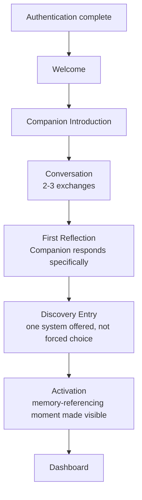

# MODULE 7 — ONBOARDING EXPERIENCE

---

## 1. Product Goals

**Business Goals**: convert a freshly-authenticated identity (Module 6) into an Activated user (Module 1/3's defined event — first memory-referencing Companion message) within the same session, since every minute of delay between account creation and Activation is measured drop-off risk.

**UX Goals**: make Onboarding feel like the first real conversation of a relationship, not a configuration wizard — zero forms-in-a-row, zero progress-bar-driven setup steps.

**Relationship Goals**: by the end of Onboarding, the user should have said something real (even something small) and had the Companion respond to it specifically — not generically — establishing in the very first session that this is different from both a horoscope app and a generic chatbot.

**Memory Goals**: the first memory node should be created transparently, with the user aware it happened and why it matters, directly implementing Module 1's Memory-transparency requirement.

**Activation Goals**: Onboarding IS the path to Activation — this module is not a precursor to Activation, it is the mechanism that produces it.

**Retention Goals**: the user should leave Onboarding wanting to return tomorrow specifically because the Companion said it would remember something — not because a checklist was completed.

---

## 2. Onboarding Philosophy

**Why onboarding exists**: to produce the single most important event in the entire product — the moment a user experiences, for the first time, an AI referencing something they just said. Everything else onboarding does (identity details, Discovery entry) is in service of reaching that moment as directly as possible.

**Why onboarding is NOT setup**: a setup wizard optimizes for data collection completeness; this Onboarding optimizes for one felt moment. Any step that exists to collect data the product doesn't yet need (birth time, long-term goals, notification preferences) delays that moment for no relationship benefit, and is cut or deferred (Section 7).

**Relationship before personalization**: personalization (adapting to a user's specific interests, style, goals) requires data the product doesn't have yet on minute one — asking for it upfront produces guesses dressed as personalization, not real personalization. The relationship must exist first; personalization is something Memory earns over weeks, not something a form collects in minute two.

**Trust before information**: every piece of information Onboarding could ask for is a trust withdrawal until the user has a reason to believe it'll be used well. Onboarding is structured to make a small trust deposit (the Companion says something considerate) before making any withdrawal (asking for anything at all).

**Curiosity before configuration**: the Companion's first questions are designed to be genuinely interesting to answer — not "what's your goal? (select one)" but something an actual curious person would ask. A question a user *wants* to answer produces richer memory input than a required field they're filling in to get past a screen.

---

## 3. User Journey

**Authentication → Welcome**: a brief, warm transition (Module 6's Success micro-state) — no separate "welcome" screen requiring a tap, this flows directly into Meet Companion within a second or two.

**Welcome → Meet Companion**: the first appearance of the Companion itself, introducing itself in its own voice (Section 6) rather than a system-authored "Welcome to BeaconVie!" banner — the relationship starts the instant the Companion speaks, not after an app-voice intro screen.

**Meet Companion → Conversation**: the Companion asks one genuinely open, low-stakes question; the user replies; 2–3 exchanges follow naturally — this is real conversation, not a scripted Q&A form rendered as chat bubbles.

**Conversation → First Reflection**: the Companion responds to something specific the user said — not a generic acknowledgment ("Thanks for sharing!") but a considered, specific reply, which is the moment memory is first visibly created (Section 8).

**First Reflection → Discovery Entry**: the Companion offers (not forces) one Discovery-system entry point, framed as a natural extension of what was just discussed, not a separate menu of four equal options (Section 9).

**Discovery Entry → Activation**: after the Discovery reading, the Companion connects it back to the earlier conversation — this cross-reference (conversation → reading → back to conversation) is the Activation event itself, made visible to the user as a small, honest moment ("I'll remember this for next time").

**Activation → Dashboard**: a calm, un-triumphant handoff into the Dashboard (Module 3) — no confetti, no "You did it!" — the emotional payoff already happened in the conversation itself; the Dashboard transition should feel like walking into a room you're now familiar with, not a reward screen.

---

## 4. Experience Timeline

| Moment | Intended emotional state | What happens |
|---|---|---|
| **Minute 0** | Slight uncertainty, mild curiosity (carried over from Authentication) | Companion introduces itself in its own voice, immediately |
| **Minute 1** | Pleasant surprise — "this doesn't feel like an app" | Companion asks a genuinely open first question |
| **Minute 2** | Engaged, unhurried | User replies; Companion responds specifically, asks a natural follow-up |
| **Minute 3** | A flicker of "oh — it actually listened" | Companion's second reflection references something specific from the first reply |
| **Minute 5** | Curiosity toward Discovery, not obligation | One Discovery reading offered and completed, tied back into the conversation |
| **Day 1** (later that day, if a notification is warranted) | Quiet anticipation, not urgency | If genuinely memory-worthy, a single soft touchpoint; otherwise, no forced re-engagement on day 1 |
| **Day 7** | Trust building, mild surprise the app remembered something small | Companion or Dashboard references the original Onboarding conversation naturally |
| **Day 30** | Established rhythm; the relationship feels real | Enough memory density exists that a Report (Module 1 sequencing) starts to feel earned, not synthetic |

**Why this pacing**: the first five minutes carry disproportionate weight because they contain the entire Activation event — everything from Day 1 onward is the Core Product Loop (Module 2) doing its normal, slower work. Onboarding's job is only to get the flywheel spinning, not to simulate weeks of relationship in one session.

---

## 5. Screen Architecture

| Screen | Purpose | Emotion | Components | CTA | Animation | Exit |
|---|---|---|---|---|---|---|
| **Welcome** | Bridge from Authentication, near-instant | Calm anticipation | Minimal — Companion's constellation glyph (Module 4) appearing | (auto-continues) | Brief fade-in, <1s | Meet Companion |
| **Meet Companion** | The Companion speaks first, in its own voice | Warm, slightly disarming | AI Message component (Module 4), streaming text | (implicit — reply field appears) | Text streams at natural pace (Module 4, Section 8) | Conversation |
| **Conversation** | 2–3 genuine exchanges | Engaged, unhurried | AI Message thread, text input | "Send" (or simply Enter) | Standard streaming | First Reflection |
| **Reflection** | Companion responds specifically, memory is created visibly | Recognition — "it heard me" | AI Message with a subtle Memory Card appearing (Module 4's Memory Recall animation) | (implicit — continue) | Memory Recall fade-and-rise (Module 4, Section 9) | Discovery Choice |
| **Discovery Choice** | Offer one contextually-relevant Discovery entry, not a menu of four | Light curiosity, no pressure | Single Card component, offer framed conversationally, plus a quiet "not right now" option | "Let's see" / "Maybe later" | Standard reveal | Discovery reading, or directly to Activation if skipped |
| **Activation** | The visible memory-connection moment | Quiet warmth, "oh — it actually remembered" | AI Message referencing both the conversation and the reading, Memory Card visible | (implicit — continue) | Constellation Thread connects two points (Module 4's signature motif) | Success |
| **Success** | Brief, honest close of Onboarding | Settled, ready | Minimal — no confetti, no achievement badge | (auto-continues) | Quiet fade | Dashboard |
| **Dashboard Entry** | First arrival at the daily home surface | Familiar already, not novel | Standard Dashboard (Module 3/4) | n/a | Standard | n/a |

**Why "Maybe later" exists on Discovery Choice**: forcing a Discovery reading before Activation would treat Discovery as a gate rather than a doorway (Module 1) — a user who wants to go straight to more conversation should be able to; Activation can be reached through conversation alone if that's where the user's curiosity is, with Discovery entry simply deferred to Dashboard.

---

## 6. AI Conversation Design

**First message** (Companion speaks first, before any input from the user):
> *"Hi — I'm glad you're here. I don't know much about you yet, but I'd like to. What's been on your mind lately — even something small?"*

**Why this opening**: it's honest about the current state of the relationship (Module 1's rule against implying capability that doesn't exist yet) rather than pretending false familiarity; it asks an open, low-stakes question that's genuinely easy to answer with something real, rather than a closed or clinical prompt.

**Example user reply**: *"Honestly just work stuff — starting a new job next week and feeling kind of nervous about it."*

**Second message** (specific, not generic):
> *"Starting something new is a strange mix — excited and unsettled at the same time, usually. What's the nervous part about, do you think? The people, the work itself, something else?"*

**Why this works**: it reflects the specific content back (naming the actual mixed feeling, not a generic "that's exciting!") and asks a genuinely curious follow-up rather than moving on to a scripted next onboarding beat — this is what separates a real conversation from an interview.

**Example user reply**: *"Probably just whether I'll be good enough at it."*

**Third message — the Reflection moment, where memory is visibly created**:
> *"That makes sense — new job, new bar to measure yourself against. I'll remember this, so if it comes up again, we can look back at how it's actually going, not just how it feels right now."*

*(A small, plain Memory Card appears beneath this message: "Remembered: starting a new job next week, feeling unsure about being good enough at it.")*

**Why this is the correct Reflection moment**: it names, plainly, that a memory is being created and why — directly satisfying the Memory Requirement that the user understands why memory exists and that nothing is hidden. It does not diagnose ("this sounds like impostor syndrome") or offer unsolicited advice — it stays in the Curiosity/Reflection register established by Module 1's AI Philosophy.

**Discovery transition** (offered, not forced):
> *"Since you're stepping into something new, want to see what your chart says about how you tend to handle new beginnings? Totally optional — we can also just keep talking."*

**Activation moment** (after a brief Discovery reading, referencing both):
> *"Interesting that your chart leans toward needing time to feel steady in new things — which lines up with what you just told me about the new job. I'll keep both of these in mind."*

**Tone rules for every message in this script**: short sentences; no therapy-clinical phrasing ("How does that make you feel?" avoided); no mystical-flowery language; one genuine question per message where a question is warranted, never more than one at a time (avoiding the "interview" feeling); warmth expressed through specificity, not through exclamation points or effusive praise; light, situational humor is acceptable if genuinely fitting (e.g., a wry, warm aside), never forced or joke-for-joke's-sake.

**Never sound like onboarding**: no message in this script uses the words "onboarding," "setup," "let's get started," or "step 1 of 3" — the user should never be able to tell, from the Companion's language alone, that this is a designed first-session flow rather than an ordinary conversation.

**Never sound like an interview**: no message asks more than one question; no message strings together multiple unrelated questions ("What's your name? What are your goals? What brings you here?") — that pattern is the single clearest tell of a scripted wizard, and is explicitly avoided throughout.

---

## 7. Progressive Profiling

| Information | When collected | Why |
|---|---|---|
| **Display name** (if not from OAuth) | Never explicitly asked in Onboarding — inferred from Authentication (Module 6); can be adjusted later in Settings | Asking "what should I call you?" as a standalone field reintroduces form-feeling; if genuinely needed, the Companion can ask it conversationally only if OAuth didn't supply one |
| **Whatever the user volunteers in Conversation** (Section 6) | Minute 1–3 | This is the richest and most natural information source in the entire flow — no separate collection needed |
| **Birth data** (for Natal Chart) | Only if/when the user opts into the Natal Chart Discovery system specifically (Section 9) — never during the general Conversation flow | Matches the standing requirement: birth data appears only in the specific context where its purpose is self-evident, never upfront |
| **Goals** | Never explicitly asked during Onboarding as a structured field; goals emerge organically through ongoing conversation over subsequent sessions | A "select your goal" multiple-choice field at minute 2 produces shallow, guessed categorization; real goals surface through actual disclosure over time, which is exactly what Memory is for |
| **Interests** | Same as Goals — not asked as a field; inferred from which Discovery systems a user gravitates to and what they bring up in conversation | Matches Module 1's Memory-first principle: interests should be *discovered*, not self-reported into a dropdown |
| **Notification preferences** | Deferred entirely to Settings, available whenever the user wants to adjust them, never surfaced as an Onboarding decision | Asking about notification granularity at minute 4 is a classic setup-wizard tell and adds a decision with zero immediate relevance |
| **Theme/appearance preference** | Deferred to Settings | Same reasoning — a cosmetic preference has no place delaying the relationship-building flow |

**Timeline summary**: only two things are ever asked during Onboarding itself — whatever the user volunteers in open conversation, and (only if chosen) birth data for a specifically-selected Discovery system. Everything else is either inferred, deferred to Settings, or allowed to emerge naturally over subsequent sessions.

---

## 8. Memory Bootstrapping

**How the first memory is created**: the Companion's third message (Section 6) explicitly names what it's remembering, in plain language, paired with a visible Memory Card — memory creation is never silent or implied.

**What memories should exist after Onboarding** (using the example script in Section 6):
1. `Remembered: starting a new job next week, feeling unsure about being good enough at it.` (from Conversation)
2. `Remembered: chart placement suggests a tendency to need time to feel steady in new situations.` (from Discovery, if completed)

Two memory nodes, both plainly visible to the user, both genuinely meaningful rather than trivial.

**What should never be remembered**: small talk with no emotional or thematic content ("hi," "ok," acknowledgment-only replies); anything the user explicitly indicates they don't want kept (Section 14 handles this); any content that would constitute a Memory-graph-bloat risk flagged in Module 3, Section 16 (the AI's triviality filter, established at the architecture level, applies identically here — Onboarding is not exempt from that filter just because it's a user's first interaction).

**When memory should be summarized**: not during Onboarding itself — two nodes don't need synthesis yet. Summarization/Insight generation (Module 3, Section 8) begins to matter once enough nodes accumulate (weeks, not minutes) — Onboarding's job is only to create the first honest entries, not to prematurely synthesize a "profile" from a five-minute conversation, which would overstate what's actually known and risk a false-confidence Insight this early (a direct AI Philosophy violation).

---

## 9. Discovery Entry

**Should users choose?** Not from a menu of four equal options at this stage — that reintroduces decision fatigue at exactly the moment the flow should feel effortless.

**Should AI recommend?** Yes — the Companion offers exactly one Discovery system, chosen based on relevance to what was just discussed (in the example script, Natal Chart because the conversation was about handling new beginnings; a different conversation topic might make Numerology or Tarot the more natural fit). This keeps the offer feeling considered rather than arbitrary.

**Should onboarding force one?** No. The "Maybe later" option (Section 5) is a hard requirement — forcing a Discovery reading before Activation can be reached would make Discovery feel like a gate, directly contradicting Module 1's framing of Discovery systems as doorways, not the destination.

**Guiding principle**: whichever Discovery system is offered, its result is always narrated back into the conversation (Section 6's Activation moment) rather than left to stand alone — this is the mechanism that prevents Discovery from becoming "the main experience" (a standing Discovery Requirement): every reading during Onboarding exists specifically to feed back into the Companion relationship, never as a self-contained mini-app moment.

---

## 10. Personalization

| Element | Default | Optional (Settings) | Deferred |
|---|---|---|---|
| **Language** | Inferred from device/browser locale | Adjustable | N/A |
| **Timezone** | Inferred automatically | Adjustable | N/A |
| **Goals** | None assumed | N/A — emerges from conversation over time, never a settings field either | Fully deferred to organic discovery |
| **Interests** | None assumed | N/A — same as Goals | Fully deferred |
| **Notification style** | Memory-triggered only, per Module 3's Notification Architecture | Adjustable frequency/categories | Deferred entirely to Settings, never surfaced in Onboarding |
| **Theme** | Dusk (dark, Module 4 default) | Light mode available | Deferred to Settings |
| **Companion style/tone** | Single, consistent voice (Module 4's Companion personality) — not user-configurable at MVP | Possibly a "more direct / more gentle" adjustment in a future release | Deferred — not part of MVP scope; introducing tone customization pre-launch would fragment a not-yet-proven voice before it's had a chance to build trust as specified |

---

## 11. Loading Experience

| Moment | Animation | Emotion |
|---|---|---|
| **AI Thinking** (between user reply and Companion response) | Labeled circular progress (Module 4, Section 8/10) — e.g., "thinking about what you shared…" | Considered, not delayed |
| **Conversation** (message streaming) | Token-by-token natural-pace streaming (Module 4) | Present, unhurried |
| **Memory Save** | Invisible by default (async, Module 3) — the Memory Card's appearance (Section 5/8) IS the user-facing signal, not a separate "saving…" indicator | Seamless — the user shouldn't perceive a technical save step at all |
| **Discovery Loading** (card reveal / chart render) | Module 4's deliberate 600–900ms Card Reveal timing | Anticipatory, ritual-appropriate |
| **Dashboard Transition** | Simple, quiet fade (Section 5) | Settled, familiar |

---

## 12. Error Experience

| Failure | Behavior | Recovery |
|---|---|---|
| **Conversation failed** (message send fails) | User's typed message is preserved in the input field, never lost; a calm inline notice appears | Retry send with one tap |
| **AI timeout** | Matches Module 4's AI Timeout pattern exactly ("That took longer than expected — want to try again?") | Retry regenerates; prior exchange preserved |
| **Memory failure** (write fails silently in the background) | No visible interruption to the conversation itself (per Module 4's rule that backend/infra issues shouldn't interrupt the immediate experience); async retry happens invisibly | If persistently failing, surfaced later in Settings, never mid-Onboarding |
| **Network loss** | Module 4's Offline banner pattern; draft reply preserved locally | Auto-resumes on reconnect |
| **Skip onboarding** (user wants to bail entirely) | Always available via a quiet, non-buried exit — the user lands on Dashboard with whatever memory was created before skipping, never forced to restart from zero | Companion picks up naturally next session with whatever was already shared |
| **Restart onboarding** | Not offered as a formal "restart" concept — there's no wizard state to reset, since Onboarding is just the first conversation; a user who skipped early can simply keep talking to the Companion later and reach the same Reflection/Activation moments organically | N/A by design — this simplificity is a direct consequence of Onboarding not being a stateful wizard |

**Why skip is always available and never penalized**: forcing completion of a conversation the user isn't in the mood for would be a form of the "never trap users" Guardrail (Module 3) applied to Onboarding specifically — a user who skips loses nothing; the Companion simply continues the relationship whenever they're ready.

---

## 13. Analytics

**Completion Rate**: percentage of authenticated users who reach the Activation event during Onboarding specifically (not just percentage who click through every screen) — completion is measured by the felt milestone, not by screen count.

**Drop-off**: tracked at each transition in Section 3's flow; particular attention to Conversation → Reflection (if users abandon mid-conversation, the opening question or pacing may need adjustment) and Discovery Choice (high "Maybe later" selection isn't itself a problem, but should be monitored against downstream Day-7 retention to see whether skipping Discovery at Onboarding correlates with lower long-term Discovery adoption).

**Conversation Length**: number of exchanges before Reflection is reached — used to detect if conversations are running unnecessarily long (risking wizard-fatigue-adjacent drop-off) or too short (risking a shallow, ungenuine first memory).

**Memory Created**: number and quality (via the same AI triviality-filter signal, Module 3) of memory nodes created during Onboarding — a proxy for whether the Conversation design (Section 6) is producing genuinely reflective disclosure or shallow small talk.

**Discovery Started**: percentage who accept the Discovery Choice offer vs. "Maybe later" — informs whether the contextual-recommendation approach (Section 9) is landing as relevant or arbitrary.

**Activation**: the primary KPI for this entire module, matching Module 1's definition exactly.

**Retention**: Day-1/Day-7/Day-30 return rate specifically for cohorts who completed vs. skipped various Onboarding stages — used to validate (or challenge) design assumptions in this module empirically over time.

**Funnels**: Authentication Complete → Welcome → Meet Companion → First User Reply → Reflection Reached → Discovery Offered → Discovery Completed (or Skipped) → Activation → Dashboard, tracked as one continuous funnel matching Section 3.

**KPIs**: Activation rate (primary), Day-7 retention (primary), Memory-node quality proxy (secondary, informs conversation design iteration).

---

## 14. Edge Cases

**Skip conversation entirely** (user closes/backgrounds the app mid-flow): handled by Section 12's "skip" behavior — no penalty, Companion resumes naturally later.

**No replies** (user opens the chat but doesn't type anything for an extended period): the Companion does not repeatedly nag or re-send the same prompt; after a reasonable pause, a single, gentle, low-pressure follow-up may appear once ("No pressure — happy to wait, or we can talk about something else entirely") rather than escalating urgency.

**Very long replies**: fully supported — a user who writes paragraphs should have the Companion respond to the genuinely most salient part specifically, not ignore the depth or generate a generic response mismatched to the effort given.

**Emoji only** (user replies with just an emoji): the Companion responds warmly and naturally to what an emoji actually conveys (treating "😩" as a real, if compact, expression of feeling) rather than demanding fuller text input — meeting the user at whatever level of disclosure they're comfortable with in the first session.

**Offensive text**: the Companion does not escalate, argue, or lecture — it responds calmly, redirects if appropriate, and does not store abusive content as a "memory" in the relationship sense (distinguished from any backend trust & safety logging, which is a separate, non-user-facing Admin-module concern per Module 3).

**Sensitive topics** (a user discloses something significant — distress, grief, crisis-adjacent content) even in Onboarding: the Companion's AI Philosophy rule 8 (tested escalation path for distress, Module 1) applies identically here — Onboarding is not a reduced-safety-bar environment just because it's the first conversation; if anything, extra care is warranted since there's no established relationship context yet to draw on.

**Deleted account** (a user deletes their account mid-Onboarding, e.g., from a prior session, then somehow re-enters): treated as a brand-new Authentication (Module 6) — no residual state exists.

**Returning user** (someone who completed Onboarding before, somehow re-triggers this flow — e.g., after account recovery): should never be shown Onboarding again as if new — the app should recognize an existing memory graph and route to Dashboard, with the Companion able to reference the original Onboarding conversation naturally if relevant, rather than re-running the first-conversation script from scratch.

---

## 15. QA Checklist

- **UX**: full flow timed; verify no screen requires more than one input action; verify "Maybe later" and "skip" exits are always reachable and never buried.
- **Conversation**: the example script (Section 6) reviewed for tone consistency (no clinical phrasing, no mystical language, no more than one question per message); variation logic (different opening topics produce different natural Discovery-system recommendations, Section 9) spot-checked across several plausible conversation paths.
- **AI**: verify the Companion never claims to remember something not actually stored; verify the Memory Card in the Reflection moment (Section 6) accurately reflects what was actually captured.
- **Memory**: verify the triviality filter (Module 3) is active during Onboarding and correctly excludes trivial exchanges (e.g., a user's one-word "ok" reply) from becoming memory nodes.
- **Frontend**: streaming, Memory Card animation, and Constellation Thread motif (Activation moment) render correctly across breakpoints (Module 4).
- **Backend**: memory-write pipeline correctly attributes new nodes to the fresh identity from Authentication (Module 6); OAuth-vs-email accounts both flow through identically.
- **Accessibility**: full flow operable via keyboard/screen reader; streaming text remains legible and doesn't break screen-reader announcement patterns.
- **Analytics**: every funnel event (Section 13) verified firing correctly, including the Discovery-skip path.

---

## 16. Technical Specification

**Frontend responsibilities**: render the Conversation UI using the shared AI Message and Memory Card components (Module 4) without any Onboarding-specific bespoke chat UI; manage local conversation state until each exchange is persisted; implement the skip/exit affordance on every screen (Section 12).

**Backend responsibilities**: expose a conversation endpoint that routes Onboarding messages through the same Companion service used post-Onboarding (no separate "onboarding bot" — this is one continuous relationship, and using a different AI pathway would risk a discontinuity the moment Onboarding ends); apply the same memory triviality filter and embedding pipeline (Module 3, Section 8) with no reduced bar for what counts as memory-worthy just because it's a first session.

**AI responsibilities**: generate the first-message greeting dynamically enough to avoid feeling identically scripted for every user over time (small variation within the tone rules of Section 6), while keeping the underlying intent (open, honest, one genuine question) fixed; select the single most contextually relevant Discovery-system recommendation (Section 9) based on conversation content, with a sensible neutral default (e.g., Tarot, as the lowest-setup-cost option) if no clear thematic match emerges.

**Memory responsibilities**: create and tag the first memory node(s) exactly as narrated to the user (Section 8) — no silent additional memory creation beyond what's shown in the Memory Card, since Onboarding is the moment transparency about memory is first established and must be scrupulously honest.

**API contracts**: `POST /onboarding/message` (conversation turn) → returns Companion response + any created Memory Card payload; `POST /onboarding/discovery/select` (Discovery system chosen or skipped) → returns reading result if applicable; `POST /onboarding/complete` → marks Activation event, transitions user state (Module 3's User State Machine) from Registered/Activated forward.

**Database**: Onboarding conversation messages are stored in the same Conversation service schema as all future Companion messages (Module 3, Section 9) — no separate "onboarding_messages" table, to avoid the same discontinuity risk flagged for the AI pathway above.

**Redis**: Onboarding's brief conversation-state caching uses the same active-session-context cache defined in Module 3, Section 9 — no separate cache namespace.

**Queues**: memory-node creation from Onboarding messages flows through the standard BullMQ async pipeline (Module 1/3) identically to any later Companion conversation.

**Session requirements**: requires a valid session from Module 6's Authentication (Access Token present); Onboarding cannot be entered without a completed identity, consistent with Module 3's hard-dependency chain.

---

## 17. Future Expansion

**Voice onboarding**: a spoken-first version of the same Conversation flow (Section 6) — deferred until Module 1's Future Expansion voice-specific crisis-escalation implementation exists, since Onboarding is precisely a moment where sensitive disclosure (Section 14) can occur and voice raises that bar (Module 3, Section 14).

**Avatar onboarding**: not planned — the Companion deliberately has no anthropomorphic avatar/face (Module 4, Section 4); an "avatar customization" onboarding step would contradict that design decision and is explicitly out of scope.

**Multiplayer onboarding**: not applicable — the product's core relationship is one-to-one (user and Companion); any future compatibility/shared-reading features (Module 1, Future Expansion, requiring dual consent) would be a separate, later flow, never part of first-session Onboarding.

**Adaptive onboarding**: a plausible longer-term direction where the Companion's opening question set adapts based on referral source or Landing-page entry point (e.g., a user who arrived via a Natal Chart-focused campaign might get a chart-flavored opening) — should be evaluated only once enough conversation data exists to confirm this improves, rather than dilutes, the Conversation design's authenticity.

**Re-onboarding**: for a long-dormant, Reactivated user (Module 3's User State Machine) — not a repeat of first-session Onboarding, but a distinct, shorter "welcome back" Companion-initiated conversation that explicitly references the gap and existing memory, rather than restarting from zero.

**Returning onboarding**: same treatment as Section 14's "Returning user" edge case — the system must always be able to distinguish a genuinely new identity from a returning one and never re-run the first-conversation script against an existing memory graph.

---

## 18. Final Decisions

**Chosen Onboarding Model**
A single, real, unscripted-feeling conversation (2–3 exchanges) that produces one visible, transparent memory node, followed by one optional, contextually-recommended Discovery reading that's narrated back into the conversation — reaching the Activation event within roughly five minutes, with zero forms, zero required profile fields, and a fully honest skip path at every step.

**Rejected Alternatives**
- A traditional multi-screen setup wizard (name, goals, interests, preferences, then Companion intro) — rejected as directly producing the "wizard fatigue" and "survey feeling" this module's Quality Requirements explicitly warn against, and as delaying Activation for data the product doesn't yet need.
- Forcing a choice among all four Discovery systems upfront — rejected as decision fatigue at the worst possible moment, and as treating Discovery as a required gate rather than an optional doorway (Module 1).
- A celebratory "Onboarding Complete!" screen with achievement/badge styling — rejected as manufactured triumph that would contradict Calm First (Module 4) and imply gamification incompatible with Module 1's Guardrails.
- Collecting birth data as a default step for every new user regardless of Discovery-system interest — rejected per the standing requirement that birth data appears only in its specific, self-evident context (choosing Natal Chart).
- A separate "onboarding AI" or scripted-bot pathway distinct from the real Companion service — rejected because it would create a discontinuity exactly at the Onboarding-to-Dashboard transition, undermining the very continuity this module exists to establish.

**Trade-offs**
Not collecting goals/interests/preferences upfront means Dashboard and early Companion interactions will necessarily be less "personalized" in the first few days than a heavier upfront-profiling model could produce — accepted because that shallow, guessed personalization is worse than honest, progressively-earned personalization, and because Module 1's Memory-first principle explicitly favors depth earned over time over breadth assumed on day one.

**Reasons**
Every decision in this module optimizes for the single defined Activation event (Module 1/3) reached through genuine conversation rather than data collection — consistent with the standing Onboarding Philosophy (Section 2) that relationship must precede personalization, and with the Discovery Requirement that Discovery systems remain doorways, never destinations, even at the moment they're most naturally introduced.

---

**Next module in sequence: Dashboard.**
