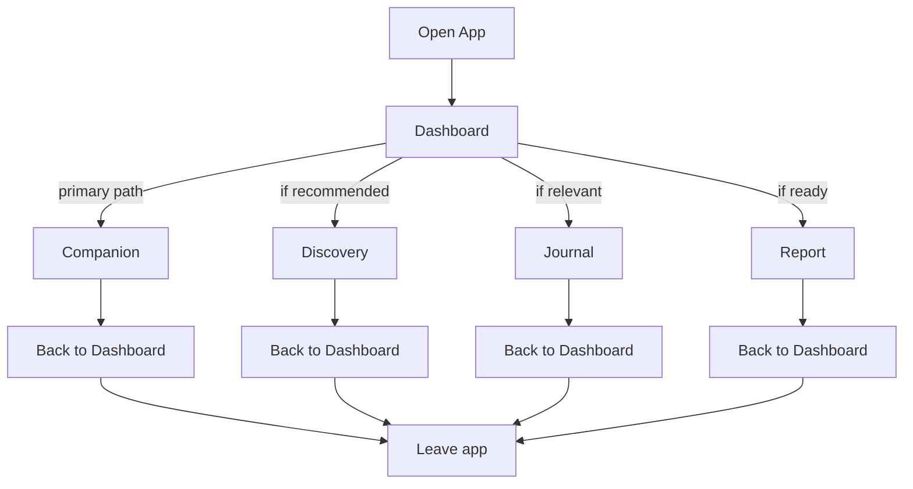

# MODULE 8 — DASHBOARD EXPERIENCE

---

## 1. Product Goals

**Business Goals**: make the Dashboard the daily proof point of the Core Product Loop (Module 2) — the one screen that has to justify, every single day, why this product is worth returning to.

**UX Goals**: answer one question on load — "what is the most meaningful thing BeaconVie should help this person with right now?" — and answer it with one clear focal point, not a grid of equally-weighted options.

**Relationship Goals**: the Dashboard should feel like the Companion already knows the user opened the app, not like a menu waiting to be navigated.

**Retention Goals**: optimize for meaningful return (a real conversation, a journal entry, a completed reflection), never for raw open-count or session length — directly enforcing Module 1's Decision Framework (Trust/Memory/User Value ranked above Engagement).

**Memory Goals**: surface memory transparently and usefully every day, so the compounding effect described in Module 1's Product Flywheel is visible in the daily experience, not just a backend concept.

**Growth Goals**: any growth benefit (habit formation, organic sharing of a Discovery moment) must be a side effect of a genuinely useful daily experience, never a mechanic bolted on independently of it.

---

## 2. Dashboard Philosophy

**Why Dashboard exists**: it is the one screen a user sees every day regardless of which module they ultimately use — it must do the work of deciding, on the relationship's behalf, what today's single most relevant next step is.

**Daily home**: like returning to a familiar room, not opening an app — the Dashboard should look and feel almost the same every day, with its *content* changing, not its *structure*, so familiarity does the calming work Module 4's Calm First principle requires.

**Relationship home**: the Dashboard's primary content is a reflection of the relationship's current state (what was recently shared, what's worth following up on) — not a static homepage template.

**Memory home**: the Dashboard is where the compounding memory graph becomes visible day to day, in small, honest doses (Section 7) — never as a dense analytics view.

**Decision home**: the Dashboard makes the day's first decision so the user doesn't have to — "what should I engage with today?" — by choosing one recommendation, never presenting an undifferentiated menu of four Discovery systems, Journal, Reports, and Companion all at once with equal visual weight.

**Why Dashboard is NOT a feature launcher**: a feature launcher lists everything available and lets the user pick; that model treats the sixteen modules (Module 3) as peers competing for attention, which directly contradicts the three-System hierarchy already established (Companion/Memory at the center, Discovery as doorway, Growth & Operations in support). The Dashboard's entire design purpose is to *resolve* that hierarchy into a single daily answer, not to display it as a menu.

---

## 3. User Journey



**Open App → Dashboard**: the app always opens to Dashboard (never a "which screen were you last on" resume, since Dashboard's whole purpose is to make the daily decision fresh, not pick up mid-navigation).

**Dashboard → Companion**: the default, most common path — the Companion Panel (Section 6) is the largest, most central element for exactly this reason.

**Dashboard → Discovery**: taken only when the Dashboard's single Discovery recommendation (Section 8) is relevant and accepted — never a required stop.

**Dashboard → Journal**: taken when a journal prompt is genuinely relevant (Section 9) — not a permanent fixture competing for attention every day.

**Dashboard → Report**: rare, periodic — taken only when a Report is actually ready (Section 10).

**Any module → back to Dashboard**: every module returns cleanly to Dashboard (Module 3's two-tap navigation) rather than deep-linking onward into another module — this keeps Dashboard as the consistent hub rather than letting users get lost in a chain of module-to-module navigation.

**Back to Dashboard → Leave**: the app doesn't manufacture a reason to keep the user scrolling after their meaningful action is done — Dashboard doesn't refill with fresh bait content to extend session length, consistent with the Retention Requirement to optimize for meaningful engagement, not session length.

---

## 4. Dashboard Architecture

```
┌─────────────────────────────────────┐
│  Hero (Greeting + single focal CTA)   │  ← the day's one answer
├─────────────────────────────────────┤
│  Companion Panel                      │  ← always present, most space
├─────────────────────────────────────┤
│  Memory Highlight (if relevant)       │  ← optional, only if meaningful
├─────────────────────────────────────┤
│  Discovery Suggestion (one, if any)   │  ← optional, singular
├─────────────────────────────────────┤
│  Journal Prompt (if relevant)         │  ← optional, contextual
├─────────────────────────────────────┤
│  Report Ready (if applicable)         │  ← rare, periodic
├─────────────────────────────────────┤
│  Recent Activity (light, collapsed)   │  ← quiet footer-adjacent
└─────────────────────────────────────┘
```

**Why this order**: Hero and Companion Panel occupy the top and largest space because they represent the actual relationship (Module 1's core thesis) — everything below is conditional and only appears when genuinely relevant, per the standing rule "never show information just because it exists." Memory Highlight sits above Discovery/Journal because a relevant memory callback is a stronger daily hook than a generic Discovery offer (Module 2's Insight-before-content-volume thesis). Reports sit near the bottom because they're the rarest, most periodic element — giving it prominent daily real estate would overstate its cadence. Recent Activity is deliberately the quietest, most collapsed element — it exists for orientation ("what did I do recently"), not for engagement-driving purposes, and is never allowed to look like a stats dashboard.

**Crucially, not every section appears every day.** On most days, several of these sections (Discovery Suggestion, Journal Prompt, Report Ready) are simply absent, not present-but-empty — an absent section reduces cognitive load; an empty-state placeholder in its place would not.

---

## 5. Hero Section

**Purpose**: deliver the single greeting and one focal recommendation for the day — the literal answer to "what's most meaningful right now."

**Headline**: the AI Greeting itself (not a static "Good morning" — always specific and context-aware, per examples below).

**Subheadline**: the one supporting sentence that frames why the day's focal recommendation matters.

**CTA**: exactly one primary action (open Companion, continue a specific thread, or accept a Discovery suggestion) — never two competing CTAs in the Hero.

**Examples**:

*Morning, no conversation today, recent stress-related memory (matches the specified rule):*
> "Good morning. How are you feeling about your new job today?"
> *CTA: Continue the conversation*

*Afternoon, quiet day, no strong memory signal:*
> "Afternoon. No pressure to talk today — I'm here whenever you want to."
> *CTA: Open Companion (soft, optional framing)*

*Night, user has journaled earlier today:*
> "You wrote something thoughtful earlier — want to keep going, or just wind down?"
> *CTA: Continue journal entry*

*Returning user (a few days' gap, ordinary):*
> "Good to see you again. Last time we were talking about the job — how's it going?"
> *CTA: Continue the conversation*

*Long absence (matches the specified rule — never "Welcome back!"):*
> "It's been a little while. I'm glad to see you again."
> *CTA: Say hello (low-pressure, open-ended)*

**Context Awareness**: greeting reflects genuine time-of-day, day-of-week, and whatever is most recently and meaningfully stored in Memory.

**Time Awareness**: morning/afternoon/evening/night framing shifts tone (mornings slightly more forward-looking, nights slightly more reflective/wind-down) without becoming formulaic ("Good morning!" repeated verbatim daily would itself start to feel scripted).

**Mood Awareness**: inferred only from what the user has actually expressed (e.g., a recent stress-related memory), never guessed from indirect signals like usage patterns alone — guessing mood from behavioral metadata risks the AI Philosophy rule against claiming to know things it doesn't.

**Memory Awareness**: the greeting draws on the single most relevant recent memory, not an exhaustive recap — per Section 18's decision engine, only one memory-derived greeting is ever surfaced, never a list.

---

## 6. Companion Panel

**How should AI appear?**: as the largest, most central panel on Dashboard — a preview of the most relevant open thread or a fresh, specific invitation, using the standard AI Message component (Module 4).

**When should AI speak (proactively surface something)?**: only when there's a genuine, specific reason — a relevant memory follow-up, an unresolved thread from the last conversation, or a natural check-in tied to something real (e.g., the new-job example). This is never a scheduled/generic daily message.

**When should AI stay silent?**: when nothing genuinely warrants a proactive message — the Companion Panel can simply offer an open invitation ("I'm here whenever you want to talk") rather than manufacturing something to say. Silence (an unforced, low-key invitation) is a valid and often correct daily state, not a failure of the panel.

**Conversation Preview**: shows the last few messages of the most recent relevant thread, so resuming feels like picking up a conversation, not starting one.

**Suggested Topics**: at most one soft suggestion chip beneath the preview (e.g., "want to talk about the job?") — never a list of multiple suggested topics, which would reintroduce decision fatigue at the one place decision fatigue matters most.

**Resume Conversation / Continue Reflection**: the primary interaction pattern for returning users — tapping the panel resumes exactly where the last conversation left off, never restarting a fresh, contextless thread.

---

## 7. Memory Panel

**Recent memories**: at most one or two shown directly on Dashboard, chosen for relevance (Section 18), never a scrollable feed of all recent memories (that would turn Memory into a stats view).

**Important memories**: distinguished from routine ones by whether the AI's triviality filter (Module 3) flagged them as genuinely significant — importance is a property already computed at storage time, not re-derived arbitrarily on Dashboard.

**Memory Highlights**: example — *"You mentioned three weeks ago that you were nervous about the new job. Today felt like a good day to check back in."* — always framed as a reason for today's relevance, not a standalone fact dump.

**Memory Timeline**: available on tap-through (into the full Memory/Search surface, Module 3), not rendered in full on Dashboard itself — Dashboard shows the single most relevant point, the Timeline component elsewhere shows the whole thread.

**Memory Search**: accessible via the global Search entry point (Module 3, Section 12), not duplicated as a separate Dashboard search box.

**Memory Transparency**: every memory shown on Dashboard is visually identical to the same Memory Card component used everywhere else (Module 4) — what was remembered and, implicitly, why it's surfacing today (tied to the Hero/Companion Panel context) is always plain, never a mysterious "insight" with no visible source.

**Memory Editing**: available from the full Memory surface (via Settings' data controls, Module 3, Section 9) — not inline-editable directly from the Dashboard card, since Memory itself is never directly user-writable except via deletion (Module 3's governing rule); "editing" in practice means deleting an inaccurate node, not rewriting it in place.

**Memory Deletion**: a clear, always-available action from the full Memory view, consistent with Module 3/6's privacy architecture — never hidden behind extra taps.

---

## 8. Discovery Panel

**Should all four systems appear?** No — showing Tarot, Natal Chart, Eastern Horoscope, and Numerology as four equal options every day would restore exactly the decision-fatigue and menu-feeling this Dashboard Philosophy exists to avoid.

**Should AI recommend only one?** Yes — a single Discovery suggestion, contextually chosen (matching a recent conversation theme, or simply the next natural daily ritual for a user who reads Tarot regularly), consistent with Onboarding's identical single-recommendation pattern (Module 7, Section 9).

**How should Discovery rotate?** Rotation is driven by relevance and recency, not a fixed round-robin — the decision engine (Section 18) explicitly excludes a system just used (per the specified rule: recent Tarot → don't recommend Tarot again, recommend Conversation instead), preventing repetitive, low-thought recommendations.

**Should old readings appear?** Only via the Memory/Timeline surface on request, not as a persistent Dashboard list — an accumulating list of past readings on the daily home screen would clutter the one-answer-per-day design goal.

---

## 9. Journal Panel

**Today's Journal**: shown only if there's a live, unfinished draft or a genuinely relevant prompt — not a permanent "write today" nag every single day.

**Continue Writing**: if a draft exists, resuming it is prioritized over any new prompt.

**Suggested Prompt**: drawn from actual recent memory context when available (matching Module 7's Journal prompt design), generic only as a fallback when no relevant memory yet exists.

**Past Entries**: accessible via tap-through into the full Journal module (Module 3), not listed on Dashboard itself.

**Relationship with Memory**: a completed Journal entry is itself a memory-creating event (Module 3) — the Journal Panel and Memory Panel are two views onto the same underlying system, never duplicated content shown twice on the same screen.

**Relationship with Companion**: per the specified rule — if the user recently completed a Journal entry, the Journal Panel/CTA is hidden that day (there's no need to prompt something just finished) and Discovery is recommended instead, keeping the day's single focal action varied rather than repetitive.

---

## 10. Reports Panel

**When should reports appear?** Only when a new Report has genuinely finished generating (Module 3's density-threshold gating) — never a placeholder "your report will be ready soon" teaser, which would create anticipation without substance.

**How often?** Monthly cadence at most (Module 2), reflected on Dashboard only around that cadence, not as a persistent fixture.

**Preview**: a single, honest preview line (not a locked/blurred teaser, per Module 1's anti-artificial-scarcity Guardrail) — free-tier users see genuine partial value, not an intentionally obscured tease.

**Insights/Patterns**: surfaced one at a time if genuinely new — per the specified rule (many unread reports → never show all, choose one), the Dashboard always resolves multiple pending items down to the single most relevant one, rather than listing a backlog.

**Never overwhelm**: if several Reports or Insights have accumulated (e.g., after a period of inactivity), the Dashboard still shows only one, chosen by recency/relevance — the backlog itself is visible only inside the Reports module proper, not stacked on the daily home screen.

---

## 11. Personalization Engine

| Signal | How it changes the Dashboard | Why |
|---|---|---|
| **Time of day** | Greeting tone (Section 5); whether a check-in feels appropriate right now vs. later | Matches natural daily rhythm rather than a static message |
| **Weather** (if permission granted, optional) | A very light, occasional contextual touch only if genuinely relevant to something previously discussed (e.g., a mentioned outdoor event) — never a generic weather widget, which would be information shown just because it exists | Only used when it serves the relationship directly, never as filler content |
| **Season** | Eastern Horoscope's annual cadence and any seasonally-relevant Discovery recommendation timing (Module 2, Scalability) | Matches the natural cadence of that specific Discovery system |
| **Mood** (as expressed, not inferred from metadata) | Greeting warmth/directness (Section 5) | Never guessed indirectly — only used when the user has actually expressed something |
| **Memory** | The single Memory Highlight and Hero greeting content (Sections 5/7) | The primary driver of daily Dashboard content — the whole point of the product |
| **Goals** | Once organically surfaced through conversation (Module 7), can subtly shape which Discovery system or Journal prompt feels most relevant | Never asked directly; only used once genuinely known |
| **History** | Prevents repetitive recommendations (Section 8's Tarot-repetition rule) | Keeps the Dashboard feeling attentive rather than repetitive/robotic |
| **Streak** | Tracked internally only for the user's own reference in Settings/Profile if they want it — never surfaced as a Dashboard pressure element (no "don't break your streak," per Module 4 Guardrail) | Avoids reintroducing habit-app dependency mechanics explicitly rejected in Module 1 |
| **Engagement level** (very active vs. quiet user) | See Section 18's overwhelmed-user rule — a user showing signs of being overwhelmed gets a simplified, reduced-recommendation Dashboard, not more content | Directly implements the "never create dependency" Guardrail |

**How Dashboard changes every day**: the structural template (Section 4) never changes; the *content* within each conditional section changes based on the signals above, recomputed fresh each time Dashboard loads — this is the mechanism by which "coming home" (familiar structure) coexists with "I've been expected" (fresh, relevant content).

---

## 12. Empty States

| State | Treatment |
|---|---|
| **No memories yet** (very new user, if somehow reaching Dashboard with minimal Onboarding memory) | Warm, anticipatory — "We're just getting to know each other — say hello whenever you're ready," Companion Panel prioritized, all other optional sections absent |
| **No journal entries** | Journal Panel simply absent (not an empty placeholder) unless the user navigates to Journal directly, where Module 3's standard empty-state applies |
| **No discovery activity** | Discovery Panel offers a single, low-pressure first suggestion rather than nothing — this is the one optional section that defaults to present-but-gentle for a brand-new user, since it's the lowest-friction first action available |
| **No reports** | Absent entirely, no placeholder — Reports simply don't exist as a Dashboard concept until one is ready |
| **Returning after long absence** | Hero uses the specified "It's been a little while. I'm glad to see you again" framing — never "Welcome back!", never guilt ("We missed you!"), never a recap-everything-that-happened info dump; the Companion Panel offers one gentle, open invitation rather than trying to catch up on weeks of absence at once |
| **First day** (immediately post-Onboarding) | Hero references the just-completed Onboarding conversation directly (continuity from Module 7's Activation moment) rather than a generic new-user greeting |

---

## 13. Loading Experience

| Moment | Animation | Emotion |
|---|---|---|
| **Dashboard loading** | Skeleton matching the final section layout (Module 4, Section 14) | Anticipatory, brief |
| **Memory loading** (Memory Highlight computing relevance) | Folded into the general Dashboard skeleton — no separate visible step | Seamless |
| **AI loading** (Companion Panel's greeting/preview generating) | Labeled, brief (Module 4's AI Thinking pattern, scaled down for a short greeting rather than a full conversation turn) | Considered, not delayed |
| **Discovery loading** | Standard Card Reveal timing (Module 4) if a suggestion card animates in | Calm |
| **Reports loading** | Progressive reveal only when actually opened (not on Dashboard itself, since the Dashboard only shows a single "ready" indicator, not the full Report) | N/A on Dashboard directly |

---

## 14. Error Experience

| Failure | Behavior | Recovery |
|---|---|---|
| **Memory unavailable** (retrieval service down) | Dashboard degrades gracefully to a content-neutral Hero ("Good morning — glad you're here") and a plain Companion Panel invitation, rather than showing an error banner for a background system the user shouldn't need to think about | Automatic retry; no visible error unless persistent |
| **AI unavailable** | Companion Panel shows a calm, honest state ("Having trouble reaching your Companion right now — try again in a moment") rather than a broken/blank panel | Retry action |
| **Offline** | Module 4's standard Offline banner; Dashboard shows last-cached state clearly marked as such | Auto-refresh on reconnect |
| **Slow network** | Skeleton loading persists gracefully rather than showing partial, jarring content pop-in | Progressive fill-in as data arrives |
| **Deleted memories** (a user deleted a memory that would have driven today's greeting) | Dashboard simply falls back to the next-most-relevant available signal or a neutral greeting — deletion is never treated as an error state, since it's an intentional user action (Module 3/6 privacy architecture) | N/A — this is expected behavior, not a failure |

---

## 15. Analytics

**Dashboard visits**: tracked per day/session, but never treated as a success metric on its own (per the standing Retention Requirement against optimizing for raw opens).

**Time on Dashboard**: tracked as a diagnostic signal only — a *long* time on Dashboard is not necessarily good (it could mean the single-recommendation model failed to clarify what to do next) and a *short* time is not necessarily bad (it could mean the recommendation was immediately clear and acted on) — this metric is interpreted contextually, never optimized directly.

**CTA usage**: which single Hero CTA type gets accepted (Companion / Discovery / Journal / Report) — used to validate whether the decision engine (Section 18) is recommending well.

**Conversation started**: from Dashboard specifically, feeding the Core Product Loop funnel (Module 2).

**Memory viewed**: whether the Memory Highlight is actually opened/engaged with, validating relevance quality.

**Journal opened / Discovery opened**: from Dashboard specifically, same purpose.

**Retention**: Day-1/7/30 return correlated with which type of daily recommendation was shown, to refine the decision engine's weighting over time.

**Funnels**: Dashboard Load → Recommendation Shown → Recommendation Accepted → Module Completed → Return to Dashboard — the core loop made measurable.

**KPIs**: Meaningful-Conversation rate originating from Dashboard (ties directly to Module 1's North Star metric), not raw Dashboard engagement metrics.

---

## 16. Edge Cases

**1000+ memories** (a long-tenured, high-density user): the decision engine (Section 18) must still resolve to exactly one Memory Highlight and one recommendation — scale in the underlying graph should never translate into scale in what's shown on Dashboard; retrieval-ranking quality (Module 3's embedding system) matters more, not less, at this density.

**Very active users**: Dashboard resists the temptation to add more surface area (more panels, more suggestions) just because engagement data suggests appetite for it — the one-answer-per-day model holds regardless of a user's activity level, per the standing Guardrail against manufactured engagement.

**Inactive users**: no artificial Dashboard changes to "win them back" (no urgency banners, no streak-guilt) — if/when they return, the long-absence Hero treatment (Section 5/12) applies.

**Returning after months**: same long-absence treatment; the Companion does not attempt to summarize everything that happened in the interim — it picks one genuine thread if one still feels relevant, or simply opens gently with no agenda.

**No internet**: Module 4/14's Offline handling applies identically.

**Timezone changes** (travel): Hero's time-of-day awareness (Section 5) recalculates automatically from the device's current timezone (Module 6, Section 15) — no manual adjustment needed.

**Premium users**: Dashboard structure is identical to Free — Premium's benefit (persistent memory, deeper Reports) is expressed through richer, more accurate Memory Highlights and more frequent genuine Report availability, never through a visually different or more "unlocked-feeling" Dashboard layout, consistent with Module 2's non-content-gating monetization thesis.

**Free users**: same Dashboard, with session-memory-only depth (MVP) or shallower cross-session memory (V1 free tier) naturally producing fewer/less-specific Memory Highlights — the honest consequence of less accumulated memory, not an artificially withheld feature.

---

## 17. Technical Specification

**Frontend**: Dashboard is a server-rendered-first (Next.js) shell with client-side hydration for the Companion Panel's interactive preview; skeleton states (Section 13) render immediately while personalized content resolves.

**Backend**: a single Dashboard aggregation endpoint composes the day's content by calling the Memory retrieval service, the Discovery recommendation logic, the Journal-state check, and the Reports-readiness check in parallel, then applies the decision engine (Section 18) to resolve the final single recommendation set before responding — the client never receives multiple competing recommendations and picks one itself; resolution happens server-side.

**AI**: greeting generation (Section 5) and the single Discovery/Journal/Companion recommendation are produced by the same Companion AI service used elsewhere (Module 7's non-duplication principle applied here too) — no separate "Dashboard AI."

**Memory**: reads from the same single embedding index and Memory service (Module 3, Section 9) — Dashboard has no independent memory store.

**Redis**: the day's resolved Dashboard content is cached briefly (e.g., a few hours) per user to avoid recomputing the full decision engine on every app open within the same day, invalidated immediately on any new memory-worthy event (a new conversation, a completed Journal entry).

**API**: `GET /dashboard` → returns the resolved Hero greeting, Companion Panel preview, and at most one each of Memory Highlight / Discovery Suggestion / Journal Prompt / Report-ready flag.

**Database**: no new Dashboard-specific tables — purely a read/aggregation layer over existing Memory, Conversation, Journal, Discovery, and Reports schemas (Module 3, Section 9).

**Caching**: per-user, short-TTL cache (above) invalidated on relevant write events via the same BullMQ pipeline that handles memory writes.

**Realtime**: not required — Dashboard is not a live-updating feed; a fresh app open or explicit pull-to-refresh recomputes content, consistent with the calm, non-urgent design intent.

**Queues**: Dashboard cache invalidation triggers ride the existing async memory-write queue (Module 3) rather than introducing a separate event system.

**State management**: client holds the resolved Dashboard payload as read-only display state; no complex client-side Dashboard-specific state machine is needed since all resolution logic lives server-side.

---

## 18. AI Dashboard Logic (Decision Engine)

**Governing principle**: the decision engine always resolves down to a *single* recommendation per optional panel, never a list — this is the one hard invariant every rule below serves.

**Priority rules** (evaluated top to bottom; first genuine match wins):
1. An unresolved, emotionally significant thread from a recent conversation → recommend Companion (resume conversation).
2. A completed Journal entry from earlier the same day → do not prompt Journal again; recommend Discovery instead (per the specified rule).
3. A Discovery system used very recently (e.g., today or yesterday) → exclude it from today's Discovery recommendation; recommend Conversation instead if no other Discovery system is clearly more relevant (per the specified rule).
4. Multiple unread/ready Reports or Insights accumulated → select exactly one (most recent or most relevant), never display the backlog (per the specified rule).
5. Signs the user may be overwhelmed (e.g., very short, terse recent replies; explicit statement of feeling overwhelmed) → suppress secondary recommendations entirely, show only the Companion Panel's open, low-pressure invitation (per the specified rule).
6. No strong signal in any of the above → fall back to a neutral, low-pressure Hero and an open Companion invitation, with at most a gentle, low-commitment Discovery suggestion (e.g., Tarot, as the lowest-friction option) if the user has shown general Discovery engagement historically.

**Context rules**: time of day shifts tone, not content selection; recency of last visit shifts absence-handling (Section 5/12) but not the underlying selection logic above.

**Recency rules**: nothing recommended in the last 1–2 days is re-recommended identically (Section 8's rotation rule) — the engine maintains a short recency window per Discovery system and per recommendation type to avoid repetitive-feeling suggestions.

**Memory weighting**: memories tagged as significant (by the triviality filter, Module 3) are weighted far above routine ones for Hero/Memory-Highlight selection; recency alone does not override significance — a highly significant memory from two weeks ago can outrank a trivial one from yesterday.

**Decision engine summary (pseudocode form)**:
```
function resolveDashboard(user):
    if user.overwhelmedSignal:
        return { hero: neutralGentleGreeting(), companion: openInvitation() }

    thread = mostSignificantUnresolvedThread(user)
    if thread exists:
        hero = greetingReferencing(thread)
        companionPreview = resumeThread(thread)
    else:
        hero = neutralTimeAwareGreeting()
        companionPreview = openInvitation()

    journalPanel = null
    if not completedJournalToday(user):
        journalPanel = relevantPromptIfAny(user)

    discoveryPanel = null
    if journalPanel == null:  # per rule: recent journal -> recommend discovery instead
        discoveryPanel = mostRelevantDiscoverySystem(user, excludeRecentlyUsed=true)

    reportPanel = singleMostRelevantReadyReport(user)  # never more than one

    return { hero, companionPreview, journalPanel, discoveryPanel, reportPanel }
```

**Why this structure**: every rule collapses multiplicity into singularity at the point of decision — the engine's entire job is to be the place where "many possible things to show" becomes "the one right thing to show today," so the Dashboard itself can stay simple by construction, not by UI-level filtering after the fact.

---

## 19. UX Specification

**Responsive behavior**: Dashboard's vertical-stack structure (Section 4) is inherently mobile-first; desktop simply widens the content column (Module 4, Section 6) rather than introducing a multi-column widget grid — a grid layout would reintroduce the "dashboard-as-launcher" feeling this module explicitly rejects.

**Desktop**: single centered column, generous whitespace, sidebar (Module 3/4 Global Nav) alongside.

**Tablet**: same single-column structure, adjusted padding.

**Mobile**: identical structure, full-width within safe-area padding (Module 4, Section 6) — Dashboard's design is the same conceptual layout at every breakpoint, unlike a traditional widget dashboard that often reflows dramatically.

**Accessibility**: Hero greeting and Companion Panel preview are read in logical order by screen readers (greeting first, then actionable preview); all conditional panels (Sections 6–10) are only present in the DOM when actually shown, never hidden-but-present (which would confuse screen-reader navigation with empty regions).

**Keyboard**: single Tab-order path through whichever panels are present that day; Enter activates the focused CTA.

**Animations**: Module 4's standard reveal timing for panel entrance; Hero and Companion Panel entrance is calm fade/rise, never staggered in a way that delays perceived readiness of the primary content.

**Interaction patterns**: tapping/clicking anywhere on the Companion Panel resumes the conversation (large hit target, not just a small button) — consistent with "Companion always reachable" (Module 3).

---

## 20. QA Checklist

- **UX**: verify Dashboard never shows more than one item per optional panel type on any test account/scenario; verify absent (not empty-placeholder) rendering for panels with nothing genuinely relevant.
- **Frontend**: verify skeleton-to-content transition has no layout shift; verify responsive behavavior matches Section 19 at all breakpoints.
- **Backend**: verify the single Dashboard aggregation endpoint correctly composes from all source services and applies decision-engine resolution server-side (client never receives multiple competing options).
- **AI**: verify greeting generation never fabricates a memory reference that isn't actually stored (ties to Module 1's core AI Philosophy rule).
- **Memory**: verify significance-weighting (Section 18) correctly outranks pure recency in test scenarios with both a significant-old and trivial-recent memory present.
- **Accessibility**: verify screen-reader DOM behavior for conditional panels (Section 19).
- **Analytics**: verify all funnel events (Section 15) fire correctly and that no event implementation encourages optimizing for raw engagement over the Meaningful-Conversation KPI.
- **Performance**: verify the per-user Redis cache (Section 17) correctly invalidates on new memory-worthy events without requiring a full page reload to reflect updated content.

---

## 21. Future Expansion

**Widgets / Dashboard customization**: explicitly not planned — user-configurable widget dashboards are the exact "widget dashboard" pattern the Quality Requirements list as something to avoid; the whole point of this module is that BeaconVie decides, not the user, what to show each day.

**AI proactive cards** (a Companion-initiated insight appearing outside a conversation): a plausible V1.5+ extension of the existing Memory Highlight pattern (Section 7), but must pass through the same decision-engine singularity rule (Section 18) — never additive on top of the existing single-recommendation model.

**Goals / Challenges**: explicitly out of scope — goal-tracking and challenge/streak mechanics are gamification patterns rejected under Module 1's Guardrails; if "goals" ever become a real feature, they'd need to emerge from organic Companion conversation (Module 7), never a Dashboard checklist widget.

**Community**: any future Community-derived pattern (Module 2/3) shown on Dashboard would need to pass through the same single-recommendation, anonymized-only constraints already established — never a feed.

**Shared memories**: only relevant if a future dual-consent compatibility feature (Module 1, Future Expansion) ships — not applicable to the current single-user Dashboard model.

**Adaptive dashboard**: the decision engine (Section 18) is already adaptive in content; further adaptation should stay within the fixed structural template (Section 4), never evolve into a variable-layout, per-user-different-widget-arrangement model.

---

## 22. Final Decisions

**Chosen Dashboard Model**
A fixed, calm structural template (Hero, Companion Panel, then at most one each of Memory Highlight, Discovery Suggestion, Journal Prompt, Report-ready) resolved fresh each day by a server-side decision engine that always collapses multiple candidate recommendations down to exactly one per panel type, with absent (not empty-placeholder) rendering for anything not genuinely relevant that day.

**Rejected Alternatives**
- A traditional multi-widget, user-customizable dashboard grid — rejected as the exact "widget dashboard" anti-pattern the Quality Requirements name explicitly, and as reintroducing decision fatigue this module exists to eliminate.
- Showing all four Discovery systems and a full report backlog on Dashboard — rejected per the specified rules (single Discovery recommendation, single Report selection) and per the standing "never overwhelm" requirement.
- Streak counters or "don't break your streak" messaging — rejected outright as a dependency-creating mechanic under Module 1's Guardrails.
- A "Welcome back!" long-absence greeting — rejected per the specified rule in favor of a calmer, non-performative "It's been a little while. I'm glad to see you again."
- Client-side recommendation resolution (sending multiple candidates to the frontend and letting the UI pick/display several) — rejected in favor of server-side singular resolution, keeping the invariant enforceable at the API layer rather than relying on frontend discipline alone.

**Trade-offs**
Resolving to exactly one recommendation per panel type means some genuinely relevant secondary options go unsurfaced on any given day (e.g., a Report and a fresh Discovery suggestion might both be technically ready, but only one appears) — accepted because the alternative (showing both, and more) is precisely the cognitive-load and engagement-maximizing pattern this entire module is designed to avoid, consistent with Module 1's Decision Framework ranking User Value and Trust above raw Engagement.

**Reasons**
Every structural and behavioral decision in this module derives directly from the Dashboard Philosophy (Section 2) that this screen answers one question daily, and from the specified AI decision rules provided for this module — nothing here introduces a competing dashboard paradigm (widgets, stats, feeds) independent of the standing Product Bible constitution.

---

**Next module in sequence: AI Companion.**
