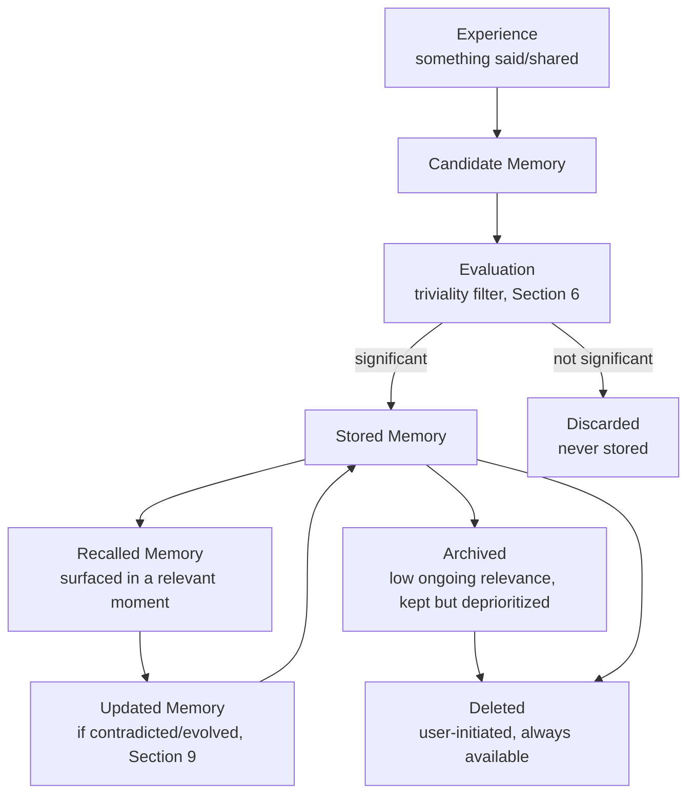
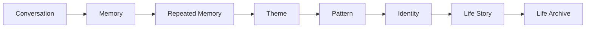
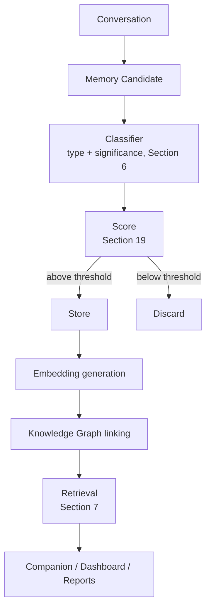

# MODULE 10 — MEMORY EXPERIENCE

---

## 1. Product Goals

**Business Goals**: protect and deepen the single strongest asset in the business (Module 2's Memory Moat) — every decision in this module is judged first by whether it makes that moat stronger or weaker.

**Memory Goals**: remember less, but remember better — a smaller number of accurate, significant, well-organized memories produces a more trustworthy Companion than a larger number of low-value ones.

**Relationship Goals**: memory should be felt as the mechanism of being understood over time (Module 9's Relationship Lifecycle), never as a surveillance log of everything said.

**Trust Goals**: every memory must be explainable, editable, and deletable on demand — trust in the Companion (Module 9) is downstream of trust in Memory specifically, since Memory is what makes the Companion's claims about "remembering" verifiable rather than asserted.

**Retention Goals**: Memory is the mechanism behind Module 1's compounding retention thesis — this module's job is to make sure that compounding is real (accurate, growing, useful) rather than illusory (bloated, stale, or inaccurate).

**AI Goals**: give the Companion (Module 9) exactly the right, most relevant context at the right moment — Memory's success is measured by how well it serves Companion conversations, Reports, and Discovery, never by its own size.

---

## 2. Memory Philosophy

**Why Memory exists**: it is the literal mechanism that separates BeaconVie from both failed categories named in Module 1 — without it, the Companion is a stateless chatbot and Discovery systems are a disconnected content feed.

**Memory is selective**: not everything said becomes a memory — only what's genuinely significant (Section 6). This is a design principle, not a technical limitation to work around.

**Memory is transparent**: every stored memory can be seen, explained, and traced to its source (Module 4's Memory Card, Section 8 below) — nothing is stored invisibly.

**Memory is editable**: in practice, "editing" means deletion (Module 3's governing rule — Memory is never directly user-writable, only user-deletable) — a user corrects the record by removing what's wrong, and the Companion updates its understanding going forward through new, current conversation (Section 9).

**Memory strengthens relationships**: every memory decision is evaluated against whether it will make some future conversation, reflection, or Report better — memory that doesn't serve that purpose isn't worth keeping, regardless of how easy it would be to store.

**Forgetfulness is a feature**: a system that remembers everything indiscriminately isn't a better memory system — it's a worse one, because it can't distinguish what matters, which is the entire point of memory as a cognitive concept.

**The standing creed** (governs every rule in this module):
> **Remember less. Remember better. Never fake. Always explain. Always allow deletion. Respect change. Protect privacy.**

Every subsequent section in this module is an operational implementation of one or more of these seven lines.

---

## 3. Memory Lifecycle



**Experience**: any conversational turn, Journal entry, or Discovery-system interaction that could contain memory-worthy content.

**Candidate Memory**: the raw content before evaluation — not yet a memory, just a possibility.

**Evaluation**: the triviality filter (Module 3/9) applies the Memory Decision Engine (Section 6) — most candidates that reach this stage from ordinary conversation are filtered here; only genuinely significant content proceeds.

**Stored Memory**: a structured node with content, tags, timestamp, source, and initial scoring (Section 19).

**Recalled Memory**: the moment a stored memory is retrieved and surfaced (Module 9, Section 7/8) — this is where memory becomes felt value, not just stored data.

**Updated Memory**: when new conversation contradicts or extends a prior memory (Section 9), the memory's current understanding is updated rather than a stale version being left to conflict silently with reality.

**Archived**: a memory that's still accurate but no longer actively relevant (e.g., a resolved short-term stressor) is deprioritized in retrieval ranking without being deleted — it remains part of the Life Archive (Module 9, Section 3) even if it's no longer surfaced daily.

**Deleted**: always a direct, user-available action (Module 3's governing rule) — the only stage in this lifecycle the user can trigger unilaterally at any point.

---

## 4. Memory Types

| Type | What it captures | Notes |
|---|---|---|
| **Identity** | Stable facts about who someone is (e.g., "works in marketing," "has two siblings") | Highest durability — rarely changes, weighted heavily in retrieval |
| **Preferences** | How someone likes things done, what they enjoy or avoid | Moderate durability; can shift over time without being a "contradiction" (Section 9) |
| **Life Events** | Discrete, dated happenings (a job change, a move, a loss) | High significance by default; often the anchor for follow-up conversations |
| **Relationships** | The people in someone's life and the nature of those relationships, as the user describes them | Handled carefully — reflects only the user's own account, never inferred judgments about the other people involved |
| **Goals** | Stated aspirations, only as organically shared (Module 7/8 — never solicited as a structured field) | Emerges over time, not collected upfront |
| **Dreams** | Aspirational or literal (sleep) content the user shares | Same organic-only collection rule as Goals |
| **Projects** | Ongoing efforts the user is engaged in | Similar to Life Events but often longer-running and updated incrementally |
| **Habits** | Recurring patterns the user describes about their own behavior | Distinguished from Insight Engine "patterns" (Section 11), which are AI-derived, not self-reported |
| **Emotions** | Explicitly stated feelings tied to specific content | Never inferred from indirect signals (Module 9, Section 12) |
| **Beliefs** | Stated values or views the user holds | Reflected respectfully, never challenged or corrected (Module 9, Section 11's rare-challenge rule) |
| **Insights** | AI-derived cross-time patterns (Section 11) | Distinct category — not something the user stated directly, always framed with appropriate humility |
| **Temporary Memory** | Session-scoped context with no long-term storage (MVP-stage Companion memory, Module 1) | Exists only for the duration of the active conversation |
| **Working Memory** | The current conversation's active context (Module 9, Section 7's top-priority tier) | Not persisted as a distinct "memory type" — it's the live context window, not a stored node |
| **Long-term Memory** | Everything in the Stored/Recalled/Archived lifecycle stages | The umbrella category everything above (except Temporary/Working) belongs to once evaluation (Section 3) passes |

---

## 5. Memory Hierarchy

**Ranking (most to least weighted in retrieval and retention priority)**:

```
Identity
   ↓
Life Events
   ↓
Relationships
   ↓
Goals
   ↓
Preferences
   ↓
Small Talk (never stored at all)
```

**Why this order**: Identity facts are the most stable and broadly useful context across almost any future conversation, so they're weighted highest and essentially never archived. Life Events are next because they're typically what a follow-up conversation would most want to reference ("how's the new job going"). Relationships and Goals matter deeply but are more specific to particular conversational threads, so they're weighted just below. Preferences are useful but lower-stakes — knowing someone's favorite reflection style matters less than knowing what's actually happening in their life. Small Talk sits outside the hierarchy entirely because it's excluded at the Evaluation stage (Section 3) and never becomes a memory in the first place — it's listed here only to make explicit that it's the hierarchy's floor, not its lowest tier.

---

## 6. Memory Decision Engine

**Should remember?** Yes, if the candidate content is Identity, a Life Event, a Relationship detail, a Goal, a stated Emotion tied to something specific, or a genuine Preference — and if it's not already captured by an existing, accurate memory.

**Should ignore?** Yes, for small talk, acknowledgment-only replies, purely factual/informational exchanges with no personal disclosure ("what does this card mean"), and anything the triviality filter scores below the storage threshold (Section 19).

**Should merge?** Yes, when a new candidate is a more detailed or updated version of an existing memory on the same topic (e.g., "started the new job" followed later by "still getting used to the new job") — merged into a single, evolving node rather than creating a growing pile of near-duplicate entries.

**Should update?** Yes, when new content clearly supersedes a prior memory's accuracy (Section 9) — the memory's current-state content is updated, with the prior version's timestamp/history retained internally for the Life Archive (Module 9), but not surfaced as a live, current fact anymore.

**Should archive?** Yes, when a memory is accurate but its active relevance has clearly passed (e.g., a resolved stressor, a completed one-time event with no ongoing thread) — archived, not deleted, so it remains part of the longitudinal record without cluttering everyday retrieval.

**Should delete?** Only ever on direct user action (Module 3's governing rule) — the Decision Engine itself never autonomously deletes a memory, only archives it; deletion is reserved exclusively for the user's own choice.

**Decision logic summary**:
```
function evaluateCandidate(candidate, existingMemories):
    if candidate.isSmallTalkOrAcknowledgmentOnly:
        return Discard

    significance = scoreSignificance(candidate)  # Section 19
    if significance < STORAGE_THRESHOLD:
        return Discard

    related = findRelatedMemory(candidate, existingMemories)
    if related exists:
        if candidate.contradicts(related):
            return Update(related, candidate)
        else:
            return Merge(related, candidate)

    return Store(candidate)
```

---

## 7. Memory Retrieval Engine

**When should memories appear?** Only when genuinely relevant to the current moment (Module 9, Section 7/8) — never as a demonstration of capability.

**How many?** At most one to a few per surfaced moment (a single Memory Highlight on Dashboard, Module 8; typically one referenced memory per Companion turn, Module 9) — retrieval always resolves to the smallest relevant set, never a dump of everything related.

**Ranking factors** (in order of weight):
1. **Importance** (Section 5's hierarchy plus Section 19's significance score) — the strongest signal.
2. **Conversation relevance** (embedding similarity to the current topic) — must be genuinely on-topic, not just generally important.
3. **Emotional relevance** (whether the current moment's emotional register matches the memory's) — a light, casual conversation shouldn't surface a heavy memory out of context.
4. **Recency** — used as a tiebreaker among similarly important and relevant candidates, never as the primary driver (Module 9, Section 8's weighting rule restated here at the retrieval-engine level).
5. **Relationship stage** (Module 9, Section 3) — gates how much interpretive confidence is applied when surfacing a memory (a Trusted-stage relationship can surface a memory with slightly more interpretive framing than a Getting-to-Know-stage one).

**Why this ordering**: Importance and relevance must dominate because a highly recent but trivial memory should never outrank an older but genuinely significant one — this is the same principle Module 8's Dashboard decision engine already established, applied here as the underlying engine both Dashboard and Companion draw from.

---

## 8. Memory Transparency

**Memory Cards** (Module 4's component, reused here as the canonical transparency mechanism): every surfaced memory renders as a Memory Card showing exactly what was remembered, in plain language.

**"Why this memory?"**: each Memory Card, on tap/expand, shows a brief, honest reason it's appearing now (e.g., "you mentioned this three weeks ago, and it came up again today") — never a black-box surfacing with no explanation.

**When created?**: timestamp always visible.

**Source conversation**: tappable link back to the original conversation or Journal entry it came from (Module 3's Context Navigation) — a user can always verify a memory against its origin.

**Edit**: in practice, implemented as delete-and-let-the-relationship-update-naturally (Section 6) rather than direct text editing, consistent with Memory never being directly user-writable.

**Delete**: always available, one action away, from the Memory Card itself or the full Memory/Search surface (Module 3, Section 9).

**Privacy**: every Memory Card and the full Memory view respect the same access rules as Module 3, Section 11's Permission Architecture — no one but the user (not even Moderator/Admin roles ambiently) can view personal memory content.

---

## 9. Memory Evolution

**Repeated facts**: when the same fact is reaffirmed across multiple conversations (e.g., mentioning the new job repeatedly), it's merged (Section 6) into a single, strengthening memory rather than creating duplicate entries — repetition increases confidence/importance scoring (Section 19), it doesn't create clutter.

**Contradictions**: when new content conflicts with a stored memory (e.g., "actually, the family visit went great" after previously expressing dread), the memory is updated to reflect the current, truer state — the Companion treats this as normal human change, never as catching the user in an inconsistency (Module 9, Section 17).

**Identity changes**: (e.g., a career change, a significant life transition) — Identity-type memories (Section 4) are updated deliberately and visibly, since these are the highest-durability memory type and a change here is itself often significant enough to be a new Life Event memory in its own right.

**Life changes**: broader shifts (a move, a relationship ending) update multiple related memories at once where relevant (e.g., a Relationship-type memory's status, plus a new Life Event memory marking the change) — handled by the same Update mechanism (Section 6), scaled to however many existing nodes are actually affected.

**Example**: 
- Stored: "Nervous about starting new job, unsure if good enough" (Month 1)
- New content (Month 2): "Actually feeling much more confident at work now"
- Result: memory updated to reflect current confidence, with the earlier uncertainty retained in the Life Archive's history (not deleted, not contradicted-and-ignored) so a future Report (Module 1) can meaningfully show the arc from uncertain to confident — this arc itself is exactly the kind of longitudinal value Memory exists to produce.

---

## 10. Forgetting System

**What should fade?** Low-significance, resolved, or superseded memories (Section 6's Archive path) — naturally deprioritized in retrieval ranking over time as their relevance recency (Section 7) diminishes, without being actively deleted.

**What should never fade?** High-durability Identity memories and significant Life Events remain retrievable indefinitely (subject only to explicit user deletion) — these are exactly the kind of memory the Life Archive (Section 11) depends on.

**Automatic forgetting**: exists only in the form of retrieval-ranking deprioritization (Archiving, Section 3) — the system never automatically, permanently deletes a memory outright; that action is reserved for the user alone (the creed's "always allow deletion" line implies deletion is a right the user exercises, not something the system does to them without consent).

**Manual deletion**: always available, immediate, and permanent (Module 3/6's privacy architecture) — this is the only true "forgetting" mechanism in the system.

**Archiving**: the practical mechanism behind "remember less, remember better" applied over time — a memory doesn't need to be deleted to stop cluttering daily retrieval; it simply needs to be correctly deprioritized.

**Temporary memories**: session-scoped content (Section 4) that was never promoted to long-term storage in the first place simply expires with the session — there's nothing to "forget" because it was never stored as a lasting memory.

**Why forgetfulness is a feature, operationally**: without archiving, a long-tenured user's retrieval quality would degrade as the graph grows (Module 8's 1000+ memories edge case) — active, disciplined deprioritization of resolved/low-significance content is what keeps retrieval sharp at scale, which is a direct, practical expression of "remember less, remember better."

---

## 11. Insight Engine



**Conversation → Memory**: a single significant disclosure becomes a stored node (Section 3).

**Memory → Repeated Memory**: the same or closely related content recurs across sessions (Section 9's merge mechanism), strengthening confidence.

**Repeated Memory → Theme**: several related memories (e.g., multiple mentions of self-doubt in new situations) are recognized as sharing a common thread — this is the first level at which the Insight Engine begins synthesizing rather than just storing.

**Theme → Pattern**: a Theme observed across enough distinct contexts and enough time becomes a Pattern worth potentially surfacing to the user (Module 9, Section 9's Insight mode) — always framed as an offered observation, never asserted fact, per Module 1's AI Philosophy rule 6.

**Pattern → Identity**: a sufficiently well-established, user-confirmed Pattern can inform the Identity memory type (Section 4) itself — e.g., a repeatedly-observed tendency becomes part of how the Companion understands who this person durably is, not just what they've mentioned recently.

**Identity → Life Story**: accumulated Identity, Life Event, and Pattern memories over a long tenure (Module 9's Long-term Companion/Life Archive stages) begin to form a coherent narrative arc — the basis for Reports' periodic synthesis (Module 1).

**Life Story → Life Archive**: the full, longitudinal record — the actual realized form of Module 1's Vision, and the clearest evidence of the Memory Moat (Module 2) in practice.

**Governing constraint at every step**: this escalation only ever moves upward through genuine, repeated, user-originated content — the Insight Engine never fabricates a Theme or Pattern from a single data point, and every step up this ladder requires proportionally more evidence, consistent with Module 1's rule to always respect uncertainty and never fake certainty.

---

## 12. Companion Interaction

**How Companion writes memories**: never directly — the Companion's conversational output triggers the async Memory Decision Engine (Section 6) after the fact; the Companion itself does not "decide" to remember something mid-conversation in a way visible as a separate action, beyond the honest Memory Card narration already established (Module 9, Section 6's state cycle "Remembering" state).

**How Companion recalls**: only from actually-retrieved, explicitly-provided memory content (Module 9, Section 15/19's hallucination-prevention rule) — never inferred or guessed.

**How Companion confirms**: when uncertain whether a retrieved memory is still accurate or relevant, the Companion asks plainly ("I remember you mentioning X — is that still how things stand?") rather than asserting it as current fact.

**How Companion updates**: upon receiving a correction or contradiction, the Companion acknowledges the update naturally in conversation (Section 9's example) and the underlying memory is updated via the standard Decision Engine pathway (Section 6) — no separate "memory editing mode" is exposed to the Companion itself.

**How Companion apologizes if wrong**: briefly and without excessive self-flagellation — "Ah, I had that a little off — thanks for setting it straight" — consistent with Module 9's personality guidance (confident, humble, never performatively self-critical).

---

## 13. Search Experience

**Natural language search**: a single query box (Module 3, Section 12) resolving via the same embedding index used for Companion retrieval — "when did I last feel this way about work" should surface thematically relevant memories, not just keyword matches.

**Timeline**: chronological view of memories (Module 4's Timeline component), the default browsing mode for the full Memory surface.

**Filters**: by Memory Type (Section 4) — e.g., "show me Life Events only" — and by date range.

**Categories**: correspond to the Memory Types table (Section 4), used as the filter taxonomy.

**Relationship timeline**: a specific filtered view surfacing Relationship-type memories chronologically, useful for a user wanting to see how they've discussed a specific person or relationship over time.

**Life events**: same pattern, filtered to Life Event-type memories — effectively a personal timeline of major happenings, one of the more naturally compelling views into the Memory system.

**Search scope**: strictly personal — never surfaces another user's content, matching Module 3, Section 12's standing rule.

---

## 14. Loading Experience

| Moment | Emotion |
|---|---|
| **Memory retrieval** | Folded into the Companion's single Thinking state (Module 9, Section 14) — never a separately visible step during conversation |
| **Memory save** | Invisible except for the Memory Card's appearance (Module 4/9) |
| **Memory merge** | Entirely invisible/backend — the user simply sees an updated, coherent memory later, never a "merging…" indicator |
| **Insight generation** | If a Report or Insight card is being computed (Module 1/8), a labeled, honest progress state ("connecting a few things you've shared…") rather than a generic spinner |

---

## 15. Error Experience

| Failure | Behavior | Recovery |
|---|---|---|
| **Memory unavailable** | Companion/Dashboard degrade gracefully to current-context-only operation (Module 8/9's identical pattern) — never a visible "Memory error" surfaced to the user during normal use | Background retry |
| **Duplicate memories** (a merge failure results in near-identical nodes) | Treated as a data-quality issue resolved by the background Decision Engine reprocessing, not user-visible | Automatic de-duplication pass; user can also simply delete a duplicate manually if noticed |
| **Wrong memory** (an inaccurate or misattributed memory) | User can always delete it directly (Section 8) — the system does not require a support ticket or explanation to correct this | Direct deletion |
| **Deleted memory** (referenced by something else, e.g., an old Report) | Historical Reports retain their originally-generated text (they were accurate at generation time) but the live Memory graph reflects the deletion going forward — deleting a memory does not retroactively rewrite past-generated content, which would be confusing and inconsistent with "what was true when it was written" | N/A — expected, documented behavior |
| **Conflicting memory** (two memories that seem to disagree, not yet merged/updated) | Retrieval ranking (Section 7) favors the more recent, higher-confidence one for live conversation use; both remain visible in the full Memory/Search view so the user can see and resolve the discrepancy themselves via deletion if desired | User-driven resolution, always available |

---

## 16. Analytics

**Memory creation**: rate and type-distribution (Section 4) of new memories — used to validate the Decision Engine's threshold (Section 6/19) isn't over- or under-storing.

**Memory retrieval**: frequency and relevance-acceptance (does a surfaced memory get engaged with positively) per Module 9, Section 16.

**Memory usefulness**: the core quality metric — proxied by whether surfaced memories lead to continued, positive engagement rather than being ignored or corrected.

**Memory edits** (i.e., deletions used as corrections, Section 8): tracked as a data-quality signal — a high correction rate on a particular memory type might indicate the Decision Engine's classification for that type needs tuning.

**Deletion**: tracked in aggregate (never inspected individually in a way that would violate the privacy this module is built to protect) as a health signal — a healthy system should see low but non-zero deletion, reflecting genuine occasional correction rather than either "user doesn't trust the memory at all" (too high) or "user has no ability/awareness to correct it" (zero, suspiciously).

**Recall accuracy**: whether recalled memories are confirmed as accurate when the Companion checks (Section 12) — feeds directly back into Decision Engine and scoring tuning (Section 19).

**Relationship growth**: memory density and Insight Engine progression (Section 11) per user over time, correlating with Module 9's Relationship Lifecycle stage transitions.

**KPIs**: % of Companion messages with an accurate, engaged-with memory reference (matches Module 1's supporting KPI); memory-graph health (low duplicate/contradiction rate); Insight Engine progression rate (Theme → Pattern → Identity) as a proxy for long-term relationship depth.

---

## 17. Edge Cases

**Contradictory memories**: handled by Section 9's Update mechanism when clearly sequential (new supersedes old); when genuinely ambiguous (two statements that don't clearly resolve which is current), both remain visible in Search/Timeline and retrieval favors recency/confidence (Section 7) without silently discarding either — the user can always resolve ambiguity by deleting whichever is inaccurate.

**False memories** (a misclassification — something stored that shouldn't have been, e.g., a misread sarcastic comment taken literally): correctable via direct deletion (Section 8); the Decision Engine's classifier (Section 6/19) is tuned over time using deletion-as-correction analytics (Section 16) to reduce this failure mode's frequency.

**Very large memory graphs** (Module 8's 1000+ memories case): retrieval scales via the significance/relevance ranking (Section 7), not via showing more — archiving (Section 10) actively keeps the *actively retrieved* set small even as the *total stored* set grows, which is the specific mechanism that prevents large graphs from degrading conversation quality.

**Privacy requests** (export/delete): handled per Module 3/6's Settings architecture — full export and full deletion are both always available, immediate (or promptly queued) actions.

**Account deletion**: cascades to full memory-graph deletion per the legal/privacy specification established in Module 3, Section 9 and Module 6, Section 9 — no memory persists past account deletion in any form usable to reconstruct the user's identity.

**Memory corruption** (a technical data-integrity failure, not a classification error): handled as a standard backend incident — detected via schema/embedding-integrity checks (Section 18), resolved via backup/replay from the async pipeline's event log rather than silent data loss.

---

## 18. Technical Specification

**Memory schema**: structured Postgres tables — `memory_node(id, user_id, type, content, source_module, source_id, created_at, updated_at, significance_score, emotional_score, confidence_score, status[active/archived/deleted])`, plus a separate `memory_embedding` table referencing each node's vector representation.

**Embedding architecture**: OpenAI embeddings (Module 1's stated stack), one embedding per memory node, stored and queried via a vector-search-capable index — a single shared index across the whole platform (Module 3's governing rule), never per-module duplicates.

**Knowledge graph**: lightweight relational linking between memory nodes (e.g., a Relationship-type node linked to Life Event nodes involving that same person) rather than a full generalized graph database — sufficient for this product's actual retrieval needs (Section 7) without introducing infrastructure complexity beyond what the Tech Stack (Module 1) specifies.

**Retrieval pipeline**: query embedding generated from current conversation context → vector similarity search scoped to `user_id` → results re-ranked by the Section 7 factor weighting (importance/relevance/emotional/recency/relationship-stage) → top-N (typically 1–3) returned to the Companion's Context Engine (Module 9, Section 7).

**Ranking algorithm**: detailed in Section 19's scoring formula.

**Vector search**: pgvector (or equivalent Postgres extension) given the existing Postgres-centric stack (Module 1), avoiding a separate dedicated vector database unless retrieval-latency data later demonstrates a genuine need.

**Caching**: hot/recent memory nodes cached in Redis (Module 3, Section 9) for low-latency Companion access within an active session.

**API**: internal service-to-service only (`MemoryService.retrieve(userId, queryContext)`, `MemoryService.evaluate(candidate)`, `MemoryService.delete(memoryId)`) — Memory has no direct user-facing API surface beyond what Settings/Search expose through their own endpoints.

**Database**: Postgres, consistent with Module 1's Tech Stack rationale (structured, relational integrity needed across Memory ↔ Companion ↔ Journal ↔ Discovery references).

**Queues**: BullMQ handles candidate evaluation, embedding generation, and merge/update processing asynchronously (Module 1/3/9) — never blocking Companion response latency.

**Redis**: hot-memory cache (above) plus a short-TTL per-user retrieval-result cache to avoid redundant vector search calls within a single active conversation.

**Background jobs**: periodic archiving sweep (Section 10) that re-scores and deprioritizes memories whose relevance has naturally faded, and a periodic de-duplication/merge-quality audit (feeding Section 16's analytics).

---

## 19. Memory Scoring Engine

**Importance Score**: derived from Memory Type (Section 5's hierarchy — Identity/Life Events weighted highest) plus explicit signal strength in the original content (how directly and specifically something was stated).

**Emotional Score**: derived from the intensity of explicitly stated emotional content (Module 9, Section 12 — never inferred indirectly) — a strongly-felt disclosure scores higher than a neutrally-stated fact of the same type.

**Recency Score**: a decay function over time since creation or last reaffirmation (Section 9's merge mechanism resets this) — used as a tiebreaker, never the dominant term (Section 7).

**Relationship Score**: weighted by how directly the memory connects to ongoing threads recognized by the Insight Engine (Section 11 — a memory that's part of an established Theme/Pattern scores higher than an isolated one-off).

**Confidence Score**: reflects how certain the classification is — a clearly-stated fact scores higher confidence than an ambiguous or sarcastic-sounding statement; low-confidence candidates are more likely to be discarded or held at a lower storage tier pending reaffirmation.

**Formula (illustrative, not a literal production constant set)**:
```
finalScore = (0.35 * importance)
           + (0.25 * emotional)
           + (0.15 * recency)
           + (0.15 * relationshipScore)
           + (0.10 * confidence)

STORAGE_THRESHOLD = tuned empirically via Section 16 analytics,
    starting conservative (favoring under-storage over over-storage,
    consistent with "remember less, remember better")
```

**Why weighted this way**: Importance and Emotional signal dominate because they most directly reflect what a human would consider "worth remembering" about another person; Recency and Confidence are present but capped low specifically so the system doesn't default to over-weighting whatever was said most recently or most clearly, at the expense of what actually matters (Section 5's hierarchy) — an explicit, auditable expression of "remember less, remember better" as a formula, not just a principle.

---

## 20. Memory Reasoning Pipeline



Each stage maps directly to sections above: Classifier and Score implement Sections 6/19; Store/Embedding/Knowledge Graph implement Section 18's schema and architecture; Retrieval implements Section 7's ranking; the final consumers (Companion, Dashboard, Reports) are exactly the modules Memory exists to serve (Section 1's AI Goals), closing the loop back to Module 1's core thesis.

---

## 21. UX Specification

**Memory Timeline**: the default full-Memory view (Module 4's Timeline component), reverse-chronological with type filters (Section 13).

**Memory Cards**: rendered identically wherever they appear across the product (Module 4's shared-component rule) — Dashboard, Companion, Search, and the full Memory Timeline all use the same visual component.

**Memory Details** (on Card expand/tap): source, timestamp, "why this memory" explanation, edit(delete)/export actions (Section 8).

**Edit**: routes to the delete-and-let-it-update-naturally pattern (Section 6/8), presented plainly rather than offering a misleading "edit text" affordance that would contradict the never-directly-writable rule.

**Delete**: single, clear, always-available action, with the same plain consequence-statement Dialog pattern established in Module 4/6 ("This will permanently delete this memory. This can't be undone.").

**Search**: global search entry point (Module 3, Section 12), same underlying retrieval engine as Companion.

**Grouping**: by relative time (Today / This Week / Earlier) and optionally by Type filter (Section 13), never an undifferentiated infinite list.

**Accessibility**: Memory Cards expose full text content to screen readers (not just a visual gold accent, Module 4, Section 12); Timeline navigation is fully keyboard-operable.

**Desktop/Tablet/Mobile**: consistent structure across breakpoints (Module 4, Section 6), Timeline becoming a single column on mobile.

---

## 22. QA Checklist

- **Memory creation**: verify the triviality filter correctly discards small talk and correctly stores genuinely significant content across a range of test conversations.
- **Retrieval**: verify ranking (Section 7) correctly prioritizes importance/relevance over raw recency in test scenarios with conflicting signals.
- **Ranking**: verify the scoring formula (Section 19) produces sensible, stable scores and that the storage threshold is neither over- nor under-inclusive against a labeled test set.
- **Embedding**: verify shared-index consistency across Companion, Search, Reports, and Notifications (no drift between what each surface can retrieve).
- **Companion**: verify recalled memories are always grounded in actually-retrieved content (Module 9's hallucination-prevention rule re-verified from the Memory side).
- **Frontend**: Memory Card, Timeline, and Search UI match Module 4 component specs exactly across breakpoints.
- **Backend**: verify async pipeline (Section 18) never blocks Companion response latency; verify merge/update logic (Section 6/9) correctly consolidates repeated content instead of duplicating.
- **Performance**: verify retrieval latency remains acceptable at high memory-graph density (1000+ nodes, Module 8's edge case).
- **Accessibility**: verify full screen-reader and keyboard support across Memory Timeline/Search/Details.
- **Analytics**: verify all Section 16 metrics are correctly instrumented, particularly deletion-as-correction signal capture for ongoing classifier tuning.

---

## 23. Future Expansion

**Cross-device memory**: already the default architecture (a single per-user Memory service, Module 3) — no additional work implied beyond what Sections 18 already specifies; explicitly called out here only to confirm it's not a gap.

**Shared memory**: relevant only alongside a future dual-consent compatibility feature (Module 1/9) — out of scope for the current single-user model; would require an entirely separate consent and access-control layer, not an extension of personal Memory's existing rules.

**Family memory**: same caution as Module 2/6's family-account discussion — a family member must never gain visibility into another's personal memory graph; any future shared-household feature would need to be billing/account-level only, never memory-level.

**Voice memories**: transcribed voice input (once Voice Companion, Module 9's Future Expansion, ships) would enter the same Candidate → Evaluation pipeline (Section 3) as text — no separate memory pathway needed, provided transcription accuracy is validated first.

**Image memories**: a future Vision Companion input channel (Module 9) — subject to the same triviality-filter and hallucination-prevention discipline before any visual content becomes a memory node; flagged as needing new classification logic (an image isn't natural-language content) rather than an assumption that existing text classifiers transfer directly.

**Life timeline**: the user-facing realization of the Insight Engine's Life Story stage (Section 11), most likely delivered through Reports (Module 1) rather than as a new standalone Memory feature.

**Semantic memory** (memory of general facts/preferences, distinct from episodic Life Events): already partially covered by the Identity/Preferences types (Section 4); a more formal semantic-vs-episodic distinction could be introduced later if retrieval-quality data shows a genuine benefit, but is not needed at current scale.

**Memory export**: already specified as a standing Settings capability (Module 3/6, Section 9) — full personal data export including the memory graph, available anytime.

---

## 24. Final Decisions

**Chosen Memory Model**
A selective, significance-scored (not recency-dominated) memory system built on a single shared embedding index, where storage requires passing an explicit threshold (favoring under-storage), where "editing" means deletion rather than direct rewriting, where archiving (not deletion) is the system's own mechanism for keeping retrieval sharp at scale, and where every stored memory is transparently explainable and traceable to its source at all times — with an Insight Engine that only escalates from Memory to Theme to Pattern to Identity to Life Story with proportionally increasing evidence at each step.

**Rejected Alternatives**
- Storing every conversational turn indiscriminately ("remember everything") — rejected outright as the precise anti-pattern this module's entire philosophy (Section 2) exists to avoid; it would degrade retrieval quality at scale and read as surveillance rather than understanding.
- Recency-dominant ranking — rejected in favor of importance-first ranking (Section 7/19), since a recent trivial exchange should never outrank an older, significant one.
- Direct in-place memory editing (allowing users to rewrite stored memory text) — rejected in favor of delete-and-let-it-update-naturally, preserving the integrity of what the Companion actually derived from real conversation versus what a user might retroactively prefer it to say.
- A fully generalized knowledge-graph database — rejected as more infrastructure than the product's actual retrieval needs require at this stage, given the existing Postgres-centric stack (Module 1) already supports the lightweight relational linking needed.
- Allowing the Insight Engine to surface a Pattern or Identity-level claim from a single or small number of data points — rejected as a direct violation of Module 1's "never fake certainty" rule; every escalation step requires proportionally more evidence.

**Trade-offs**
A conservative storage threshold (favoring under-storage) means some genuinely useful context will occasionally be missed in early relationship stages, when there isn't yet enough data to distinguish signal from noise confidently — accepted because the alternative (an aggressive, over-inclusive threshold) risks the Memory graph filling with low-value noise that degrades both retrieval quality and user trust at scale, which is a far more costly failure mode long-term than occasionally under-remembering early on.

**Reasons**
Every decision in this module is a direct operational implementation of the standing creed (Section 2) — remember less, remember better, never fake, always explain, always allow deletion, respect change, protect privacy — and of Module 1's AI Philosophy and Decision Framework. Nothing here introduces a memory behavior independent of that constitution; this module's entire purpose is making the Memory Moat (Module 2) real, verifiable, and worthy of the trust the whole product depends on.

---

**Next module in sequence: Journal.**
