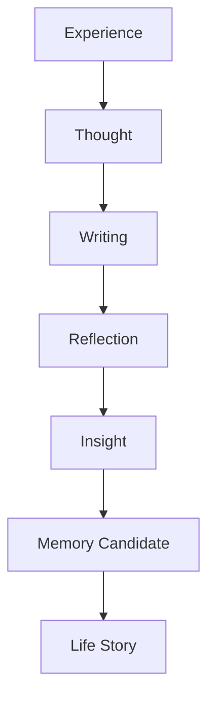
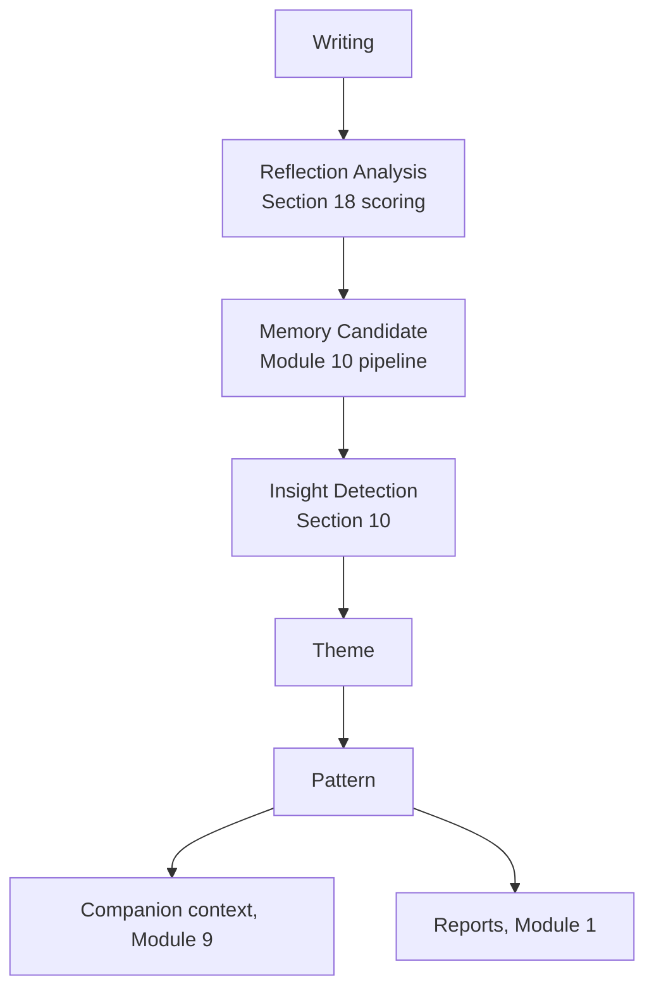

# MODULE 11 — JOURNAL EXPERIENCE

---

## 1. Product Goals

**Business Goals**: Journal is the single richest memory-input source in the ecosystem (Module 2, Section 3) — this module's job is to make that richness real by protecting the quality of writing, not by maximizing writing frequency.

**Reflection Goals**: help people think more clearly by writing, not help them produce more written content — the measure of success is clarity gained, not word count.

**Relationship Goals**: Journal deepens the Companion relationship (Module 9) by feeding it real, voluntarily-disclosed material — a completed entry should make future conversations noticeably better, and this should be felt, not just true in the backend.

**Memory Goals**: Journal entries are evaluated by the exact same Memory Decision Engine as conversation (Module 10) — no separate, looser standard for what becomes memory here.

**Trust Goals**: Journal must feel like the most private, safest space in the entire product — any AI presence here has to earn its place by restraint, not by being helpful in the usual sense.

**Retention Goals**: a genuinely valuable Journal habit compounds retention (Module 2's Core Product Loop) — but never through streaks, reminders-as-pressure, or productivity framing, all of which would undermine the reflective quality this module depends on.

**AI Goals**: know when to say almost nothing — Journal is the one surface in the product where the Companion's default behavior should be closer to silence than in Companion chat itself (Module 9).

---

## 2. Journal Philosophy

**Why Journal exists**: to give people a private space where the act of writing itself — not the AI, not a prompt, not a feature — produces clarity. It exists because writing changes thinking; the Companion and Memory system exist beside this, in service of it, never as its replacement.

**Reflection over documentation**: a diary documents what happened; this Journal helps someone understand what happened — the difference is whether writing is oriented toward a record or toward insight.

**Thinking over writing**: the writing itself is instrumental — the goal is the thinking it produces, not a polished or complete piece of writing. This has direct UX consequences (Section 5): no pressure toward completeness, length, or quality.

**Clarity over productivity**: no streaks, no word-count goals, no "journaling levels" — anything that would turn reflection into a productivity metric is explicitly rejected (Module 1's Guardrails, applied here specifically against a very common journaling-app failure mode).

**Private before social**: Journal has zero social surface at MVP or any planned release — no sharing, no visibility to anyone but the user (and, per explicit AI-permission opt-in, anonymized aggregate use, Module 6, Section 9) — this is the one module in the entire ecosystem where privacy is not just a value but the literal precondition for the module to work at all, since honest reflection requires the writer to trust no one else will see it.

**Writing changes thinking**: the psychological premise underlying this entire module — the act of putting a half-formed thought into words is itself clarifying, independent of any response. This is why the Companion's restraint (Section 6) is a feature, not a missing capability — sometimes the correct AI behavior is to let the writing do its own work.

---

## 3. Reflection Lifecycle



**Experience**: something happens in the user's life — the raw material.

**Thought**: the half-formed internal reaction to it, before language.

**Writing**: the act of putting the thought into words — this stage alone often produces clarity, independent of anything downstream.

**Reflection**: rereading or continuing to write produces a clearer articulation of what the Thought actually was — sometimes aided by a gentle Companion response (Section 6), often not.

**Insight**: a genuinely new understanding surfaces, either in the writing itself or through a rare, well-placed Companion reflection.

**Memory Candidate**: whatever in the entry is significant enough passes through Module 10's Memory Decision Engine exactly as any conversational content would.

**Life Story**: over time, entries become part of the same Insight Engine escalation (Module 10, Section 11) that Companion conversations feed — Journal and Companion are two inputs into one Memory system, not two parallel ones.

---

## 4. Journal Types

| Type | What it is | Notes |
|---|---|---|
| **Free Writing** | Completely open, no structure | The default mode — most consistent with "thinking over writing" |
| **Daily Reflection** | A loosely end-of-day framing, still open-ended | Not a structured template — just a gentle temporal anchor |
| **Guided Reflection** | A single memory-informed or thematic prompt (Section 9) | Optional, never forced |
| **Gratitude** | A specific, occasional prompt type, not a daily ritual | Used sparingly to avoid becoming a rote, low-reflection habit (a common failure mode of gratitude-journaling features that devolve into listing) |
| **Decision Journal** | A prompt structure for thinking through a specific choice | Genuinely useful reflective framing, offered contextually when a decision is mentioned in conversation |
| **Dream Journal** | Space for literal sleep dreams or aspirational "dreams" | Distinguished by context, not a separate rigid template |
| **Life Event** | Prompted around a significant, dated happening | Naturally produces high-value Memory candidates (Module 10, Section 5) |
| **Letter To Myself** | A reflective address to one's own present or past self | A specific, occasionally offered format, not a default |
| **Future Self** | Reflective address to a future version of oneself | Same treatment as Letter To Myself |
| **Relationship Reflection** | Focused on a specific relationship, at the user's initiation | Handled with the same care as Companion's relationship-content rules (Module 9, Section 10) |

**Why so many named types exist but none are defaults**: naming these types gives Prompt Engine (Section 9) a vocabulary to offer genuinely different, well-fitted entry points contextually — but the actual writing surface (Section 5) is always the same open text field regardless of type; "type" shapes only which prompt (if any) is offered, never a structurally different or more constrained editor.

---

## 5. Writing Experience

**Blank page**: the default state — an open, uncluttered text field, no placeholder pressure beyond a quiet cursor.

**Prompted page**: when a prompt is offered (Section 9), it appears as a single line above the same open text field — never a form with multiple fields to fill in.

**Continue draft**: any unfinished entry auto-resumes exactly where it was left (Section 13's autosave) — no "start over" friction.

**Autosave**: continuous, invisible, no manual "save" action ever required or exposed.

**Focus mode**: a distraction-minimal writing view — Global Navigation and Dashboard chrome recede, leaving just the writing surface, consistent with Module 4's Calm First principle taken to its most literal expression in this module.

**Minimal UI**: no word count, no formatting toolbar clutter, no "journaling streak" badge anywhere in view while writing.

**Emotion while writing**: should feel like a quiet room — private, unhurried, no visible signal that anything (including the AI) is watching in real time.

**Why no live AI presence while typing**: an AI suggestion appearing mid-sentence (auto-complete, live commentary) would directly interrupt the very thinking-through-writing process this module exists to protect (Module 4's Journal Block Do/Don't rule, reaffirmed here as this module's central UX constraint).

---

## 6. Reflection Engine

**When should AI speak?** Only after an entry is completed (not mid-writing) and only when a genuinely warranted, brief reflective response exists — matching Module 9's Reflection Engine modes (Reflection, Question, Validation), never Advice as a default.

**When should AI stay silent?** By default. Silence is the Reflection Engine's baseline state in Journal specifically — more so than in Companion chat, since the writing itself has often already done the clarifying work; an entry doesn't require a response to have been worthwhile.

**When should AI summarize?** Rarely, and only if explicitly useful (e.g., a very long, wandering entry where a brief, honest reflection of the throughline might help) — never as a default post-entry behavior, since summarizing what someone just wrote about themselves back to them can easily feel presumptuous or reductive.

**When should AI ask (a question)?** Only if a single, genuinely curious follow-up feels warranted and the user seems open to continuing the thought — offered as an optional next step, never required to close the entry.

**When should AI simply thank the user?** For entries where a fuller reflective response would be presumptuous or unnecessary (a short, complete-feeling entry, or one on a topic where reflection would feel like intrusion) — a brief, warm acknowledgment ("Thank you for sharing this") is often the most respectful response, not a placeholder for having nothing better to say.

**Decision rule summary**:
```
function reflectOnEntry(entry):
    if entry.isVeryShort and entry.feelsComplete:
        return QuietAcknowledgment  # "Thank you for writing this."

    if entry.isVeryLong and entry.hasWanderingThemes:
        return OptionalGentleSummary  # offered, not forced

    if entry.containsGenuineOpenThread and relationshipStage supports it:
        return OneReflectionOrQuestion

    return Silence  # no response required; entry stands on its own
```

**Why silence is the plurality outcome**: this is the single clearest way this module differs from Companion chat (Module 9) — a conversation structurally invites a reply; a Journal entry does not, and treating every entry as requiring an AI response would gradually turn Journal into a chat interface with extra steps, undermining "Journal is NOT the Companion" as a standing distinction.

---

## 7. Companion Interaction

**How Companion enters Journal**: only via an explicit, optional invitation from within a Companion conversation ("this might be worth sitting with a bit longer — want to write about it?", Module 9, Section 11) — never an unprompted redirect.

**How Companion leaves**: after offering that invitation, the Companion doesn't hover — the writing surface (Section 5) is clean of any lingering Companion presence.

**How Companion reflects**: per Section 6's rules, after the entry is complete, not during.

**How Companion recommends Journal**: contextually, from a conversation, matching Module 9's identical standing rule — Journal is offered, never pushed, and Dashboard's own Journal prompt (Module 8) follows the same contextual-relevance logic, never a daily default nag.

**How Journal returns to Companion**: a completed, reflected-upon entry becomes available context for the next Companion conversation (Module 9, Section 7's context hierarchy) — the loop closes naturally the next time the topic (or a related one) comes up, not via an artificial "let's discuss your journal entry" forced follow-up.

**Why this two-way but restrained relationship matters**: Companion and Journal are one relationship expressed through two different postures (active conversation vs. private reflection) — the design goal is that a user never has to wonder which one to use; each simply offers the other when it's the more natural fit for the moment.

---

## 8. Memory Interaction

**How Journal creates memories**: identically to Companion conversation (Module 10, Section 3) — an entry is evaluated by the same Memory Decision Engine, with the same significance threshold, immediately after completion (async, non-blocking).

**How memories are extracted**: the same embedding/classification pipeline (Module 10, Section 18) processes Journal entry text exactly as it would a conversational turn — no separate, Journal-specific extraction logic, preserving Module 3's single-source-of-truth principle.

**What should never become memory**: incomplete drafts (only a finished, or explicitly "done for now," entry is evaluated); purely stream-of-consciousness venting with no identifiable stable content (still passes through the same significance threshold as anything else — the rule isn't "Journal content is exempt," it's that the same triviality filter naturally excludes low-signal content here too).

**How memories evolve**: identical to Module 10, Section 9 — a later entry contradicting or updating an earlier one triggers the same Update/Merge mechanism, never a Journal-specific separate versioning system.

**Example**: an entry describing dread about an upcoming event, followed weeks later by an entry describing how it actually went well — the earlier memory updates to reflect the current understanding (Module 10, Section 9's identical pattern), preserved in the Life Archive's history for future Reports.

---

## 9. Prompt Engine

**When prompts appear**: on opening Journal with no active draft, if there's a genuinely relevant, specific prompt available (Section 9's sources below) — never as a mandatory field that must be answered before writing.

**When no prompts appear**: whenever no specific, relevant prompt exists — the default blank page (Section 5) is a completely valid, unprompted state, not a fallback to be avoided.

**Adaptive prompts**: drawn from recent Memory (Module 10) when a clear, natural thread exists — e.g., "You mentioned feeling unsure about the new job — has anything shifted since then?"

**Memory-based prompts**: the most common and highest-quality prompt source, directly reusing Module 10's retrieval engine.

**Relationship-based prompts**: informed by Module 9's Relationship Lifecycle stage — a Stranger/Getting-to-Know-stage user gets gentler, more general prompts; a Trusted/Deep-Relationship-stage user can receive a more specific, thread-connecting prompt.

**Seasonal prompts**: tied to Eastern Horoscope's annual cadence (Module 2) or simply calendar-aware moments (a new year, a birthday if known) — used sparingly, since seasonal prompts are the most generic category and risk feeling templated if overused.

**Examples**:
- Memory-based: "Last week you mentioned things felt tense with your sister — how are things now?"
- Relationship-based (early stage, generic but still specific in framing): "What's something you've been turning over in your mind but haven't said out loud yet?"
- Seasonal: "The new year often brings a mix of feelings — anything on your mind as it starts?"

---

## 10. Insight Engine

Reuses Module 10's exact escalation model (Section 11 there), with Journal content simply as one of the two inputs (alongside Companion conversation) feeding it:

```
Reflection (a single entry)
   ↓
Theme (recurring content across several entries)
   ↓
Pattern (a theme confirmed across enough time/contexts)
   ↓
Identity (a well-established, durable understanding)
   ↓
Life Story (the longitudinal narrative, feeding Reports)
```

**Why this isn't a separate Insight Engine**: introducing a Journal-specific pattern-detection system running in parallel to Module 10's would risk two different, potentially conflicting "understandings" of the same person — a direct threat to the single-source-of-truth Memory principle (Module 3). Journal and Companion feed one Insight Engine, not two.

---

## 11. Privacy Philosophy

**Private by default**: no Journal content is ever visible to anyone but the user, including internal Admin/Moderator roles under ordinary operation (Module 3, Section 11's Permission Architecture applies without exception here).

**AI transparency**: any Companion reflection on an entry is visible in-context (Section 6) — never a hidden background analysis the user isn't shown.

**Memory transparency**: any memory derived from a Journal entry is shown via the standard Memory Card (Module 10, Section 8), including its source entry link (Module 3's Context Navigation).

**Delete**: an entry can be deleted entirely by the user at any time; deletion cascades to any derived Memory nodes per Module 3, Section 9's stated rule.

**Export**: full Journal export is part of the standing Settings data-export capability (Module 6, Section 9).

**Encryption**: Journal content is encrypted at rest, consistent with Module 1's Technical Design rationale for the most sensitive data category in the product.

**Trust**: because Journal is the most private surface in the product, it's held to the strictest version of every privacy rule established elsewhere in the Bible — nothing here is a relaxed or Journal-specific privacy exception; if anything, it's the strictest application of the standing rules.

---

## 12. Search Experience

**Timeline**: reverse-chronological list of entries (Module 4's Timeline component), consistent with Module 10's Memory Timeline pattern.

**Calendar**: a date-grid view as an alternate browsing mode, useful for entries tied to specific life events or dates.

**Natural language search**: same shared embedding index as Memory/Companion search (Module 3, Section 12; Module 10, Section 13) — "when did I write about feeling this way" resolves thematically, not just by keyword.

**Themes**: surfaces Insight Engine Theme-level groupings (Section 10) as a browsing filter — e.g., "entries related to the new job."

**Tags**: not a manual user-tagging system (which would reintroduce productivity-app organizational overhead) — any "tag"-like grouping is derived automatically from Memory Type/Theme classification, never hand-entered by the user.

**Life domains**: a coarse filter (work, relationships, personal growth, etc.) derived from Memory Type classification (Module 10, Section 4), not a separate taxonomy requiring manual categorization.

**Mood search**: only searchable via explicitly-stated emotional content within entries (matching Module 9/10's rule against inferring mood from indirect signals) — never a separate mood-tracking log or chart.

**Relationship search**: same as Module 10, Section 13 — filtered to Relationship-type memories originating from Journal entries specifically, if useful.

---

## 13. Loading Experience

| Moment | Emotion |
|---|---|
| **Autosave** | Entirely invisible — no "saving…" indicator ever shown, consistent with the quiet-room feeling (Section 5) |
| **Reflection** (post-entry Companion response, if any) | Brief, labeled Thinking state (Module 4/9), appearing only after the entry is marked done |
| **Insight generation** | Rare, and only visible in the context of Reports (Module 1), not as a Journal-specific loading moment |
| **Memory extraction** | Fully invisible/async (Module 10, Section 14's identical pattern) |

---

## 14. Error Experience

| Failure | Behavior | Recovery |
|---|---|---|
| **Draft recovery** (app closed/crashed mid-entry) | The autosaved draft is always recoverable on next open — nothing written is ever lost | Automatic — the draft simply reappears |
| **Offline writing** | Fully supported — the editor works offline by design (local-first draft state), syncing once reconnected | Automatic sync on reconnect, matching Module 4's Offline pattern |
| **Autosave failure** (sync to server fails, but local draft persists) | No visible error during active writing (per the quiet-room principle) — a background retry handles it; only a persistent, multi-attempt failure surfaces a calm, specific notice | Background retry; local draft never discarded regardless of server-sync state |
| **Memory extraction failure** | Silent background retry (Module 10, Section 15's identical pattern) — never interrupts the writing/reading experience | Automatic retry |
| **Insight failure** (a Report/pattern computation fails) | Handled entirely within Reports' own error experience (Module 1) — not a Journal-facing error at all | N/A from Journal's perspective |

---

## 15. Analytics

**Journal frequency**: tracked as a diagnostic signal, never optimized directly (per the standing rule against productivity-mindset metrics) — a healthy frequency is whatever frequency correlates with genuine reflection quality, not a target number.

**Reflection depth**: proxied by entry length variance, thematic richness (Insight Engine Theme detection, Section 10), and whether entries lead to meaningful downstream Companion conversation.

**Writing completion**: whether started drafts are finished vs. abandoned — used to detect friction (e.g., is the editor itself getting in the way) rather than to push completion as a goal in itself.

**Prompt usefulness**: whether offered prompts (Section 9) are actually used vs. dismissed in favor of free writing — informs whether the Prompt Engine's relevance-matching needs tuning.

**Insight usefulness**: whether Theme/Pattern-level Insight Engine output (Section 10) derived partly from Journal content is engaged with positively when later surfaced (Module 9's Insight mode, Reports).

**Memory usefulness**: identical framing to Module 10, Section 16, applied to Journal-sourced memories specifically.

**Relationship growth**: correlation between sustained, quality Journal use and Module 9's Relationship Lifecycle stage progression.

**KPIs**: Journal entries per retained user per week (Module 1's supporting KPI, tracked as a health signal, not optimized directly); % of Journal entries producing a genuine memory node (a quality proxy, not a volume target).

---

## 16. Edge Cases

**Very long journals**: fully supported without artificial length limits; the Reflection Engine's optional-summary behavior (Section 6) exists specifically for this case, offered rather than forced.

**Empty journals** (opened but nothing written, or immediately deleted): no engagement penalty or nudge — an empty session is simply a non-event, never followed up on.

**One sentence journals**: fully valid; the Quiet Acknowledgment response (Section 6) is the appropriate default here, not a request for more detail.

**Repeated journals** (writing about the same topic across many entries): handled by Module 10, Section 9's merge/reaffirmation mechanism — repetition strengthens the underlying memory rather than being flagged as redundant to the user.

**Sensitive topics**: Module 9, Section 13's Safety Philosophy applies identically in Journal — a crisis-adjacent disclosure in a Journal entry triggers the same tested escalation response as it would in conversation, since the safety bar cannot be lower just because the surface is different.

**Deleted journals**: cascades to derived Memory nodes per Module 3/10's standing rule; the deletion itself is never treated as suspicious or flagged internally — it's an ordinary, respected user action.

**Imported journals** (a user bringing entries from another app/format, if such an import feature exists in the future): would need to pass through the same Memory evaluation pipeline as native entries, with appropriate disclosure to the user about how imported historical content will be treated by Memory (Future Expansion, Section 22).

---

## 17. Technical Specification

**Editor**: a plain, distraction-minimal rich-text-optional editor (light Markdown support for structure, no heavy formatting toolbar) — implemented client-side with local-first draft persistence (IndexedDB or equivalent) before server sync, ensuring offline writing (Section 14) works natively rather than as an afterthought.

**Autosave**: debounced local save on every meaningful pause in typing, with background sync to the server on a slightly longer interval — never blocking the writing experience.

**Draft system**: one active draft per Journal session context; resuming (Section 5) simply loads the most recent unsynced or synced-but-continuable draft.

**Markdown support**: light (bold/italic/line breaks) — enough for basic structure without turning Journal into a document editor (standing non-goal, per Module 11's title distinction from Notes).

**Attachments**: not supported at MVP (photo/file attachments are explicitly Future Expansion, Section 22) — keeping the writing surface purely textual and private-feeling for now.

**Memory extraction pipeline**: identical to Module 10, Section 18 — Journal entries are simply another `source_module` value on the same `memory_node` schema.

**AI pipeline**: reuses Module 9's Companion AI service for post-entry reflection generation (Section 6) — no separate "Journal AI."

**API**: `POST /journal/entry` (create/update, autosave-driven), `POST /journal/entry/:id/complete` (marks done, triggers Reflection Engine and Memory evaluation), `GET /journal/entries` (Timeline/Search/Calendar views).

**Database**: `journal_entry(id, user_id, content, status[draft/complete], created_at, updated_at)` in Postgres, linked to `memory_node` via `source_module='journal', source_id=journal_entry.id` (Module 10's schema).

**Queues**: BullMQ handles post-completion Reflection Engine invocation and Memory evaluation asynchronously, identical pattern to Companion (Module 9/10).

**Caching**: minimal — Journal doesn't need the same hot-retrieval caching Companion/Dashboard require, since it's a write-first, read-occasional surface; standard Redis session caching suffices.

---

## 18. Reflection Scoring Engine

Reuses Module 10, Section 19's scoring model directly for Memory-worthiness, with two Journal-specific reflection-quality signals used only to inform the Reflection Engine's response decision (Section 6), not Memory storage itself:

**Depth Score**: how much genuine exploration (vs. surface description) the entry contains — informs whether a Reflection/Question response (vs. Quiet Acknowledgment) is warranted.

**Emotional Score**: identical concept to Module 10, Section 19 — explicit emotional content strength.

**Clarity Score**: whether the entry reads as already having reached some clarity (in which case a response risks being redundant) vs. still working through something open-ended (where a gentle question might genuinely help).

**Growth Score**: whether the entry reflects change/movement relative to prior related entries (feeds Module 10's Insight Engine's Theme/Pattern escalation, Section 10 above).

**Memory Score**: the same formula as Module 10, Section 19 — determines actual storage, independent of the above reflection-quality signals.

**Why these are separate from Memory Score**: an entry can be highly memory-worthy but need zero AI response (a clear, complete disclosure needing only acknowledgment), or conversely be very low in memory-worthiness but still warrant a warm Quiet Acknowledgment simply because the user took the time to write — reflection-response decisions and memory-storage decisions are related but distinct judgments, and conflating them would either cause over-responding to memorable-but-complete entries or under-responding to entries that matter to the writer but don't rise to a stored-memory threshold.

---

## 19. Journal Reasoning Pipeline



Each stage maps to sections above: Reflection Analysis implements Section 18; Memory Candidate routes into Module 10's exact pipeline; Insight Detection/Theme/Pattern extend Module 10, Section 11 identically; the outputs feed Companion (Module 9's context hierarchy) and Reports (Module 1's synthesis), closing the loop into the same two consumer surfaces Memory already serves.

---

## 20. UX Specification

**Desktop/Tablet/Mobile**: consistent single-column writing surface at every breakpoint (Module 4, Section 6's 720px reading-column pattern), no layout divergence.

**Editor**: plain text-first, light Markdown, no toolbar clutter (Section 5/17).

**Reading mode**: past entries render in a calm, book-like typographic style (Fraunces for any Companion-annotated margin notes, Karla for the user's own writing, per Module 4's type-role assignment) — never a dense list view.

**Focus mode**: the default writing state itself (Section 5) — there isn't a separate "distraction-free toggle" because the ordinary writing experience already is that; introducing a separate mode would imply the default isn't already calm enough, which would be a design failure, not a feature gap.

**Accessibility**: full screen-reader support for both writing and reading past entries; text resizing respected throughout (Module 4, Section 12).

**Animations**: minimal — a soft fade when a Companion reflection appears post-entry (Module 4's Memory Recall timing where relevant), otherwise no animation during active writing at all, consistent with protecting the writing flow from any visual interruption.

---

## 21. QA Checklist

- **Writing**: verify offline-first local draft persistence works reliably across app backgrounding/closing/network loss.
- **Autosave**: verify no data loss scenario exists across the full failure matrix (Section 14).
- **Reflection**: verify the Reflection Engine's Silence/Quiet-Acknowledgment/Reflection decision (Section 6) is well-calibrated across a range of test entries, particularly that Silence is genuinely the plurality outcome, not a rarely-hit branch.
- **Memory**: verify Journal entries route through the identical Module 10 pipeline with no separate, divergent extraction logic.
- **Insights**: verify Journal-derived and Companion-derived content merge into one Insight Engine output, not two conflicting understandings.
- **Frontend**: verify the editor has zero live AI presence during active typing (a hard, testable assertion, not just a design guideline).
- **Backend**: verify async pipeline never blocks the writing/save experience.
- **Accessibility**: verify full keyboard/screen-reader operability for writing, reading, and search.
- **Performance**: verify autosave debouncing doesn't introduce perceptible lag on typical devices.
- **Analytics**: verify Journal frequency and completion metrics are tracked as diagnostic signals only, with no dashboard or alert implying they should be pushed upward as growth targets (a process safeguard against the standing anti-goal of productivity-mindset optimization).

---

## 22. Future Expansion

**Voice Journal**: spoken entries transcribed into the same pipeline (Section 8/17) — deferred until transcription accuracy and the same Voice-specific crisis-escalation work (Module 9, Section 23) is validated.

**Photo Journal / Video Journal**: attachments (Section 17's current non-goal) — would require new classification logic for non-text memory candidates (Module 10, Section 23's identical caveat for image memories), not assumed to work automatically with existing text-based Memory extraction.

**Shared Journal / Couple Journal**: explicitly out of scope — Journal's entire privacy premise (Section 11) depends on being singularly private; any shared-writing feature would need to be an entirely separate product surface with its own distinct consent architecture, never a mode of this Journal.

**Travel Journal**: a plausible thematic prompt-set variant (Section 9) tied to location/calendar signals, not a structurally different Journal type.

**AI Reflection Coach**: explicitly rejected as a direction — a more assertive, coaching-postured AI presence in Journal would violate this module's central design requirement (AI interrupts rarely, never becomes the author); if requested by users, this tension should be resolved by strengthening Companion's own coaching-adjacent boundaries (Module 9) rather than introducing a more directive AI persona here.

**Life Timeline**: the same longer-term Reports-delivered concept as Module 9/10's Future Expansion — Journal contributes to it, doesn't need its own separate timeline feature beyond the standard Timeline/Calendar views (Section 12).

---

## 23. Final Decisions

**Chosen Journal Model**
A private, offline-first, distraction-minimal writing surface with zero live AI presence during writing, a Reflection Engine whose default outcome is silence or brief acknowledgment (not a guaranteed response), prompts drawn from real memory/relationship context rather than a fixed template library, and memory extraction routed through the exact same pipeline and standards as Companion conversation — with strict privacy (no sharing surface at all) as the module's foundational, non-negotiable premise.

**Rejected Alternatives**
- A guaranteed AI response after every entry — rejected because it would gradually turn Journal into Companion-chat-with-extra-steps, undermining the deliberate distinction between the two surfaces (Section 2/6).
- Word count goals, streaks, or completion badges — rejected outright as the exact productivity/gamification anti-pattern this module's Quality Requirements name explicitly.
- A separate, Journal-specific Memory/Insight pipeline — rejected in favor of routing through Module 10's existing system, avoiding the risk of two divergent "understandings" of the same person.
- Manual user-tagging for organization — rejected in favor of automatic Theme/Life-domain derivation from existing Memory classification, avoiding productivity-app-style organizational overhead.
- A live, in-editor AI writing assistant (auto-complete, inline suggestions) — rejected outright as directly interrupting the thinking-through-writing process this entire module exists to protect.

**Trade-offs**
Defaulting to silence/brief-acknowledgment after most entries (Section 6) means some entries that might have benefited from a well-placed reflective question go unaddressed — accepted because the alternative (responding to every entry) risks turning a private reflective space into a chat interface, which would undermine the very reason Journal exists as a distinct module from Companion (Section 2).

**Reasons**
Every decision in this module protects the same core premise: writing itself, in a private and unhurried space, is what produces clarity — the Companion and Memory system exist to support that premise (by receiving what's shared and occasionally reflecting it back with restraint), never to compete with it for the user's attention or override it with more assertive AI participation.

---

**Next module in sequence: Tarot.**
