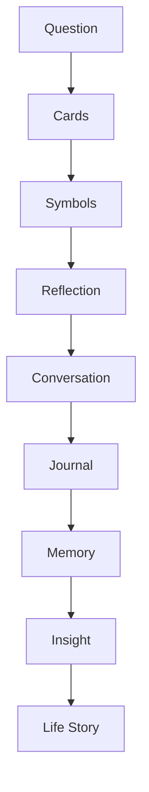
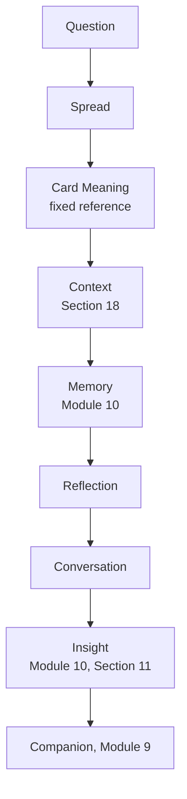

# MODULE 12 — TAROT EXPERIENCE

---

## 1. Product Goals

**Business Goals**: Tarot is the lowest-friction, highest-frequency Discovery ritual in the ecosystem (Module 2, Section 3) — its job is to generate frequent, genuine conversation-starting moments cheaply, funding the acquisition/retention loop without ever becoming the product itself.

**Reflection Goals**: every reading should leave the user seeing their own situation with slightly more perspective — never with a prediction to either believe or dismiss.

**Discovery Goals**: Tarot should be the easiest possible on-ramp into the Companion relationship (Module 1) — no setup cost, usable the first minute of Onboarding (Module 7).

**Relationship Goals**: every reading exists to start a conversation with the Companion, never to stand alone as a complete experience.

**Trust Goals**: Tarot's entire credibility with the Reflective Skeptic persona (Module 1) depends on never overstating what a card means — a single overreaching interpretation would undo more trust than a hundred careful ones could build.

**Retention Goals**: daily-draw frequency should emerge from genuine value, never from streak mechanics or manufactured urgency (Module 1's Guardrails, reaffirmed here against this module's specific temptation toward daily-habit gamification).

**AI Goals**: interpret symbolically, reflect, and ask — never predict, never claim certainty, never become an authority the user defers to instead of their own judgment.

---

## 2. Tarot Philosophy

**Why Tarot exists**: as a structured, low-friction prompt for self-reflection — a card is a Rorschach-like frame that gives someone a specific, concrete starting point for thinking about their own situation, not a supernatural information source.

**Reflection over prediction**: a card never tells the user what will happen — it offers a lens for thinking about what's already happening or already on their mind.

**Questions over answers**: the correct output of a reading is usually a better question about the user's situation, not a conclusion about it.

**Possibilities over certainty**: every interpretation is offered as one way of seeing things among several possible ones, never the definitive reading.

**Meaning over magic**: the value of a card is the meaning a person constructs from engaging with its symbolism, not any claim about supernatural mechanism — the product takes no position on whether tarot "works" mystically, and doesn't need to, because its value proposition is entirely psychological and reflective.

**Perspective over destiny**: a reading changes how something is seen, never what will happen.

**The standing creed** (governs every design decision in this module):
> **Cards are symbols. Not facts. Interpretation is an invitation. Not an answer. Reflection is always more important than prediction. The user always owns the final meaning.**

---

## 3. Discovery Lifecycle



**Question**: the user's actual situation or curiosity, explicit or implicit — every reading begins from something real, even if unstated (a default daily draw's implicit question is simply "what's worth reflecting on today").

**Cards**: the draw itself, per the selected Reading Type (Section 4) and spread structure (Section 17).

**Symbols**: the card's traditional symbolic content, offered as raw material for interpretation, not as a coded message.

**Reflection**: the AI's interpretation (Section 6), always framed as one possible reading connected to the user's actual situation via Memory/Journal context (Section 9), never as an isolated textbook definition.

**Conversation**: the reading's natural continuation into the Companion (Section 7) — this is the step every other step exists to reach.

**Journal**: an optional deeper continuation (Module 11) if the reflection surfaced something worth writing further about.

**Memory**: whatever from the reading and its resulting conversation is genuinely significant becomes a memory node (Section 8), via the identical Module 10 pipeline.

**Insight → Life Story**: over time, recurring themes across readings feed the same Insight Engine escalation (Module 10, Section 11) as every other memory source — Tarot doesn't have its own separate pattern-detection system, consistent with Module 3's single-source-of-truth principle.

---

## 4. Reading Types

| Type | What it is | Notes |
|---|---|---|
| **Daily Draw** | Single card, no specific question | The lowest-friction, highest-frequency ritual — the entry point for most users |
| **Three Card Spread** | Past/Present/Future or Situation/Challenge/Guidance framing | "Future" position is framed as "where this might be headed if things continue as they are" — never literal prediction, consistent with the standing creed |
| **Relationship Reading** | Focused on a specific relationship the user names | Reflects the user's own account only, same care as Module 9, Section 10's relationship-content handling |
| **Career Reading** | Focused on work/career reflection | Same reflective framing, never directive advice about career decisions |
| **Decision Reading** | Structured around a specific choice the user is weighing | Complements Module 11's Decision Journal type — Tarot can be the prompt, Journal the deeper working-through |
| **Self Reflection** | General, open-ended personal reflection | Closest to a pure Journal-prompt equivalent, delivered through card symbolism instead of a text prompt |
| **Life Direction** | Broader, less immediate framing | Offered only to users with enough relationship depth (Module 9, Section 3) that broader reflection feels earned, not presumptuous |
| **Year Ahead** | An annual, larger spread | Explicitly framed as "themes worth paying attention to," never a forecast — ties naturally to Eastern Horoscope's annual cadence (Module 2) as a complementary seasonal moment |
| **Shadow Reflection** | A more introspective spread focused on what's avoided or unacknowledged | Requires care in framing (Section 6) — offered gently, never framed as "exposing" something |
| **Custom Reading** | User-initiated, open framing around their own stated question | The most direct expression of "Question" as the lifecycle's starting stage (Section 3) |

**Why so many types exist without becoming a cluttered menu**: exactly one is ever offered at a time by the Companion/Dashboard recommendation engines (Module 8/9's singularity principle) — this table is a vocabulary for contextual recommendation, not a menu a user browses and picks from directly at every visit.

---

## 5. Card Experience

**Shuffle**: a brief, calm animation (Module 4's Card Reveal timing, 600–900ms) — never a lengthy, theatrical shuffle sequence designed to build artificial anticipation.

**Draw**: a single deliberate tap/gesture to draw — no repeated re-draw/"try again" affordance for a daily draw (re-drawing until landing on a preferred card would undermine the entire reflective premise; the card drawn is the card reflected on).

**Reveal**: the card flips/settles into view using Module 4's organic, slow-start-gentle-settle easing — the single slowest, most deliberate animation moment in the product, matching Module 4's stated rationale for ritual legitimacy.

**Animation**: abstract, celestial illustration style (Module 4, Section 4) for card backs and any supporting visual chrome — card face art itself uses a consistent, calm, non-garish illustration style, never literal "spooky mystic" visual tropes.

**Emotion**: anticipatory but calm — a moment of attention, not drama.

**Timing**: the reveal is the only deliberately slow moment; everything before (opening the Discovery panel) and after (reading the interpretation) moves at normal pace — the ritual's weight lives specifically in the reveal, not throughout the whole interaction.

**Interaction**: tapping a revealed card can show its traditional symbolic meaning (an optional "learn more" layer) separately from the AI's personalized interpretation (Section 6) — keeping "what this symbol traditionally represents" and "how this connects to you" as two distinct, clearly labeled pieces of content, never blended in a way that could look like the AI asserting the traditional meaning as fact about the user's life.

---

## 6. AI Interpretation Engine

**How AI interprets**: connects the card's traditional symbolism to the user's actual, currently-relevant context (Memory/Journal, Section 9) — never a generic, copy-paste textbook definition alone.

**How AI avoids prediction**: language is consistently framed in the present/reflective tense ("this can suggest," "this might point to," "worth considering") rather than the future/declarative tense ("this means," "you will") — this is a hard, checkable constraint on every generated interpretation (Section 17's prompt architecture enforces it structurally, not just stylistically).

**How AI handles uncertainty**: explicitly names that a card supports multiple readings and invites the user to say which resonates ("this could point to a few different things — does any of it land for you?") rather than picking one interpretation and presenting it as the reading.

**How AI asks reflective questions**: exactly one genuine question per reading interpretation, matching Module 9, Section 4's standing rule against over-questioning — the interpretation itself is brief; the question is what invites the Companion conversation forward.

**How AI invites conversation**: every interpretation ends with an explicit, natural bridge into Companion chat (Section 7) — a reading is never presented as a complete, standalone artifact with nothing further to do.

**Example** (Daily Draw, The Tower, no specific stated question):
> "The Tower often comes up around sudden shifts or things falling away to make room for something else. Is anything in your life feeling like it's shifting right now, even if it's not dramatic?"

**Why this example works**: no claim that something *will* collapse or change; explicitly offers the traditional symbolic association as a lens, then asks a real, open question connecting it to the user's actual life — fully consistent with the standing creed.

---

## 7. Companion Interaction

**How Tarot starts conversations**: every reading's final line is a direct, natural invitation into a Companion exchange (Section 6's example) — the reading and the conversation are one continuous moment, not two separate screens the user must choose between.

**How Companion continues them**: the Companion picks up exactly where the reading's question left off, with the card's context available as supporting (not primary) context per Module 9, Section 7's context hierarchy.

**How Companion remembers**: whatever emerges from the resulting conversation is evaluated for memory exactly as any other Companion exchange (Module 10) — the reading itself is a Discovery-type memory candidate (a fact: which card, when), while the conversation that follows may produce richer, personal memory content.

**How Companion follows up**: in a future conversation, if genuinely relevant, the Companion can reference back to a past reading naturally (Module 9, Section 8) — never a rote "let's check your cards again" but a real callback if the topic recurs.

---

## 8. Memory Interaction

**What becomes memory**: the fact of the reading itself (card drawn, reading type, date) is stored as a low-weight Discovery-type memory (Module 10, Section 4); any personal disclosure that emerges in the resulting Companion conversation is evaluated and stored through the standard significance-based pipeline exactly like any other conversational content.

**What never becomes memory**: the card's generic traditional meaning text itself (that's static reference content, not personal information); a reading with no follow-up engagement beyond viewing the card (low signal, filtered by the standard triviality threshold, Module 10, Section 6/19).

**Reading history**: retained as a lightweight log (Section 12) distinct from the richer Memory graph — useful for pattern purposes (repeated cards, Section 16) without inflating the significance-weighted Memory system with routine, low-content draws.

**Reflection**: if the user engages meaningfully with the interpretation and conversation, that engagement is what's memory-worthy — the reading is the occasion, not the content, of what gets remembered.

**Insights**: recurring reading-derived themes (e.g., cards related to change appearing repeatedly during a period of actual life transition) feed the same Insight Engine (Module 10, Section 11) — never a separate "tarot pattern" system.

**Example**:
- Stored (low-weight Discovery log): "Daily Draw: The Tower, March 3."
- Stored (from resulting conversation, standard significance pipeline): "Feeling like starting the new job is a bigger shift than expected, connects to a sense that a lot is changing at once."

---

## 9. Personalization Engine

**Relationship stage** (Module 9, Section 3): gates how directly a reading can connect to personal context — a Stranger-stage reading stays more general; a Trusted/Deep-stage reading can draw a more specific connection to a known ongoing thread.

**Memory**: the primary source of personalization — a card's interpretation is framed in light of the single most relevant recent memory, if one exists (matching Module 8/9's singularity principle — one connection, not several).

**Journal**: if a recent entry is thematically relevant, the reading can gently reference it ("you wrote a bit about this feeling recently") — used as supporting context, sparingly.

**Life events**: recent significant memories (Module 10, Section 4) are the strongest personalization signal for Reading Types like Life Direction or Decision Reading.

**Previous readings**: used to avoid immediate repetition (Module 8, Section 8's rotation rule) and to recognize a genuinely recurring card pattern (Section 16) worth gently noting, without over-indexing on coincidence.

**User preferences**: which Reading Types a user tends to engage with more deeply informs which type the Companion/Dashboard recommendation engine (Module 8, Section 18) offers next — never a configurable settings menu of "preferred reading style."

---

## 10. Reflection Engine

**How symbolism becomes reflection**: the AI Interpretation Engine (Section 6) connects a card's traditional meaning to the user's actual context — this transformation, from generic symbol to personally relevant reflection, is the entire value-add of the AI layer over a static tarot-meaning reference site.

**How reflection becomes insight**: a single reading's reflection is just a Reflection-stage event (Section 3); when a theme recurs across multiple readings and/or conversations, it escalates through Module 10's Insight Engine exactly like Journal-derived content (Module 11, Section 10) — one shared escalation model across the whole platform.

**How insight becomes growth**: once a Pattern or Identity-level insight (Module 10, Section 11) is well-established and user-confirmed, it can inform how future readings are framed (Section 9's personalization) — the loop closes when the accumulated understanding measurably improves the quality of future reflection, not just accumulates as data.

---

## 11. Ethics Philosophy

**No prediction**: no reading ever asserts a future outcome as likely or certain — reaffirms Section 6's language constraint at the philosophical level.

**No certainty**: every interpretation is explicitly offered as one possible lens (Section 6), never the single correct reading.

**No manipulation**: no interpretation is engineered to create anxiety or urgency in service of engagement or monetization — a Guardrail violation regardless of any documented engagement lift such framing might produce.

**No fear**: even traditionally "difficult" cards (Death, The Tower, The Devil) are interpreted through their reflective/transformative symbolic meaning, never through a frightening, doom-laden framing — this is standard, legitimate tarot practice, not a watering-down of the tradition.

**No dependency**: Tarot doesn't position itself as something the user needs daily to function or decide — the Companion never frames a reading as necessary before making a choice.

**No authority**: the AI never positions its interpretation as more valid than the user's own sense of their situation — per the creed, the user always owns the final meaning.

**Transparency**: every interpretation is clearly AI-generated and clearly framed as one possible reading (Section 6) — never presented with false claims of channeling, divination, or supernatural certainty.

**Respect beliefs**: the product takes no position on whether tarot has literal mystical validity — it neither claims supernatural power for the cards nor mocks users who hold a more spiritual view of them; both the Reflective Skeptic and the more genuinely spiritually-inclined Ritual Seeker (Module 1's personas) are served by the same respectful, non-presumptuous framing.

---

## 12. Reading History

**Timeline**: reverse-chronological log of past readings (Module 4's Timeline component), lighter-weight than the full Memory Timeline (Module 10) since most entries here are low-significance Discovery-log items rather than rich memory nodes.

**Search**: searchable by card, reading type, or date; thematically searchable via the same shared embedding index where a reading connects to richer conversational memory.

**Themes**: derived groupings (e.g., "readings during periods of change") surfaced only when a genuine Insight Engine Theme exists (Section 10), not a manufactured categorization for every reading.

**Patterns**: recurring card appearances (Section 16) surfaced gently, if genuinely notable, never presented as numerologically or mystically significant in themselves — framed reflectively ("this card has come up for you a few times this year — interesting to notice, not necessarily meaningful on its own").

**Repeated cards**: tracked, but interpreted with appropriate humility (Section 11) — three draws is not proof of anything; the framing stays consistent with "worth noticing" rather than "significant."

**Life domains**: same derived-from-Memory-classification approach as Module 11, Section 12 — no separate manual tagging system.

**Reflection history**: the richer, Memory-linked subset of readings that led to genuine conversation — distinguished visually (perhaps via the same significance-based tiering as Module 10) from routine, low-engagement draws.

---

## 13. Loading Experience

| Moment | Emotion |
|---|---|
| **Shuffle** | Brief, calm anticipation |
| **Reveal** | The single deliberate, slow moment (Section 5) |
| **Interpretation** | Labeled AI Thinking state (Module 4/9), brief — the interpretation itself should feel considered but not slow |
| **Reflection** (the Companion conversation that follows) | Standard Companion streaming (Module 9) |

---

## 14. Error Experience

| Failure | Behavior | Recovery |
|---|---|---|
| **Interpretation failure** (AI generation fails) | Falls back to the card's plain traditional meaning text (always available, static content) with a calm note that a fuller, personalized reflection couldn't be generated right now | Retry for the fuller interpretation; static fallback ensures the user is never left with nothing |
| **Card loading** (asset failure) | Standard skeleton/retry (Module 4) | Automatic retry |
| **AI unavailable** | Same fallback as Interpretation failure | Retry when available |
| **Offline** | The draw itself and static card meaning can work offline (a pre-cached card database, Section 17); the personalized interpretation requires connectivity and queues for when back online | Module 4's standard Offline pattern |

---

## 15. Analytics

**Reading completion**: whether a drawn card's interpretation is actually opened/read, not just drawn — a low completion rate would suggest the reveal experience or interpretation isn't landing.

**Reflection quality**: proxied by whether a reading's Companion-conversation invitation is accepted and leads to genuine continued exchange (Module 9, Section 16's identical framing).

**Conversation continuation**: the single most important funnel step — a reading that doesn't lead anywhere conversationally has failed its actual purpose regardless of how many readings are completed.

**Journal continuation**: whether readings lead to Journal entries (Module 11), a secondary but meaningful depth signal.

**Memory usefulness**: whether reading-derived memories (Section 8) are engaged with positively when later surfaced.

**Retention**: correlation between Tarot engagement and Module 1's broader retention KPIs — tracked to validate (not simply assume) that Tarot functions as a doorway rather than becoming, for some users, a dead-end habit disconnected from the Companion relationship.

**KPIs**: % of readings that lead to a Companion conversation (primary — directly measures "doorway, not destination"); Weekly Meaningful Conversations originating from Tarot (ties to Module 1's North Star).

---

## 16. Edge Cases

**Repeated readings** (multiple draws in a short window): the daily-draw ritual is naturally rate-limited to one meaningful daily card (re-drawing repeatedly to "get a better card" is explicitly not supported, Section 5) — other reading types can be used more freely since they're user-initiated for a specific question, not a daily ritual slot.

**Obsessive readings** (a user drawing many readings across many reading types in a single session, or returning to re-ask the same question repeatedly): the Companion's overwhelmed-signal detection (Module 8, Section 18) applies here too — if usage patterns suggest compulsive rather than reflective engagement, the product should gently favor Conversation over further reading offers, consistent with "no dependency" (Section 11); this is a genuine tension worth monitoring, since Discovery engagement is otherwise treated as a positive signal.

**Same question repeatedly**: the AI can gently note the recurrence ("you've asked something similar before — has anything shifted since then, or does it still feel the same?") rather than mechanically re-running an identical interpretation, turning repetition itself into a reflective moment.

**Sensitive questions** — **Death**: interpreted through Tarot's traditional symbolic meaning (transformation, endings, change) explicitly and immediately, never left ambiguous in a way that could read as a literal death prediction — this is standard tarot practice and is treated as a hard, non-negotiable framing rule, not a judgment call.

**Health**: the Companion does not use a reading to suggest anything about physical health outcomes; if a user's stated question concerns actual medical concern, the reading stays reflective/emotional-support framed, and Module 9, Section 13's standing rule against medical guidance applies identically here.

**Money**: same pattern — reflective framing only, no specific financial predictions or advice; Module 9, Section 13's financial-guidance boundary applies.

**Relationships**: reflects only the user's own stated account and feelings, never asserts claims about a third party's feelings or intentions (a common but ethically risky tarot-reading pattern that this product explicitly avoids).

---

## 17. Technical Specification

**Card database**: static reference content (78-card traditional tarot structure) stored once, versioned, including each card's traditional meaning text (upright/reversed if used) — this content is fixed, curated, and reviewed for accuracy/tone (Module 2's Admin content-curation responsibility), not AI-generated per request.

**Spread engine**: deterministic draw logic (random selection without replacement per spread) plus positional metadata (e.g., "Past/Present/Future" or "Situation/Challenge/Guidance" slot labels) per Reading Type (Section 4).

**Interpretation pipeline**: the draw result (card + position + Reading Type) plus personalization context (Section 9, retrieved via Module 10's Memory service) is passed to the Companion AI service (Module 9) to generate the personalized reflection — reusing the same LLM service and prompt-layering architecture (Module 9, Section 19), not a separate "Tarot AI."

**Prompt architecture**: a dedicated Tarot-specific prompt layer sits alongside Module 9's existing layers (System/Developer/Relationship/Memory/Reflection/Safety) — specifically constraining language to reflective/possibility framing (Section 6) and injecting the card's traditional meaning as fixed reference content the model must ground its interpretation in, rather than inventing meanings freely.

**API**: `POST /tarot/draw` (reading type, optional stated question) → returns card(s) + traditional meaning + personalized interpretation (streamed, matching Companion's streaming behavior) + Companion conversation entry point.

**Database**: `tarot_reading(id, user_id, reading_type, cards[], question, created_at)` — lightweight, linked to `memory_node` only for whatever the resulting conversation actually produces (Section 8), not for the reading log itself by default.

**Caching**: the static card database is cached aggressively (rarely changes) enabling offline card-meaning access (Section 14); personalization context retrieval uses Module 10's existing hot-memory cache.

**Queues**: any resulting memory evaluation from the post-reading conversation rides the standard BullMQ pipeline (Module 9/10) — no separate Tarot queue.

**AI**: Module 9's Companion service, extended with the Tarot-specific prompt layer above.

**Frontend**: Card Reveal component (Module 4, Section 9's signature timing), reusing the Discovery module's shared visual language (Module 4, Section 4's illustration style for card art).

---

## 18. Symbol Interpretation Engine

**Card meaning**: the fixed, curated traditional meaning (Section 17's static reference content) — the starting material, never bypassed or invented per-request.

**Context**: the user's current situation as expressed in the conversation/question, if any.

**Spread position**: modifies interpretive framing (a card in a "Challenge" position reads differently than the same card in a "Guidance" position) — positional meaning is also fixed, curated reference content, not freely generated.

**Question**: if the user stated an explicit question, the interpretation is anchored to it directly; if not (a default Daily Draw), the interpretation stays more general and invitational.

**Memory**: the single most relevant recent memory (Module 9/10's singularity principle) is used to personalize the connection between card and situation — never multiple memories woven in, which would overload a brief interpretation with more personalization than a card reading can credibly support.

**Journal**: used as secondary supporting context only if directly relevant (Section 9).

**Life situation**: broader Relationship-stage-gated context (Section 9) shapes how specific vs. general the interpretation can appropriately be.

**Reasoning model summary**:
```
function interpretCard(card, position, readingType, question, userContext):
    baseMeaning = lookupFixedMeaning(card, position)  # never invented
    relevantMemory = getMostRelevantMemory(userContext)  # singular, per Module 9/10

    if question exists:
        anchor = question
    else:
        anchor = relevantMemory or "general reflection"

    interpretation = connect(baseMeaning, anchor)  # always reflective/possibility-framed language
    closingQuestion = generateOneGenuineQuestion(interpretation, anchor)

    return { baseMeaning, interpretation, closingQuestion, companionEntryPoint: true }
```

---

## 19. Tarot Reasoning Pipeline



Maps directly to Section 18's reasoning model and Section 3's lifecycle — Card Meaning is always fixed/curated, never generated, which is the single most important architectural guarantee in this pipeline (it's what makes "cards are symbols, not facts" enforceable in code, not just in prompt instructions).

---

## 20. UX Specification

**Desktop/Tablet/Mobile**: consistent single-card-focus layout (Module 3, Screen Architecture) — full-width visual reveal, interpretation text below, matching Module 3's specified Discovery screen pattern exactly.

**Animations**: Card Reveal (Section 5) is the signature moment; everything else uses standard Module 4 timing.

**Card interactions**: tap for traditional meaning layer (Section 5); primary interaction is otherwise passive reading, not manipulation (no dragging/arranging cards, which would add interaction complexity without reflective value).

**Accessibility**: card imagery includes descriptive alt text conveying the symbolic content (not just "tarot card image"); interpretation text is fully screen-reader accessible; the reveal animation respects reduced-motion settings (Module 4, Section 12), replaced with an immediate, still-labeled state change.

**Reading flow**: Draw → Reveal → Interpretation → Companion invitation, matching Module 3's Discovery screen architecture and Section 3's lifecycle exactly — no extra steps.

---

## 21. QA Checklist

- **Cards**: verify all 78 traditional card meanings are curated, reviewed for tone (no fear-based language), and versioned.
- **Readings**: verify each Reading Type's positional framing (Section 4/18) is distinct and correctly labeled.
- **Reflection**: verify every generated interpretation uses reflective/possibility language exclusively — zero declarative future-tense claims (Section 6) — this should be an automated linguistic check, not manual-only review.
- **AI**: verify the interpretation is always grounded in the fixed card-meaning reference content (Section 18) rather than freely generated, and that at most one memory connection is drawn per reading.
- **Memory**: verify the reading log itself stays low-weight while resulting conversational content is evaluated at full significance (Section 8).
- **Frontend**: Card Reveal timing and illustration style match Module 4 specs exactly.
- **Backend**: verify offline card-database caching (Section 14/17) functions correctly.
- **Accessibility**: verify reduced-motion and screen-reader behavior for the reveal moment.
- **Performance**: verify interpretation generation latency stays within an honestly-labelable Thinking-state range.
- **Analytics**: verify Reading-to-Conversation funnel (Section 15) is tracked accurately as the primary success metric, not raw reading-completion count.

---

## 22. Future Expansion

**AI Generated Spread** (a novel, non-traditional spread layout generated per situation): a plausible future enhancement, but must still ground interpretation in the fixed card-meaning database (Section 17/18) — only the positional structure would be novel, never the underlying symbolic content.

**Voice Reading**: spoken interpretation delivery — deferred alongside Module 9's Voice Companion work and its crisis-escalation prerequisite.

**Image Reading**: not applicable in the traditional sense here (cards are already visual); more relevant to a future user-uploaded-image context feature, out of this module's scope.

**Physical Deck Sync**: a novel idea (scanning a user's own physical tarot deck) — interesting but adds significant complexity (image recognition, deck-variant handling) for a use case serving a small subset of the Ritual Seeker persona; not prioritized without clearer signal of demand.

**Couple Reading**: same standing caution as every other module's shared/dual-user feature — requires a separate consent architecture (Module 1), out of scope for the current single-user model.

**Seasonal Reading**: the Year Ahead type (Section 4) already covers this; further seasonal variants should reuse the same fixed-meaning-database architecture rather than introducing new content pipelines.

**Rituals**: broader ritual-framing features (e.g., a suggested small physical ritual alongside a digital reading) are a plausible brand-differentiating idea but need explicit design work to avoid drifting into performative mysticism the standing Ethics Philosophy (Section 11) cautions against.

**Life Timeline**: same as other modules' identical Future Expansion note — delivered through Reports (Module 1), not a separate Tarot-specific timeline feature.

---

## 23. Final Decisions

**Chosen Tarot Model**
A fixed, curated card-meaning reference database (never AI-invented per request) combined with a personalization layer that connects a single most-relevant memory to the card's traditional symbolism, always rendered in reflective/possibility language, always closing with exactly one genuine question and a direct bridge into Companion conversation — with reading-log data kept lightweight and separate from the significance-weighted Memory graph, which only receives what the resulting conversation actually produces.

**Rejected Alternatives**
- Freely AI-generated card meanings per request (no fixed reference database) — rejected as removing the one architectural guarantee (Section 19) that makes "cards are symbols, not facts" enforceable rather than merely aspirational.
- Predictive, future-declarative interpretation language — rejected outright per the standing creed and Ethics Philosophy.
- Unlimited re-drawing until a preferred card appears — rejected as undermining the entire reflective premise of a reading.
- A separate Tarot-specific Insight/pattern-detection system — rejected in favor of routing into Module 10's single Insight Engine, avoiding divergent understandings of the same person.
- Fear-based framing of traditionally "difficult" cards (Death, Tower, Devil) — rejected in favor of their standard transformative/reflective symbolic meaning, consistent with legitimate tarot practice and the standing "no fear" Ethics rule.

**Trade-offs**
Grounding every interpretation in a fixed, curated meaning database (rather than fully generative AI interpretation) trades some novelty/variety across readings for reliability, accuracy, and auditability of tone — accepted because the alternative risks exactly the kind of ungrounded, potentially fear-inducing or over-asserted interpretation this module's Ethics Philosophy exists to prevent.

**Reasons**
Every decision in this module operationalizes the standing creed — cards are symbols, not facts; interpretation is an invitation, not an answer; reflection outranks prediction; the user always owns the final meaning — and routes Tarot's actual product value (conversation-starting, memory-enriching) through the exact same Companion and Memory systems already established in Modules 9 and 10, rather than building a parallel, divergent system specific to this one Discovery module.

---

**Next module in sequence: Natal Chart.**
