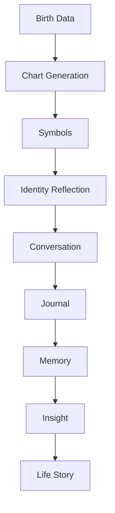
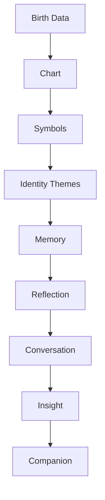

# MODULE 13 — NATAL CHART EXPERIENCE

---

## 1. Product Goals

**Business Goals**: Natal Chart is the richest, most durable Discovery-system memory anchor in the ecosystem (Module 2, Section 3) — a one-time setup that pays off in interpretive depth for months or years, making it the highest long-term-value Discovery ritual even though it's the highest-friction one to start.

**Discovery Goals**: give users a genuinely deep, multi-layered self-discovery map — richer and slower-cadence than Tarot (Module 12), rewarding return visits with new depth rather than new draws.

**Identity Goals**: help someone see themselves more clearly through a symbolic lens, without ever being told who they are — the chart suggests, it never defines (the standing creed).

**Relationship Goals**: like Tarot, every chart element exists to open a Companion conversation, never to stand alone as a personality profile.

**Memory Goals**: chart placements are unusually durable memory anchors (they don't change) — this module's job is to make that durability useful for months of future conversations, not just a one-time reveal.

**Trust Goals**: astrology carries a heavier "pseudoscience" skepticism association than tarot for some users (Module 1's Reflective Skeptic persona) — this module's ethical rigor (Section 11) has to be even more carefully non-deterministic than Tarot's to earn and keep that trust.

**Retention Goals**: depth over frequency — Natal Chart succeeds by being revisited meaningfully over a long relationship (Section 12), not by daily engagement.

**AI Goals**: interpret, reflect, connect, ask — never predict, never label, never define. The user always owns their identity.

---

## 2. Natal Chart Philosophy

**Why Natal Chart exists**: to give a person a rich, structured symbolic map for exploring their own identity, temperament, and tendencies — a durable, one-time-generated frame that a years-long Companion relationship can keep returning to with new relevance.

**Maps over labels**: a chart is a map of terrain, not a label stamped on a person — "Mercury in Gemini" describes a tendency worth exploring, not a category someone is sorted into.

**Potential over destiny**: every placement describes a potential, a tendency, a raw material — never a fixed, guaranteed trait or a preordained life path.

**Reflection over prediction**: identical standing principle to Tarot (Module 12) — a chart never asserts what will happen, only offers a lens for what might be worth noticing about how someone tends to experience things.

**Patterns over stereotypes**: astrology has a long cultural history of stereotype ("Virgos are neat freaks") — this module explicitly interprets patterns and tendencies in a personally-connected way (via Memory/Journal context, Section 9), never as a generic, sign-based stereotype recited independent of the actual person.

**Growth over fixed identity**: a chart doesn't change, but a person's relationship to their own placements does — the module's job is to support that evolving relationship, not to lock someone into a fixed self-concept the day they generate their chart.

**The standing creed** (governs every design decision in this module):
> **The chart suggests. It never defines. Identity evolves. Potential is not destiny. Symbols invite reflection. Growth is always possible. The user owns the final meaning.**

---

## 3. Discovery Lifecycle



**Birth Data**: date, time (if known), and location — collected only at the moment a user chooses this specific Discovery system (Module 7's standing rule against collecting birth data upfront), with time explicitly optional and clearly explained why it matters (Section 5/16).

**Chart Generation**: deterministic astronomical calculation (Section 17) — not AI-generated, a precise computation based on birth data.

**Symbols**: the chart's raw placements (planets, signs, houses, aspects) — fixed astronomical/astrological reference facts, not yet interpretation.

**Identity Reflection**: the AI's personalized interpretation (Section 6), connecting symbolic placements to the user's actual life via Memory/Journal context — this is where "map" becomes something the user can actually use to think about themselves.

**Conversation**: the natural bridge into Companion chat (Section 7) — identical structural pattern to Tarot.

**Journal**: an optional deeper written exploration (Module 11), often well-suited to Natal Chart's more expansive, identity-level content.

**Memory**: durable Identity-type memory nodes (Module 10, Section 4) are a natural fit for chart placements — high durability, rarely archived.

**Insight → Life Story**: chart-derived themes feed the same shared Insight Engine (Module 10, Section 11) as every other source — no separate astrology-specific pattern system.

---

## 4. Experience Structure

| Section | What it covers |
|---|---|
| **Chart Overview** | A single, calm visual summary — the "big picture" entry point, not an overwhelming full technical chart wheel on first view |
| **Planet Overview** | Each planet's placement (sign + house), one at a time, progressively disclosed (Section 5) |
| **Houses** | The twelve life-domain areas the chart divides into — explained plainly, connected to real-life domains (career, relationships, etc.) |
| **Signs** | The zodiacal qualities coloring each placement — explained without stereotype (Section 2) |
| **Aspects** | The relationships between placements (harmonious or tense angles) — the most technically dense layer, deepest in the progressive-disclosure hierarchy |
| **Identity Themes** | AI-synthesized, cross-placement themes (e.g., "a tension between wanting stability and craving change") — the first genuinely interpretive, synthesized layer above raw placements |
| **Strengths** | Reflectively framed potential strengths — always framed as tendencies worth recognizing, not guaranteed traits |
| **Growth Areas** | Reflectively framed potential growth edges — framed with care (Section 11) to avoid reading as criticism or a flaw diagnosis |
| **Life Domains** | Cross-references Houses with the user's actual stated life content (Memory/Journal) — where the chart becomes personally specific rather than generic |
| **Deep Dive** | On-demand technical detail (exact degrees, minor aspects) for users who want it — the deepest, most optional layer, matching the Ritual Seeker persona's (Module 1) desire for legitimacy and detail |

**Why this order**: mirrors Module 3's progressive disclosure principle exactly — Overview first, technical Aspects and Deep Dive last, so a first-time viewer isn't confronted with the full technical complexity of a natal chart before they've had a chance to find it meaningful at a glance.

---

## 5. Chart Experience

**Birth information**: date required; time optional but explained plainly why it matters ("time affects your houses and Ascendant — without it, we can still map your planets and signs, just not your rising sign or house placements precisely"); location required for house/timezone calculation.

**Chart generation**: near-instant for date/location-only charts; a brief, honest loading state (Section 13) for the full calculation.

**Visualization**: an abstract, calm rendering of the traditional chart wheel (Module 4's illustration style — line-based, celestial, never a cluttered, ornate astrology-website-style wheel dense with unlabeled glyphs).

**Navigation**: Chart Overview as the entry screen, with clear, calm navigation into each Experience Structure section (Section 4) via simple, labeled taps — not a single overwhelming all-at-once display.

**Interaction**: tapping a planet/house/sign reveals its individual placement and a brief traditional meaning, with the option to go deeper into the AI's personalized interpretation (Section 6) — mirroring Tarot's separation (Module 12, Section 5) between static reference meaning and personalized reflection.

**Progressive disclosure**: Overview → Planets/Houses/Signs → Aspects/Identity Themes → Deep Dive, matching Section 4's structure — a user is never forced past the Overview if that's all they want on a given visit.

**Emotion**: calm, considered, and appropriately weighty — the reveal of a first full chart is a more significant moment than a daily tarot draw and can support a slightly longer, more deliberate reveal animation (Module 4's Card Reveal timing, scaled up modestly) without feeling like drama for its own sake.

---

## 6. AI Interpretation Engine

**How AI interprets**: connects fixed placement meanings (Section 18) to the user's actual context (Memory/Journal, Section 9), exactly as Tarot's engine does (Module 12, Section 6) — the same architectural pattern, applied to astrological rather than tarot symbolism.

**How AI avoids deterministic language**: consistent use of tendency/potential framing ("this placement often shows up as...", "you might notice a pull toward...") rather than declarative, fixed-trait language ("you are...", "you will always..."). This is a hard, checkable constraint (Section 17's prompt architecture enforces it structurally).

**How AI explains uncertainty**: explicitly notes that any given placement can express itself very differently across people, and invites the user to say whether it resonates ("this could look like several different things in practice — does any of this sound familiar, or does it feel off?").

**How AI connects symbolism to real life**: the personalization layer (Section 9) — a placement's interpretation is always grounded in something real about the user's actual life where possible, not left as an abstract astrological description.

**How AI asks reflective questions**: exactly one genuine question per interpreted section, matching the same over-questioning restraint established for Tarot (Module 12) and Companion (Module 9).

**Example** (Mercury in Gemini, no specific prior context yet):
> "Mercury in Gemini often shows up as a mind that likes to explore lots of angles rather than settle on one — sometimes that's a strength, sometimes it can feel scattered. Does that sound like how your thinking tends to work, or not really?"

**Why this example works**: no "you are a Gemini-minded person" label; explicit acknowledgment of both a potential strength and a potential challenge without judgment; ends with a genuine, open question inviting the user's own account rather than asserting the trait as settled fact.

---

## 7. Companion Interaction

**How Natal Chart starts conversations**: identical bridging pattern to Tarot (Module 12, Section 7) — every interpreted section ends with a natural invitation into Companion chat.

**How Companion deepens understanding**: because chart placements are durable (Section 3), the Companion can reference them across many future conversations, not just the one immediately following chart generation — e.g., weeks later, connecting a stated feeling back to an Identity Theme (Section 4) established at chart generation.

**How Companion follows up**: naturally, when genuinely relevant — the Companion doesn't schedule periodic "let's revisit your chart" check-ins; it references chart context organically per Module 9, Section 7's context hierarchy (chart content sits in the same "Discovery, supporting context" tier as Tarot).

**How Companion remembers**: chart placements themselves become durable Identity-type memory nodes (Section 8) — among the highest-durability, least-likely-to-archive content in the entire Memory graph (Module 10, Section 5's hierarchy), reflecting their genuinely stable, unchanging nature.

---

## 8. Memory Interaction

**What becomes memory**: chart placements (planet/sign/house combinations) are stored as Identity-type memory nodes (Module 10, Section 4) — high durability, high importance weighting by default, given their permanence; Identity Themes (Section 4) synthesized at chart-review time are stored similarly; any personal disclosure from the resulting Companion conversation follows the standard significance-based pipeline.

**What never becomes memory**: the raw, generic textbook meaning of a placement (static reference content, not personal information) — only the personalized interpretation and the user's own response to it are memory-worthy, exactly as with Tarot (Module 12, Section 8).

**Identity evolution**: while the chart itself never changes, the user's relationship to a given placement can (Section 10) — e.g., initially resonating strongly with a Growth Area, later feeling they've moved past it — this evolution is tracked via the standard Update mechanism (Module 10, Section 9), not by altering the chart.

**Reflection history**: which Identity Themes/placements a user has actually engaged with meaningfully (vs. just viewed) is tracked (Section 12), informing future Companion references and Deep Dive recommendations.

**Example**:
- Stored (Identity-type, high durability): "Mercury in Gemini — resonates with tendency toward exploring many angles rather than settling quickly."
- Stored (from resulting conversation): "Feels like this shows up most at work, where switching between projects feels natural but sometimes leads to unfinished threads."

---

## 9. Personalization Engine

**Relationship stage** (Module 9, Section 3): gates depth and directness of interpretation — a Stranger-stage first chart reveal stays more general per placement; a Trusted/Deep-stage revisit (Section 12) can draw more specific, confident connections.

**Memory**: the primary personalization signal, identical architecture to Tarot (Module 12, Section 9) — the single most relevant memory shapes how a placement's interpretation connects to the user's actual life.

**Journal**: secondary supporting context, same treatment as Tarot.

**Life events**: recent significant memories inform which Life Domain (Section 4) connections feel most relevant on a given revisit.

**Tarot history**: if a recurring Tarot theme (Module 12, Section 12) and a chart placement seem to resonate together, the Companion can note the connection across Discovery systems — a natural, cross-system synthesis opportunity unique to having both systems available.

**User growth**: Identity evolution tracking (Section 8) directly informs whether a Growth Area's framing should shift over time (e.g., acknowledging progress rather than repeating an unchanged framing indefinitely).

---

## 10. Identity Reflection Engine

**How symbolism becomes identity exploration**: the AI Interpretation Engine (Section 6) transforms a fixed placement into a question about the user's own experience — the transformation from "Mercury is in Gemini" (fact) to "does a scattered-but-exploratory mind sound like you?" (invitation) is the entire value the AI layer adds.

**How exploration becomes reflection**: through the resulting Companion conversation (Section 7) and optional Journal continuation (Module 11) — the chart itself only starts the process.

**How reflection becomes insight**: recurring engagement with a theme across conversations/readings escalates through Module 10's shared Insight Engine (Section 11 there) exactly as Tarot and Journal content does.

**How insight becomes growth**: once an Identity Theme is well-established and user-confirmed, future interpretations (Section 9's "user growth" personalization) can acknowledge movement/change relative to it — this is the clearest expression of "identity evolves" from the standing creed: the chart stays fixed, but what the product understands about the user's *relationship* to it keeps updating.

---

## 11. Ethics Philosophy

**No prediction**: no placement or aspect is ever framed as predicting a future event — identical standing principle to Tarot.

**No labeling**: the AI never says "you are a [sign/placement] person" as an identity label — always tendency/potential language (Section 6).

**No deterministic personality**: no placement is presented as guaranteeing a fixed personality trait; the same placement can and does express differently across different people, and the AI says so explicitly when relevant.

**No manipulation**: no interpretation is engineered to create anxiety about a "difficult" placement in service of engagement or a premium upsell (e.g., never "your chart reveals a serious challenge — unlock Premium to understand it fully," which would be a direct, severe Guardrail violation).

**No authority**: the AI's interpretation is never positioned as more valid than the user's own sense of themselves — the user owns the final meaning, full stop.

**No dependency**: the chart is generated once and doesn't need daily revisiting to "work" — this module's entire retention model (Section 1) is explicitly built around depth-over-frequency for exactly this reason.

**Respect beliefs**: as with Tarot, the product takes no position on astrology's literal validity — it serves both the Reflective Skeptic (who uses it purely as a structured reflection framework) and the more spiritually-inclined Ritual Seeker equally respectfully.

**Transparency**: every interpretation is clearly AI-generated and clearly framed as one possible reading, grounded in real fixed astronomical/astrological reference data (Section 17) that the user can always see plainly (exact placements, not just AI prose).

---

## 12. Natal Timeline

**Identity evolution**: a view showing how the user's engagement with specific Identity Themes/Growth Areas has changed over time (Section 8/10) — distinct from the chart itself, which never changes.

**Reflection history**: which placements/themes have led to genuine Companion conversation or Journal entries, surfaced as the "richer" subset of chart content, mirroring Tarot's identical distinction (Module 12, Section 12).

**Life domains**: cross-referenced with Houses (Section 4), showing which life areas have been explored most vs. least — informing what Deep Dive or Companion follow-up might be most valuable next.

**Growth areas**: tracked over time (Section 10) to see whether a user's relationship to a specific Growth Area has shifted.

**Chart revisits**: logged simply (when the user returns to view the chart, which section they explore) — a low-weight log, similar to Tarot's reading-history log, not the significance-weighted Memory graph itself.

**Search**: same shared embedding index (Module 3, Section 12) enabling natural-language search across chart-related conversations and Journal entries.

---

## 13. Loading Experience

| Moment | Emotion |
|---|---|
| **Chart generation** | A calm, honest brief wait — "calculating your chart" — appropriately labeled given it's a real (if fast) astronomical computation |
| **Visualization** | Skeleton/shape-matched loading (Module 4, Section 14) before the final wheel renders |
| **Interpretation** | Labeled AI Thinking state (Module 4/9), per-section as the user navigates into each part of the Experience Structure (Section 4) |
| **Reflection** (the Companion conversation) | Standard Companion streaming (Module 9) |

---

## 14. Error Experience

| Failure | Behavior | Recovery |
|---|---|---|
| **Birth data missing** (e.g., time unknown) | Chart generates with planets/signs only, houses/Ascendant clearly marked as unavailable, with a plain explanation why (Section 5) — never blocked entirely | User can add birth time later in Settings/Profile if it becomes known, regenerating the fuller chart |
| **Unknown location** (e.g., historical/approximate location for older birth records) | Best-effort calculation using the closest known location, with a calm note about the resulting approximation's limits | User can refine location later |
| **Chart generation failure** (calculation service error) | Calm, honest error state ("we couldn't generate your chart just now") — never a silent failure | Retry |
| **AI unavailable** (interpretation generation fails) | Falls back to the static traditional meaning text for whatever section was being viewed (Section 17), same pattern as Tarot's fallback (Module 12, Section 14) | Retry for the fuller personalized interpretation |
| **Offline** | Chart visualization and static traditional meanings can be cached and viewed offline once generated once; personalized interpretation requires connectivity | Module 4's standard Offline pattern |

---

## 15. Analytics

**Chart completion**: whether a user who starts birth-data entry actually completes chart generation — informs whether the data-entry UX (Section 5) itself is a friction point.

**Deep dive completion**: whether users engage with the more technical Aspects/Deep Dive layers (Section 4) — a secondary depth signal, not a target to maximize (per the standing anti-overwhelm design requirement).

**Conversation continuation**: identical framing to Tarot (Module 12, Section 15) — the primary success metric; a chart that doesn't lead to Companion conversation has failed its purpose regardless of how thoroughly it was viewed.

**Journal continuation**: whether chart engagement leads to Journal entries (Module 11).

**Memory usefulness**: whether chart-derived Identity-type memories are engaged with positively when later surfaced in conversation.

**Retention**: correlation between Natal Chart engagement (a one-time-setup, high-depth ritual) and long-term retention specifically — distinct from Tarot's daily-frequency retention signal, since this module's value should show up as depth-of-relationship over months, not frequency of visits.

**KPIs**: % of chart interpretations that lead to Companion conversation (primary); chart-derived memory engagement rate over the following 90 days (a specific test of this module's "durable, long-term-value memory anchor" thesis, Section 1).

---

## 16. Edge Cases

**Unknown birth time**: fully supported (Section 14) — chart generates with clear labeling of what's available (planets/signs) vs. unavailable (houses/Ascendant) without treating this as a degraded or broken experience; framed as simply a different, still-valuable version of the map.

**Approximate birth time** (e.g., "sometime in the morning"): the product can accept a time range and either use the midpoint with a clear caveat, or default to the no-time version with an option to refine later — never silently guessing a precise time and presenting house placements with false confidence.

**Incorrect birth data** (a user later realizes they entered the wrong date/time/location): fully editable in Settings/Profile — the chart regenerates from corrected data, and prior chart-derived memories update via the standard Update mechanism (Module 10, Section 9) rather than leaving stale, now-inaccurate Identity memories in place.

**Changing beliefs** (a user who initially engaged with astrology skeptically becomes more invested, or vice versa): the product's respectful-of-both-stances design (Section 11) means no UX change is actually needed — the same reflective, non-deterministic framing serves both a user becoming more invested and one becoming more skeptical equally well.

**Repeated chart reading** (revisiting the same section multiple times): not discouraged (unlike Tarot's daily-draw rate-limiting) — since the chart itself is static and durable, repeated engagement over time is a legitimate, expected use pattern (Section 12's Identity Evolution tracking exists specifically to make repeated visits meaningfully different from each other as understanding deepens).

**Sensitive identity questions** (e.g., a user distressed by a "difficult" aspect or Growth Area): Module 9, Section 13's Safety Philosophy applies identically; additionally, Growth Areas (Section 4) are specifically designed in framing (Section 11) to never read as a diagnosis or flaw, precisely to reduce the likelihood of this edge case arising from the content itself.

---

## 17. Technical Specification

**Birth data parser**: validates date/time/location input, geocodes location to lat/long and correct historical timezone (accounting for historical DST/timezone rules for older birth dates) — a genuinely nontrivial technical requirement given how much historical timezone data has changed globally.

**Astronomy engine**: a standard ephemeris-based calculation library (planetary positions at a given date/time/location) — deterministic, precise, versioned, and covered by its own correctness test suite independent of any AI component; this calculation is never AI-generated or approximated by a language model.

**Chart calculation**: derives houses (if birth time available), planetary sign/house placements, and aspects (angular relationships between placements) from the astronomy engine's raw output, using standard, documented astrological house-system conventions (a specific, named system chosen and documented for consistency, e.g., Placidus, rather than left ambiguous).

**Interpretation pipeline**: identical architectural pattern to Tarot (Module 12, Section 17) — chart placement data plus personalization context (Module 10) passed to the Companion AI service (Module 9), reusing the same LLM service, not a separate "Astrology AI."

**Prompt architecture**: a dedicated Natal Chart prompt layer alongside Module 9's existing layers, constraining language to tendency/potential framing (Section 6) and grounding interpretation in the fixed placement-meaning reference database (Section 18), never freely generated.

**API**: `POST /natal-chart/generate` (birth data) → returns full chart data (placements, houses, aspects); `GET /natal-chart/interpret/:section` → returns personalized interpretation for a given Experience Structure section (Section 4), streamed.

**Database**: `natal_chart(id, user_id, birth_date, birth_time, birth_time_known, birth_location, computed_placements_json, house_system, created_at)` — the chart itself is computed once and stored, not recalculated on every view.

**Caching**: computed chart data cached indefinitely (it never changes barring a birth-data correction, Section 16); personalization context uses Module 10's existing hot-memory cache.

**Queues**: any resulting memory evaluation from post-interpretation conversation rides the standard BullMQ pipeline; chart generation itself is fast enough to be synchronous, not queued.

**Frontend**: Chart Overview/wheel visualization component (Module 4's illustration style), Experience Structure navigation (Section 4) as a progressive-disclosure component tree.

---

## 18. Symbol Interpretation Engine

**Planets**: fixed traditional meanings (what each planet represents — e.g., Mercury: communication/thinking) — curated reference content.

**Signs**: fixed traditional qualities (e.g., Gemini: adaptable, curious, dual-natured) — curated reference content, explicitly reviewed to avoid reductive stereotype language (Section 2).

**Houses**: fixed traditional life-domain associations (e.g., 10th house: career/public life) — curated reference content.

**Aspects**: fixed traditional meanings for angular relationships (e.g., a "square" aspect suggesting productive tension) — curated reference content, the most technically dense layer (Section 4).

**Patterns**: AI-synthesized combinations across multiple placements (Identity Themes, Section 4) — this is the first layer that's genuinely generated (not purely fixed-lookup), and is held to the strictest reflective-language constraints since it's synthesizing rather than just reporting a single fixed fact.

**Life domains**: cross-reference between Houses (fixed) and the user's actual Memory/Journal content (personalized) — the mechanism that turns "10th house" into "how does your actual work life connect to this."

**Memory/Journal**: personalization context sources, identical role to Tarot's engine (Module 12, Section 18).

**Reasoning model summary**:
```
function interpretPlacement(planet, sign, house, userContext):
    baseMeaning = lookupFixedMeaning(planet, sign, house)  # never invented
    relevantMemory = getMostRelevantMemory(userContext)  # singular

    interpretation = connect(baseMeaning, relevantMemory or "general reflection")
    # always tendency/potential framing, never declarative

    closingQuestion = generateOneGenuineQuestion(interpretation)

    return { baseMeaning, interpretation, closingQuestion, companionEntryPoint: true }

function synthesizeIdentityTheme(allPlacements, userContext):
    # only when multiple placements coherently suggest a shared theme
    # held to stricter evidentiary bar than single-placement interpretation,
    # per Module 10's Insight Engine escalation discipline
    ...
```

---

## 19. Natal Reasoning Pipeline



Maps to Section 18's reasoning model and Section 3's lifecycle — Chart/Symbols are always deterministic/fixed computation and reference lookup (never AI-generated), which is the architectural guarantee that makes "the chart suggests, it never defines" enforceable rather than aspirational, identical in spirit to Tarot's equivalent guarantee (Module 12, Section 19).

---

## 20. UX Specification

**Desktop/Tablet/Mobile**: Chart Overview and wheel visualization adapt in scale but not structure across breakpoints (Module 4, Section 6); Experience Structure sections (Section 4) navigate via simple tap-through on all form factors.

**Chart interactions**: tap a placement for its fixed meaning + option to go deeper into personalized interpretation (Section 5), consistent with Tarot's identical pattern.

**Animations**: chart wheel reveal uses a scaled-up version of Module 4's Card Reveal timing given the greater significance of a first full chart generation (Section 5); subsequent navigation between Experience Structure sections uses standard Module 4 transition timing.

**Accessibility**: chart wheel includes a fully accessible textual/tabular equivalent (not just a visual wheel) for screen-reader users — placements, houses, and aspects all navigable as structured text, not solely as an image.

**Navigation**: progressive disclosure exactly per Section 4/5 — Overview always the entry point, Deep Dive always the most optional, furthest layer.

**Reading flow**: Birth Data → Chart Generation → Overview → (optional) deeper sections → Companion invitation, matching Section 3's lifecycle.

---

## 21. QA Checklist

- **Chart accuracy**: verify the astronomy engine's calculations against known reference charts (a critical, non-negotiable correctness bar, since this is the one Discovery system making a genuine computational accuracy claim, unlike Tarot's symbolic-only content).
- **Interpretation**: verify tendency/potential language exclusively — zero deterministic "you are"/"you will" phrasing (an automated linguistic check, matching Tarot's equivalent QA item).
- **Reflection**: verify Identity Theme synthesis (Section 18) only fires with genuinely coherent multi-placement evidence, not from a single placement dressed up as a broader theme.
- **Memory**: verify chart-derived Identity memories are correctly weighted at high durability/importance (Module 10, Section 5) and correctly update (not duplicate) on birth-data correction (Section 16).
- **Frontend**: verify chart wheel visualization renders correctly across breakpoints and includes the full accessible text equivalent.
- **Backend**: verify historical timezone/geocoding correctness for a range of test birth dates/locations, including pre-modern-timezone-standardization dates.
- **Accessibility**: verify full screen-reader navigability of chart data.
- **Performance**: verify chart generation completes within an honestly-labelable wait time (Section 13).
- **Analytics**: verify the Conversation-continuation funnel (Section 15) is tracked as the primary success metric, not raw chart-view or Deep-Dive-completion counts.

---

## 22. Future Expansion

**Transit Reading** (current planetary positions relative to the natal chart): a plausible, valuable extension — would need its own dedicated ethics review to ensure transit interpretation stays as non-deterministic as natal interpretation (transits are more time-bound than natal placements, and thus carry higher risk of drifting toward prediction-like framing if not carefully designed).

**Progressions**: a more advanced astrological technique — deferred, same rigor requirement as Transit Reading.

**Solar Return**: an annual chart variant — a natural complement to the existing Year Ahead Tarot reading type (Module 12) and Eastern Horoscope's annual cadence (Module 2); worth coordinating across all three for a coherent "annual reflection season" rather than three disconnected features.

**Relationship Compatibility**: requires dual-consent architecture (Module 1's standing caution, reaffirmed here identically to every other module's shared-feature caveat) — out of scope for the current single-user model.

**Family Charts**: same dual/multi-consent caution as Compatibility.

**Voice Interpretation**: deferred alongside Module 9's Voice Companion prerequisite work.

**Life Timeline**: delivered through Reports (Module 1), consistent with every other module's identical note.

**AI Identity Coach**: explicitly rejected as a direction, mirroring Module 11's rejection of an "AI Reflection Coach" — a more directive, coaching-postured identity-interpretation AI would violate this module's central "the chart suggests, it never defines" principle; any felt need for more direct guidance should be addressed through Companion's own existing, carefully-bounded behavior (Module 9), not a new, more assertive persona specific to this module.

---

## 23. Final Decisions

**Chosen Natal Chart Model**
A deterministic, ephemeris-based chart calculation (never AI-approximated) paired with a fixed, curated placement-meaning reference database, personalized through the same single-most-relevant-memory connection pattern established for Tarot, always rendered in tendency/potential language, with Identity Theme synthesis held to a stricter multi-placement evidentiary bar than single-placement interpretation — and a depth-over-frequency retention model that treats durable engagement over months, not daily revisits, as this module's success signal.

**Rejected Alternatives**
- AI-approximated or AI-generated chart calculations (skipping a real astronomy engine) — rejected outright; this would be both technically wrong and would undermine the one place in this module where genuine computational precision is actually possible and expected.
- Sign-based stereotype language ("Geminis are...") — rejected in favor of placement-specific, tendency-framed, personally-connected interpretation.
- A daily-engagement retention model matching Tarot's — rejected in favor of a depth-over-frequency model appropriate to a one-time-generated, durable artifact.
- An "AI Identity Coach" persona for more assertive guidance — rejected identically to Module 11's Reflection Coach rejection, for the same reason (violates the chart-suggests-never-defines principle).
- Allowing Identity Theme synthesis from a single placement — rejected in favor of requiring genuine multi-placement coherence, matching Module 10's Insight Engine's proportional-evidence discipline.

**Trade-offs**
Requiring a real, precise astronomy engine (including historical timezone/geocoding correctness) is a meaningfully higher engineering bar than a simpler, approximate calculation would be — accepted because chart accuracy is the one place in this entire product where a factual computational error would be immediately, verifiably wrong to any user who checks it against another source, which would damage trust far beyond this one module.

**Reasons**
Every decision in this module operationalizes the standing creed — the chart suggests, it never defines; identity evolves; potential is not destiny; symbols invite reflection; growth is always possible; the user owns the final meaning — while routing all actual product value (conversation-starting, durable memory-anchoring) through the exact same Companion and Memory systems already established in Modules 9 and 10, consistent with every other Discovery module in this Bible.

---

**Next module in sequence: Eastern Horoscope.**
