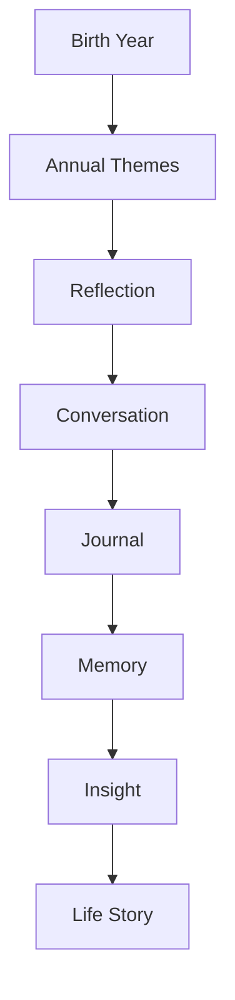
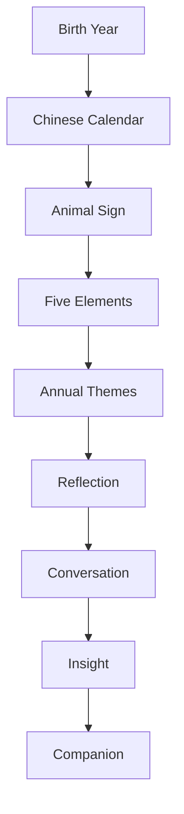

# MODULE 14 — EASTERN HOROSCOPE EXPERIENCE

---

## 1. Product Goals

**Business Goals**: Eastern Horoscope adds a second cyclical cadence (annual, Module 2, Section 3) alongside Tarot's daily and Natal Chart's one-time-durable rituals, broadening the Discovery System's reach into markets/audiences where this framework has strong native resonance (Module 2's Internationalization strategy).

**Discovery Goals**: give users a warm, culturally-grounded seasonal lens for reflection — distinct in register from Tarot's card-based symbolism and Natal Chart's individual astronomical precision.

**Seasonal Goals**: help someone notice the themes of a period (a year, a season) they're moving through — never what that period guarantees will happen.

**Relationship Goals**: identical standing pattern to Tarot and Natal Chart — every theme exists to open a Companion conversation, never to stand alone.

**Memory Goals**: annual themes are a natural, low-friction recurring memory anchor — revisited once a year, connecting a full year's worth of accumulated Memory/Journal content back to a seasonal frame.

**Trust Goals**: this module carries a specific responsibility Tarot and Natal Chart don't — cultural authenticity. Getting the Chinese zodiac/Five Elements framework wrong, or treating it as generic "Eastern mysticism" flavor, would damage trust with exactly the users for whom this system carries real cultural weight.

**Retention Goals**: an annual, seasonal cadence — success here is measured over a year's worth of engagement quality, not daily frequency.

**AI Goals**: interpret, reflect, connect, ask — never predict, never promise luck, never assign fate. The user owns their choices.

---

## 2. Eastern Horoscope Philosophy

**Why Eastern Horoscope exists**: to offer a second, culturally distinct seasonal lens for reflection — years and seasons have recognizable qualities and themes worth noticing, and this system gives language for that noticing, without claiming to determine outcomes.

**Cycles over destiny**: the calendar's cyclical structure (years, elements, animal signs) describes recurring qualities of time, not a fixed fate assigned to anyone born under them.

**Seasons over prediction**: a year's themes describe a season's general character, the way "winter tends to be a time of rest" describes a quality of a period without predicting what will specifically happen to any individual within it.

**Themes over events**: interpretation stays at the level of thematic quality ("a year that often favors steady, patient effort") never specific predicted events ("you will get a promotion").

**Reflection over superstition**: the module explicitly does not traffic in lucky numbers, lucky colors, or luck-scoring — these are common commercial horoscope-app conventions this product deliberately avoids as superstition-adjacent rather than reflection-oriented.

**Growth over luck**: the framing throughout is about what's worth paying attention to and how one might grow through a period, never about whether the period is "lucky" or "unlucky" for someone.

**The standing creed** (governs every design decision in this module):
> **Every year has themes. Not guarantees. Cycles invite awareness. Not fear. Reflection matters more than luck. Growth matters more than prediction. The user owns every decision.**

---

## 3. Discovery Lifecycle



**Birth Year**: the user's birth date, already collected if they've set up Natal Chart (Module 13) or collected fresh, specifically for this system, if not — reused across Discovery systems rather than re-asked (Module 3's single-identity-anchor principle applied to input data, not just memory).

**Annual Themes**: the calculated horoscope profile (animal sign, element, current year's relationship to it — Section 17) and its interpreted themes (Section 4).

**Reflection**: the AI's personalized connection of those themes to the user's actual life (Section 6).

**Conversation**: the natural bridge into Companion chat (Section 7), identical structural pattern to Tarot and Natal Chart.

**Journal**: optional deeper written exploration (Module 11).

**Memory**: annual-theme engagement becomes memory exactly as with the other Discovery systems (Section 8).

**Insight → Life Story**: feeds the same shared Insight Engine (Module 10, Section 11) — no separate system.

---

## 4. Experience Structure

| Section | What it covers |
|---|---|
| **Horoscope Overview** | A calm, single-glance summary — animal sign, element, and this year's general relationship between them |
| **Animal Sign** | The traditional zodiac animal's qualities — explained authentically, sourced from genuine cultural tradition, not a flattened "cute animal personality" gloss |
| **Five Elements** | Wood/Fire/Earth/Metal/Water and how they interact — the framework's deeper structural layer |
| **Year Energy** | How the current calendar year's own animal/element relates to the user's — the core seasonal-reflection mechanism |
| **Seasonal Themes** | Broader thematic qualities of the current period, synthesized from Year Energy | 
| **Growth Themes** | Reflectively framed potential growth areas for the period — same non-diagnostic care as Natal Chart's Growth Areas (Module 13) |
| **Relationships** | How this period's themes might relate to relationship dynamics, reflectively framed, never asserting claims about specific other people |
| **Career** | Same reflective treatment applied to work/career themes |
| **Health Reflection** | Explicitly framed as general seasonal-wellness reflection (e.g., "a time that traditionally favors rest") — never diagnostic or medical claims (Module 9, Section 13's standing medical-guidance boundary applies identically) |
| **Annual Reflection** | A synthesized, personalized reflection connecting the year's themes to the user's actual stated life content (Memory/Journal) |
| **Deep Dive** | More detailed traditional content on the Five Elements interactions and historical/cultural context, for users wanting deeper engagement |

**Why this order**: mirrors Natal Chart's progressive-disclosure logic (Module 13, Section 4) — Overview first, most technical/deep content last — while structuring the middle sections around life domains (Relationships, Career, Health) the way Natal Chart's Houses do, giving the two astrological systems a parallel, learnable structure across the product even though their underlying frameworks differ.

---

## 5. Horoscope Experience

**Overview**: a calm, warm visual summary (Module 4's illustration style, extended to include this system's own distinct but consistent visual motifs — e.g., subtle seasonal imagery rather than generic "Eastern mysticism" decoration).

**Visualization**: the Five Elements cycle and animal-year wheel rendered abstractly and respectfully — genuine cultural symbols represented accurately and tastefully, never as generic "exotic" decoration disconnected from their actual meaning.

**Navigation**: Overview entry point, progressive disclosure into deeper sections (Section 4), matching the established pattern from Tarot and Natal Chart.

**Progressive disclosure**: Overview → Animal Sign/Elements/Year Energy → life-domain sections → Deep Dive.

**Season transitions**: since this system is inherently annual/seasonal, the product can mark genuine seasonal transitions (e.g., Lunar New Year) with a quiet, dignified acknowledgment — never a "special sale" or urgency-driven event framing, consistent with Guardrails.

**Emotion**: warm, grounded, wise — distinct in register from Tarot's more immediate, symbolic calm and Natal Chart's deep, personal weightiness; this system's emotional register leans toward season-appropriate warmth and perspective.

**Interaction**: tap into any section for its traditional meaning plus the option for personalized interpretation (Section 6), consistent with the established pattern.

---

## 6. AI Interpretation Engine

**How AI interprets**: connects fixed traditional meanings (animal sign qualities, element interactions, Section 18) to the user's actual context (Memory/Journal, Section 9) — identical architectural pattern to Tarot and Natal Chart.

**How AI avoids prediction**: consistent thematic/quality framing ("this year often favors...", "a period that traditionally invites...") rather than declarative outcome claims ("you will..."), matching the standing creed exactly.

**How AI explains yearly themes**: frames a theme as describing the general character of a period, explicitly distinguishing that from a guarantee about the individual's specific experience within it ("years like this tend to reward patience — that doesn't mean nothing exciting can happen, just that steady effort is often what this kind of year rewards").

**How AI connects cultural wisdom with real life**: grounds interpretation in the user's actual stated life content wherever a genuine connection exists (Section 9), rather than leaving themes as abstract cultural description disconnected from the person's actual situation.

**How AI asks reflective questions**: exactly one genuine question per interpreted section, matching the established restraint pattern across all Discovery modules.

**Example** (a Wood Dragon year, user's own sign is Water Rabbit):
> "This year's energy — Wood feeding into your own Water sign — often points to growth that comes through nurturing something patiently rather than forcing quick results. Is there something in your life right now that feels like it needs that kind of patient tending?"

**Why this example works**: names the actual elemental relationship specifically (cultural authenticity); frames it as a thematic tendency, not a guarantee; connects to the user's real life via an open question rather than asserting what's happening in their life.

---

## 7. Companion Interaction

**How Eastern Horoscope starts conversations**: identical bridging pattern to Tarot and Natal Chart — every interpreted section ends with a natural Companion invitation.

**How Companion follows up**: naturally, when genuinely relevant, referencing annual themes as supporting context (Module 9, Section 7's context hierarchy) — never a scheduled "check in on your year" nag.

**How Companion remembers**: annual themes become memory (Section 8), with a natural, built-in revisit point the following year (Section 12) when the calendar cycles.

**How yearly themes evolve**: unlike Natal Chart's fixed placements, this system's core content changes annually by design (the calendar year itself changes) — so revisiting isn't just about the user's evolving relationship to fixed content (as with Natal Chart), but genuinely new thematic content each year, layered on top of the user's unchanging animal sign/element profile.

---

## 8. Memory Interaction

**What becomes memory**: the user's horoscope profile (animal sign, element — Identity-type, high durability, Module 10, Section 4) is stored once; each year's specific Annual Themes engagement is stored as a lower-durability, time-bound memory (naturally archived once the year passes, Module 10, Section 10); any personal disclosure from resulting conversation follows the standard significance pipeline.

**What never becomes memory**: generic traditional meaning text itself (static reference content); lucky-number/color content isn't offered at all (Section 11), so there's no equivalent "trivial content" category to exclude here beyond the same small-talk/no-disclosure filter used everywhere else.

**Annual themes**: naturally time-scoped — a Wood Dragon year's themes are relevant for that year and appropriately archived (not deleted) once it passes, becoming part of the Life Archive's history rather than continuing to be surfaced as current.

**Seasonal reflections**: any Journal/conversation content tied to a specific season/year is retained with that temporal context intact, useful for future Reports (Module 1) looking back at "how this year's themes actually played out."

**Example**:
- Stored (Identity-type, permanent): "Water Rabbit sign."
- Stored (time-bound, this year only): "Currently in a Wood Dragon year — themes of patient growth."
- Stored (from resulting conversation): "Connects this to a slow, ongoing effort to rebuild a friendship that's felt worth being patient with."

---

## 9. Personalization Engine

**Relationship stage**: gates interpretive depth/confidence, identical pattern to Tarot/Natal Chart.

**Memory**: primary personalization signal, same single-most-relevant-memory pattern.

**Journal**: secondary supporting context.

**Tarot**: if a recurring Tarot theme (Module 12) resonates with the current year's Eastern Horoscope theme, the Companion can note the cross-system connection.

**Natal Chart**: similarly, a Natal Chart Identity Theme (Module 13) and a current annual theme can be connected where genuinely relevant — this product's three astrological/symbolic Discovery systems (Tarot, Natal Chart, Eastern Horoscope) are designed to be cross-referenceable by the Companion, not siloed.

**Life events**: recent significant memories inform which life-domain section (Relationships/Career/Health, Section 4) feels most relevant to surface first on a given visit.

**User growth**: tracked the same way as Natal Chart's Identity Evolution (Module 13, Section 8) — how a user's relationship to a given year's themes shifts as the year progresses.

---

## 10. Seasonal Reflection Engine

**How yearly themes become reflection**: the AI Interpretation Engine (Section 6) connects the year's general thematic quality to the user's specific, real situation — identical value-add pattern to Tarot and Natal Chart's engines.

**How reflection becomes insight**: recurring engagement across the year (a theme mentioned again in later conversations, Journal entries revisiting it) escalates through Module 10's shared Insight Engine.

**How insight becomes growth**: by year's end (or at next year's transition, Section 5), the accumulated engagement with that year's theme can inform a genuine, evidenced reflection on how the year actually went relative to its themes — a natural, built-in retrospective moment feeding Reports (Module 1).

---

## 11. Ethics Philosophy

**No prediction**: no theme is ever framed as predicting specific future events.

**No luck score**: this product does not offer lucky numbers, lucky colors, or any numerical/scored "luck rating" for a day, month, or year — a deliberate, explicit rejection of a very common commercial horoscope convention, because luck-scoring is superstition-adjacent content with no reflective value and real potential for anxiety-driven engagement.

**No fear**: even traditionally "challenging" year/element combinations are framed through their thematic tension and growth potential, never through ominous or fear-inducing language.

**No manipulation**: no theme is engineered to create anxiety in service of engagement or a premium upsell.

**No authority**: the AI's interpretation is never positioned as more valid than the user's own experience of their year.

**No dependency**: this module's annual cadence (Section 1) is itself a structural safeguard against dependency — there's no daily hook to create, by design.

**Respect beliefs**: as with Tarot and Natal Chart, no position taken on literal validity; serves both the reflective-framework user and the more traditionally-invested user equally.

**Respect culture**: this system is drawn from real, living cultural tradition (Chinese zodiac, Five Elements) — content is curated with genuine cultural accuracy and care (Section 17), not treated as generic "Eastern" flavor-text; where the product's broader tone (calm, minimal, Module 4) might otherwise flatten cultural specificity, this module explicitly preserves accurate, respectful cultural detail over house visual-style consistency where the two would conflict.

**Transparency**: every interpretation is clearly AI-generated and framed as one possible reading, grounded in real fixed calendrical/traditional reference data.

---

## 12. Annual Timeline

**Year themes**: a simple, chronological log of each year's themes as experienced by the user (Section 8's time-bound memory), naturally accumulating into a genuine multi-year personal seasonal history.

**Season changes**: marked quietly (Section 5) as they occur.

**Reflection history**: which themes led to genuine Companion conversation or Journal entries (the "richer" subset), same pattern as Tarot/Natal Chart.

**Growth history**: tracked per Section 10 — how the user's engagement with a given year's themes evolved as the year progressed.

**Search**: same shared embedding index, enabling natural-language search across horoscope-related content.

---

## 13. Loading Experience

| Moment | Emotion |
|---|---|
| **Theme generation** | Brief, honest wait — calendrical calculation is near-instant, so this is typically folded into a single calm loading moment |
| **Visualization** | Skeleton loading (Module 4) before the Five Elements/animal-year visual renders |
| **Interpretation** | Labeled AI Thinking state, per-section |
| **Reflection** | Standard Companion streaming |

---

## 14. Error Experience

| Failure | Behavior | Recovery |
|---|---|---|
| **Birth year missing** | Prompted only at this system's specific entry point (never upfront, Module 7's standing rule); if a user already has Natal Chart set up, birth year is reused automatically | Direct entry if not already available |
| **Unknown calendar** (a user unsure of their exact birth date under a different calendar system, or historical calendar ambiguity) | Best-effort calculation with a calm note about the resulting approximation's limits, matching Natal Chart's identical unknown/approximate-data handling (Module 13, Section 16) | User can refine later |
| **AI unavailable** | Falls back to static traditional meaning text for the section being viewed | Retry for full personalized interpretation |
| **Offline** | Cached profile/theme visualization viewable offline once generated; personalized interpretation requires connectivity | Module 4's standard Offline pattern |

---

## 15. Analytics

**Reflection completion**: whether generated theme content is actually opened/read.

**Conversation continuation**: the primary success metric, identical framing to Tarot/Natal Chart.

**Journal continuation**: whether horoscope engagement leads to Journal entries.

**Memory usefulness**: whether horoscope-derived memories are engaged with positively when surfaced later.

**Retention**: tracked over an annual cadence specifically — this module's retention signal should be evaluated year-over-year, not week-over-week, consistent with its seasonal design.

**KPIs**: % of theme interpretations leading to Companion conversation (primary); year-over-year re-engagement rate at each new calendar-year transition (the module-specific retention proxy appropriate to its cadence).

---

## 16. Edge Cases

**Changing beliefs**: identical handling to Natal Chart (Module 13, Section 16) — the respectful, non-deterministic framing serves users at any point on the belief spectrum without needing to change.

**Multiple traditions** (a user who also has interest in, e.g., Vedic astrology or other systems not covered by this product): the product doesn't claim to cover every tradition — it's transparent that this specific system is Chinese-zodiac/Five-Elements based, and doesn't present itself as a universal "Eastern astrology" catch-all, which would itself be a form of cultural flattening (Section 11).

**Repeated yearly reading**: expected, normal behavior (Section 12) — revisiting the same year's themes as the year progresses is a legitimate, encouraged use pattern, distinct from Tarot's daily-draw rate-limiting.

**Sensitive questions** — **Money**: reflective framing only, no specific financial predictions or advice, matching Module 9, Section 13's standing financial-guidance boundary.

**Career**: same reflective, non-directive treatment as the Career section (Section 4) already specifies.

**Relationships**: reflects only the user's own account and stated feelings, never asserts claims about a third party.

**Health**: explicitly framed as general seasonal-wellness reflection only, never diagnostic or medical claims — Module 9, Section 13's medical-guidance boundary applies identically, reinforced by this module's Health Reflection section (Section 4) being deliberately named "reflection," not "advice" or "forecast."

---

## 17. Technical Specification

**Chinese calendar engine**: a precise lunisolar calendar calculation library, correctly converting a Gregorian birth date to the corresponding Chinese calendar year/animal sign/element — a genuine computational accuracy requirement (similar in spirit to Natal Chart's astronomy engine, Module 13, Section 17), never AI-approximated.

**Five Elements engine**: deterministic mapping of birth year to element and calculation of current-year element interactions (the Year Energy section, Section 4) based on documented traditional Five Elements interaction rules (generating/controlling cycles) — fixed, versioned reference logic, not AI-generated.

**Annual calculation**: combines the user's fixed animal-sign/element profile with the current calendar year's own animal-sign/element to compute the Year Energy relationship (Section 4) — recalculated automatically each year as the calendar advances.

**Interpretation pipeline**: identical architectural pattern to Tarot and Natal Chart — computed profile/theme data plus personalization context passed to the Companion AI service, no separate "Eastern Horoscope AI."

**Prompt architecture**: a dedicated Eastern Horoscope prompt layer alongside Module 9's existing layers, constraining language to thematic/quality framing (Section 6), explicitly instructed to draw only from the fixed, curated cultural reference content (Section 18) and never invent culturally-flavored content freely.

**API**: `POST /eastern-horoscope/generate` (birth date, reused from Natal Chart if already available) → returns profile (sign, element) + current Year Energy; `GET /eastern-horoscope/interpret/:section` → personalized interpretation, streamed.

**Database**: `eastern_horoscope_profile(id, user_id, animal_sign, element, birth_date, created_at)` (computed once) plus `annual_theme_engagement(id, user_id, calendar_year, sections_viewed, created_at)` for the time-bound yearly log (Section 8/12).

**Caching**: profile data cached indefinitely (never changes); current-year theme content cached for the duration of the calendar year and regenerated automatically at year transition.

**Queues**: memory evaluation from resulting conversation rides the standard BullMQ pipeline; profile/theme calculation is fast enough to be synchronous.

**Frontend**: Overview/visualization component reusing Module 4's illustration system, extended with authentic, curated cultural visual motifs (Section 5), Experience Structure navigation matching the established Discovery-module pattern.

---

## 18. Symbol Interpretation Engine

**Animal signs**: fixed traditional qualities per sign — curated reference content, reviewed for cultural accuracy and against reductive stereotype ("cute animal personality" flattening, Section 4).

**Five Elements**: fixed traditional qualities and generating/controlling interaction rules — curated reference content.

**Year energy**: computed relationship between the user's element and the current year's element (Section 17) — deterministic, not AI-generated.

**Seasonal cycles**: fixed traditional seasonal-quality associations layered onto the Year Energy calculation.

**Themes**: AI-synthesized connection between the fixed Year Energy calculation and the user's real life (Section 9) — the genuinely generative layer, held to the same reflective-language discipline as every other interpretive layer in this Bible.

**Life domains**: cross-reference between the life-domain sections (Relationships/Career/Health, Section 4) and the user's actual Memory/Journal content.

**Memory/Journal**: personalization context sources, identical role to the other Discovery modules' engines.

**Reasoning model summary**:
```
function interpretYearEnergy(userProfile, currentYearProfile, userContext):
    baseTheme = lookupFixedInteraction(userProfile.element, currentYearProfile.element)
    # fixed generating/controlling cycle lookup, never invented

    relevantMemory = getMostRelevantMemory(userContext)  # singular

    interpretation = connect(baseTheme, relevantMemory or "general seasonal reflection")
    # always thematic/quality framing, never declarative outcome claims

    closingQuestion = generateOneGenuineQuestion(interpretation)

    return { baseTheme, interpretation, closingQuestion, companionEntryPoint: true }
```

---

## 19. Eastern Horoscope Reasoning Pipeline



Maps to Section 18's reasoning model and Section 3's lifecycle — Chinese Calendar/Animal Sign/Five Elements/Annual Themes computation is always deterministic and fixed-reference-based, never AI-generated, the same architectural guarantee established for Tarot and Natal Chart, applied here to make "every year has themes, not guarantees" enforceable rather than aspirational.

---

## 20. UX Specification

**Desktop/Tablet/Mobile**: consistent structure across breakpoints (Module 4, Section 6), matching the established Discovery-module pattern.

**Season visualization**: the Five Elements cycle and animal-year wheel render abstractly and tastefully (Section 5), scaling appropriately across screen sizes.

**Animations**: standard Module 4 timing throughout; no special extended reveal moment is needed here the way Natal Chart's first-generation reveal warrants, since this system's content updates annually rather than being generated once with unusual significance.

**Accessibility**: full text-equivalent for all visual elements (animal sign, elements wheel), matching Natal Chart's identical accessibility requirement.

**Navigation**: Overview → sections → Deep Dive, matching the established progressive-disclosure pattern.

**Reading flow**: Birth Year (or reused) → Profile/Year Energy generation → Overview → deeper sections → Companion invitation.

---

## 21. QA Checklist

- **Calendar accuracy**: verify the Chinese lunisolar calendar conversion against known reference dates, particularly around calendar edge cases (dates near Lunar New Year, where the Chinese calendar year boundary doesn't align with the Gregorian year boundary) — a genuine, checkable correctness requirement.
- **Theme generation**: verify Year Energy calculation correctly applies the Five Elements generating/controlling rules (Section 17/18).
- **Reflection**: verify thematic/quality language exclusively — zero prediction-style phrasing, and explicit verification that no lucky-number/lucky-color content appears anywhere (Section 11's hard exclusion).
- **Memory**: verify permanent profile data and time-bound annual-theme data are correctly distinguished and that annual content archives appropriately at year transition.
- **Frontend**: verify visualization renders correctly and respectfully across breakpoints.
- **Backend**: verify calendar-conversion correctness across a representative range of test birth dates, especially near Lunar New Year boundaries.
- **Accessibility**: verify full screen-reader support.
- **Performance**: verify theme generation/interpretation latency stays within honestly-labelable ranges.
- **Analytics**: verify Conversation-continuation tracking and year-over-year retention signal (Section 15) are correctly instrumented.

---

## 22. Future Expansion

**Monthly Reflection / Seasonal Reflection**: a finer-grained cadence within a year (matching the traditional solar terms/seasonal calendar) — a plausible, culturally-authentic extension, deferred until the annual cadence's value is validated first.

**Life Cycles** (larger multi-year cycles in the traditional framework): a longer-horizon extension of Section 12's Annual Timeline concept.

**Compatibility**: requires dual-consent architecture, same standing caution as every other module's shared-feature caveat.

**Family Horoscope**: same multi-consent caution.

**Voice Reading**: deferred alongside Module 9's Voice Companion prerequisite.

**Annual Reports**: a natural, near-term extension delivered through the existing Reports module (Module 1) rather than a new standalone feature — this system's annual cadence makes it an especially natural fit for Reports' periodic synthesis.

**Festival Rituals** (marking specific traditional festival moments, e.g., Lunar New Year, with a small reflective ritual): a plausible, culturally-resonant idea, but must be designed with the same rigor against performative-without-meaning mysticism flagged in Module 12's Future Expansion (Rituals) — genuine cultural respect requires real substance, not decorative festival theming.

---

## 23. Final Decisions

**Chosen Eastern Horoscope Model**
A deterministic Chinese lunisolar calendar and Five Elements calculation engine (never AI-approximated), paired with a fixed, culturally-curated reference database for animal signs and elemental interactions, personalized through the same single-most-relevant-memory pattern as Tarot and Natal Chart, always rendered in thematic/quality (never predictive or luck-scored) language, with an explicit, hard rejection of lucky-number/lucky-color content, and a retention model evaluated on annual, not daily or weekly, cadence.

**Rejected Alternatives**
- Lucky numbers/colors/luck-scoring — rejected outright as superstition-adjacent content with no reflective value, directly named in this module's Quality Requirements as something to avoid.
- Treating this system as generic "Eastern astrology" flavor without genuine Chinese-zodiac/Five-Elements cultural specificity — rejected in favor of accurate, curated, respectfully-sourced content, even where that means preserving cultural detail the house visual/tonal style might otherwise flatten.
- A daily-engagement cadence matching Tarot's — rejected in favor of an annual/seasonal cadence appropriate to the framework's actual structure.
- AI-approximated calendar/element calculation — rejected in favor of a real, precise lunisolar calendar engine, matching Natal Chart's identical stance on computational accuracy.
- Framing "difficult" element-year combinations with fear-based or ominous language — rejected in favor of thematic-tension-and-growth framing, consistent with the standing "no fear" Ethics rule.

**Trade-offs**
Requiring a precise lunisolar calendar engine (rather than a simpler Gregorian-year-based approximation of the animal cycle) is a meaningfully higher engineering bar, particularly around Lunar New Year boundary dates — accepted for the same reason as Natal Chart's equivalent trade-off: a verifiably wrong calendar calculation would be immediately checkable against other sources and would damage trust in exactly the cultural-authenticity dimension this module depends on most.

**Reasons**
Every decision in this module operationalizes the standing creed — every year has themes, not guarantees; cycles invite awareness, not fear; reflection matters more than luck; growth matters more than prediction; the user owns every decision — while routing all actual product value through the same Companion and Memory systems established in Modules 9 and 10, consistent with every other Discovery module in this Bible, and while treating cultural authenticity as a first-class, non-negotiable constraint specific to this module's subject matter.

---

**Next module in sequence: Numerology.**
