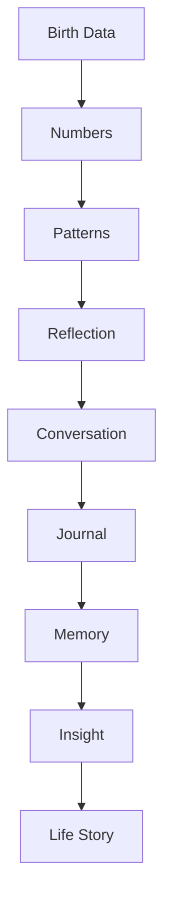
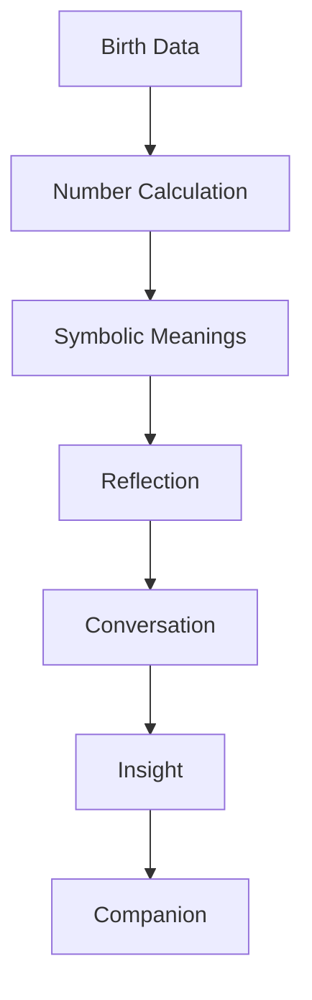

# MODULE 15 — NUMEROLOGY EXPERIENCE

---

## 1. Product Goals

**Business Goals**: Numerology is the fastest, lowest-setup-cost Discovery system in the ecosystem (Module 2, Section 3) — only a name and birthdate required — making it an especially strong early-activation tool for new users still setting up deeper systems like Natal Chart.

**Discovery Goals**: give users a distinct, pattern-oriented reflective lens that doesn't overlap with the other three Discovery systems (Section 2's positioning) — numbers as a way of noticing recurring patterns across a life, not a situation-specific reading (Tarot), an identity map (Natal Chart), or a time-based seasonal frame (Eastern Horoscope).

**Reflection Goals**: help someone notice a pattern worth paying attention to — never assign them a personality type or predict an outcome.

**Relationship Goals**: identical standing pattern to every other Discovery system — every number exists to open a Companion conversation, never to stand alone.

**Memory Goals**: core numbers (Life Path, Expression, Soul Urge, Personality, Birthday — Section 4) are permanent, durable Identity-type memory anchors, similar in durability to Natal Chart placements.

**Trust Goals**: numerology carries the highest "pseudoscience"/parlor-trick association of all four Discovery systems for skeptical users — this module's discipline against personality-typing and lucky-number superstition (Section 11) has to be the strictest of all four to avoid confirming that association.

**Retention Goals**: like Natal Chart, a depth-over-frequency model — core numbers are calculated once and revisited meaningfully over time, not a daily ritual.

**AI Goals**: interpret, reflect, connect, ask — never predict, never define identity, never assign personality. The user owns their story.

---

## 2. Numerology Philosophy

**Why Numerology exists**: to give a person a distinct, pattern-based symbolic lens — numbers derived from a name and birthdate as a frame for noticing recurring qualities and tendencies across a life, positioned specifically as *reflection by patterns*, distinct from the other three Discovery systems' roles (Section 2's Discovery Consistency mapping, restated below).

**Patterns over labels**: a number describes a pattern worth exploring, never a category someone belongs to ("Life Path 7" is not a personality type).

**Meaning over certainty**: the value of a number is the meaning a person constructs by reflecting on it, not a claim about numerical mechanism or metaphysical truth.

**Symbols over facts**: numbers here are symbolic material, not empirical evidence about anyone.

**Reflection over prediction**: identical standing principle across all Discovery modules — a number never asserts what will happen.

**Growth over destiny**: framing stays oriented toward what's worth growing through or paying attention to, never a fixed life-path guarantee (notably, even though this system's most prominent number is literally called "Life Path," the product is careful never to let that name imply a determined route).

**Numerology's distinct role among the four Discovery systems**:
- Tarot = reflection by *situation* (Module 12)
- Natal Chart = reflection by *identity* (Module 13)
- Eastern Horoscope = reflection by *time* (Module 14)
- **Numerology = reflection by *pattern*** — noticing recurring symbolic qualities across a life's whole shape, distinct from a single situation, a birth-moment identity map, or a seasonal cycle.

**The standing creed** (governs every design decision in this module):
> **Numbers are symbols. Not evidence. Patterns invite reflection. Not conclusions. Meaning is created. Not assigned. Growth matters more than certainty. The user owns every interpretation.**

---

## 3. Discovery Lifecycle



**Birth Data**: full birth name and birthdate — reused from Natal Chart/Eastern Horoscope setup if already available (Module 3's single-input-collection principle), collected fresh only if this is the user's first Discovery system.

**Numbers**: the deterministic calculation (Section 17) of the core numbers (Section 4).

**Patterns**: the symbolic qualities associated with each number and, where genuinely present, patterns across multiple numbers (e.g., a repeated digit across Life Path and Expression) — fixed reference content, not yet personalized interpretation.

**Reflection**: the AI's personalized connection of these patterns to the user's actual life (Section 6).

**Conversation → Journal → Memory → Insight → Life Story**: identical structural pipeline to every other Discovery system, feeding the same shared Companion and Memory systems (Modules 9/10).

---

## 4. Experience Structure

| Section | What it covers |
|---|---|
| **Overview** | A calm, single-glance summary of the core numbers |
| **Life Path Number** | Derived from birthdate — the broadest, most central number; framed as a pattern worth exploring across a lifetime, never a fixed route |
| **Expression Number** | Derived from full birth name — associated with how someone tends to express/act in the world |
| **Soul Urge Number** | Derived from the vowels in a birth name — associated with inner motivations and desires |
| **Personality Number** | Derived from the consonants in a birth name — associated with how someone tends to come across to others |
| **Birthday Number** | The day-of-month component — a smaller, specific supporting pattern |
| **Current Cycles** | Time-bound numerological cycles (e.g., a "Personal Year" number) — the one section with an annual cadence, paralleling Eastern Horoscope's structure |
| **Growth Themes** | Reflectively framed potential growth areas across the numbers, same non-diagnostic care as Natal Chart's Growth Areas |
| **Life Domains** | Cross-references numbers with the user's actual stated life content (Memory/Journal) |
| **Reflection Summary** | A synthesized, personalized reflection connecting multiple numbers into a coherent (but appropriately humble) pattern-level observation |
| **Deep Dive** | Master Numbers, calculation methodology, and deeper traditional detail for users wanting it |

**Why this order**: mirrors the progressive-disclosure structure established by Natal Chart (Module 13, Section 4) — Overview first, most-synthesized/technical content (Reflection Summary, Deep Dive) last — while keeping the five core numbers as clearly separated, individually digestible sections rather than one dense combined readout.

---

## 5. Numerology Experience

**Overview**: a calm visual summary (Module 4's illustration style) — the five core numbers presented plainly, without decorative numerological iconography (no glowing digits, no "mystical number" visual clichés).

**Calculation**: near-instant (simple arithmetic reduction, Section 17) — the fastest generation moment of any Discovery system.

**Visualization**: numbers presented with quiet, minimal typographic emphasis (leaning on Module 4's IBM Plex Mono utility typeface for the numbers themselves, per the Design System's existing role assignment for structured/data content) rather than ornate numerological symbol art.

**Navigation**: Overview entry point, progressive disclosure into individual number sections (Section 4).

**Interaction**: tap any number for its traditional symbolic meaning plus the option for personalized interpretation (Section 6) — the same established pattern across all Discovery modules.

**Progressive disclosure**: Overview → individual core numbers → Current Cycles/Growth Themes → Reflection Summary → Deep Dive.

**Emotion**: minimal, grounded, quietly precise — this system's emotional register is the calmest and most understated of the four Discovery systems, matching its symbolic register (clean numbers) rather than a more visually rich astrological or card-based system.

---

## 6. AI Interpretation Engine

**How AI interprets**: connects fixed traditional number meanings (Section 18) to the user's actual context (Memory/Journal, Section 9) — identical architectural pattern to every other Discovery system.

**How AI avoids deterministic language**: tendency/pattern framing exclusively ("this number often points to...", "a pattern worth noticing might be...") — never "you are a [number]" labeling, the single most important discipline in this module given numerology's strong cultural association with personality-typing (Section 11).

**How AI explains symbolic meaning**: explicitly frames a number's meaning as symbolic material for reflection, not a fact about the person — "this number is traditionally associated with X — take that as one lens, not a verdict."

**How AI connects patterns to real life**: grounds interpretation in the user's actual stated life content wherever a genuine connection exists (Section 9), exactly as with the other three systems.

**How AI asks reflective questions**: exactly one genuine question per interpreted section, matching the established restraint pattern.

**Example** (Life Path 7, no specific prior context yet):
> "Life Path 7 is often associated with a pull toward depth and introspection — sometimes at the cost of feeling a bit separate from others. Does a need for solitude or deep thinking feel like a real pattern in your life, or does that not quite land?"

**Why this example works**: no "you are a 7, which means..." label; names a traditional association explicitly as one lens; includes a genuine, honest counterpoint (the "cost" side) rather than only flattering language; ends with an open, falsifiable question the user can genuinely disagree with.

---

## 7. Companion Interaction

**How Numerology starts conversations**: identical bridging pattern to every other Discovery system — each interpreted section ends with a natural Companion invitation.

**How Companion deepens reflection**: because core numbers are durable (Section 3), the Companion can reference them across many future conversations, the same durability logic as Natal Chart placements (Module 13, Section 7).

**How Companion remembers**: core numbers become high-durability Identity-type memory nodes (Section 8); Current Cycles content (time-bound) is treated with lower durability, archived at cycle transition, matching Eastern Horoscope's identical pattern for annual content (Module 14, Section 8).

**How Companion follows up**: naturally, when genuinely relevant, per Module 9, Section 7's context hierarchy — never a scheduled "let's revisit your numbers" nag.

---

## 8. Memory Interaction

**What becomes memory**: the five core numbers (Section 4) stored once as Identity-type memory nodes, high durability; Current Cycles content stored as time-bound memory, naturally archived at cycle transition; Reflection Summary-level synthesized patterns stored similarly to Natal Chart's Identity Themes; any personal disclosure from resulting conversation follows the standard significance pipeline.

**What never becomes memory**: generic traditional meaning text itself (static reference content); the raw calculation process (arithmetic steps are not memory-worthy, only the resulting number and the user's response to it).

**Reflection history**: which numbers/sections a user has actually engaged with meaningfully (vs. just viewed), tracked for future Companion reference and Deep Dive recommendation (Section 12).

**Identity evolution**: same Update mechanism as Natal Chart (Module 13, Section 9) — a user's relationship to a given number's pattern can shift over time even though the number itself never changes.

**Example**:
- Stored (Identity-type, high durability): "Life Path 7 — resonates with a pull toward introspection, sometimes at the cost of feeling separate from others."
- Stored (from resulting conversation): "Connects this to a pattern of pulling back from group settings at work, even when part of them wants more connection."

---

## 9. Personalization Engine

**Relationship stage**: gates interpretive depth/confidence, identical pattern to every other Discovery system.

**Memory**: primary personalization signal.

**Journal**: secondary supporting context.

**Tarot / Natal Chart / Eastern Horoscope**: where a genuine cross-system resonance exists (e.g., a Natal Chart Identity Theme and a Life Path pattern pointing the same direction), the Companion can note the connection — this product's four Discovery systems are designed as cross-referenceable inputs into one Companion relationship, never siloed experiences.

**Life events**: recent significant memories inform which Life Domain feels most relevant to surface first.

**User growth**: tracked identically to Natal Chart's Identity Evolution.

---

## 10. Pattern Reflection Engine

**How numbers become reflection**: the AI Interpretation Engine (Section 6) transforms a fixed number meaning into a question about the user's own experience — the "Life Path 7" example (Section 6) is the clearest illustration of this transformation.

**How reflection becomes insight**: recurring engagement with a number's pattern across conversations/Journal entries escalates through Module 10's shared Insight Engine, identical mechanism to every other Discovery module.

**How insight becomes growth**: once a pattern is well-established and user-confirmed, future interpretations can acknowledge movement/change relative to it (Section 9's "user growth" personalization) — the same "identity evolves even though the number doesn't" logic as Natal Chart.

---

## 11. Ethics Philosophy

**No prediction**: no number is ever framed as predicting a future event.

**No labeling**: the AI never says "you are a [number]" — always pattern/tendency language.

**No personality typing**: this is the single most important, most heavily enforced rule in this module specifically — numerology's most common commercial failure mode is exactly the kind of rigid, MBTI-style personality-typing this product explicitly and repeatedly rejects across every number and every interpretation.

**No manipulation**: no interpretation is engineered to create anxiety or urgency in service of engagement or upsell.

**No authority**: the AI's interpretation is never positioned as more valid than the user's own sense of themselves.

**No dependency**: like Natal Chart, this module's depth-over-frequency design (Section 1) is itself a structural safeguard.

**Respect beliefs**: no position taken on numerology's literal validity; serves skeptical and invested users equally.

**Transparency**: every interpretation is clearly AI-generated, clearly framed as one possible reading, grounded in real fixed calculation and reference content the user can always see plainly (their own numbers, not just AI prose).

---

## 12. Numerology Timeline

**Number history**: a simple record of when each core number was first calculated (typically once, given their permanence) and any Current Cycle transitions over time.

**Reflection history**: which numbers/sections led to genuine Companion conversation or Journal entries — the "richer" subset, matching the pattern established across all Discovery modules.

**Growth history**: tracked per Section 10 — how the user's engagement with a given number's pattern has evolved.

**Life domains**: cross-referenced view showing which life areas have been explored most/least via numerological reflection.

**Search**: same shared embedding index enabling natural-language search across numerology-related content.

---

## 13. Loading Experience

| Moment | Emotion |
|---|---|
| **Calculation** | Near-instant, minimal loading state needed given the simplicity of the arithmetic |
| **Visualization** | Brief skeleton loading (Module 4) before the Overview renders |
| **Interpretation** | Labeled AI Thinking state, per-section |
| **Reflection** | Standard Companion streaming |

---

## 14. Error Experience

| Failure | Behavior | Recovery |
|---|---|---|
| **Birth data missing** (name or birthdate) | Prompted only at this system's specific entry point; reused automatically if already collected via another Discovery system | Direct entry if not already available |
| **Calculation failure** (unlikely given simple arithmetic, but possible for malformed name input, e.g., non-Latin-script names needing transliteration handling) | Calm, honest error state explaining what's needed (Section 17 addresses transliteration handling directly) | Corrected input retried immediately |
| **AI unavailable** | Falls back to static traditional meaning text for the section being viewed | Retry for full personalized interpretation |
| **Offline** | Cached numbers/visualization viewable offline once generated once; personalized interpretation requires connectivity | Module 4's standard Offline pattern |

---

## 15. Analytics

**Reflection completion**: whether generated number interpretations are actually opened/read.

**Conversation continuation**: the primary success metric, identical framing to every other Discovery module.

**Journal continuation**: whether numerology engagement leads to Journal entries.

**Memory usefulness**: whether numerology-derived memories are engaged with positively when surfaced later.

**Retention**: evaluated on a depth-over-frequency basis, matching Natal Chart's identical model.

**KPIs**: % of number interpretations leading to Companion conversation (primary); numerology-derived memory engagement rate over the following 90 days (mirroring Natal Chart's durable-memory-anchor validation KPI, Module 13, Section 15).

---

## 16. Edge Cases

**Changing beliefs**: identical handling to Natal Chart/Eastern Horoscope — the respectful, non-deterministic framing serves users at any point on the belief spectrum.

**Repeated calculations** (a user re-entering slightly different name spellings to see different numbers): the product doesn't discourage this outright, but the AI can gently note if a user seems to be searching for a "better" result rather than reflecting ("noticing you've tried a couple of versions of your name — want to talk through what you're hoping to find, or just explore this version for now?") — a light, non-judgmental version of Tarot's "obsessive readings" caution (Module 12, Section 16).

**Sensitive identity questions**: Module 9, Section 13's Safety Philosophy applies identically; Growth Themes (Section 4) are specifically framed (Section 11) to never read as a diagnosis or flaw.

**Money / Career / Relationships / Health**: identical reflective-only, non-directive treatment as every other Discovery module, with Module 9, Section 13's medical/financial-guidance boundaries applying without exception.

---

## 17. Technical Specification

**Calculation engine**: standard Pythagorean numerology reduction rules (summing digits, letter-to-number mapping for name-based numbers) — deterministic, versioned, covered by its own correctness test suite, never AI-generated or approximated.

**Master Numbers**: 11, 22, and 33 are recognized as unreduced "Master Numbers" per standard numerological convention, with their own distinct fixed meanings (Section 18) rather than being collapsed into their reduced single-digit equivalents — a specific, documented rule the calculation engine must implement correctly.

**Reduction rules**: documented digit-summing algorithm for each core number type (Life Path from birthdate, Expression/Soul Urge/Personality from name letters via the standard letter-to-number table), with explicit, tested handling for Master Number exceptions.

**Name/transliteration handling**: for names not in the Latin alphabet, or with diacritics, a documented, tested transliteration approach is required (Section 14's error case) — this is flagged as a genuine technical requirement needing explicit design attention, not an assumption that ASCII-only input handling suffices for a global product.

**Interpretation pipeline**: identical architectural pattern to every other Discovery system — computed numbers plus personalization context passed to the Companion AI service, no separate "Numerology AI."

**Prompt architecture**: a dedicated Numerology prompt layer alongside Module 9's existing layers, constraining language to pattern/tendency framing (Section 6) and explicitly, strongly instructed against personality-typing language (Section 11's highest-priority rule for this module) — this constraint should be tested more aggressively than any other Discovery module's language constraint, given numerology's strongest real-world tendency toward exactly that failure mode.

**API**: `POST /numerology/generate` (name, birthdate, reused if available) → returns all core numbers; `GET /numerology/interpret/:section` → personalized interpretation, streamed.

**Database**: `numerology_profile(id, user_id, life_path, expression, soul_urge, personality, birthday_number, birth_name, birth_date, created_at)` (computed once) plus `personal_cycle(id, user_id, cycle_year, personal_year_number, created_at)` for the time-bound Current Cycles data (Section 4/8).

**Caching**: profile data cached indefinitely; Current Cycle data cached per cycle-year, regenerated at transition.

**Queues**: memory evaluation from resulting conversation rides the standard BullMQ pipeline; calculation itself is synchronous given its simplicity.

**Frontend**: Overview/number-display component using Module 4's IBM Plex Mono for the numbers themselves (Section 5), Experience Structure navigation matching the established Discovery-module pattern.

---

## 18. Symbol Interpretation Engine

**Numbers**: fixed traditional meanings for digits 1–9 — curated reference content, explicitly reviewed against personality-typing language (Section 11).

**Master Numbers**: fixed traditional meanings for 11, 22, 33 — curated reference content, distinct from their reduced-digit equivalents.

**Cycles**: fixed traditional meaning for Personal Year numbers (Current Cycles, Section 4) — curated reference content, recalculated annually.

**Patterns**: AI-synthesized observations across multiple numbers (Reflection Summary, Section 4) — the genuinely generative layer, held to the same proportional-evidence discipline as Natal Chart's Identity Theme synthesis (Module 13, Section 18) — only synthesized when multiple numbers coherently suggest a shared pattern, never manufactured from a single number dressed up as a broader synthesis.

**Life Domains**: cross-reference between number meanings and the user's actual Memory/Journal content.

**Memory/Journal**: personalization context sources, identical role to every other Discovery module's engine.

**Reasoning model summary**:
```
function interpretNumber(numberType, value, userContext):
    baseMeaning = lookupFixedMeaning(numberType, value)  # never invented,
    # includes Master Number exception handling

    relevantMemory = getMostRelevantMemory(userContext)  # singular

    interpretation = connect(baseMeaning, relevantMemory or "general reflection")
    # always pattern/tendency framing, explicitly never "you are" labeling

    closingQuestion = generateOneGenuineQuestion(interpretation)

    return { baseMeaning, interpretation, closingQuestion, companionEntryPoint: true }

function synthesizePatternSummary(allNumbers, userContext):
    # only when multiple numbers coherently point to a shared pattern
    # held to the same stricter evidentiary bar as Natal Chart's Identity Themes
    ...
```

---

## 19. Numerology Reasoning Pipeline



Maps to Section 18's reasoning model and Section 3's lifecycle — Number Calculation and Symbolic Meanings lookup are always deterministic and fixed-reference-based, never AI-generated, the same architectural guarantee established for every other Discovery system, applied here to make "numbers are symbols, not evidence" enforceable rather than aspirational.

---

## 20. UX Specification

**Desktop/Tablet/Mobile**: consistent structure across breakpoints, matching the established Discovery-module pattern.

**Visualization**: minimal, typographically-led (Section 5) — the simplest visual treatment of the four Discovery systems, appropriately matching its underlying symbolic register (clean numbers rather than rich imagery).

**Animations**: standard Module 4 timing; no extended reveal moment needed given the near-instant calculation and the module's deliberately minimal emotional register.

**Accessibility**: full text-equivalent for all number displays (already inherently text-based, simplifying this requirement relative to Natal Chart/Eastern Horoscope's visual wheels).

**Navigation**: Overview → individual core numbers → Current Cycles/Growth Themes → Reflection Summary → Deep Dive.

**Reading flow**: Birth Data (or reused) → Number Calculation → Overview → deeper sections → Companion invitation.

---

## 21. QA Checklist

- **Calculation accuracy**: verify digit-reduction and Master Number exception logic against known reference calculations for all five core number types.
- **Interpretation**: verify pattern/tendency language exclusively — zero "you are a [number]" labeling anywhere (the single most aggressively tested linguistic constraint in this module, given the standing Discovery Consistency requirement to avoid personality-typing).
- **Reflection**: verify Reflection Summary synthesis only fires with genuine multi-number coherence, not from a single number dressed up as broader synthesis.
- **Memory**: verify permanent core-number data and time-bound Current Cycle data are correctly distinguished and archived appropriately.
- **Frontend**: verify number display renders correctly and legibly across breakpoints using the correct typographic role (Module 4's IBM Plex Mono).
- **Backend**: verify transliteration handling for non-Latin-script and diacritic-containing names (Section 17).
- **Accessibility**: verify full screen-reader support.
- **Performance**: verify near-instant calculation performance is maintained.
- **Analytics**: verify Conversation-continuation tracking (Section 15) is correctly instrumented as the primary success metric.

---

## 22. Future Expansion

**Personal Year**: already specified as the Current Cycles section (Section 4) — flagged here only to confirm it's covered, not a gap.

**Monthly Cycles**: a finer-grained extension of Personal Year, deferred until the annual cadence's value is validated.

**Compatibility**: requires dual-consent architecture, same standing caution as every other module.

**Family Numbers**: same multi-consent caution.

**Voice Interpretation**: deferred alongside Module 9's Voice Companion prerequisite.

**Reflection Reports**: delivered through the existing Reports module (Module 1), not a new standalone feature.

**AI Pattern Explorer** (a more open-ended tool for exploring cross-number/cross-system patterns interactively): a plausible longer-term idea, but must be designed carefully against the same personality-typing risk (Section 11) that governs every other part of this module — an interactive "explorer" framing could easily drift toward feeling like a quiz/typing tool if not deliberately designed against that pull.

**Life Timeline**: delivered through Reports, consistent with every other module's identical note.

---

## 23. Final Decisions

**Chosen Numerology Model**
A deterministic Pythagorean numerology calculation engine (with explicit Master Number handling and documented transliteration support, never AI-approximated), paired with a fixed, curated symbolic-meaning reference database, personalized through the same single-most-relevant-memory pattern as every other Discovery system, always rendered in pattern/tendency language with an explicit, aggressively-enforced prohibition on personality-typing phrasing — positioned distinctly as "reflection by pattern" among the four Discovery systems, with a depth-over-frequency retention model matching Natal Chart's.

**Rejected Alternatives**
- Personality-typing-style interpretation ("Life Path 7s are introspective people") — rejected outright as the single most important, most explicitly named anti-pattern for this specific module, given numerology's strong real-world association with exactly this failure mode.
- Lucky-number content or numerical "scoring" — rejected identically to Eastern Horoscope's lucky-color/number rejection (Module 14), consistent across all Discovery modules that could tempt toward superstition-adjacent content.
- A daily-engagement cadence — rejected in favor of depth-over-frequency, matching Natal Chart's identical reasoning (a permanent, one-time-calculated set of numbers doesn't need daily re-engagement to remain valuable).
- Allowing Reflection Summary synthesis from a single number — rejected in favor of requiring genuine multi-number coherence, matching Natal Chart's Identity Theme discipline.
- Treating Numerology as redundant with Natal Chart (both being "identity" systems) — rejected via the explicit Discovery Consistency positioning: Numerology is reflection by *pattern*, distinct from Natal Chart's reflection by *identity*, preserving a clear, non-overlapping role for each of the four Discovery systems.

**Trade-offs**
The minimal, typography-led visual treatment (Section 5/20) trades some of the visual richness the other three Discovery systems offer (card art, chart wheels, elemental cycles) for a cleaner match to numerology's inherently abstract, numeric symbolic register — accepted because forcing a more decorative visual treatment onto numbers would risk exactly the "mystical for entertainment" failure mode this module's Design Requirements explicitly warn against.

**Reasons**
Every decision in this module operationalizes the standing creed — numbers are symbols, not evidence; patterns invite reflection, not conclusions; meaning is created, not assigned; growth matters more than certainty; the user owns every interpretation — while occupying a clearly distinct, non-overlapping role among the four Discovery systems and routing all actual product value through the same Companion and Memory systems established in Modules 9 and 10.

---

**Next module in sequence: Reports.**
