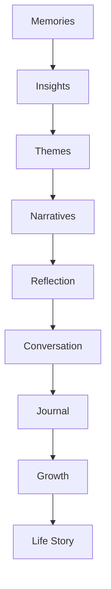
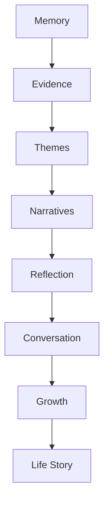

# MODULE 16 — REPORTS EXPERIENCE

---

## 1. Product Goals

**Business Goals**: Reports is the module where the entire Memory Moat (Module 2) becomes visible as a felt, human artifact — this is the single strongest proof point of the whole business thesis, and the clearest, most legitimate context for the Premium paywall moment (Module 2, Section 8).

**Reflection Goals**: help someone see their own change and growth over time in a way that feels earned and specific, not generic.

**Narrative Goals**: turn accumulated memory into genuine narrative — a story with a shape, not a list of facts.

**Relationship Goals**: Reports should feel like the Companion showing, not just telling, that it has been paying attention across the whole relationship — the ultimate expression of Module 9's core thesis ("it understands me").

**Memory Goals**: Reports is the primary consumer of the full Insight Engine escalation (Module 10, Section 11) — it exists specifically at the Life Story stage of that ladder, and shouldn't attempt to manufacture that stage prematurely from insufficient evidence.

**Trust Goals**: every claim in a Report must be traceable to real evidence (Section 8/18) — this module carries the single highest hallucination-risk profile in the product, since it synthesizes across the largest amount of accumulated content, and must be held to a correspondingly higher evidentiary bar than any single-turn Companion response.

**Retention Goals**: Reports is the clearest, most legitimate long-term-retention artifact in the product — success is a user who feels their history is being kept faithfully, not a user checking a dashboard.

**AI Goals**: summarize, connect, reflect, narrate, ask — never invent memories, never fabricate stories, never exaggerate. Always explain evidence.

---

## 2. Reports Philosophy

**Why Reports exist**: to periodically transform the memory graph (Module 10) into something a person can actually read and feel — a narrative, not a database export. Reports are where the entire product's accumulated understanding becomes tangible.

**Stories over statistics**: a Report describes what happened and what it meant, never a count of how many times something happened.

**Meaning over metrics**: no report ever leads with a number ("you journaled 12 times this month") — it leads with what that engagement actually revealed about the person.

**Growth over productivity**: Reports track change and growth, never output or activity volume — this is the single most important distinction separating this module from a habit-tracker or analytics dashboard, and the primary anti-pattern named throughout this module's Quality Requirements.

**Reflection over tracking**: the purpose of looking back is to understand, not to monitor or measure compliance with some implied standard.

**Memory over logs**: a Report draws from the significance-weighted Memory graph (Module 10), never a raw activity log — this is why Reports can only exist where genuine memory density and quality already exist (Section 8's evidence thresholds), not on a fixed calendar schedule regardless of what's actually there.

**The standing creed** (governs every design decision in this module):
> **Every story deserves evidence. Every memory deserves context. Growth deserves recognition. Pain deserves compassion. Nothing is invented. The user owns the final story.**

---

## 3. Report Lifecycle



**Memories**: the raw, significance-weighted content already accumulated in Module 10's Memory graph — Reports never operates on anything other than what's already there.

**Insights**: Theme/Pattern-level content already escalated through Module 10's Insight Engine — Reports consumes this escalation ladder, it doesn't run a separate one.

**Themes**: the specific recurring content Reports selects to narrate around for a given report period (Section 4's report types), chosen by genuine evidentiary weight (Section 18), not by what would make the "best story."

**Narratives**: the actual written synthesis — where Themes become readable prose, always attributed back to specific evidence (Section 6).

**Reflection**: the Companion's framing of the narrative as an invitation to reflect further, not a final verdict (matching every other module's standing non-authority principle).

**Conversation → Journal**: identical bridging pattern to every Discovery module — a Report should open further conversation and reflection, never stand as a closed, complete artifact with nothing left to explore.

**Growth**: the user's continued engagement with the report's themes over subsequent weeks feeds back into the Memory/Insight system, closing the loop.

**Life Story**: the accumulated, longitudinal effect of many reports over years — the full realization of Module 1's Vision.

---

## 4. Report Structure

| Type | Cadence | What it covers |
|---|---|---|
| **Daily Reflection** | Optional, lightweight | A brief, same-day narrative thread if genuinely warranted — not a forced daily habit (most days, no Daily Reflection is generated at all, consistent with Module 8's singularity/never-overwhelm principle) |
| **Weekly Reflection** | Weekly, if warranted | A short narrative of the week's most significant thread(s) |
| **Monthly Reflection** | Monthly | The first cadence with reliable enough density (Module 1's sequencing) to feel genuinely earned rather than synthetic |
| **Quarterly Review** | Quarterly | A broader narrative connecting several months' themes |
| **Yearly Review** | Annually | The most substantial standing report type — a full year's narrative arc |
| **Life Chapters** | As they emerge, not scheduled | Longer-horizon narrative segments the Insight Engine has identified as coherent "chapters" (e.g., "the period around your job change") |
| **Relationship Report** | On demand / periodic | A narrative specifically about a tracked relationship thread over time |
| **Learning Report** | On demand / periodic | A narrative about how the user's understanding of a specific topic/pattern has developed |
| **Growth Report** | Periodic | Focused specifically on Growth Theme evolution (from Natal Chart/Numerology/Tarot's Growth Areas/Themes, Modules 12/13/15) |
| **Memory Highlights** | Ongoing, lightweight | A rotating set of specific, well-evidenced individual memories worth resurfacing, distinct from a full narrative report |
| **Insight Summary** | Periodic | A more concise, list-adjacent (but still narrative, never bulleted-stats) summary of recent Pattern/Identity-level insights |
| **The Best Moments** | Periodic, especially annual | A warm, specific narrative of genuinely positive, celebratory memories |
| **Lessons Learned** | Periodic | A narrative specifically about difficulty that led to growth, handled with the compassion the creed requires |
| **Unfinished Stories** | Ongoing | Threads the Companion has noticed remain open/unresolved — an invitation to revisit, never a nagging "incomplete" flag |
| **Future Reflection** | Occasional | A forward-looking narrative connecting past growth to what might be worth paying attention to next — reflective, never predictive (consistent with every Discovery module's standing anti-prediction rule) |
| **Deep Dive** | On demand | Full evidence trail for any given report — every memory/insight a narrative drew from, shown transparently |

**Why so many types without becoming overwhelming**: exactly one report is ever surfaced as "ready" at a time on Dashboard (Module 8, Section 10's singularity rule), regardless of how many types could theoretically be generated — this table is the vocabulary the underlying engine chooses from, never a menu the user browses through at will on a given day.

---

## 5. Reports Experience

**Overview**: a calm entry point listing available reports chronologically, not a dense archive-browser — matching Module 4's Calm First principle at the module's own top level.

**Timeline**: the Life Timeline (Section 12) as the primary long-horizon navigation structure.

**Cards**: individual reports rendered as Report Cards (Module 4, Section 5) — locked/free-tier variants show genuine partial value (Module 4's anti-artificial-scarcity rule), never a fully obscured teaser.

**Stories**: the actual narrative content — read as prose, in the Companion's own first-person voice (Module 4, Section 11's content rule — a Report is the Companion's synthesis, written as such, not a separate analytics product's voice).

**Highlights**: Memory Highlights (Section 4) rendered as the lightest-weight report artifact, distinct from full narrative reports.

**Navigation**: Overview → individual report → Deep Dive (evidence trail) if wanted, matching the progressive-disclosure pattern established across every other module.

**Interaction**: reading is the primary interaction; a "discuss this with your Companion" action is always present at the end of a report (Section 7); Deep Dive evidence is tap-through, optional.

**Emotion**: warm, personal, hopeful — even when narrating difficulty (Section 16), the emotional register stays compassionate and growth-oriented, never clinical or corporate.

---

## 6. AI Narrative Engine

**How AI creates reports**: selects genuinely well-evidenced Themes (Section 18) for the given report period/type, then synthesizes them into first-person Companion prose — never a bulleted list of facts dressed up as narrative.

**How AI summarizes**: condenses without losing the specific, real detail that makes a narrative feel earned — a summary that could apply to anyone is a failed summary in this module specifically.

**How AI finds themes**: reuses Module 10's Insight Engine escalation exactly — a report never surfaces a "theme" the underlying Memory system hasn't already independently identified through its normal Theme/Pattern evidentiary process (Section 8).

**How AI avoids hallucination**: the single most important technical discipline in this module — every sentence in a narrative must be traceable to an actual retrieved memory or Journal entry; the generation step is constrained (Section 17's prompt architecture) to only narrate from provided, retrieved evidence, identical in spirit to Module 9's memory-grounding rule but applied at a larger, cross-memory synthesis scale where the risk is correspondingly higher.

**How AI explains evidence**: every narrative claim is paired, on Deep Dive tap-through, with the specific memory/Journal entry/conversation it draws from (Section 12) — nothing in a Report should ever feel like an assertion with no visible source.

**How AI tells stories**: with genuine narrative shape (a beginning, a turn, a current state) rather than a flat chronological recitation — but the "story" is always the shape the evidence itself supports, never an embellished or dramatized version of it.

**Example** (Monthly Reflection excerpt):
> "This month had a real thread running through it — starting the new job you were nervous about, and slowly finding your footing. You mentioned early on wondering if you'd be good enough at it; a few weeks later, you were already describing feeling steadier. That's worth noticing — not because the nervousness disappeared, but because you moved through it."

**Why this example works**: specific, evidence-grounded claims (an actual disclosed feeling, an actual later update) rather than generic praise; explicitly names the arc (nervous → steadier) rather than just stating a mood; ends on a growth-recognizing note without exaggeration ("worth noticing," not "you conquered your fears").

---

## 7. Companion Interaction

**How reports create conversations**: every report ends with a natural, specific invitation to discuss it with the Companion (Section 5) — never a "you're all caught up!" dead end.

**How Companion expands reports**: in the resulting conversation, the Companion can go deeper into any specific thread the report surfaced, using the report's content as available context (Module 9, Section 7's hierarchy — reports sit at a similar tier to Discovery-system content, supporting but not overriding live conversation).

**How Companion asks questions**: a report's closing invitation includes one genuine, open question ("does that feel like an accurate picture of the month, or is there something it's missing?") — explicitly inviting correction, not just agreement, consistent with the creed's "the user owns the final story."

**How Companion remembers previous reports**: past reports themselves can be referenced in future ones and in ordinary conversation (e.g., a Yearly Review can reference themes first identified in an earlier Monthly Reflection) — reports become part of the Life Archive's own history, not disposable one-off documents.

---

## 8. Memory Interaction

**What reports use**: only content already present in the Memory graph, Journal, Discovery-system engagement, and Companion conversation history — nothing external, nothing invented.

**What reports never invent**: a story element, a quote, a specific detail not actually present in the underlying evidence — this is the hardest, most non-negotiable rule in this entire module.

**Evidence thresholds**: a given report type (Section 4) only generates once its minimum evidentiary bar is met (Section 18) — e.g., a Monthly Reflection requires genuine memory density for that month; if a month was sparse, the system simply doesn't generate a report rather than manufacturing one from thin material (Section 16's Sparse Memories edge case).

**Memory confidence**: reused directly from Module 10's Confidence Score (Section 19 there) — low-confidence memories are weighted down or excluded from narrative synthesis, since a narrative built on shaky evidence compounds the risk of an inaccurate story.

**Examples**:
- Correctly used: a specific, high-confidence, high-significance memory node with a clear timestamp and source.
- Correctly excluded: a low-confidence, ambiguous memory (e.g., something sarcastic that may have been misclassified) — excluded from narrative synthesis even if technically present in the graph, until/unless later reaffirmed.

---

## 9. Personalization Engine

**Relationship stage** (Module 9, Section 3): gates report depth and directness — a Getting-to-Know-stage user's first Monthly Reflection stays more modest in scope; a Long-term Companion-stage user's Yearly Review can draw much richer cross-time connections.

**Memory / Journal**: the primary raw material for every report.

**Tarot / Natal Chart / Eastern Horoscope / Numerology**: all four Discovery systems' accumulated engagement feed into relevant report types (Growth Report drawing on Natal Chart/Numerology Growth Themes; a Report noting Tarot's recurring-card patterns; Eastern Horoscope's annual themes feeding the Yearly Review) — Reports is explicitly the convergence point where every other module's output becomes one coherent narrative (Section 2's Discovery Consistency framing, restated here).

**Learning history**: which report types/themes a user has engaged with meaningfully in the past informs which report type is generated/prioritized next.

**Life events**: significant Memory-type Life Events (Module 10, Section 4) are the strongest single signal for what a given report period's central narrative thread should be.

**Growth**: Identity Evolution tracking (Modules 13/15) directly feeds Growth Report and Lessons Learned content.

---

## 10. Narrative Engine

**How memories become stories**: the AI Narrative Engine (Section 6) selects evidenced Themes and synthesizes them into first-person prose with genuine shape — this transformation from "a pile of memory nodes" to "a story with a beginning, a turn, and a current state" is this module's entire value proposition.

**How stories become reflection**: the Companion's closing invitation (Section 7) turns a completed narrative into an open question, preventing it from being received as a closed, final verdict.

**How reflection becomes insight**: continued engagement (further conversation, Journal entries responding to a report) feeds new content back into Module 10's Insight Engine, which can in turn inform the next report — a genuinely closed loop, not a one-way broadcast.

**How insight becomes growth**: over years, the accumulated sequence of reports itself becomes visible evidence of change — a user can look back at how their own Yearly Reviews have evolved, which is the ultimate, most concrete expression of Module 1's entire retention thesis.

---

## 11. Ethics Philosophy

**No fake memories**: every narrative element must trace to real, retrieved evidence (Section 8) — the single hardest constraint in this module.

**No invented stories**: no dramatization, no embellished quotes, no invented specific details beyond what's actually recorded.

**No manipulation**: no report is engineered to create anxiety, urgency, or guilt in service of engagement or a premium upsell.

**No guilt**: a report never frames inactivity, missed journaling, or unresolved threads as something the user should feel bad about — "Unfinished Stories" (Section 4) are framed as open invitations, never as a shortcoming.

**No productivity pressure**: reports never imply the user should have done more, journaled more, or engaged more — this is the single most heavily enforced rule in this module given how easily a "reflection report" can accidentally read as a performance review.

**No authority**: a report's narrative is always offered as the Companion's best synthesis, explicitly revisable by the user (Section 7's closing question) — never presented as the definitive account.

**Transparency**: every narrative claim is traceable via Deep Dive (Section 12) to its actual source.

**Evidence**: the standing, non-negotiable requirement underlying every other rule in this section — a Report without sufficient evidence simply isn't generated (Section 8's thresholds), rather than being generated anyway with weaker guarantees.

---

## 12. Life Timeline

**Life Chapters**: longer-horizon narrative segments (Section 4), identified only when the Insight Engine has genuinely escalated content to that level (Module 10, Section 11) — never manufactured to give the Timeline a more complete-feeling structure.

**Major Moments**: high-significance Life Event-type memories (Module 10, Section 4/5), surfaced as timeline anchor points.

**Important Memories**: the broader set of high-confidence, high-significance memories underlying the Timeline, browsable via the same Memory Timeline pattern established in Module 10, Section 21.

**Turning Points**: specifically flagged where a Life Chapter's narrative shape includes a clear before/after shift (e.g., the new-job example's nervous-to-steady arc, Section 6) — identified from genuine evidence of change, not imposed as a narrative convention.

**Growth Timeline**: a filtered view specifically tracking Growth Theme/Growth Area evolution (Modules 12/13/15) over time.

**Relationship Timeline**: a filtered view of Relationship-type memories (Module 10, Section 4) over time, feeding the Relationship Report type.

**Learning Timeline**: a filtered view tracking how understanding of a specific topic/pattern has developed, feeding the Learning Report type.

**Search**: the same shared embedding index (Module 3, Section 12) used across the entire product — Reports introduces no separate search system.

---

## 13. Loading Experience

| Moment | Emotion |
|---|---|
| **Report generation** | Labeled, honest, appropriately paced given the genuine synthesis work involved ("connecting a few things you've shared…", matching Module 10, Section 14's identical framing) — never a generic spinner for what is, correctly, the most computationally and narratively significant generation moment in the product |
| **Story generation** | The progressive, sectioned reveal already specified in Module 4, Section 9 — sections animate in sequentially, mirroring a synthesis being assembled thoughtfully |
| **Visualization** (Life Timeline rendering) | Standard skeleton loading (Module 4, Section 14) |
| **Streaming** | If narrative text streams token-by-token (consistent with Companion's identical pattern), natural reading pace, never instant-dump |

---

## 14. Error Experience

| Failure | Behavior | Recovery |
|---|---|---|
| **Not enough memories** | The report type simply isn't generated/offered yet, with a calm, honest note if the user navigates to Reports directly ("your first Report will appear once we've gotten to know you a bit" — Module 8's identical no-countdown, no-false-precision framing) — never a hollow report generated from insufficient material | Report becomes available once evidence thresholds (Section 8) are met |
| **No journal** | Reports still generate from Companion/Discovery memory alone if sufficient — Journal enriches but isn't strictly required | N/A — degraded but honest gracefully |
| **No insights** (Insight Engine hasn't escalated anything to Theme/Pattern level yet) | Lighter report types (Memory Highlights) may still be available even when full narrative Themes aren't yet supported by evidence | Fuller reports become available as Insight Engine escalation naturally progresses |
| **AI unavailable** | Report generation queues and retries rather than producing a degraded/partial narrative — a half-generated Report is worse than a delayed one, given the module's evidentiary stakes | Retry once available |
| **Offline** | Previously-generated reports remain viewable (cached); new generation requires connectivity | Module 4's standard Offline pattern |

---

## 15. Analytics

**Report completion**: whether a generated report is actually opened and read fully, not just notified.

**Conversation continuation**: the primary success metric, identical framing to every Discovery module — a report that doesn't lead to further conversation has underperformed regardless of how well-written it was.

**Journal continuation**: whether reports lead to Journal entries responding to their content.

**Memory usefulness**: whether report-referenced memories are engaged with positively.

**Retention**: correlation between report quality/frequency and long-term retention — a particularly important signal for validating whether Reports functions as the intended proof-of-memory retention driver (Module 2, Section 8's monetization thesis).

**KPIs**: % of reports leading to Companion conversation (primary); Deep Dive engagement rate (a proxy for whether users trust and want to verify the evidence, a healthy sign rather than a concerning one); Premium conversion rate specifically correlated with report exposure (validates or challenges Module 2's report-as-paywall-moment thesis with real data).

---

## 16. Edge Cases

**Sparse memories**: handled by Section 8/14's evidence-threshold gating — no report is generated until genuine density exists; this is the correct behavior, not a failure state to work around.

**Conflicting memories**: Module 10, Section 9's Update mechanism should have already resolved most contradictions before Reports ever consumes the graph; where genuine ambiguity remains, the Narrative Engine favors the more recent, higher-confidence version (Module 10, Section 7's identical retrieval-ranking rule) and doesn't narrate the contradiction as a "confusing" element.

**Long inactivity**: a report covering a period that included a long gap simply narrates honestly around it (e.g., "things went quiet for a while after that, and then...") rather than either fabricating content to fill the gap or flagging the gap as a shortcoming (No Guilt, Section 11).

**Changing beliefs**: reports remain equally meaningful to a more skeptical or more invested user, identical to every Discovery module's handling — the narrative is about the user's own life, not about the belief systems used to explore it.

**Trauma-sensitive content**: Module 9, Section 13's Safety Philosophy applies with particular weight here — a report narrating a period that included genuine distress must be handled with real compassion (the creed's explicit "pain deserves compassion" line), never clinical distance, and must never present difficult content as a triumphant "overcame it!" arc if the evidence doesn't actually support that framing; if signs of ongoing acute distress are present in the underlying memory, the standard crisis-escalation behavior takes precedence over normal report generation.

**Relationship loss**: narrated with the same compassionate, non-presumptuous care as Module 9, Section 10's Grief conversation-type handling — a report never assumes closure or "moving on" has occurred unless the evidence actually shows the user expressing that themselves.

**Career changes**: narrated factually and warmly, consistent with the Career-type memory handling established across Companion and Discovery modules.

**Health reflections**: narrated without any diagnostic or medical framing, identical to every other module's standing medical-guidance boundary (Module 9, Section 13).

---

## 17. Technical Specification

**Narrative pipeline**: a scheduled/triggered job (per report type's cadence, Section 4) queries the Evidence Engine (Section 18) for the relevant period/theme, checks evidence thresholds, and if met, invokes the Companion AI service's Narrative Engine (Section 6) with the retrieved evidence set as strictly bounded context.

**Evidence engine**: retrieves and ranks candidate memories/Journal entries/conversation excerpts/Discovery engagement for a given report scope, applying Module 10's significance/confidence weighting (Section 18 below).

**Summarization engine**: the narrative-generation step itself, constrained to only reference the evidence set provided (identical hallucination-prevention discipline to Module 9, Section 19's Memory Prompt layer, scaled to multi-memory synthesis).

**Prompt architecture**: a dedicated Reports-specific layer within Module 9's existing layered system — critically, the Evidence layer here is stricter than Companion's single-turn Memory Prompt layer, since the surface area for potential hallucination is larger (synthesizing across many memories rather than referencing one or two in a single turn); every generated sentence should be traceable to a specific evidence-set item, enforced structurally (e.g., requiring the model to tag which evidence item(s) support each narrative claim, verified before display).

**API**: `POST /reports/generate` (report type, period) → triggers evidence retrieval + narrative generation (async, given the heavier synthesis work); `GET /reports/:id` → returns narrative + evidence trail; `GET /reports/:id/evidence` → Deep Dive full evidence list.

**Database**: `report(id, user_id, type, period_start, period_end, narrative_content, generated_at, evidence_refs[])` — `evidence_refs` explicitly links each narrative claim (or the report as a whole, at minimum) back to specific `memory_node` / `journal_entry` / `conversation` IDs, making Deep Dive traceability a first-class schema feature, not an afterthought.

**Caching**: generated reports are cached/stored permanently once created (they represent a point-in-time synthesis and shouldn't silently change later); regeneration would only occur via explicit user request, never silently.

**Queues**: report generation is inherently async (BullMQ) given its heavier computational and narrative-synthesis cost relative to a single Companion turn.

**Frontend**: Report Card, Timeline, and progressive-narrative-reveal components reusing Module 4's existing shared components — no bespoke Reports-only visual system.

---

## 18. Evidence Engine

**Memories / Insights / Journal / Conversations / Discovery / Learning**: all treated as candidate evidence sources, retrieved via the same shared embedding index and significance/confidence scoring established in Module 10 (Sections 7/19) — Reports introduces no separate scoring system, only a synthesis layer on top of the existing one.

**Evidence weighting**: significance and confidence dominate (identical priority to Module 10, Section 7); recency matters for period-scoping (e.g., a Monthly Reflection scopes to that month's evidence) but not for cross-period importance ranking within a Yearly Review, where a highly significant memory from any point in the year should be included regardless of exactly when in the year it occurred.

**Confidence**: low-confidence memories (Module 10, Section 19) are excluded from narrative synthesis by default — a report should never build a narrative claim on shaky classification.

**Reasoning model summary**:
```
function generateReport(userId, reportType, period):
    candidateEvidence = retrieveEvidence(userId, period, minConfidence=CONFIDENCE_THRESHOLD)

    if evidenceVolume(candidateEvidence) < reportType.minimumThreshold:
        return NotYetAvailable  # never generate from insufficient evidence

    themes = identifyThemes(candidateEvidence)  # reuses Module 10 Insight Engine escalation
    narrative = synthesizeNarrative(themes, candidateEvidence)
    # every sentence must cite at least one evidence item

    verifiedNarrative = verifyEvidenceGrounding(narrative, candidateEvidence)
    # reject/regenerate any unsupported claim before returning

    return { narrative: verifiedNarrative, evidenceTrail: candidateEvidence }
```

**Why the explicit verification step**: given this module's synthesis scale and correspondingly higher hallucination risk (Section 6), a post-generation grounding check — confirming every narrative claim traces to a real evidence item before the report is ever shown to the user — is treated as a required pipeline stage, not an optional QA nicety.

---

## 19. Reports Reasoning Pipeline



Maps directly to Section 18's reasoning model and Section 3's lifecycle — Evidence retrieval and Theme identification reuse Module 10's existing infrastructure entirely; Narrative synthesis is this module's genuinely new capability, held to the strictest grounding-verification standard in the product given its scale.

---

## 20. UX Specification

**Desktop/Tablet/Mobile**: single-column, book-like reading layout (Module 4, Section 6's 720px reading-column pattern) — Reports is the most text-forward, reading-oriented module in the product, and should feel like it, consistent across breakpoints.

**Timeline**: Module 4's Timeline component, used for the Life Timeline (Section 12) navigation.

**Cards**: Report Cards (Module 4, Section 5), including honest, non-obscured locked-tier previews.

**Animations**: the progressive, sectioned reveal (Module 4, Section 9) is this module's signature loading/reveal moment, distinct from any other module's animation profile, matching the genuine significance of a completed synthesis.

**Accessibility**: full screen-reader support for narrative text; Deep Dive evidence trail fully navigable as structured, labeled content, not just inline citations.

**Navigation**: Overview → report → optional Deep Dive, matching the established progressive-disclosure pattern.

**Reading flow**: report opens directly into its narrative (no unnecessary intermediate screen), closing with the Companion's reflective invitation (Section 7).

---

## 21. QA Checklist

- **Narrative accuracy**: verify every generated report passes the evidence-grounding verification step (Section 18) with zero unsupported claims — this should be an automated, release-blocking check, not manual-only review, given the module's hallucination-risk profile.
- **Evidence accuracy**: verify Deep Dive evidence trails correctly link to the actual source memory/Journal/conversation content.
- **Reflection**: verify every report ends with a genuine, open (not rhetorical) closing question inviting correction.
- **Memory**: verify low-confidence memories are correctly excluded from narrative synthesis.
- **Frontend**: verify progressive narrative reveal and Report Card rendering match Module 4 specs.
- **Backend**: verify evidence-threshold gating correctly withholds report generation when insufficient evidence exists, across all report types (Section 4).
- **Accessibility**: verify full screen-reader support for narrative and evidence-trail content.
- **Performance**: verify async generation completes within a reasonable, honestly-communicated window (Section 13).
- **Analytics**: verify Conversation-continuation and Deep Dive engagement tracking (Section 15) are correctly instrumented.

---

## 22. Future Expansion

**Life Book**: a compiled, longer-form document synthesizing multiple Life Chapters — a natural longer-horizon extension of this module's existing Narrative Engine, not a new capability.

**Memory Movies** (a visual/video-style compilation): would require new non-text synthesis capability and careful ethics review (avoiding the "highlight reel" triumphalism this module's No Guilt/compassion rules already guard against in text form).

**Milestone Reports**: a specific-event-triggered report type (e.g., a one-year-anniversary-of-a-major-life-event reflection) — a plausible, well-aligned extension of the existing Report Structure (Section 4).

**Relationship Reports**: already specified (Section 4) — noted here to confirm coverage, not a gap.

**AI Biography** (a full-life narrative compilation): the longest-horizon, most ambitious extension of this module's premise — would need the most mature Memory graph and the strictest possible evidence-grounding verification given its scale.

**Voice Narration**: spoken delivery of report narratives — deferred alongside Module 9's Voice Companion prerequisite, though notably lower-risk than a voice *input* feature since this would be one-directional narration, not requiring new crisis-detection work.

**Printable Reports**: a plausible, low-risk export format extension of the existing Settings data-export capability (Module 6, Section 9).

**Life Archive**: already the conceptual endpoint of this entire module (Section 2/3) — not a separate future feature, but the natural cumulative result of this module functioning well over years.

---

## 23. Final Decisions

**Chosen Reports Model**
A strictly evidence-gated narrative synthesis engine that only generates a given report type once genuine evidentiary thresholds are met, reuses Module 10's existing significance/confidence scoring and Insight Engine escalation rather than introducing parallel systems, requires an explicit post-generation grounding-verification step confirming every narrative claim traces to real evidence before any report is shown to a user, and treats every report as an invitation to further reflection (via a genuine closing question) rather than a closed, final verdict — with warmth and compassion, especially around difficult content, as a first-class design requirement, not an afterthought.

**Rejected Alternatives**
- Statistics-led reports (activity counts, engagement metrics) — rejected outright as the precise anti-pattern this module's entire philosophy (Section 2) and Quality Requirements name explicitly.
- Generating a report on a fixed calendar schedule regardless of actual evidence density — rejected in favor of evidence-threshold gating (Section 8/14), since a hollow report generated on schedule would actively damage trust rather than demonstrate memory quality.
- Allowing narrative generation without a post-generation grounding-verification step — rejected as an unacceptable risk given this module's larger synthesis scale and correspondingly higher hallucination surface area relative to single-turn Companion responses.
- Triumphant "overcame it!" framing for difficult periods regardless of whether the evidence actually supports that resolution — rejected in favor of honest, compassionate narration that doesn't presume closure the user hasn't themselves expressed.
- A separate Reports-specific Insight/Theme-detection system — rejected in favor of consuming Module 10's existing Insight Engine escalation directly, avoiding any risk of two divergent "understandings" of the same person's life.

**Trade-offs**
Requiring genuine evidence thresholds before generating any report (rather than producing something on every scheduled cadence regardless of density) means some users, especially newer or lower-engagement ones, will go without certain report types for a meaningful stretch of time — accepted because a report manufactured from insufficient evidence would be a worse outcome for exactly the trust this module exists to build, consistent with Module 1's Decision Framework ranking Trust above the appearance of feature completeness.

**Reasons**
Every decision in this module operationalizes the standing creed — every story deserves evidence, every memory deserves context, growth deserves recognition, pain deserves compassion, nothing is invented, the user owns the final story — while functioning as the explicit convergence point (per the Discovery Consistency requirement) where Tarot, Natal Chart, Eastern Horoscope, Numerology, Journal, and Companion conversation all become one coherent, evidence-grounded Life Story, rather than a dashboard summarizing product usage.

---

**Next module in sequence: Premium.**
