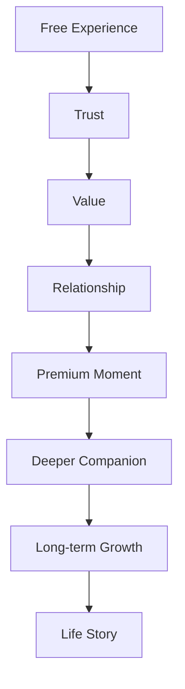
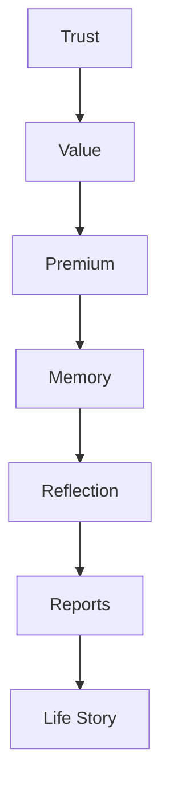

# MODULE 17 — PREMIUM EXPERIENCE

---

## 1. Product Goals

**Business Goals**: monetize the relationship's accumulated depth (Module 2's core thesis), never the initial experience — Premium's entire business case rests on Modules 9/10/16 already having produced something genuinely worth deepening before any payment is ever asked for.

**Relationship Goals**: Premium should feel like choosing to deepen something already valuable, not like unlocking something withheld.

**Retention Goals**: a Premium subscriber should be the most retained, not just the highest-paying, segment — if Premium doesn't measurably improve retention beyond conversion itself, the model has failed regardless of revenue.

**Reflection Goals**: Premium should produce richer reflection (deeper Reports, more contextual Companion responses), not more content volume.

**Memory Goals**: Premium's central, load-bearing benefit is persistent, cross-session memory depth — everything else in this module is in service of making that one thing feel real and valuable.

**Trust Goals**: this module carries the highest risk of violating Module 1's Decision Framework (Trust > Revenue) of any module in the Bible, since it's the one place actual money changes hands — every design decision here is held to the strictest possible Guardrail scrutiny.

**Revenue Goals**: sustainable, trust-compatible revenue that funds the memory/AI infrastructure (Module 2's cost-modeling concern) — revenue is a necessary output, never the module's organizing principle.

**AI Goals**: Premium's Companion should remember more, connect more, reflect deeper, and personalize better — never pretend to know more than evidence supports, never invent memories, never manufacture emotional attachment to justify its price.

---

## 2. Premium Philosophy

**Why Premium exists**: to let a user who has already experienced real value from the relationship choose to deepen it — persistent memory across sessions, richer Reports, fuller Discovery access — funded sustainably without ever gating the experience that built the trust in the first place.

**Depth over restriction**: Premium adds depth to what already works; it does not restrict the free experience to manufacture demand.

**Trust over pressure**: the upgrade decision is made from a position of already-felt value, never from artificial pressure, urgency, or fear of missing out.

**Relationship over transactions**: Premium is framed and experienced as investing further in an existing relationship, never as a one-off transaction for a feature.

**Memory over tokens**: Premium is never sold as "more AI usage" or "more messages" — it's sold as more relationship continuity, which happens to require more compute, but that's never the framing presented to the user.

**Growth over consumption**: Premium's value compounds the same way the whole product's value compounds (Module 1's Product Flywheel) — it is not a consumable allotment that resets and gets used up.

**The standing creed** (governs every design decision in this module):
> **Trust creates value. Value earns Premium. Premium deepens relationships. Relationships create memories. Memories become life stories. Nothing valuable is taken away. Only something meaningful is added.**

---

## 3. Premium Journey



**Free Experience**: full access to Discovery systems, Companion chat with session memory, Journal — the complete core-loop experience (Module 2's monetization thesis), never gated.

**Trust**: built through consistent, honest, memory-aware behavior over the free experience (Modules 1/9's entire standing thesis).

**Value**: the user has genuinely felt something — an Insight moment, a Report, a Companion response that landed — independent of any payment.

**Relationship**: sustained engagement across the Core Product Loop (Module 2, Section 4) — the user is retained not because of a paywall, but because the relationship itself has become worth returning to.

**Premium Moment**: the specific, felt trigger (Section 12) where continuing the relationship's depth becomes something worth paying for — always downstream of Value and Relationship, never presented earlier.

**Deeper Companion**: what Premium actually buys — richer memory, more context, better personalization (Section 7).

**Long-term Growth**: the compounding effect of persistent memory over months/years.

**Life Story**: the same endpoint as Module 16's Reports — Premium's ultimate expression is a richer, more complete Life Story than the free tier's necessarily shallower memory depth can produce.

**Why this order matters**: every stage before "Premium Moment" must genuinely occur first — this module's entire ethical structure depends on Premium never being reachable except downstream of real, already-delivered value, consistent with the standing Business Consistency requirement that Premium monetizes accumulated value, never blocks initial value.

---

## 4. Premium Structure

| Section | What it covers |
|---|---|
| **Free Experience** | Full Discovery access, session-memory Companion, Journal — explicitly documented here as the deliberately full-featured baseline, not a stripped-down teaser tier |
| **Premium Companion** | Persistent, cross-session memory-aware conversation (Section 7) |
| **Premium Memory** | Deeper retention, richer retrieval, higher memory-density support (Section 8) |
| **Premium Reports** | Full access to all Report types (Module 16, Section 4), including Life Chapters, Relationship Reports, and Yearly Reviews at their fullest evidentiary depth |
| **Premium Discovery** | Priority/early access to new Discovery-system features, richer Deep Dive content across Tarot/Natal Chart/Eastern Horoscope/Numerology |
| **Premium Timeline** | Full Life Timeline (Module 16, Section 12) access, including Growth/Relationship/Learning Timeline filtered views |
| **Premium Personalization** | Richer cross-system personalization (Section 9) — more context considered per interaction, within the same singularity/never-overwhelm principles established elsewhere |
| **Premium Reflection** | Higher Credits allotment (Module 2, Section 8) for deep, on-demand synthesis actions |
| **Premium Archive** | Full historical access with no memory-density ceiling that the free tier might otherwise practically encounter at scale |
| **Premium Exports** | The same standing data-export capability (Module 6, Section 9) available to all users, simply noted here as unaffected by tier — export is never a Premium-gated capability, since gating a privacy right behind payment would violate the Privacy value (Module 1) |
| **Deep Dive** | Full evidence-trail access (Module 16, Section 12) at every report depth |

**Why Exports is explicitly non-gated**: calling this out directly prevents a natural but incorrect assumption that "more data access" belongs in the Premium column by default — data export and deletion are standing user rights (Module 3/6), never monetized.

---

## 5. Premium Experience

**Overview**: a simple, honest two-tier comparison (Free vs. Premium), reused directly from Module 5's Landing pricing section — no separate, more aggressive in-app upsell design distinct from what was shown pre-signup.

**Benefits**: presented as specific, felt capabilities ("your Companion remembers across every conversation, not just today's") rather than an abstract feature list.

**Upgrade moments**: contextual, tied to Section 12's specific triggers — never a standing, ambient "Upgrade" button competing for attention on every screen.

**Progressive disclosure**: the comparison view stays simple by default (two tiers, plain differences); a "see full details" option can expand into the complete Premium Structure (Section 4) for users who want it.

**Comparison**: honest and complete — no strikethrough fake discounts, no artificially inflated "original price," no decoy third tier (Module 5's standing pricing-transparency rule, reaffirmed here).

**Navigation**: reached only via a contextual trigger (Section 12) or a deliberate Settings/Profile visit — never an interruption of an in-progress Companion conversation or Discovery reading.

**Interaction**: a single, clear upgrade action; no dark-pattern friction on the way out (canceling, if ever needed, is equally simple, per Section 11).

**Emotion**: warm, respectful, low-pressure — the upgrade screen should feel like the natural next step in an already-valued relationship, never like a sales pitch.

---

## 6. Premium Intelligence Engine

**How Premium becomes smarter**: not through a "smarter model" swap, but through more available context — persistent cross-session memory retrieval depth (Section 8) gives the same underlying Companion service (Module 9) more to work with, which is what produces the felt improvement in conversation quality.

**How memory becomes deeper**: Premium removes the practical retrieval-depth/retention ceiling that a free-tier session-memory-only or shallow-cross-session model implies — more of the Memory graph (Module 10) becomes available and durable for retrieval.

**How reports become richer**: Premium unlocks full evidentiary depth (Module 16) — more historical memory available to draw from means richer, more substantiated Yearly Reviews and Life Chapters, not different narrative quality per se.

**How personalization improves**: more available context (Section 9) allows richer, still-singular (never overwhelming, Module 8's standing principle) connections in Companion responses and Discovery interpretations.

**How AI remains honest**: identical grounding/hallucination-prevention discipline as every other module (Modules 9/10/16) — Premium's deeper memory access never loosens the rule that every reference must trace to real, retrieved evidence; if anything, a Premium user's larger memory graph raises the retrieval-ranking stakes (Module 10, Section 7), not the honesty bar.

**How Premium avoids unfair advantages**: "unfair" is the wrong frame entirely — Premium doesn't make the Companion more emotionally intelligent, more empathetic, or more careful for paying users; those qualities (Module 9's entire Personality/Reflection Engine) are identical across tiers. Premium only affects the *quantity and durability* of available memory context, never the *quality* of care, safety, or interpretive humility applied to it.

---

## 7. Companion Interaction

**Free Companion**: full personality, full Reflection Engine (Module 9, Section 9), session-scoped or shallow cross-session memory depending on release stage (Module 1's MVP/V1 sequencing) — a complete, genuinely good relationship experience, not a deliberately hobbled one.

**Premium Companion**: identical personality and Reflection Engine; the difference is purely in memory depth and retrieval reach — more of the user's history is available and durable for the Companion to draw from.

**Conversation quality**: the *tone, care, and safety* of every response (Module 9, Sections 4/12/13) is identical across tiers — this is a hard, non-negotiable line, since varying emotional quality by payment tier would be a severe Trust violation.

**Context depth**: this is the actual, honest difference — a free-tier conversation might only have the current session (or a shallow recent window) to draw from; a Premium conversation can draw from the user's full accumulated Memory graph (Module 10).

**Memory depth**: directly tied to Section 8's retention model.

**Long-term relationship**: Premium accelerates how quickly the Relationship Lifecycle stages (Module 9, Section 3) can be fully realized, since more historical context is retrievable sooner — but a free user reaches the same stages eventually too, simply with a shallower memory well to draw from at any given point.

---

## 8. Memory Interaction

**Free Memory**: functional, real memory (per Module 1's MVP/V1 sequencing — session-scoped initially, then genuine but potentially retention-window-limited cross-session memory at V1's free tier) — never fake or performative; whatever memory exists for a free user is exactly as honestly grounded as Premium's.

**Premium Memory**: extends the retention window and retrieval depth — more of the historical graph remains actively retrievable rather than archived/deprioritized (Module 10, Section 10's archiving mechanism) purely due to tier-based practical limits.

**Memory lifetime**: free tier may archive lower-significance memories more aggressively over time (a practical infrastructure/cost consideration, Module 2's cost-modeling concern) while Premium retains a deeper active window — critically, archiving is never deletion (Module 10's standing distinction), so no free user's memory is ever destroyed by a tier limit, only deprioritized in retrieval ranking.

**Memory retrieval**: Premium's retrieval can draw from a larger candidate pool (Module 10, Section 7's ranking engine operating over more available, non-archived content).

**Memory summaries**: Premium's deeper Reports (Module 16) benefit from a larger evidence pool to synthesize from, producing richer (not differently-toned) narratives.

**Examples**:
- Free tier, 6 months in: a significant memory from month 1 may have been archived (deprioritized) if the free tier's practical active-retrieval window is narrower — still exportable, still real, just less likely to surface unprompted.
- Premium, 6 months in: the same month-1 memory remains in the actively retrievable pool, more likely to be referenced when genuinely relevant.

---

## 9. Personalization Engine

**Relationship stage / Memory / Journal / Reports / Discovery / Learning / Life events / Growth**: identical signal set to every other module's personalization engine (Modules 8/9/10/16) — Premium doesn't introduce new personalization *inputs*, only a larger available pool of the same inputs to draw from (Section 6).

**Premium adaptation**: the practical effect is that a Premium user's Companion/Reports/Discovery personalization can draw on more historical depth per decision, while still respecting every standing singularity/never-overwhelm principle (Modules 8/9) — more available context never means more shown at once, only better-informed selection of the one most relevant thing.

---

## 10. Value Engine

**How trust becomes value**: consistent, honest Companion behavior over the free experience (Module 9) produces genuine felt moments (Insights, Module 1's definition) — this is Value, and it must occur before anything else in this module's logic.

**How value becomes Premium**: once Value has been felt, a natural, specific trigger (Section 12) — never an arbitrary usage cap — presents the option to deepen it.

**How Premium creates growth**: deeper memory retention (Section 8) produces richer future Insights and Reports (Module 16), compounding the same Product Flywheel (Module 1) that the free tier already benefits from, just with a wider memory aperture.

**How growth creates retention**: a user whose Reports and Companion conversations keep getting richer over time has an increasingly strong, non-manufactured reason to stay — retention here is earned by continued value delivery, not defended by a subscription lock-in mechanic.

---

## 11. Ethics Philosophy

**No manipulation**: no upgrade prompt is engineered to produce anxiety, FOMO, or urgency.

**No fake urgency**: no countdown timers, no "offer ends soon," no artificially scarce "limited spots" framing — Premium is available identically, at the same price, whenever a user is ready.

**No dark patterns**: cancellation is exactly as simple as subscription — no maze of retention offers, no hidden cancel button, no guilt-tripping exit-survey copy.

**No addiction**: Premium's value proposition (deeper memory, richer reports) is explicitly not designed to increase compulsive engagement — depth, not frequency, is the entire model (Section 1).

**No emotional pressure**: no upgrade copy implies the Companion "needs" the user to upgrade or that the relationship is at risk without it (a direct Guardrail violation Module 1 already forbids at the constitutional level, reaffirmed here in its most tempting possible context).

**No fake limitations**: the free tier is never artificially hobbled beyond its honest, disclosed memory-depth/retention-window difference (Section 8) — no feature is deliberately broken or degraded on the free tier purely to create upgrade pressure.

**Transparency**: the exact difference between tiers (memory depth/retention window, Report/Discovery access breadth, Credits allotment) is stated plainly, never left vague or implied to be more dramatic than it actually is.

**Fairness**: every user, regardless of tier, receives identical emotional care, safety, and interpretive honesty (Section 7) — payment affects quantity/depth of available context, never quality of relationship.

---

## 12. Upgrade Moments

| Moment | Why it's the right trigger |
|---|---|
| **First Report** | The clearest, most concrete proof-of-memory moment (Module 16) — a user has just directly experienced what accumulated memory produces, making "keep this going, deeper" the most honest, self-evident possible upgrade framing |
| **Long-term Memory** (a free-tier user noticing/asking whether the Companion will remember something past the free retention window) | A direct, user-initiated moment of curiosity about exactly what Premium adds — the most consent-forward possible trigger, since the user raised the question themselves |
| **Life Chapters** (Module 16) forming | A felt sign of real depth already existing — a natural moment to offer continuing that depth further |
| **Deep Reflection** (a particularly rich Companion conversation or Journal entry) | The Insight-moment trigger Module 1's Optimization review specifically recommended — Premium offered as a continuation of something just felt, not a generic ambient prompt |
| **Companion Growth** (a Relationship Lifecycle stage transition, Module 9, Section 3) | A meaningful, evidenced signal that the relationship has genuinely deepened, making continued depth a coherent next offer |
| **Discovery** (e.g., wanting earlier access to a new Discovery-system feature) | A lower-stakes, feature-driven trigger, offered only when genuinely relevant, never as a primary upgrade path |
| **Journal** (a rich entry that would benefit from deeper long-term Companion continuity) | Similar framing to Deep Reflection, specific to Journal's context |
| **Reports** (a locked-tier preview, Module 16, showing genuine partial value) | The passive, always-available path — present without being pushed, honoring the anti-artificial-scarcity rule (genuine partial value shown, never a fully obscured tease) |

**Why never earlier**: every listed moment occurs only after real value has already been delivered (Section 3's Journey) — there is no upgrade moment in this table that fires before a user has experienced something concrete and specific worth deepening.

---

## 13. Loading Experience

| Moment | Emotion |
|---|---|
| **Premium generation** (activating the upgraded tier itself) | Brief, calm confirmation — no theatrical "welcome to Premium!" celebration sequence, consistent with Calm First even at the moment of conversion |
| **Report generation** | Identical to Module 16's standard experience — Premium doesn't get a different, flashier loading treatment, since the underlying process is the same, just drawing on more evidence |
| **Memory retrieval** | Identical, invisible-by-default pattern (Module 9/10) regardless of tier |
| **Streaming** | Identical Companion streaming behavior regardless of tier |

**Why Premium gets no special loading flourish**: differentiating the loading/visual experience by tier would subtly imply a "better," flashier product experience for paying users, contradicting Section 7's hard rule that emotional/interaction quality is identical across tiers.

---

## 14. Error Experience

| Failure | Behavior | Recovery |
|---|---|---|
| **Subscription expired** | Graceful downgrade to free-tier memory depth/retention window (Section 8) — nothing is deleted, only the active retrieval window narrows per the standing archiving-not-deletion principle | Renewal at any time restores full retrieval depth to the same, uninterrupted memory graph |
| **Offline** | Standard Module 4 Offline pattern, identical regardless of tier | Auto-resume on reconnect |
| **AI unavailable** | Identical fallback behavior to every other module, regardless of tier | Retry |
| **Downgrade** (user-initiated) | Calm, honest confirmation of what changes (retrieval window, Report/Discovery breadth) — explicitly reaffirms nothing is deleted (per the creed: "nothing valuable is taken away") | Can re-upgrade anytime with full history intact |

---

## 15. Analytics

**Upgrade rate**: tracked, but explicitly correlated with prior Insight/Report/Relationship-stage events (Section 12) rather than treated as an independent lever to optimize by adjusting prompt aggressiveness.

**Retention**: Premium-subscriber retention compared against free-tier retention — the primary validation metric for this entire module's thesis (a Premium tier that doesn't outperform free-tier retention has failed regardless of conversion rate).

**Conversation quality**: tracked identically across tiers (Module 9, Section 16) — used specifically to verify Section 7's hard equal-quality rule is holding in practice, not just in design intent.

**Memory usage**: retrieval-depth utilization by tier, informing whether the free-tier retention window is well-calibrated (neither so generous it undermines the Premium value proposition, nor so narrow it feels punitive).

**Report usage**: engagement with full-depth Reports (Module 16) among Premium subscribers specifically, validating the Reports-as-upgrade-driver thesis with real data.

**Renewal**: tracked as a health signal for whether Premium's felt value is sustained over time, not just at initial conversion.

**KPIs**: Premium-vs-free retention differential (primary — validates the entire module's ethical and business thesis simultaneously); renewal rate (secondary); upgrade-moment-to-conversion attribution (informs which Section 12 triggers are genuinely working, without ever becoming a lever to make those triggers more aggressive).

---

## 16. Edge Cases

**Returning users** (a lapsed Premium subscriber returning): full historical memory graph remains intact and immediately available upon renewal — no re-onboarding, no rebuilt-from-scratch memory.

**Downgrade**: handled per Section 14 — graceful, honest, non-punitive, reversible.

**Refund**: processed per standard payment-provider policy (PayOS/VNPay, Module 1's stack) with no retaliatory reduction in service during the refund window beyond the standard downgrade behavior.

**Subscription pause** (if offered): treated identically to a temporary downgrade — memory graph preserved, retrieval window narrows temporarily, restored fully on resume.

**Heavy users** (high Companion/Journal/Discovery engagement): Premium's Credits allotment (Section 4) is sized to genuinely accommodate legitimate heavy use, not designed to hit a ceiling quickly and create a secondary upsell pressure point.

**Light users** (infrequent engagement, Premium subscribers): still retain full memory depth benefit even with infrequent access — Premium's core value (retention window) doesn't require frequent usage to justify itself, consistent with the depth-over-frequency model established across Natal Chart/Numerology (Modules 13/15).

**Multiple devices**: entitlement is account-level, not device-level (Module 6's session architecture already supports multi-device access identically) — Premium status is consistent across every device the user logs into.

---

## 17. Technical Specification

**Entitlement system**: a simple, account-level `subscription_status(user_id, tier, renewed_at, expires_at)` record checked by the Memory retrieval engine (Module 10) to determine active retrieval-window depth, and by the Reports/Discovery/Credits systems for feature-breadth gating (Module 16's evidence engine, Module 2's Credits system).

**Subscription engine**: integrates with PayOS/VNPay (Module 1's payment stack) for billing, renewal, and webhook-driven entitlement updates.

**Prompt architecture**: no separate "Premium prompt layer" exists in Module 9's layered system (Section 19 there) — entitlement only affects which memory candidates are available to the Context Retrieval stage (Module 9, Section 20), never the Personality, Safety, or Reflection Engine layers, which are entitlement-agnostic by design (Section 7's hard rule).

**Memory limits**: implemented as a retrieval-window/archiving-aggressiveness parameter (Module 10, Section 10) keyed to `subscription_status`, not a hard memory-graph size cap — the underlying graph continues to store everything passing the standard significance threshold regardless of tier; tier only affects how aggressively older/lower-significance content is archived out of the active retrieval pool.

**Feature flags**: gate Report-type breadth (Module 16, Section 4) and Discovery early-access features per tier — implemented as simple entitlement checks at the API layer, not scattered conditional logic through the frontend.

**API**: `GET /subscription/status`, `POST /subscription/upgrade`, `POST /subscription/cancel`, webhook endpoints for payment-provider events (renewal, failure, refund).

**Database**: `subscription(id, user_id, tier, provider, provider_subscription_id, status, current_period_end, created_at)`.

**Caching**: entitlement status cached in Redis for low-latency checks on every Memory-retrieval and Report-generation call, invalidated immediately on webhook-driven status changes.

**Queues**: subscription webhook processing (renewal, expiration, refund) handled asynchronously via BullMQ, updating entitlement cache and triggering the graceful memory-retrieval-window adjustment (Section 14) without any user-facing interruption.

**Frontend**: upgrade/comparison screens reuse Module 5's Landing pricing components directly (Section 5) — no separate, bespoke in-app Premium sales UI.

---

## 18. Premium Reasoning Engine

```
function resolveMemoryContext(userId, queryContext):
    entitlement = getEntitlement(userId)  # free or premium

    if entitlement == 'premium':
        retrievalWindow = FULL_ACTIVE_GRAPH  # deeper, wider archiving threshold
    else:
        retrievalWindow = STANDARD_ACTIVE_GRAPH  # narrower, more aggressive archiving

    candidates = retrieveMemory(userId, queryContext, scope=retrievalWindow)
    # ranking logic (significance > recency, Module 10 Section 7) identical regardless of tier

    return rankAndSelect(candidates)  # same singularity principle, same honesty rules, every tier
```

**Relationship → Memory → Evidence → Personalization → Companion → Reports → Growth**: each stage's *logic* is entitlement-agnostic; only the *evidence pool size* available at the Memory stage varies by tier — this is the single, precise, auditable place in the entire technical architecture where Premium status has any effect at all, which is exactly what makes Section 7's "identical quality, different depth" promise structurally true rather than aspirational.

---

## 19. Premium Reasoning Pipeline



Maps to Section 3's Journey and Section 10's Value Engine — Trust and Value must occur upstream of Premium in every case; Premium's only technical effect (Section 18) is on Memory's retrieval window, which then flows through the same Reflection/Reports/Life Story pipeline every other module already established, entitlement-agnostic from that point forward.

---

## 20. UX Specification

**Desktop/Tablet/Mobile**: consistent, simple comparison layout across breakpoints, reusing Module 5's Landing pricing component structure directly.

**Upgrade screens**: single-focus, reached only via contextual triggers (Section 12) or deliberate Settings navigation — never an interstitial interrupting an active Companion/Discovery/Journal flow.

**Comparison**: plain two-column layout (Module 4, Section 5's standard Card component), no decorative "recommended" badge steering, no artificial visual emphasis manufacturing pressure toward Premium beyond honest information.

**Animations**: standard Module 4 timing only — no special celebratory Premium-activation animation (Section 13's rationale).

**Accessibility**: full screen-reader and keyboard support for the comparison and upgrade flow, matching every other transactional flow's standard (Module 6's Authentication accessibility bar).

**Navigation**: reachable from Settings at any time, plus the specific contextual triggers in Section 12 — never from a persistent, ambient nav-bar badge.

**Reading flow**: comparison → single upgrade action → brief, calm confirmation → return to whatever screen triggered the upgrade moment, now with full depth active.

---

## 21. QA Checklist

- **Entitlements**: verify `subscription_status` correctly and immediately gates Memory retrieval window and Report/Discovery breadth on both upgrade and downgrade/expiration.
- **Upgrade flow**: verify the flow is reachable only from the specified contextual triggers (Section 12) plus Settings — no stray, untracked upgrade entry points introduced elsewhere in the app.
- **Downgrade**: verify graceful, non-punitive behavior — no data deletion, only retrieval-window narrowing, confirmed via direct testing of the archiving (not deletion) mechanism.
- **Renewal**: verify webhook-driven entitlement updates process correctly and promptly.
- **Memory**: verify identical ranking/honesty logic (Module 10, Section 7) applies regardless of tier — only pool size differs, verified via direct comparison testing.
- **Reports**: verify full Report-type breadth correctly gates by entitlement without affecting narrative quality/tone for either tier.
- **Frontend**: verify upgrade screens reuse Module 5's existing components rather than introducing a divergent visual system.
- **Backend**: verify subscription webhook processing (Section 17) handles renewal/failure/refund cases correctly and idempotently.
- **Accessibility**: verify full keyboard/screen-reader support for the upgrade flow.
- **Performance**: verify entitlement-check caching (Redis) doesn't introduce latency into Memory retrieval or Report generation.
- **Analytics**: verify Premium-vs-free retention differential (Section 15) is the tracked headline metric for this module, not raw conversion rate in isolation.

---

## 22. Future Expansion

**Family Plan**: same standing multi-user consent caution as every other module — a family billing arrangement must never grant one family member visibility into another's personal memory graph (Module 2/6's identical caveat, reaffirmed here specifically because billing-sharing features are exactly where this risk tends to creep in unnoticed).

**Student Plan**: a plausible pricing-tier variant, not a product-behavior change — would need no changes to this module's ethical structure, only to the billing/pricing layer (Module 17, Section 17).

**Team Plan**: not applicable to this product's fundamentally personal, one-to-one relationship model (Module 1) — flagged as a likely non-goal rather than a roadmap item.

**Gift Premium**: a plausible, low-risk extension — gifting access to someone else's account never implies gifter visibility into the recipient's memory graph, a distinction that would need explicit, clear UX treatment if built.

**Lifetime Premium**: a pricing-model variant requiring careful cost-modeling given Module 2's flagged LLM-cost-scaling risk — a lifetime commitment against an unbounded future compute cost is a genuine actuarial risk needing explicit modeling before consideration, not just a product decision.

**Premium Memories** (a hypothetical curated/highlighted memory collection feature): would need to pass the same memory-test discipline (Module 1's Product Principles) as any other feature proposal — not automatically justified just because it sounds Premium-appropriate.

**AI Mentor**: explicitly cautioned against, mirroring Module 11/13's identical rejection of more directive AI personas ("AI Reflection Coach," "AI Identity Coach") — a "Mentor" framing risks the same authority/directiveness this entire Bible consistently rejects; if ever considered, it would need to fit within Module 9's existing Companion personality constraints, not introduce a new, more assertive one.

**Personal Knowledge Vault**: a plausible reframing of the existing Memory/Timeline/Export capabilities as a more prominent, dedicated feature — likely achievable through better surfacing of what already exists (Module 10's Search/Timeline, Module 6's Export) rather than a genuinely new capability.

---

## 23. Final Decisions

**Chosen Premium Model**
A depth-not-restriction subscription that extends Memory's active retrieval window and unlocks full Report/Discovery breadth and a larger Credits allotment, funded entirely by trust already earned in the free tier (Section 3's Journey), with entitlement affecting only the size of the available evidence pool at the Memory retrieval stage (Section 18) — never the quality, safety, warmth, or honesty of the Companion relationship, which remains strictly identical across tiers — and with every upgrade moment triggered only downstream of a genuinely felt value event (Section 12), never an arbitrary usage cap or manufactured scarcity.

**Rejected Alternatives**
- Gating core Discovery-system content or basic Companion chat behind Premium — rejected outright as directly contradicting Module 2's CAC/virality-funding thesis and this module's own Business Consistency requirement (monetize accumulated value, never block initial value).
- Selling "more messages" or "more tokens" as the Premium framing — rejected in favor of framing Premium entirely around relationship continuity/depth, consistent with the standing prohibition against "selling GPT tokens."
- A different, warmer/more empathetic Companion personality for Premium subscribers — rejected outright as a severe Trust violation; emotional quality must be identical across tiers, full stop.
- Fixed usage caps on the free tier (e.g., "3 conversations per day") as the primary upgrade lever — rejected in favor of the honest memory-retrieval-window distinction, since an arbitrary usage cap would be exactly the kind of fake limitation this module's Ethics Philosophy prohibits.
- A special celebratory activation animation/flourish for new Premium subscribers — rejected in favor of a calm, understated confirmation, consistent with Calm First and with not visually implying a "better" product experience purchased by payment.

**Trade-offs**
Funding infrastructure costs (Module 2's flagged LLM-cost-scaling risk) through a depth-based rather than volume-based model means Premium's revenue ceiling per user is somewhat less directly tied to actual compute cost than a usage-metered model would be — accepted because usage-metering would reintroduce exactly the "selling tokens/conversations" framing this module's standing constraints explicitly prohibit, and because the business's actual differentiated asset (Module 2's Memory Moat) is depth, not volume, so pricing around depth is the economically coherent choice even if it's a slightly less precise cost-recovery mechanism.

**Reasons**
Every decision in this module operationalizes the standing creed — trust creates value, value earns Premium, Premium deepens relationships, relationships create memories, memories become life stories, nothing valuable is taken away, only something meaningful is added — while keeping Premium's only technical effect narrowly scoped to Memory's retrieval window (Section 18), which is precisely what makes "Premium deepens, never restricts" an enforceable architectural fact rather than a marketing claim.

---

**Next module in sequence: Community.**
