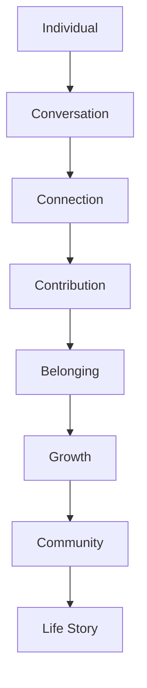
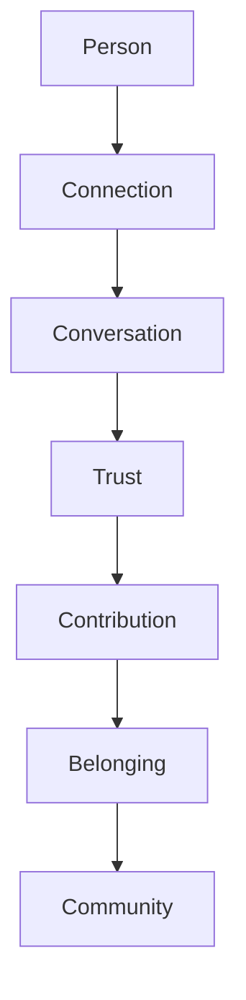

# MODULE 18 — COMMUNITY EXPERIENCE

---

## 0. Reconciliation Note (read before the rest of this module)

Module 1 established that BeaconVie is explicitly **not** a social network, and Module 2/3/8/5 each described Community narrowly — anonymized pattern-sharing only, no public profiles, no feed. This module's brief asks for a fuller structure: Feed, Groups, Clubs, Posts, Comments, Profile, Recognition, Leadership.

This module resolves that tension rather than ignoring it. The standing constitution's actual prohibitions (Module 1, Guardrails) are specifically: no public profile tied to a user's real identity or personal Memory/Journal content; no follower/popularity mechanics; no infinite-scroll, algorithmically-optimized engagement feed; no social performance layer that would undermine the vulnerability Journal and Companion depend on (Module 1, Brand Positioning: "We are NOT a social network").

Everything in this module is designed to deliver genuine belonging and shared growth **within** those prohibitions, not by relaxing them:
- **Profile** here means a minimal, pseudonymous community identity (a chosen display name, not the user's real name or any Memory-derived content) — never linked publicly to the user's personal Companion relationship.
- **Feed** here means a curated, non-infinite, theme-organized discussion surface — never an algorithmic, engagement-maximizing "for you" feed.
- **Recognition** here means contribution-based acknowledgment (helpfulness, thoughtfulness) — never follower counts, like counts as a status metric, or leaderboards.
- Sharing anything derived from personal Memory/Journal/Companion content into Community requires **explicit, per-item, opt-in consent** (Section 8) — nothing crosses from the private relationship into Community by default, ever.

This module is best understood as: **a genuine discussion and mutual-support space, built with the discipline of a reflection product, not the instincts of a social platform.**

---

## 1. Product Goals

**Business Goals**: Community is a secondary, opt-in layer that can reinforce retention (Module 2) by giving users a space to feel less alone in their reflective practice — it is never a primary acquisition or engagement driver, and is not resourced or measured as one.

**Community Goals**: genuine belonging and mutual support among people doing similar reflective work — never scale-for-its-own-sake or engagement volume.

**Belonging Goals**: a user should feel recognized and welcome, distinct from feeling popular or followed.

**Relationship Goals**: Community exists beside the Companion relationship (Module 9), never in competition with it — every design decision below is checked against whether it might pull attention or vulnerability away from the private Companion/Journal relationship that is this product's actual core.

**Learning Goals**: shared discussion should genuinely help people understand themselves and each other better — measured in the same way Reflection Goals are measured elsewhere in this Bible (depth, not volume).

**Trust Goals**: Community carries real trust & safety stakes (harassment, toxicity, exploitation of vulnerable disclosures) that no other module in this Bible faces at the same scale — this module's Ethics Philosophy (Section 11) and moderation pipeline (Section 17) are held to a correspondingly higher operational bar.

**Retention Goals**: Community should be evaluated on whether it deepens genuine long-term participation, never on time-on-feed or scroll depth.

**AI Goals**: connect people thoughtfully, encourage healthy discussion, reduce toxicity — never maximize engagement, never optimize for outrage, never manipulate emotion to keep people scrolling.

---

## 2. Community Philosophy

**Why Community exists**: reflective growth doesn't have to happen alone — a space for people to discuss shared themes, ask questions, and support each other's growth adds something the one-to-one Companion relationship structurally can't (Module 9's single-user model): the recognition that others are working through similar things.

**Belonging over popularity**: success is a member feeling they belong, not a member accumulating followers or likes.

**Growth over attention**: every design choice optimizes for whether participation helps someone grow, never for how much time they spend in the module.

**Conversation over broadcasting**: the module is built around genuine back-and-forth discussion, not one-to-many broadcast/audience-building, which is precisely the dynamic that turns a space into a popularity contest.

**Support over competition**: contribution is recognized as helpfulness (Section 12), never ranked competitively against other members.

**Learning over entertainment**: content quality is measured by whether it helped someone think more clearly, never by how entertaining or shareable it was.

**The standing creed** (governs every design decision in this module):
> **Every person deserves respect. Every voice deserves safety. Growth matters more than popularity. Contribution matters more than attention. Belonging matters more than virality. The community succeeds when its members grow.**

---

## 3. Community Lifecycle



**Individual**: a user arrives at Community as a private-relationship-first user (Module 9) considering, for the first time, whether to engage with others.

**Conversation**: an initial discussion or question, low-stakes, pseudonymous.

**Connection**: a genuine back-and-forth with one or a few other members around a shared theme.

**Contribution**: offering something helpful — an answer, a supportive reply, a shared perspective — recognized (Section 12), never scored competitively.

**Belonging**: the felt sense of being a genuine, welcome part of a specific group/circle (Section 4), not of the platform broadly.

**Growth**: the actual reflective/learning benefit of sustained participation.

**Community**: the aggregate, healthy space this produces over time.

**Life Story**: any (consented, Section 8) Community-derived content that genuinely mattered can feed back into the user's own personal Reports (Module 16) — Community can enrich an individual's Life Story, but only through explicit consent at the point of sharing, never automatically.

---

## 4. Community Structure

| Section | What it is | Reconciliation with the constitution |
|---|---|---|
| **Feed** | A curated, theme-organized (not algorithmically personalized-for-engagement) discussion surface, paginated, never infinite-scroll | No engagement-maximizing ranking; sorted by recency/relevance within a chosen theme, not by predicted engagement |
| **Groups** | Small, topic-based discussion spaces (e.g., "navigating career change") | Opt-in, joinable/leavable freely, no size-based status |
| **Clubs** | Slightly more durable, ongoing groups around a sustained shared interest | Same pseudonymous-identity and consent rules as Groups |
| **Learning Circles** | Smaller, discussion-format groups oriented around a specific reflective practice or theme over a defined period | Emphasizes depth over churn — a bounded, cohort-like format rather than an open perpetual feed |
| **Challenges** | Optional, shared reflective prompts a group can engage with together (e.g., a week of shared journaling prompts, discussed collectively) | Never gamified with points/streaks/leaderboards (Guardrail) — framed purely as shared reflection, not competition |
| **Events** | Scheduled discussion sessions (e.g., a live or async themed discussion) | Opt-in, calendar-based, no FOMO-driven "don't miss out" framing |
| **Discussions** | Longer-form, threaded conversation on a specific topic | The core content unit of this module |
| **Questions** | A lighter-weight, specific-ask discussion format | Encourages genuine help-seeking without needing to frame it as a full "post" |
| **Mentorship** | Optional, opt-in pairing of more experienced members with newer ones around a shared theme | Explicit consent-based pairing, not an algorithmically-optimized matching system; framed as mutual, not hierarchical |
| **Recognition** | Acknowledgment of genuinely helpful contributions | Never follower counts, like-counts-as-status, or leaderboards (Section 11) — recognition is qualitative and contribution-specific |
| **Profile** | A minimal, pseudonymous community identity | Chosen display name only; no real name, no personal Memory/Journal content, no public activity history beyond what the user has explicitly posted |

**Why "Feed" and "Profile" are reinterpreted rather than dropped**: the underlying user need (a place to see relevant discussion, a way to be recognized as the same person across conversations) is legitimate and worth serving — it's the specific mechanics (algorithmic engagement optimization, real-identity/follower-based profiles) that are rejected, not the concepts themselves.

---

## 5. Community Experience

**Overview**: a calm entry point organized by theme/Group, not a single undifferentiated global feed.

**Feed**: paginated, theme-scoped, sorted by recency/relevance — no infinite scroll, no "pull to refresh for new content" engagement loop.

**Posts**: genuine discussion posts, text-forward (matching Module 4's overall content-over-decoration design philosophy), no algorithmic boosting.

**Comments**: threaded, genuine reply structure.

**Reactions**: limited to a small set of supportive, non-competitive options (e.g., "this resonates," "thank you for sharing") — explicitly no numeric "like count" displayed as a visible status metric anywhere in the UI (Guardrail against popularity mechanics).

**Navigation**: Groups/Clubs/Circles as the primary entry points, not a single monolithic feed — a user navigates to a specific community of interest, rather than scrolling one endless stream.

**Interaction**: posting, replying, and reacting are the entire interaction surface — no sharing/reposting mechanics, no follower/following relationships.

**Emotion**: warm, welcoming, safe — matching Module 4's Calm First principle, with Community's own specific warmth calibrated toward mutual support rather than individual reflection's quieter register.

---

## 6. Community Intelligence Engine

**How AI supports conversations**: can offer a gentle, optional prompt to help a member phrase a question or contribution more clearly if asked — never auto-generates community content on a user's behalf.

**How AI recommends communities**: based on genuinely relevant Discovery/Journal themes (with consent, Section 8) — e.g., suggesting a career-change Group to someone whose Companion conversations have touched on that theme, only ever with explicit opt-in, never by silently surfacing personal content to justify the recommendation publicly.

**How AI surfaces meaningful content**: relevance and helpfulness ranking (Section 18), never predicted-engagement ranking — the single most important technical distinction between this module's Feed and a conventional social-media feed.

**How AI avoids echo chambers**: recommendation logic deliberately avoids narrowing a user's exposure to only content that confirms what they already believe or feel — occasional genuinely different perspectives within a theme are preserved in ranking, not filtered out in service of "more of what you already engage with."

**How AI encourages healthy participation**: gentle prompts toward constructive framing when a draft post reads as likely to escalate conflict (Section 16), offered before posting, never after-the-fact censorship without explanation.

---

## 7. Companion Interaction

**How Companion connects Community**: only via explicit, optional suggestion — never automatic cross-posting or silent linkage.

**Private reflection**: the default, always-available option — a user can discuss anything with their Companion without ever considering Community at all.

**Public sharing**: only ever a deliberate, explicit user action — "share an anonymized version of this reflection with a Group?" — never a default or pre-checked option.

**Consent**: per-item, explicit, and reversible (Section 8) — sharing something once doesn't create a standing permission for future automatic sharing.

**Companion suggestions**: the Companion can note, gently and rarely, that a theme the user is working through might be one others in a specific Group are also navigating — framed as an optional door, never a nudge implying the user should share.

**Community memories**: if a user chooses to bring something from Community back into their own reflective practice (e.g., "someone in the career Group said something that really helped"), that becomes an ordinary, standard memory candidate (Module 10) like any other — Community-sourced content is not treated as a special, second-class or higher-priority memory category.

---

## 8. Memory Interaction

**What stays private by default**: everything — Companion conversations, Journal entries, Memory graph content, Discovery-system engagement — none of it is visible to Community in any form unless the user explicitly chooses to share a specific piece of it.

**What can be shared**: only what the user explicitly selects and confirms sharing, per instance — e.g., choosing to post a specific reflection (possibly anonymized/reworded by the user themselves) into a Group discussion.

**Shared memories**: once shared, a Community post is itself just Community content (Section 4) — it does not retroactively become linked back to the user's private Memory graph unless the user separately, explicitly chooses to save a meaningful Community reply back into their own reflective practice.

**Consent**: explicit, per-item, revocable — a shared post can be deleted by the user at any time, consistent with the standing deletion rights established throughout this Bible (Module 3/6/10/11).

**Visibility**: Community posts are visible only within their specific Group/Circle context (never surfaced into a user's personal Dashboard or Companion conversation without the user's own action) — Module 8's standing rule that any Community-derived pattern shown elsewhere in the product must stay anonymized and aggregate-only is unaffected by this module's fuller Community structure.

**Examples**:
- Never shared automatically: a Journal entry about a difficult week.
- Correctly shared (explicit user action): the user chooses to post, in their own words, in a career-change Group: "Anyone else find the first few months of a new job bring up a lot of self-doubt?" — genuinely their own authored content, posted deliberately.

---

## 9. Personalization Engine

**Relationship stage / Memory / Journal / Reports / Discovery / Learning / Growth**: used only, and only with explicit consent, to recommend relevant Groups/Circles (Section 6) — never to auto-populate Community content or auto-share anything.

**Community interests**: a user's own explicit engagement within Community itself (which Groups they've joined, what they've posted about) is the primary, consent-free personalization signal for further Community recommendations, since it's content the user has already made visible by their own choice within Community.

**Adaptation**: recommendations stay singular and relevant (Module 8/9's standing singularity principle) — never a barrage of "communities you might like" notifications.

---

## 10. Belonging Engine

**How conversations become trust**: consistent, genuine, supportive replies over several interactions build a member's trust in a specific Group — the same underlying mechanism as Module 9's Relationship Lifecycle, applied at a group-social rather than one-to-one level.

**How trust becomes belonging**: once a member feels genuinely recognized within a Group (not just tolerated), belonging follows — measured qualitatively (does the member keep returning to that specific Group, do they post original content, not just react) rather than by any single engagement metric.

**How belonging becomes contribution**: a member who feels they belong is more likely to offer help/support to newer members — the natural, healthy version of "network effects" this product allows (Module 2's stated preference for data/aggregate network effects over social ones, extended here to a genuine but bounded social layer).

**How contribution strengthens Community**: contribution is recognized (Section 12) in a way that reinforces the contributor's sense of belonging without creating a competitive status hierarchy — the loop is self-reinforcing without becoming extractive.

---

## 11. Ethics Philosophy

**No popularity addiction**: no follower counts, no visible like-counts-as-status, no leaderboards — the single most heavily enforced rule in this module.

**No engagement farming**: the Feed (Section 5) is never ranked to maximize time-on-module; pagination, not infinite scroll, is a deliberate structural choice against this specific failure mode.

**No outrage optimization**: content ranking (Section 6/18) never favors emotionally provocative content, even if it would predictably increase engagement.

**No harassment**: a zero-tolerance, actively-enforced moderation standard (Section 17) — harassment is treated with the same seriousness as any other Trust & Safety-critical failure mode in this Bible.

**No manipulation**: no dark patterns anywhere in this module — notification design (if any Community notifications exist) follows Module 3, Section 13's identical memory/relevance-triggered-only standard, never generic "someone replied!" engagement bait.

**No algorithmic toxicity**: ranking/recommendation logic (Section 6) is explicitly audited against amplifying conflict-prone or divisive content, the same discipline applied to preventing echo chambers.

**Transparency**: moderation decisions are explained to affected users plainly (Section 14), never a silent, unexplained removal.

**Fairness**: moderation standards apply consistently regardless of a member's tenure, contribution history, or Premium status (Module 17's standing equal-quality-across-tiers principle extended here).

---

## 12. Community Journey

| Stage | What happens | Design intent |
|---|---|---|
| **First post** | A gentle, low-stakes first contribution (often a Question, Section 4, rather than a full Discussion) | Lowest possible barrier to a first genuine contribution |
| **First reply** | Receiving a genuine, supportive response | The first real evidence that this is a safe, welcoming space |
| **First friendship** | A recurring, positive back-and-forth with a specific other member | Organic, never algorithmically pushed via a "friend suggestion" mechanic |
| **First club** (joining a Club) | Choosing to engage more durably with a specific shared interest | Opt-in, no pressure to join multiple |
| **First challenge** | Participating in a shared reflective prompt with a Group | Framed as shared practice, never competition |
| **Long-term participation** | Sustained, healthy engagement over months | The actual target outcome of this entire module |
| **Recognition** | Being acknowledged for genuine helpfulness | Qualitative, specific, never a numeric score |
| **Leadership** (e.g., helping moderate or guide a Group/Circle) | An opt-in, trust-earned role for members who've shown sustained, healthy contribution | Never a status symbol pursued for its own sake — framed as a responsibility offered, not a rank achieved |

---

## 13. Loading Experience

| Moment | Emotion |
|---|---|
| **Feed loading** | Standard skeleton loading (Module 4, Section 14) — paginated, so this is a bounded, honest wait, never an infinite "loading more" implying endless content |
| **Recommendations** | Labeled, brief (e.g., "finding groups that might be relevant") |
| **Streaming** | If AI-assisted phrasing help is used (Section 6), standard Companion-style streaming |
| **Animations** | Standard Module 4 timing throughout — no special engagement-driving animation (e.g., no reaction-count "pop" animations, consistent with the no-popularity-mechanics rule) |

---

## 14. Error Experience

| Failure | Behavior | Recovery |
|---|---|---|
| **Offline** | Standard Module 4 Offline pattern; cached recent content viewable | Auto-sync on reconnect |
| **Content unavailable** (a post/Group removed) | Calm, plain explanation if the removal was moderation-related and the user is the affected party (Section 11's transparency rule); otherwise a simple "no longer available" | N/A |
| **Moderation** (a user's content is actioned) | Clear, specific, non-punitive-in-tone explanation of what rule was violated and why — never a vague "content removed" with no reason | Appeal path available (Section 17) |
| **Deleted content** (user-initiated) | Immediate, complete removal, consistent with standing deletion rights | N/A |
| **Reporting** (a user reports another's content) | Calm acknowledgment that the report was received, with a clear (if general, to protect reporter privacy) sense of what happens next | Follow-up notice once resolved, without exposing moderation-internal detail unnecessarily |

---

## 15. Analytics

**Healthy conversations**: proxied by genuine back-and-forth depth and supportive-reaction ratios, not raw post/comment volume.

**Meaningful replies**: tracked qualitatively (does a reply lead to further genuine discussion) rather than counted alone.

**Belonging**: proxied by sustained return-to-the-same-Group behavior over time, not overall Community-wide engagement.

**Retention**: Community-participating users' broader product retention (Module 1's overall KPIs), tracked to confirm Community is genuinely additive to, not a distraction from, the core Companion relationship.

**Contribution**: tracked per Section 12's Recognition framing — qualitative helpfulness, never a leaderboard-style aggregate score exposed to users.

**Safety**: moderation response time, report resolution rate, and repeat-offense rate — treated as a headline metric category on equal footing with engagement-adjacent metrics, not a secondary concern.

**KPIs**: % of Community-participating users who also maintain healthy Companion/Journal engagement (validates that Community isn't cannibalizing the core relationship); moderation response time (Trust & Safety health); qualitative belonging proxy (sustained same-Group return rate) — explicitly, raw Feed engagement time is never a tracked success KPI for this module.

---

## 16. Edge Cases

**Toxic behavior**: addressed via the moderation pipeline (Section 17) with zero tolerance and consistent, transparent enforcement (Section 11/14).

**Loneliness** (a member who seems isolated or is expressing distress within Community content): Module 9, Section 13's Safety Philosophy applies identically here — if a Community post suggests genuine crisis-level distress, the same tested escalation response takes priority, and Community moderation/AI assistance should surface appropriate support resources directly, not just moderate the post as a policy violation.

**Spam**: standard automated + human moderation detection (Section 17).

**Fake accounts**: Community identity is pseudonymous by design (Section 4), but still tied to a single verified underlying account (Module 6's Authentication) — pseudonymity is not the same as anonymity from the platform's own accountability standpoint, which is what makes moderation and ban-enforcement possible.

**Burnout** (a highly active contributor showing signs of over-extension, e.g., in a Leadership role): the product doesn't push engagement metrics that would encourage this, and can gently, privately (via the Companion, with consent) check in if a pattern suggests it — never publicly flagged in a way that would embarrass the member.

**Community conflicts** (disagreement within a Group escalating): AI-assisted gentle de-escalation prompts (Section 6) are offered proactively when draft replies show clear escalation signals; human moderation intervenes if it continues.

**Sensitive discussions**: Module 9, Section 13's standing medical/legal/financial/political/religious boundaries apply identically to Community content and AI-assisted moderation guidance — Community doesn't become a space where the product's own AI offers directive advice on these topics, even indirectly through moderation framing.

---

## 17. Technical Specification

**Feed engine**: paginated, theme/Group-scoped query, ranked by recency and relevance (Section 18) — explicitly not an ML engagement-prediction ranking model, a deliberate architectural choice to make "no engagement optimization" structurally true, not just a stated policy.

**Recommendation engine**: Group/Circle suggestions based on consented Discovery/Journal/Companion theme signals (Section 9) plus a user's own explicit Community activity — same shared embedding index (Module 3) used elsewhere, applied here only to already-explicitly-shared or explicitly-consented content.

**Moderation pipeline**: combines automated detection (toxicity/spam classifiers) with human review for anything flagged or reported — given the elevated Trust & Safety stakes of this module (Section 1), human review is not optional for any action beyond the most clear-cut automated spam removal.

**AI assistant**: the optional phrasing-help and de-escalation-prompt features (Section 6/16) reuse the Companion AI service's underlying LLM infrastructure (Module 9) but operate under a distinct, narrower prompt layer scoped only to constructive-communication assistance — never given access to the user's private Memory graph unless the specific content being discussed has already been explicitly shared into Community by the user.

**API**: `GET /community/groups`, `GET /community/feed/:groupId` (paginated), `POST /community/post`, `POST /community/comment`, `POST /community/report`, `POST /community/moderation/action` (internal/Admin).

**Database**: `community_group(id, name, theme, type[group/club/circle])`, `community_post(id, group_id, author_pseudo_id, content, created_at, status)`, `community_report(id, post_id, reporter_id, reason, status)` — critically, `author_pseudo_id` is a Community-scoped identity distinct from the user's core `user_id`-linked personal Memory/Journal data, enforcing the pseudonymity boundary at the schema level, not just the UI level.

**Caching**: paginated feed results cached briefly per Group; no personalized engagement-optimized caching layer (consistent with the non-algorithmic ranking approach).

**Queues**: moderation classifier jobs and report-processing run asynchronously via BullMQ; AI-assisted phrasing-help requests are synchronous, matching Companion's standard latency expectations.

**Frontend**: reuses Module 4's Card, List, and standard component set — no bespoke "social media" visual patterns (no follower-count badges, no like-count displays as primary visual elements).

---

## 18. Community Reasoning Engine

```
function recommendCommunity(userId, consentedThemes):
    # consentedThemes: only themes the user has explicitly opted to use
    # for Community recommendation purposes (Section 9) — never silently
    # inferred from private Memory without consent

    candidateGroups = matchGroupsByTheme(consentedThemes)
    ownActivity = getUserCommunityActivity(userId)  # consent-free, self-generated signal

    ranked = rankByRelevanceAndHealthiness(candidateGroups, ownActivity)
    # "healthiness" = active, well-moderated, genuinely supportive Group,
    # never popularity/size

    return topSingularRecommendation(ranked)  # one at a time, matching
    # the standing singularity principle (Modules 8/9)
```

**Relationship → Interests → Communities → Conversations → Belonging → Growth**: each stage is gated by explicit consent at the Interests stage (nothing flows from private Relationship/Memory into Community recommendation without it), and every subsequent stage is measured qualitatively (Section 15), never by volume.

---

## 19. Community Reasoning Pipeline



Maps to Section 3's Lifecycle and Section 10's Belonging Engine — this pipeline is deliberately social/qualitative in nature (distinct from the Memory-pipeline diagrams in every other module), since Community's core mechanism is genuine interpersonal trust-building, not AI-mediated memory synthesis; the AI's role here (Section 6/18) is supportive and recommendation-only, never a participant generating content on anyone's behalf.

---

## 20. UX Specification

**Desktop/Tablet/Mobile**: consistent Group/Circle-first navigation across breakpoints — no divergent "mobile-optimized infinite feed" pattern that would reintroduce the exact engagement-maximizing mobile-scroll pattern this module rejects.

**Feed**: paginated list (Module 4's List component), grouped by Group/theme.

**Groups**: Card-based entry points (Module 4, Section 5).

**Cards**: standard Card component, text-forward, no engagement-bait visual elements (no large, prominent like-counts).

**Accessibility**: full screen-reader/keyboard support for posting, replying, and reporting flows.

**Navigation**: Groups/Circles as primary navigation, Feed as a secondary, scoped view within a chosen Group — never a single global "Community" tab defaulting to an undifferentiated firehose.

**Reading flow**: Overview → Group selection → Feed (paginated) → Discussion thread → optional reply/react — a clear, bounded path, not an endless one.

---

## 21. QA Checklist

- **Moderation**: verify the moderation pipeline correctly flags, routes, and resolves reported content within a defined, tested SLA; verify transparency messaging (Section 14) is accurate and non-vague in test cases.
- **Feed quality**: verify Feed ranking uses only recency/relevance, with no engagement-prediction signal present anywhere in the ranking logic (an explicit, testable architectural assertion).
- **Recommendations**: verify Group/Circle recommendations only ever use explicitly consented theme signals, never silently-inferred private Memory content.
- **Frontend**: verify no follower-count, like-count-as-status, or leaderboard UI element exists anywhere in this module.
- **Backend**: verify the schema-level pseudonymity boundary (`author_pseudo_id` vs. `user_id`) is correctly enforced and cannot be trivially de-anonymized through any API response.
- **Accessibility**: verify full keyboard/screen-reader support for all posting/reply/report flows.
- **Performance**: verify paginated Feed loading performs well without needing an infinite-scroll pattern to feel responsive.
- **Analytics**: verify tracked KPIs (Section 15) exclude raw engagement-time metrics as any kind of success target.
- **Safety**: dedicated, release-blocking review of the crisis-adjacent-content handling path (Section 16's Loneliness edge case) — this is this module's single highest-priority QA category, matching Module 9's Safety QA priority for the same underlying reason.

---

## 22. Future Expansion

**Local Communities**: geography-scoped Groups — a plausible extension, subject to the same pseudonymity/consent rules; geographic specificity would need careful handling to avoid making pseudonymous identity more easily de-anonymizable in small local groups.

**Study Groups**: a specific Learning Circle variant, no new mechanics needed.

**AI Moderators**: an expanded automated-moderation capability — must remain human-reviewed for any consequential action (Section 17's standing rule), never fully autonomous given the stakes.

**Mentor Network**: a more formalized extension of the existing Mentorship structure (Section 4) — same opt-in, mutual (not hierarchical) framing required.

**Community Projects**: collaborative, opt-in group efforts around a shared theme — a plausible extension, evaluated against the same no-competition, no-gamification standard as Challenges.

**Events**: already specified (Section 4); further expansion (e.g., live audio discussion) would need its own moderation/safety design work given real-time content is harder to moderate than async text.

**Volunteer Programs**: a plausible Leadership-track extension (Section 12) — same opt-in, responsibility-not-status framing.

**Global Chapters**: a broader organizational structure for very large-scale Community growth — explicitly deferred until the current, smaller-scale model's health (Section 15's qualitative metrics) is validated; scaling a community structurally before validating its health repeats the exact mistake conventional social platforms make.

---

## 23. Final Decisions

**Chosen Community Model**
A pseudonymous, Group/Circle-organized discussion space with a paginated (never infinite-scroll), recency/relevance-ranked (never engagement-optimized) Feed, qualitative contribution-based Recognition (never follower/like-count status mechanics), explicit per-item consent required for any content crossing from the private Companion/Memory/Journal relationship into Community, and a moderation pipeline held to this Bible's highest Trust & Safety operational bar given the module's genuinely elevated interpersonal-harm risk profile relative to every other, single-user module in the product.

**Rejected Alternatives**
- A conventional algorithmic, engagement-optimized "for you" feed — rejected outright as the precise anti-pattern named throughout this module's brief and consistent with Module 1's standing "we are NOT a social network" positioning.
- Public, real-identity-linked profiles — rejected in favor of pseudonymous, Community-scoped identity, preserving the vulnerability/privacy premise that makes the rest of this product (especially Journal, Module 11) work at all.
- Follower/following relationships and visible like-counts — rejected outright as popularity mechanics directly named as an anti-pattern in this module's own Quality Requirements.
- Automatic or default sharing of any personal Memory/Journal/Companion content into Community — rejected in favor of strict, explicit, per-item, revocable consent, consistent with the Privacy value established in Module 1 and reaffirmed in every subsequent module.
- Gamified Challenges with points/streaks/leaderboards — rejected in favor of framing shared reflective practice as mutual support, consistent with the standing Guardrail against gamification incompatible with this product's values.

**Trade-offs**
A paginated, non-infinite, non-algorithmically-optimized Feed will likely produce lower raw engagement-time metrics than a conventional social feed would — accepted deliberately, since this module's entire ethical premise depends on never optimizing for that metric in the first place; a Community module that "performed better" by that measure would have failed by every measure this Bible actually cares about.

**Reasons**
Every decision in this module operationalizes the standing creed — every person deserves respect, every voice deserves safety, growth matters more than popularity, contribution matters more than attention, belonging matters more than virality, the community succeeds when its members grow — while resolving the tension between this module's fuller requested structure and Module 1's standing anti-social-network constitution by reinterpreting conventional social-product mechanics (Feed, Profile, Recognition) through this Bible's existing Guardrails, rather than relaxing those Guardrails to accommodate conventional social-product conventions.

---

**Next module in sequence: Notifications.**
