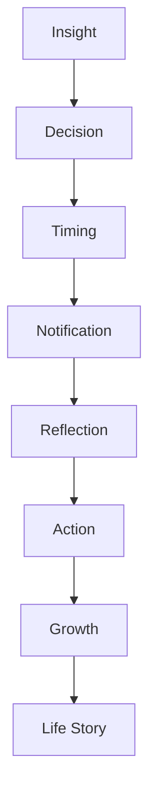
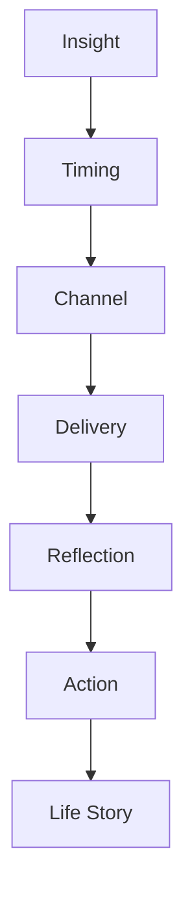

# MODULE 19 — NOTIFICATIONS EXPERIENCE

---

## 1. Product Goals

**Business Goals**: notifications exist to serve retention only as a byproduct of genuine value delivery (Module 1's Decision Framework) — never as an independently-optimized growth lever, which this module treats as an explicit, standing constraint on every other goal below.

**Reflection Goals**: a notification's only legitimate purpose is to prompt genuine reflection or reconnect the user with something meaningful already established in the relationship — never to generate an open or a click for its own sake.

**Retention Goals**: measured by whether notified users go on to have meaningful engagement (Module 1's North Star), never by open rate or notification volume.

**Relationship Goals**: every notification is, structurally and tonally, the Companion speaking (Module 9's personality, unchanged) — never a separate "marketing voice."

**Trust Goals**: this module has the highest per-user-annoyance risk of any module in the Bible, since it's the one surface that reaches a user outside the app itself — held to the strictest possible Guardrail discipline as a result.

**Memory Goals**: every notification must trace to a genuine memory-based reason (Module 3, Section 13's already-established rule) — this module operationalizes that rule in full technical and design depth.

**Community Goals**: Community notifications (Module 18) follow the exact same standard as every other category — no exception for social-style engagement notifications.

**AI Goals**: notify only when meaningful, know when silence is better, learn preferred timing, never optimize for clicks, never manipulate attention.

---

## 2. Notification Philosophy

**Why notifications exist**: to occasionally, respectfully reconnect a user with something genuinely meaningful in their ongoing relationship with the Companion — never to pull attention back to the app for its own sake.

**Meaning over frequency**: one deeply relevant notification a month beats ten generic ones a day — frequency is never a target, meaning always is.

**Timing over quantity**: the right single moment matters more than how many chances are taken to reach a user.

**Reflection over interruption**: a notification should invite reflection when opened, never simply interrupt whatever the user was doing.

**Care over engagement**: the test for every notification is whether it demonstrates genuine care about the user's life, not whether it's likely to be opened.

**Trust over attention**: this module would rather send fewer notifications and preserve trust than send more and win short-term attention — directly enforcing Module 1's Decision Framework at the level of a single push-notification decision.

**The standing creed** (governs every design decision in this module):
> **Every notification should have a reason. Every reminder should have meaning. Silence is better than interruption. Trust is worth more than attention. The best notification is often the one never sent.**

---

## 3. Notification Lifecycle



**Insight**: a genuine, memory-based reason exists — something the Companion would naturally want to check in about, drawn from Module 10's Memory/Insight Engine, never manufactured for the sake of having something to send.

**Decision**: the Notification Intelligence Engine (Section 6) evaluates whether this Insight actually warrants reaching the user outside the app at all — the default answer is no (per the creed) unless the Insight clears a genuine, meaningful bar.

**Timing**: if a notification is warranted, the Timing Engine (Section 10) determines the right moment — never an arbitrary fixed schedule.

**Notification**: the actual delivery, in the Companion's own voice (Section 7), specific and honest.

**Reflection**: what happens when the user opens it — a genuine continuation of something meaningful, not a bait-and-switch into unrelated content.

**Action**: whatever the user does next (a conversation, a Journal entry, simply dismissing it) — all equally valid outcomes; dismissal is never treated as a failure requiring a follow-up nudge.

**Growth → Life Story**: whatever genuine engagement results feeds back into the same Memory/Insight/Reports pipeline as any other interaction.

---

## 4. Notification Structure

| Category | What triggers it | Standing rule from Module 3, Section 13 restated/extended |
|---|---|---|
| **Reflection reminders** | A genuinely relevant open thread or seasonal moment (e.g., a Discovery system's natural cadence) | Never generic "come back and reflect!" — always tied to something specific |
| **Memory reminders** | A significant memory becoming newly relevant (e.g., an anniversary of a Life Event) | The clearest, highest-value notification category in the whole module |
| **Journal reminders** | Only when a genuinely relevant prompt exists (Module 11's identical standing rule) | Never a daily "don't forget to journal" nag |
| **Reports ready** | A new Report has genuinely finished generating (Module 16's evidence-gating) | Never a "your report is almost ready" teaser — only sent once genuinely ready |
| **Discovery reminders** | A natural cadence moment (Tarot's daily ritual, if the user has opted into that rhythm; Eastern Horoscope's annual transition) | Never pushed for a user who hasn't shown genuine engagement with that specific Discovery system |
| **Community notifications** | A genuine reply to the user's own post/question (Module 18) | Never a generic "new activity in your groups!" digest bait |
| **Learning reminders** | Relevant to Module 16's Learning Report/Timeline threads | Rare, tied to genuine accumulated learning content |
| **Achievements** | Explicitly **not used** as a category — no badges, streaks, or milestone-completion notifications (Guardrail) | Listed here only to confirm its deliberate absence, not to specify its design |
| **Relationship moments** | A genuine Relationship Lifecycle stage transition (Module 9, Section 3) reaching a milestone worth acknowledging (e.g., a year of using the Companion) | Framed warmly and specifically, never as a gamified "level up" |
| **System notifications** | Security/account notices (Module 3, Section 13's highest-priority, non-negotiable category) | Functional, not relationship-toned — the one category exempt from the Companion-voice requirement, since it's inherently operational |

---

## 5. Notification Experience

**Overview**: a Notification Center (Module 3's standing Notification Card component) listing recent notifications, grouped by time — never an unread-count badge designed to create anxiety about clearing it (a deliberate, explicit deviation from the near-universal red-badge convention).

**Notification Center**: chronological, calm, no "mark all as read" urgency framing.

**Push**: used only for genuinely time-sensitive or high-significance content (Section 4's categories, filtered by the Timing Engine, Section 10).

**Email**: used for lower-urgency, richer content (e.g., a Report-ready notice with a bit more context) where a push notification's brevity would undersell the moment.

**In-app**: the Notification Center itself, plus contextual surfacing (a relevant notification appearing as part of Dashboard's own resolved recommendation, Module 8, rather than a separate list the user must separately check).

**Priority**: Module 3, Section 13's tiering (System > Memory > Journal/Companion > Reports/Discovery > Community) governs both delivery promptness and grouping.

**Grouping**: high-priority notifications (Memory, System) are never batched; low-priority (Community digest) can be batched into a weekly summary, per Module 3's existing rule.

**Navigation**: tapping any notification routes directly into the relevant module (Companion, Journal, Reports, Community) with full context already loaded — never a generic app-open with the user left to find the relevant content themselves.

**Interaction**: dismiss, open, or (rarely) snooze — no forced acknowledgment, no nagging re-surfacing of a dismissed notification.

**Emotion**: gentle, warm, specific — every notification should read as something a thoughtful friend would actually say, not something a marketing calendar scheduled.

---

## 6. Notification Intelligence Engine

**How AI decides whether to notify**: the default is no — a notification is sent only when a genuine, specific Insight (Section 3) clears an explicit relevance/significance bar (Section 18), reusing Module 10's significance scoring rather than a separate, looser threshold for this module.

**How AI decides timing**: per the Timing Engine (Section 10) — a time genuinely appropriate for the specific content and the specific user's own established patterns, never a company-wide fixed send time.

**How AI decides channel**: push for time-sensitive/high-significance content, email for richer/lower-urgency content, in-app-only for content that doesn't warrant reaching outside the app at all (the majority of cases, by design).

**How AI prevents overload**: a standing per-user notification budget/cooldown (Section 17) ensures no user receives more than a small, deliberately conservative number of notifications in a given period, regardless of how many individually-valid Insights might otherwise qualify — if multiple genuine reasons to notify exist simultaneously, the engine selects the single most significant one and defers/discards the rest, matching the singularity principle already established across Modules 8/9/18.

**How AI avoids manipulation**: every notification's copy is checked against the same standing content rules as Companion (Module 9, Section 4) and against Module 1's Guardrails explicitly — no urgency language, no fear-of-missing-out framing, no engineered curiosity gaps ("You won't believe what your chart says today!").

---

## 7. Companion Interaction

**How Companion creates reminders**: any notification framed as coming from the Companion (Section 4's default) is generated using the same Companion AI service and voice (Module 9) as any in-app message — never a separately-authored marketing-team copy template.

**Reflection prompts**: drawn from genuinely relevant Journal/Discovery context (Module 11, Section 9's identical prompt-sourcing logic).

**Conversation follow-up**: a genuinely unresolved thread from a past conversation, surfaced respectfully and only occasionally.

**Memory resurfacing**: the single highest-value notification type (Section 4) — a significant memory becoming newly relevant.

**Growth reminders**: tied to genuine Relationship Lifecycle or Growth Theme/Area evolution (Modules 9/13/15), never generic motivational content.

**Relationship continuity**: notifications should read as a continuation of an ongoing relationship's own voice and history, never as if a different, more transactional "notifications system" is speaking on the Companion's behalf.

---

## 8. Memory Interaction

**Memory resurfacing**: a notification referencing a specific stored memory always uses the same Memory Card transparency (Module 4/10) once opened — the user can always see exactly what's being referenced and why.

**Important anniversaries**: a Life Event-type memory's anniversary is a natural, high-quality notification trigger, framed warmly and specifically ("A year ago you were just starting the new job — a lot has happened since then").

**Life Chapters**: a newly-identified Life Chapter (Module 16) can be a rare, significant notification trigger, since it represents genuinely substantial accumulated Insight.

**Reports**: a genuinely-ready Report (Module 16's evidence-gating) is a standing, reliable notification trigger.

**Reflection timing**: the same significance-over-recency weighting established in Module 10, Section 7 governs which memory, among several plausible candidates, is chosen for a given notification moment.

**Consent**: notifications drawing on Community content (Module 18) respect that module's strict consent boundaries — a notification never surfaces or references anything the user hasn't explicitly made visible.

**Example**: "Nervous about the new job" (Module 7's running example) resurfacing three weeks later as a specific, warm Companion notification — the canonical example already established in Module 3, Section 13 and referenced throughout this Bible.

---

## 9. Personalization Engine

**Relationship stage / Memory / Journal / Reports / Discovery / Community / Growth**: identical signal set to every other module's personalization engine — Notifications introduces no new input types, only a filter (Section 6/10) determining whether and when any of this content is worth surfacing outside the app.

**Premium**: Premium's deeper memory retrieval window (Module 17) can surface a richer set of candidate Insights for notification purposes, but the notification *frequency* and *tone* standard is identical across tiers (Module 17, Section 7's hard equal-quality rule extended here) — Premium never means more notifications, only potentially richer content within the same conservative budget (Section 6).

**Adaptation**: over time, the Timing Engine (Section 10) learns a given user's actual preferred timing/frequency from their own engagement patterns (Section 15), narrowing toward what that specific person finds genuinely welcome, never toward what maximizes aggregate open rates across all users.

---

## 10. Timing Engine

**Right moment**: inferred from the user's own historical active-usage patterns (time of day they typically engage) combined with the content's own natural relevance window (e.g., a memory anniversary notification sent on the actual day, not days later) — never a single global send time applied to all users.

**Right frequency**: governed by the standing per-user budget/cooldown (Section 6/17) — a conservative default (e.g., no more than a small number of proactive notifications per week, System notifications excepted) that narrows further for a user who shows signs of preferring less.

**Right urgency**: nearly every notification in this module is low-urgency by design (Section 4's categories) — only System notifications (security/account) carry genuine urgency, and are the only category permitted any degree of insistence in tone.

**Right silence**: the engine's default output for the overwhelming majority of days is "send nothing" — this is treated as the expected, healthy outcome, not a missed opportunity to be optimized away.

**Timing model summary**:
```
function decideNotification(userId, candidateInsights):
    if candidateInsights.isEmpty:
        return NoNotification  # the default, expected outcome

    significant = filterBySignificanceThreshold(candidateInsights)  # Module 10 scoring
    if significant.isEmpty:
        return NoNotification

    withinBudget = checkCooldownBudget(userId)  # Section 6/17
    if not withinBudget:
        return NoNotification  # even a genuinely significant Insight defers if budget is exhausted

    best = selectSingleMostSignificant(significant)  # never more than one
    timing = inferOptimalTiming(userId, best)  # user's own patterns, not a global schedule

    return scheduleNotification(best, timing)
```

---

## 11. Ethics Philosophy

**No manipulation**: no notification copy is engineered to produce anxiety, curiosity gaps, or compulsive checking.

**No FOMO**: nothing is framed as time-limited or exclusive to create pressure to open immediately.

**No guilt**: no "we miss you" or "your streak is at risk" framing — consistent with the standing rejection of streak mechanics across the entire product (Module 8's identical rule).

**No fake urgency**: reserved exclusively, and honestly, for genuine System notifications (security/account).

**No addictive notifications**: the conservative budget (Section 6/10/17) is itself the primary structural defense against this — frequency is capped regardless of how many valid Insights exist.

**No engagement optimization**: the Timing/Intelligence Engines are never tuned to maximize open rate or click-through as an objective — success metrics (Section 15) explicitly exclude raw open rate as a target.

**Transparency**: every notification, once opened, shows exactly what memory/context it's based on (Section 8) — never an unexplained, opaque prompt.

**Respect**: notification preferences (Section 17) are easy to adjust, fully granular, and never buried or made deliberately hard to find (a common dark-pattern convention this product explicitly avoids).

**Silence is valuable**: the module's central, load-bearing philosophical stance — the absence of a notification on a given day is a correct, intended, healthy outcome, not a gap to be filled.

---

## 12. Notification Journey

| Stage | What happens | Design intent |
|---|---|---|
| **First notification** | Should not arrive too early — a user needs enough of a relationship established (Module 7/9) before any notification has real context to draw from | Prevents a hollow, premature "we miss you already" notification in the first days |
| **First reflection reminder** | Tied to a genuinely relevant thread from early conversation | Establishes the pattern: every notification means something specific |
| **First report** | The Reports-ready notification (Module 16), typically the first genuinely substantial notification a user receives | A strong, legitimate early proof point of the whole module's value |
| **First community reply** | A genuine reply to the user's own Community post/question (Module 18) | Specific, never a generic "new activity" digest |
| **Memory resurfacing** | An early, well-chosen memory-anniversary or thread-follow-up moment | The clearest single demonstration of "this app actually remembers me," reinforced outside the app itself |
| **Life Story reminder** | A rare, significant Life Chapter or Yearly Review-adjacent notification | Reserved for genuinely substantial accumulated Insight |
| **Long-term relationship** | An established, comfortable rhythm the user has implicitly shaped through their own engagement patterns (Section 10's adaptive timing) | The steady-state outcome this entire module is designed to reach |

---

## 13. Loading Experience

| Moment | Emotion |
|---|---|
| **Sync** (Notification Center refresh) | Standard skeleton loading (Module 4), brief |
| **Delivery** (push/email send) | Invisible to the user by design — no user-facing "sending..." state |
| **Grouping** (batched low-priority digest assembly) | Invisible background process |
| **Animations** | Standard Module 4 timing for Notification Center list rendering; no special attention-grabbing animation for new/unread items (no bouncing badge icons) |

---

## 14. Error Experience

| Failure | Behavior | Recovery |
|---|---|---|
| **Offline** | Notifications queue server-side and deliver once the device reconnects; no urgent "catch-up" burst of all missed notifications at once — the same per-notification significance/budget filtering applies even to queued content | Delivered per standard timing rules once online |
| **Permission denied** (user has disabled push) | Respected fully and immediately — no repeated in-app nagging to "turn on notifications" | In-app Notification Center remains fully functional regardless of push permission status |
| **Notification delayed** | A delayed but still genuinely relevant notification is simply delivered late rather than discarded or artificially re-timed to seem current | N/A |
| **Duplicate notification** (a technical delivery-retry error) | De-duplication logic (Section 17) prevents this from reaching the user twice | Automatic |
| **Delivery failed** (push service error) | Falls back to in-app Notification Center visibility at minimum — the user is never left with no record of a genuinely significant notification just because push delivery failed | Retry via push; guaranteed in-app fallback |

---

## 15. Analytics

**Meaningful opens**: whether an opened notification leads to genuine continued engagement (a conversation, a Journal entry), not just the open itself.

**Reflection rate**: proportion of notifications that lead to actual reflective engagement — the primary quality signal for this module.

**Conversation continuation / Journal continuation**: identical framing to every other module's standing "the real success metric is what happens after," never the click itself.

**Community engagement**: same standard, applied to Community-sourced notifications (Module 18).

**Retention**: correlation between well-calibrated (low-frequency, high-relevance) notification exposure and long-term retention — used to validate, not to justify increasing, notification frequency.

**Notification fatigue**: explicitly tracked as a risk metric — opt-out rate, permission-revocation rate, and any signal of declining engagement correlated with notification frequency are treated as early-warning signs requiring the Timing Engine to pull back, never as a reason to test more aggressive tactics.

**KPIs**: Reflection rate (primary); notification-fatigue/opt-out rate (a hard ceiling metric — the module should actively defend against this rising, not simply monitor it); raw open rate and raw send volume are explicitly and deliberately **not** tracked as success KPIs, consistent with the standing "never optimize for clicks" requirement.

---

## 16. Edge Cases

**Silent users** (no engagement with notifications over a long period): the engine doesn't escalate frequency or urgency to compensate — it simply continues sending at its already-conservative rate, or less, per the user's own inferred preference (Section 10), never treating silence as a problem to be solved with more noise.

**Heavy users**: even a highly engaged user doesn't receive more notifications than the standing budget allows — engagement level with the product overall doesn't translate into permission for more frequent outreach.

**Vacation** (a Do Not Disturb-adjacent extended pause, inferred from a sudden usage gap or explicit setting): the engine can infer or respect an explicit setting to pause non-critical notifications entirely, resuming gently (never with a "catch-up" burst) on return.

**Do Not Disturb**: device-level DND settings are fully respected; the product does not attempt to bypass or work around them for any notification category, System notifications included, except where the underlying OS itself carves out an exception (e.g., critical account-security alerts, handled per platform convention, not a BeaconVie-specific override).

**Burnout** (signs of user overwhelm, matching Module 8's identical detection concept): the Timing Engine reduces frequency further, consistent with Module 8's overwhelmed-user Dashboard-simplification rule extended into this module.

**Sensitive memories**: a notification referencing something emotionally significant is worded with the same care as Module 9's emotional-intelligence rules — warm, specific, never casually flip about heavy content.

**Grief**: a memory-anniversary notification touching on loss is handled with the same compassion as Module 9, Section 10's Grief conversation-type and Module 16, Section 16's Relationship-loss narration — never framed with default cheerful "look how far you've come!" energy if the evidence doesn't support that framing.

**Trauma**: if any underlying memory involved in a potential notification touches on content flagged under Module 9, Section 13's Safety Philosophy, the notification-generation pipeline defers entirely to that Safety Philosophy's standing rules — a proactive notification is never the right channel to surface something crisis-adjacent; that content is handled, if at all, within the Companion conversation itself, never via an external push.

---

## 17. Technical Specification

**Notification engine**: evaluates candidate Insights (Section 3/10) against significance thresholds and per-user budget, selects the single best candidate if any clears the bar, and schedules delivery.

**Scheduling**: per-user optimal-timing inference (Section 10), not a global cron-based blast schedule.

**Priority queue**: System > Memory > Journal/Companion > Reports/Discovery > Community, matching Module 3, Section 13's established tiering exactly.

**Deduplication**: idempotency keys per Insight-source (e.g., a specific memory node ID) prevent the same underlying reason from generating multiple notifications across delivery retries or overlapping evaluation runs.

**Preference system**: granular, user-controlled settings (Module 3's Settings module) covering channel (push/email/in-app-only) and category (Section 4) opt-outs — easy to find, easy to adjust, never buried multiple menus deep.

**API**: internal `NotificationService.evaluate(userId)` (runs the Timing/Intelligence Engine), `NotificationService.deliver(notification, channel)`, user-facing `GET /notifications` (Notification Center), `PATCH /notifications/preferences`.

**Database**: `notification(id, user_id, category, source_memory_id, channel, scheduled_at, delivered_at, opened_at, status)`, `notification_preference(user_id, category, channel_enabled)`.

**Caching**: per-user notification budget/cooldown state cached in Redis for fast evaluation-time checks.

**Queues**: BullMQ handles scheduled evaluation runs and actual push/email delivery asynchronously, decoupled from any user-facing request path.

**Frontend**: Notification Center reuses Module 4's Notification Card component and List pattern exactly — no bespoke visual system, no unread-count red-badge convention (Section 5's deliberate deviation).

---

## 18. Notification Reasoning Engine

```
function evaluateForNotification(userId):
    relationshipContext = getRelationshipStage(userId)  # Module 9, Section 3
    memoryCandidates = getSignificantRecentMemory(userId)  # Module 10, Section 7

    meaningfulCandidates = filterByGenuineRelevance(memoryCandidates, relationshipContext)
    if meaningfulCandidates.isEmpty:
        return NoNotification  # the expected default

    timing = resolveOptimalTiming(userId)  # Section 10
    notification = composeInCompanionVoice(meaningfulCandidates.best)  # Module 9's actual voice, not marketing copy

    return { notification, timing }
```

**Relationship → Memory → Meaning → Timing → Notification → Reflection → Growth**: each stage is a genuine gate, not a formality — a candidate must survive relationship-appropriateness, memory significance, and timing-fit checks before a notification is ever composed, and composition itself reuses the Companion's actual voice rather than a separate copywriting layer.

---

## 19. Notification Reasoning Pipeline



Maps to Section 3's Lifecycle and Section 18's reasoning model — Channel selection (push/email/in-app) sits between Timing and Delivery as the point where Section 5's channel rules are applied, closing into the same Reflection/Action/Life Story loop every other module in this Bible ultimately feeds.

---

## 20. UX Specification

**Desktop/Tablet/Mobile**: consistent Notification Center structure across breakpoints (Module 4, Section 6); push notifications follow each platform's native conventions without introducing custom, attention-grabbing visual treatments beyond the OS default.

**Notification Center**: chronological list (Module 4's List component), grouped by relative time, no unread-badge urgency styling.

**Cards**: standard Notification Card component (Module 4, Section 5), one visual style per category (Section 4) matching each category's established accent (e.g., Memory notifications use the same gold Insight accent as in-product Memory Cards, Module 4, Section 4).

**Accessibility**: full screen-reader support for the Notification Center and for push-notification content itself (proper OS-level accessibility labeling).

**Navigation**: tap-through routes directly into full relevant context (Section 5).

**Reading flow**: notification received → opened → routed directly into the relevant module with context pre-loaded → genuine continuation of the relationship, never a dead-end landing screen.

---

## 21. QA Checklist

- **Timing**: verify the Timing Engine's per-user adaptive scheduling (Section 10) functions correctly and never defaults to a global fixed-time blast.
- **Priority**: verify the priority queue (Section 17) correctly tiers and never batches high-priority (Memory/System) content.
- **Deduplication**: verify idempotency keys prevent duplicate delivery across retry scenarios.
- **Frontend**: verify Notification Center matches Module 4 component specs exactly, with no red-badge/unread-count urgency element present.
- **Backend**: verify the per-user budget/cooldown (Section 6/10/17) is correctly enforced even when multiple valid Insights exist simultaneously.
- **Accessibility**: verify full screen-reader support for both in-app and push notification content.
- **Performance**: verify evaluation runs (Section 18) execute efficiently at scale without needing to relax significance thresholds to manage load (a real risk worth explicitly testing against).
- **Analytics**: verify tracked KPIs (Section 15) exclude raw open rate/send volume as any kind of tracked success target, and that fatigue/opt-out metrics are actively monitored as a ceiling, not just logged.
- **Trust**: dedicated review confirming zero instances of urgency, FOMO, or guilt-based copy across every notification category template — this module's single highest-priority QA category given its explicit "voice of the Companion, not Marketing" standing requirement.

---

## 22. Future Expansion

**Smart Digest**: a periodic, opt-in, low-priority-category-only digest (e.g., weekly Community activity) — must remain genuinely optional and never creep into replacing the individually-significant notification model for higher-priority categories.

**Weekly Reflection Digest**: a plausible, gentle summary format, subject to the same evidence/significance gating as any individual notification — never generated as filler content just to have something to send weekly.

**AI Notification Coach**: explicitly rejected as a direction, consistent with this Bible's repeated rejection of more directive AI personas (Modules 11/13/17) — a "coach" framing for notification timing/behavior would misrepresent this module's actual, restrained role.

**Adaptive Timing**: already the core mechanism (Section 10) — flagged here only as an area for continued refinement as more usage data accumulates, not a new capability.

**Family Notifications**: same standing multi-consent caution as every other module touching shared/family contexts (Modules 2/6/17) — a family member must never receive or see notifications derived from another's personal memory content.

**Cross-device Continuity**: notification state (read/unread, delivered) should sync correctly across a user's multiple devices (Module 6's multi-device session architecture) — flagged as a technical requirement to verify, not a new design capability.

**Calendar Integration**: a plausible future signal source for Timing Engine inference (e.g., avoiding notification delivery during a calendar-marked busy period, with explicit user permission) — deferred until core timing intelligence (Section 10) is well-validated on existing signals first.

**Wearables**: a plausible future delivery channel once Module 2's broader Wearables integration exists — would need to pass through the identical significance/budget gating as every other channel, never a new, looser standard for a novel surface.

---

## 23. Final Decisions

**Chosen Notification Model**
A default-to-silence system where a notification is only ever composed and sent once a genuine, memory-significant Insight clears an explicit relevance threshold and a conservative per-user budget, timed via adaptive, user-specific inference rather than a global schedule, delivered in the Companion's own authentic voice through the channel (push/email/in-app) best suited to the content's urgency and depth, with raw open rate and send volume explicitly excluded from this module's success metrics in favor of downstream reflection/engagement quality and a hard ceiling on fatigue/opt-out signals.

**Rejected Alternatives**
- A global, scheduled notification cadence (e.g., daily reminders at a fixed time) — rejected in favor of per-user adaptive timing and genuine-Insight gating, consistent with the standing "timing over quantity" principle.
- Streak/achievement/gamified notification content — rejected outright, consistent with the product-wide rejection of gamification mechanics (Module 1's Guardrails).
- Tracking and optimizing for raw open rate or click-through — rejected as the precise anti-pattern this module's Quality Requirements and Ethics Philosophy name explicitly; success is measured downstream, in genuine reflective engagement.
- An unread-count red-badge Notification Center convention — rejected as introducing exactly the anxiety-driven "clear this" pressure this module's entire philosophy exists to avoid.
- Escalating frequency for silent or heavy users — rejected in both directions; neither silence nor heavy usage earns a different (higher) notification frequency than the standing conservative budget allows.

**Trade-offs**
A conservative, silence-by-default notification model will produce lower raw engagement/re-open metrics than a conventional growth-optimized notification system would — accepted deliberately, since this module's entire premise is that trust preserved by restraint is worth more than attention captured by frequency, directly mirroring Module 1's Decision Framework applied at its most granular, per-notification level.

**Reasons**
Every decision in this module operationalizes the standing creed — every notification should have a reason, every reminder should have meaning, silence is better than interruption, trust is worth more than attention, the best notification is often the one never sent — while keeping every notification structurally and tonally the voice of the Companion (Module 9), never a separate marketing system, consistent with this module's explicit standing consistency requirement.

---

**Next module in sequence: Settings.**
