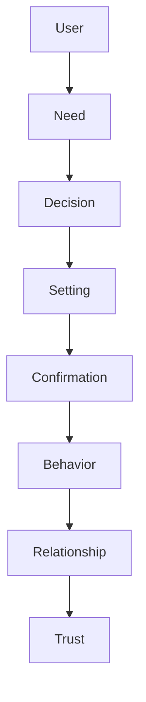
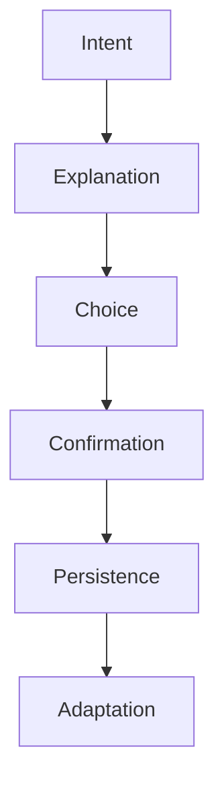

# MODULE 20 — SETTINGS EXPERIENCE

---

## 1. Product Goals

**Business Goals**: Settings is where trust, once built by every other module, is either preserved or spent — a user who feels genuinely in control here is more likely to keep disclosing to Journal/Companion at all, making this module a quiet but real retention lever indirectly.

**Trust Goals**: every setting exists to make the relationship's actual behavior visible and controllable — this module is the practical, everyday realization of Module 1's Privacy value and Decision Framework (Trust as the top-ranked priority).

**Relationship Goals**: Settings should feel like the place a user defines the terms of their relationship with BeaconVie, not a technical configuration page bolted onto the side of the product.

**Transparency Goals**: a user should always be able to answer, from within this module alone, "what does it know, what does it remember, what can it do, what do I control" — with no need to guess or take anything on faith.

**Privacy Goals**: every data-control right established throughout this Bible (export, delete, consent granularity) is concretely, accessibly implemented here — Settings is where those standing rights become real, clickable actions.

**Security Goals**: account/device/session controls (building on Module 6) are clear and easy to use without requiring technical fluency.

**AI Goals**: the Companion's behavior (memory retention, reflection frequency, tone within its fixed personality bounds) is explainable and, where genuinely adjustable, adjustable here — never secretly changed, never opaque.

**Accessibility Goals**: Settings is itself where accessibility preferences live, and must meet the highest accessibility bar in the product, since a user who can't operate Settings can't exercise control over anything else.

---

## 2. Settings Philosophy

**Why Settings exist**: to make every consequential thing BeaconVie does about a user's own data and relationship visible, explained, and directly controllable — trust that isn't backed by real, accessible control is just an assertion.

**Control over convenience**: where a genuine trade-off exists between a smoother default and clearer user control, this module chooses control — even at the cost of one more tap or one more explained decision.

**Transparency over automation**: nothing in Settings is automated silently on the user's behalf without their knowledge — if a setting has a smart default, that default is disclosed as a default, never hidden as if it were the only option.

**Trust over complexity**: settings are organized and worded for genuine understanding, not technical completeness — a setting a typical user can't understand is a setting that has failed at this module's actual job, however precisely it might describe the underlying system.

**Safety over hidden behavior**: nothing about how memory, AI behavior, or data sharing works is left undocumented here, even where the detail is unflattering or the answer is "yes, we do retain this" — hiding an uncomfortable truth in the name of a cleaner UI would violate this module's entire purpose.

**The standing creed** (governs every design decision in this module):
> **Every setting should be understandable. Every permission should be explicit. Every change should be reversible. Every consequence should be explained. Users should always remain in control.**

---

## 3. Settings Lifecycle



**User**: arrives at Settings with a specific need — curiosity, a concern, a desire to adjust something.

**Need**: the actual underlying question ("what does it remember about me," "how do I stop notifications," "how do I delete my data").

**Decision**: the user, having found and understood the relevant setting (Section 5's navigation/search), decides what they want.

**Setting**: the actual toggle/action, worded plainly, with consequences stated (Section 11).

**Confirmation**: for any consequential (especially destructive) action, a clear, honest confirmation step (Module 4's Dialog pattern, reused exactly).

**Behavior**: the product's actual behavior changes accordingly — immediately, verifiably, and exactly as described.

**Relationship**: the user's experience of the product reflects the change (e.g., notifications genuinely stop, memory genuinely isn't retained past a chosen point).

**Trust**: the cumulative effect of settings always doing exactly what they said — this is the entire mechanism by which this module contributes to the product's overall trust thesis (Module 1).

---

## 4. Settings Structure

| Section | What it covers |
|---|---|
| **Profile** | Display name, avatar (Module 4/6/8's standing minimal-default treatment) |
| **Account** | Email, password/OAuth-linked methods, account deletion (Module 6) |
| **Companion** | Relationship/tone preferences within Module 9's fixed personality bounds (Section 7) |
| **Memory** | Retention window (tier-dependent, Module 17), viewing, editing (via deletion, Module 10), deletion, export (Section 8) |
| **Journal** | Privacy confirmation (already strict by default, Module 11), export, deletion |
| **Reports** | Report-type preferences, export |
| **Community** | Pseudonymous profile management, Group memberships, sharing-consent history (Module 18) |
| **Notifications** | Full granular category/channel controls (Module 19, Section 17) |
| **Discovery** | Birth-data management (Natal Chart/Numerology/Eastern Horoscope, Modules 13–15), reading-history preferences |
| **Premium** | Subscription status, billing, upgrade/downgrade (Module 17) |
| **Language** | Locale preference (Module 7's inferred-by-default, adjustable here) |
| **Theme** | Dusk (default) / Light mode (Module 4) |
| **Accessibility** | Text size, motion reduction, screen-reader-specific preferences (Module 4, Section 12) |
| **Devices** | Active sessions/devices (Module 6, Section 7's multi-device architecture), sign-out per device |
| **Security** | Password change, login-notification preferences (Module 6, Section 10) |
| **Privacy** | Consent management (AI-training-use opt-in, Module 6, Section 9; Community-sharing consent, Module 18, Section 8) |
| **Data** | Full export, full deletion (Section 8) |
| **Support** | Contact/help access |
| **About** | App version, legal (Terms/Privacy Notice links, Module 6/5) |

---

## 5. Settings Experience

**Overview**: a calm, categorized list (Section 4's structure), not a dense technical grid — organized around the user's actual relationship with the product (Profile/Companion/Memory first) rather than an engineering-convenient alphabetical or system-architecture-mirroring order.

**Navigation**: category list → individual setting screens, matching Module 3's two-tap-maximum navigation depth rule.

**Categories**: grouped logically (Section 4's ordering: identity/relationship-facing settings first, technical/account settings later) — mirroring how a user actually thinks about their relationship with BeaconVie, not how the backend is organized.

**Search**: a single search box at the top of Settings, since even a well-organized list can be slower than "let me just search for 'delete my data.'"

**Quick Settings**: the handful of most commonly needed actions (data export, notification pause, theme toggle) are one tap from the Settings home screen, not buried in sub-categories.

**Advanced Settings**: more granular or rarely-needed controls (e.g., per-Discovery-system birth-data edits) sit one level deeper, consistent with progressive disclosure (Module 3).

**Interaction**: toggles/actions apply immediately with visible confirmation (Section 13) — no separate "Save" button requiring the user to remember to commit a change (a common source of the "did that actually save?" uncertainty this module exists to eliminate).

**Animations**: minimal, standard Module 4 timing — Settings is a utility space, and should never compete visually with the product's more expressive surfaces (Discovery, Companion).

**Emotion**: calm, clear, reassuring — the specific emotional register this module aims for is "I understand exactly what just happened," more than warmth for its own sake.

---

## 6. Settings Intelligence Engine

**How AI recommends settings**: rarely, and only when genuinely useful — e.g., noticing a user has never adjusted notification preferences despite showing signs of fatigue (Module 19, Section 16) might prompt a gentle, optional suggestion to review notification settings; never a nag.

**How AI simplifies complexity**: plain-language explanations accompany every setting (Section 11) — the AI (or, more precisely, well-written static copy reviewed for clarity, not a live AI-generated explanation per view) translates technical reality into what it actually means for the user's day-to-day experience.

**How AI explains settings**: an optional "what does this mean?" expansion on any setting, written in the same plain, specific voice established throughout Module 4's Content Design system.

**How AI detects confusion**: if a user repeatedly opens and closes a setting without changing it, or searches for the same term multiple times, this can inform which settings' copy needs revision (an internal content-quality signal, Section 15) — never used to trigger an intrusive in-app prompt asking "need help?"

**How AI restores defaults**: a simple, always-available "reset to default" action per section, with a plain confirmation of exactly what will change back.

---

## 7. Companion Interaction

**Relationship preferences**: within Module 9's fixed personality bounds (warm, curious, calm — never user-configurable away from these core traits, Module 9, Section 6), a user can adjust genuinely safe, bounded preferences — e.g., how often the Companion proactively reaches out via Dashboard/Notifications (Module 19's frequency controls) rather than the Companion's fundamental character.

**Conversation style**: no "make the Companion blunter" or "make the Companion more clinical" toggle — Module 9's standing personality constraints are not user-configurable, since varying them would undermine the carefully-designed emotional safety this Bible establishes throughout; this is stated plainly in Settings itself, not left as an unexplained absence.

**Companion personality**: fixed, as above — explained honestly rather than simply omitted, so a user who might expect this kind of control understands why it isn't offered.

**Memory behavior**: retention window (tier-dependent, Module 17), what counts as memory-worthy (not directly user-configurable, since the significance threshold, Module 10, is a quality mechanism, not a preference) — but full visibility into what has been remembered (Section 8) is always available.

**Reflection frequency**: how often the Companion offers Insight-level observations (Module 9, Section 9) can be gently adjusted (e.g., "less frequent" for a user who finds it too much) within the bounds of the Reflection Engine's existing restraint-first design.

**Tone**: not separately configurable beyond the above — Module 9's tone is deliberately consistent for every user, a design decision explained here rather than hidden.

**Boundaries**: a user can explicitly ask the Companion to avoid certain topics/reflection styles going forward — respected as an ongoing preference (Module 9, Section 17's identical standing respect for user-stated limits).

---

## 8. Memory Interaction

**Memory permissions**: the AI-training-use consent toggle (Module 6, Section 9) lives here, off by default, plainly explained, fully revocable at any time.

**Memory retention**: the tier-dependent retrieval window (Module 17, Section 8) is disclosed plainly — a user can see exactly how far back active retrieval currently reaches.

**Memory editing**: implemented as deletion (Module 10's standing rule), explained honestly here rather than offering a misleading "edit" affordance that doesn't actually exist.

**Memory deletion**: the full Memory Timeline (Module 10, Section 21) is reachable from here, with per-item deletion always available, plus a "delete all memory" nuclear option with the clearest possible consequence statement.

**Memory transparency**: a dedicated "what BeaconVie remembers about me" view — effectively the full Memory Timeline/Search surface (Module 10), reachable directly from Settings as well as from its own module entry point (Module 3's navigation), since a user looking for transparency specifically often starts from Settings.

**Memory export**: full export (Module 6, Section 9) in a plain, portable format.

**Consent**: every memory-adjacent permission (AI training use, Community sharing history, Module 18) is listed together under Privacy (Section 9), never scattered without a single place to review them all at once.

**Example**: a user opens Settings → Memory and sees a plain summary: "You have 214 stored memories going back 8 months. Your plan keeps the most recent and most significant ones readily available; everything is still yours to view, export, or delete anytime" — followed by direct links to the full Timeline, Export, and Delete actions.

---

## 9. Privacy Engine

**Data collection**: disclosed plainly (linking to the full Privacy Notice, Module 6, Section 9) — what's collected and why, in plain language first, legal detail available on request.

**Consent**: every specific, granular consent (AI training use, Community sharing) is individually toggleable and individually revocable — never bundled into a single "I agree to everything" switch beyond the one, appropriately general Terms/Privacy consent given at signup (Module 6, Section 9).

**Community visibility**: exactly what's visible to Community, to whom, and how to review/revoke any past sharing (Module 18, Section 8) — reiterated here for discoverability, not redefined.

**Journal visibility**: reaffirmed plainly as private-by-default, with no sharing mechanism to configure at all (Module 11's standing architectural fact, not a toggle).

**Companion visibility**: reaffirmed that conversation content is private, viewable only by the user (and, per the standing Permission Architecture, only by Admin under an audited, reason-required override, Module 3, Section 11) — stated here plainly for a user who wants that assurance without having to dig through the full Privacy Notice.

**AI permissions**: the AI-training-use toggle (Section 8), the only AI-specific permission genuinely requiring separate, explicit consent per Module 6, Section 9.

**Third-party integrations**: currently minimal (payment provider, Module 1's stack) — disclosed plainly; any future integration would be added here with the same standing transparency requirement.

---

## 10. Personalization Engine

**Language / Theme / Accessibility**: straightforward, always-available preference toggles (Section 4), immediately effective.

**Learning / Discovery / Community / Notifications / Reports / Premium**: each surfaces its own relevant preferences within its own Settings sub-section (Section 4), all reachable from the same top-level Settings home, avoiding the common anti-pattern of scattering preferences across each individual module with no central place to review them all.

**Relationship stage**: not itself a setting, but disclosed transparently if a user is curious how the Companion's current behavior maps to Module 9's Relationship Lifecycle stages — a plain, optional "about your relationship with your Companion so far" explainer, not a gamified progress bar.

**Adaptation**: Settings itself doesn't adapt its own layout per user (a stable, predictable settings structure is more trustworthy than one that reorganizes itself) — personalization here means the *content* of certain sections (e.g., which Discovery systems have configurable birth data) varies by what the user has actually set up, never the overall navigational structure.

---

## 11. Ethics Philosophy

**No hidden settings**: every control that affects data, memory, notifications, or AI behavior is documented and reachable here — nothing is configurable only via a support ticket or hidden flag.

**No dark patterns**: canceling, deleting, and opting out are exactly as easy to find and complete as their opposite actions (Module 17's identical standing rule, applied product-wide here).

**No confusing language**: every setting's label states plainly what it does; technical terms are explained inline (Section 6), never left as unexplained jargon.

**No forced opt-in**: every consent (Section 9) defaults to the more private/conservative option, requiring explicit action to opt into anything less private, never the reverse.

**No misleading toggles**: a toggle's on/off state always accurately reflects actual system behavior — no toggle that looks "off" while data collection continues in the background.

**Transparency**: the standing, load-bearing requirement of this entire module.

**User ownership**: language throughout uses "your data," "your memories" — reinforcing, in the interface itself, that these are user rights being exercised, not privileges being granted by the company.

**Trust**: every rule above exists in service of the same outcome — a user who checks Settings should always find their trust confirmed, never undermined by a surprising discovery.

---

## 12. Settings Journey

| Stage | What happens | Design intent |
|---|---|---|
| **First setup** | Minimal — most preferences default sensibly (Module 7's standing anti-upfront-configuration rule extends here) | Settings shouldn't need visiting at all for a new user to have a good experience |
| **First privacy change** | Typically a Community-sharing consent decision (Module 18) or the AI-training-use toggle | The first moment a user exercises granular control — should work exactly as described, no surprises |
| **First AI preference** | Adjusting reflection frequency or reactivating a boundary (Section 7) | Reinforces that the Companion's behavior is genuinely responsive to explicit user preference |
| **First notification preference** | Adjusting category/channel settings (Module 19) | Should take effect immediately and verifiably |
| **First memory export** | A genuine trust-testing moment — does the export actually contain what was promised | The single highest-stakes "does this product do what it says" moment in this whole module |
"| **First account deletion request** | Handled with the same plain, non-manipulative consequence statement as any other destructive action (Module 6, Section 5) — no retention-offer maze | Confirms the product's stated respect for user autonomy at its most consequential test |
| **Long-term relationship** | Settings becomes a rarely-visited, quietly trusted background presence — the sign of a well-functioning relationship, not a module needing frequent attention | The intended steady-state outcome |

---

## 13. Loading Experience

| Moment | Emotion |
|---|---|
| **Loading** (Settings screen open) | Standard skeleton loading (Module 4), brief |
| **Sync** (cross-device preference sync) | Invisible by default |
| **Save** | Immediate, visible confirmation (a small, quiet checkmark/success state, Module 4, Section 9) — no separate "Save" button delay to begin with |
| **Confirmation** (destructive actions) | Module 4's standard Dialog pattern — plain, clear, unhurried |
| **Animations** | Minimal, standard Module 4 timing throughout |

---

## 14. Error Experience

| Failure | Behavior | Recovery |
|---|---|---|
| **Offline** | Settings changes queue locally and sync once reconnected, with a plain "will apply once you're back online" notice for any change that genuinely requires connectivity (e.g., a Premium billing change) | Auto-apply on reconnect |
| **Conflict** (a setting changed on two devices near-simultaneously) | Last-write-wins with a plain, honest notice if a conflicting recent change is overwritten — never a silent, unexplained resolution | User can re-apply the intended setting if the wrong version won |
| **Permission denied** (e.g., a billing action requiring re-authentication) | Clear, specific prompt to re-authenticate, matching Module 6's standing error-tone rules | Re-auth and retry |
| **Failed save** | Calm, specific error message; the UI reverts to the last known-good state rather than showing an ambiguous, possibly-wrong toggle position | Retry |
| **Rollback** (a destructive action needs to be reversed, e.g., accidental deletion within an undo window if one exists) | Where reversibility is genuinely possible (per the creed's "every change should be reversible" line), a brief undo window is offered; where an action is truly permanent (e.g., final account deletion after the confirmation period), this is stated plainly in advance, not glossed over | N/A once truly final |

---

## 15. Analytics

**Frequently changed settings**: informs which preferences genuinely matter to users and deserve more prominent placement (Section 5's Quick Settings).

**Ignored settings**: a low-engagement setting might indicate either genuine lack of need or poor discoverability/clarity — investigated via qualitative means (copy review, Section 6) rather than assumed to mean "remove this control."

**Search usage**: which terms users search for in Settings (Section 5) directly informs both navigation structure and content-clarity improvements.

**Accessibility adoption**: tracked to ensure accessibility features (Section 4) are genuinely discoverable and used by those who need them, not just theoretically present.

**Privacy adoption**: tracked in aggregate only (never inspected per-individual in a way that would itself violate the privacy this data concerns) — informs whether privacy controls are genuinely usable or too buried/confusing.

**Trust indicators**: correlation between Settings engagement (especially Memory/Privacy sections) and overall product trust signals (Module 1's retention/Reflection KPIs) — a user who visits and uses these controls confidently should show healthy, not declining, engagement elsewhere, validating that transparency builds rather than erodes trust.

**KPIs**: Settings task-completion rate (can users actually find and complete what they came for) as the primary usability metric; privacy-control usage correlated with continued healthy product engagement (validates the trust thesis) as the primary trust metric.

---

## 16. Edge Cases

**Guest users**: not applicable — Settings requires an authenticated account (Module 6's standing Guest-state limitation), a Guest simply doesn't have Settings to configure yet.

**Premium expired**: Settings clearly, honestly reflects the current (downgraded) entitlement state (Module 17, Section 14) — never an ambiguous or misleading display of features no longer active.

**Offline**: handled per Section 14.

**Multiple devices**: the Devices section (Section 4) lists all active sessions plainly, with per-device sign-out (Module 6, Section 7's multi-device architecture made visible and controllable here).

**Lost device**: a user can remotely sign out a specific lost/stolen device from Settings on another device — a genuinely important security control, clearly surfaced, not buried.

**Companion reset** (a hypothetical "start over" action): if offered at all, framed with the full weight of its actual consequence (loses the accumulated relationship/memory) stated plainly — this is a significant enough action that it should require the same deliberate confirmation as account deletion, never a casual "reset" button.

**Delete account**: handled per Module 6, Section 5's standing Delete Account screen design, reachable from Settings' Account section.

**GDPR** (and equivalent regional data-rights regimes): the Export/Delete capabilities already specified (Section 8) satisfy the core substantive rights (access, portability, erasure); Settings' Privacy section should also surface the plain-language summary of these rights explicitly for regions where they're legally guaranteed, without making the underlying capability itself region-gated — every user gets the same real control, regardless of jurisdiction, even where only some jurisdictions require it by law.

---

## 17. Technical Specification

**Settings engine**: a straightforward preference-store service backing every category in Section 4 — no complex rules engine needed beyond simple key-value preference storage, since Settings' complexity is in clarity and UX, not backend logic.

**Preferences**: `user_preference(user_id, category, key, value, updated_at)` — a flexible, generic schema since preference types are heterogeneous (toggles, enums, structured objects like notification category/channel matrices).

**Synchronization**: preferences sync across devices via the standard authenticated API (Module 6) — read on app open, written immediately on change, cached briefly in Redis for fast repeated reads within a session.

**Conflict resolution**: last-write-wins by `updated_at` timestamp (Section 14), simple and sufficient given preferences are rarely edited concurrently across devices in practice.

**API**: `GET /settings` (all preferences), `PATCH /settings/:category/:key`, `POST /settings/data/export`, `POST /settings/data/delete-all`, `POST /account/delete`.

**Database**: `user_preference` table (above); Memory/Journal export and deletion reuse the existing Module 10/11 data-access layers directly, not a separate Settings-owned copy of that data.

**Caching**: Redis cache of resolved preferences per user, invalidated immediately on any write.

**Queues**: full data export (a potentially large compilation job) and full account deletion (cascading across every module's data) are handled asynchronously via BullMQ, with the user notified plainly once complete (Module 19's standing System-notification category, the one category exempt from the Companion-voice framing).

**Frontend**: standard Module 4 component set (List, Card, Dialog, toggle/Input primitives) — no bespoke Settings-specific visual system.

---

## 18. Settings Reasoning Engine

```
function resolveSettingsRecommendation(userId):
    context = getUserContext(userId)  # e.g., notification fatigue signal (Module 19),
                                        # repeated Memory-section visits without action

    need = inferGenuineNeed(context)  # conservative — only acts on clear, repeated signals
    if need is None:
        return NoRecommendation  # the default outcome, matching the module's restrained posture

    recommendation = composePlainExplanation(need)
    # never a nag; a single, optional, clearly-dismissible suggestion

    return recommendation
```

**User Context → Need → Recommendation → Decision → Behavior → Relationship → Trust**: mirrors Section 3's Lifecycle exactly — the "Recommendation" stage here is deliberately rare and always optional, since Settings' AI role (Section 6) is explanatory and suggestive only, never directive or autonomous.

---

## 19. Settings Reasoning Pipeline



**Intent**: the user's actual goal in visiting Settings.

**Explanation**: plain-language context for the relevant setting(s), always available before a decision is required.

**Choice**: the user's actual selection.

**Confirmation**: immediate, visible acknowledgment (destructive actions get a full Dialog, Section 13).

**Persistence**: the change is saved and synced (Section 17) reliably.

**Adaptation**: the product's actual behavior reflects the change from that point forward, closing the loop back into Section 3's Behavior/Relationship/Trust stages.

---

## 20. UX Specification

**Desktop/Tablet/Mobile**: consistent categorized-list structure across breakpoints (Module 4, Section 6) — a two-pane layout (category list + detail) on desktop, single-pane drill-down on mobile, same underlying information architecture.

**Categories**: Section 4's grouping, ordered relationship-first (Profile/Companion/Memory) rather than technical-first.

**Cards**: standard Module 4 Card/List components for settings groups and individual toggles.

**Accessibility**: this module is held to the strictest accessibility bar in the product (Section 1) — full keyboard operability, complete screen-reader labeling for every toggle/action, and the accessibility preferences themselves (text size, motion reduction) are set here and take effect immediately and product-wide.

**Navigation**: search (Section 5) plus a shallow, two-tap-maximum category structure.

**Reading flow**: Settings home → category → individual setting → (if consequential) confirmation → immediate, visible effect.

**Search**: prominent, top-of-screen, matching the shared global search pattern (Module 3, Section 12) but scoped specifically to Settings content.

---

## 21. QA Checklist

- **Frontend**: verify every toggle's visual state accurately reflects actual backend preference state at all times — no stale or optimistic-UI mismatches (Section 11's no-misleading-toggles rule, made testable).
- **Backend**: verify preference writes are immediate and correctly synced across devices (Section 17).
- **Accessibility**: verify full keyboard/screen-reader operability across every category — this module's single highest QA priority given Section 1's stated accessibility bar.
- **Privacy**: verify every consent toggle (Section 9) defaults to the private/conservative state and that toggling it off genuinely, verifiably stops the associated behavior (e.g., disabling AI-training-use consent actually excludes the user's content from that pipeline going forward).
- **Security**: verify Devices section (Section 16) correctly lists and can remotely sign out sessions.
- **Synchronization**: verify conflict resolution (Section 14/17) behaves as documented, with the user-facing notice appearing correctly when a conflicting overwrite occurs.
- **Performance**: verify Settings loads quickly even for accounts with large Memory/Journal export payloads pending.
- **Analytics**: verify Section 15's KPIs (task-completion rate, privacy-control usage correlation) are correctly instrumented.
- **Trust**: dedicated review confirming zero dark patterns anywhere in this module — asymmetric friction between opt-in/opt-out, confusing double-negative toggle labels, and pre-checked consent boxes are all explicitly tested against and must be absent.

---

## 22. Future Expansion

**Smart Settings**: minor, well-gated recommendation surfacing (Section 6/18) — already the ceiling of this module's AI involvement; further expansion should stay within the same restrained, optional, explanation-first posture.

**AI Explain Mode**: an expanded, more conversational "ask about any setting" interface — a plausible enhancement of Section 6's existing per-setting explanation feature, using the Companion's own voice/service (Module 9) rather than a separate settings-chatbot.

**Adaptive Settings**: explicitly cautioned against as a *layout*-level concept (Section 10's standing rule that Settings' structure itself should stay stable and predictable) — adaptive *content* within a stable structure is fine; a self-reorganizing Settings menu is not.

**Relationship Dashboard**: a plausible expanded view of the Relationship Lifecycle explainer (Section 10) — should stay descriptive/informational, never gamified into a progress-bar/level-up format.

**Privacy Timeline**: a chronological view of consent changes over time (e.g., "you enabled AI-training-use consent on [date], revoked it on [date]") — a strong, low-risk transparency enhancement well aligned with this module's entire purpose.

**Permission History**: closely related to Privacy Timeline — a full audit log of consent/permission changes, viewable by the user themselves.

**Settings Assistant**: effectively AI Explain Mode by another name — same standing caution against becoming a directive, "coach"-like persona (consistent with this Bible's repeated rejection of that pattern across Modules 11/13/17/19).

**Cross-device Continuity**: already the core synchronization requirement (Section 17) — flagged here as an area for continued technical refinement, not a new capability.

---

## 23. Final Decisions

**Chosen Settings Model**
A calm, relationship-organized (not system-architecture-organized) categorized settings structure where every control states plainly what it does and what happens if toggled either way, every consent defaults to the private/conservative option, every destructive action carries a clear, non-manipulative consequence statement, changes apply immediately and verifiably with no separate "Save" step to forget, and full Memory/Journal transparency, export, and deletion are always one or two taps away — with AI involvement in this module kept deliberately minimal and strictly explanatory/suggestive, never directive or autonomous.

**Rejected Alternatives**
- A technical, system-architecture-mirroring settings organization (grouped by backend service rather than by what the user actually wants to control) — rejected in favor of a relationship-first structure (Companion/Memory before Account/Security), consistent with this module's standing "control center, not admin panel" framing.
- Bundled, all-or-nothing consent toggles — rejected in favor of granular, individually-revocable consent per specific use (AI training, Community sharing), consistent with Module 1's Privacy value.
- A separate "Save" button requiring explicit commit — rejected in favor of immediate-effect toggles with visible confirmation, removing the "did that actually save?" uncertainty this module exists to eliminate.
- A self-reorganizing or heavily AI-personalized settings layout — rejected in favor of a stable, predictable structure, since unpredictability in the one place users go to verify control would undermine this module's core purpose.
- A more assertive "Settings Assistant" AI persona proactively suggesting changes — rejected in favor of rare, optional, clearly-dismissible suggestions only, consistent with this Bible's standing rejection of directive AI personas across every other module.

**Trade-offs**
Defaulting every consent to the most private/conservative option (rather than a more "helpful-by-default" opt-out model) means some users will miss out on genuinely valuable features (like Community recommendations informed by consented themes, Module 18) simply by never actively opting in — accepted because reversing that default would mean the product deciding, on the user's behalf, to share more than they explicitly chose, which is a Guardrail-level violation this module exists specifically to prevent.

**Reasons**
Every decision in this module operationalizes the standing creed — every setting should be understandable, every permission should be explicit, every change should be reversible, every consequence should be explained, users should always remain in control — while functioning as the concrete, everyday mechanism through which every privacy/data/consent right established across Modules 1–19 becomes a real, accessible, verifiable action rather than a policy statement.

---

**Next module in sequence: Admin.**
