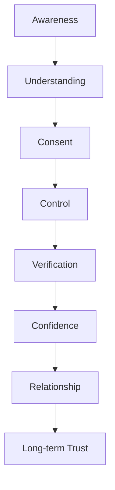
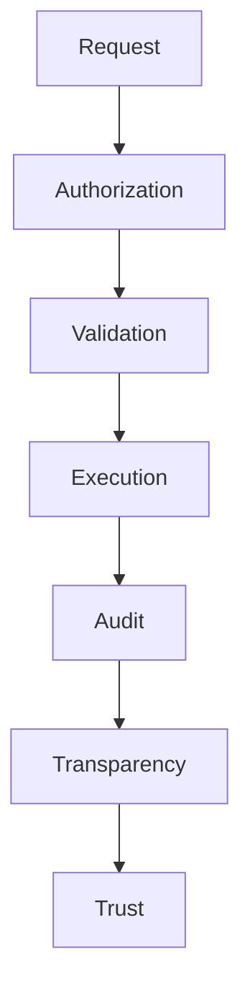

# MODULE 21 — PRIVACY & TRUST EXPERIENCE

---

## 0. Relationship to Prior Modules

Privacy mechanics already exist throughout this Bible: consent granularity and export/deletion (Module 6, Section 9; Module 20, Sections 8–9), Memory transparency (Module 10, Section 8), Community consent (Module 18, Section 8), tier-neutral honesty (Module 17, Section 7), permission architecture (Module 3, Section 11). This module does not redefine any of that. It exists to do three things those modules don't:

1. **Consolidate** every privacy/trust mechanic into one coherent, product-wide experience the user can access from a single place (the Trust Center, Section 5) — Settings (Module 20) is where a user *changes* something; this module is where they go to *understand and verify* everything at once, across every module.
2. **Define the underlying architecture** (data classification, encryption, audit logging, regional compliance) that every other module's privacy claims actually rest on, which no prior module specified end-to-end.
3. **State, once, the trust principle every other module has been individually applying** — that trust is earned continuously through demonstrated behavior, never declared through a policy document.

---

## 1. Product Goals

**Trust Goals**: make trust something the user can verify at any moment, not something they're asked to take on faith — this module is the single place that proves, concretely, that every trust claim made elsewhere in this Bible is actually true.

**Privacy Goals**: consolidate every data right (access, export, deletion, consent) into one discoverable, coherent experience.

**Transparency Goals**: answer, at any time, what BeaconVie knows, why, who can access it, and how to change any of that — in plain language, from one place.

**Relationship Goals**: privacy and trust are relationship infrastructure, not a compliance feature bolted on — this module's success is measured by whether it deepens the user's confidence in the Companion relationship, not by whether it satisfies a legal checklist.

**Security Goals**: make the underlying security architecture (encryption, key management, audit logging) both genuinely robust and honestly explainable to a non-technical user.

**AI Goals**: every AI decision — what it remembered, why it responded a certain way, what it's uncertain about — must be explainable on demand, never opaque.

**Business Goals**: trust, demonstrated continuously, is this business's actual moat alongside Memory (Module 2) — this module is where that moat becomes visible and verifiable, which is itself a competitive advantage no competitor operating on a thinner privacy architecture can easily replicate.

**Community Goals**: Community-specific consent (Module 18) is represented here as part of the unified picture, never siloed away from the rest of the user's privacy posture.

---

## 2. Trust Philosophy

**Why trust exists**: because a product asking someone to disclose their inner life to an AI has no right to that disclosure unless it can prove, continuously and concretely, that it deserves it.

**Trust vs. Privacy**: Privacy is the set of rights and controls (what's collected, who can see it, how to remove it); Trust is the felt, cumulative result of those rights being honestly, consistently honored over time. Privacy is the mechanism; Trust is the outcome.

**Trust vs. Security**: Security is the technical discipline (encryption, access control) that makes privacy commitments actually enforceable rather than merely promised; Trust is what a user feels when both Privacy and Security consistently hold.

**Transparency over secrecy**: every rule, tradeoff, and limitation is stated plainly, including unflattering ones (e.g., "yes, a rare, audited Admin override process exists for trust & safety reasons") rather than omitted to look cleaner.

**Control over assumption**: nothing about how memory or AI behavior works is left as an assumption the user has to trust blindly — it's stated and, wherever feasible, directly controllable (Module 20).

**Explainability over opacity**: every AI decision that materially affects a user (what it remembered, why it said something) can be explained on request, in plain language.

**Consent over convenience**: wherever a smoother default would require assuming permission the user hasn't given, this product chooses the less convenient, more explicit path (Module 20, Section 11's identical standing rule, restated here as a cross-cutting principle).

**Trust as a daily experience**: trust isn't a badge earned once at signup — it's re-earned in every single interaction where the product does exactly what it said it would, and this module exists to make that ongoing proof visible rather than invisible.

**The standing creed** (governs every design decision in this module):
> **People own their data. People own their memories. Consent must be explicit. Transparency must be continuous. Trust must be earned. Privacy is a right. Human dignity comes first.**

---

## 3. Trust Lifecycle



**Awareness**: the user first encounters a privacy-relevant moment — signing up (Module 6), first Companion memory (Module 7), first Community share (Module 18).

**Understanding**: plain-language explanation of what's actually happening (Module 20's standing content-clarity rule) at that moment.

**Consent**: an explicit, granular choice, never assumed (Module 6, Section 9; Module 18, Section 8).

**Control**: the ability to later view, adjust, or revoke that choice (Module 20).

**Verification**: the user can independently confirm the product actually behaves as promised — e.g., exporting their data and finding exactly what was described, or revoking AI-training consent and confirming (via the Transparency Report, Section 5) that it's genuinely no longer used.

**Confidence**: the felt result of verification succeeding — trust becomes lived experience, not a claim taken on faith.

**Relationship → Long-term Trust**: sustained over the full life of the account, this cycle repeating correctly every time is what makes Module 1's entire retention thesis (trust compounding over years) actually true rather than aspirational.

---

## 4. Privacy Architecture

| Component | What's true about it |
|---|---|
| **Identity** | A single, immutable internal ID (Module 6, Section 8); no public username/handle exists anywhere in the product |
| **Authentication** | JWT access token (in-memory) + rotated HttpOnly refresh token (Module 6, Section 7) |
| **Sessions** | Per-device, independently revocable (Module 6, Section 7; Module 20, Section 16's Devices control) |
| **Companion** | Conversation content private by default; viewable only by the user and, exceptionally, via an audited, reason-required Admin override (Module 3, Section 11) |
| **Memory** | Never directly user-writable, always user-deletable (Module 10's governing rule); encrypted at rest |
| **Journal** | The strictest privacy tier in the product — no sharing surface at all (Module 11, Section 11) |
| **Reports** | Generated from the user's own Memory/Journal/Discovery data only, never cross-user data (Module 16) |
| **Community** | Pseudonymous identity, explicit per-item consent before any personal content crosses into it (Module 18, Section 8) |
| **Notifications** | Content derived only from the user's own Memory, sent via channels the user explicitly controls (Module 19, Section 17) |
| **Settings** | The primary control surface for every preference/consent in this table (Module 20) |
| **Premium** | Entitlement affects only Memory retrieval-window size, never data access breadth or privacy posture (Module 17, Section 18) |
| **Admin Access** | Rare, audited, reason-required override only — no ambient visibility into personal content for any internal role (Module 3, Section 11) |
| **Third-party Services** | Currently limited to the payment provider (PayOS/VNPay, Module 1's stack) and the LLM provider (OpenAI) for processing, never for resale |
| **Backups** | Encrypted, access-controlled, and subject to the same deletion guarantees as primary storage (Section 9) |
| **Audit Logs** | Every Admin-override access and every consent change is logged, immutable, and reviewable in aggregate for Trust & Safety oversight (Section 17) |

---

## 5. Trust Experience

**Trust Center**: a single, top-level surface (reachable from Settings and from its own Global Navigation-adjacent entry point) consolidating everything below — the "one place to see it all" this module exists to provide.

**Privacy Dashboard**: a plain-language summary — what's stored, what's shared (and with whom, i.e., only Community per explicit consent), what permissions are currently active.

**Permission Center**: every granular consent (AI-training use, Community sharing history) in one list, individually toggleable, cross-linked to where each was originally granted.

**Activity History**: a log of the user's own account activity (logins, exports, deletions, consent changes) — their own audit trail, viewable by them directly, not just held internally.

**Export Center**: one-tap full data export (Module 6/20), with a plain manifest of exactly what's included.

**Delete Center**: per-item deletion links (routing into Memory Timeline, Journal, Community posts) plus the full account-deletion path (Module 6, Section 5).

**Transparency Report**: a plain-language, always-current statement of what data is collected, why, how long it's retained, and — notably — aggregate, anonymized statistics about Admin-override usage (e.g., "in the last quarter, X audited override accesses occurred across the entire user base, each for a documented trust & safety reason"), making the rare-exception process itself auditable by users in aggregate, not just asserted.

**Security Overview**: a plain explanation of encryption, session security, and login-notification practices (Module 6, Section 10), written for a non-technical reader.

---

## 6. Consent Engine

**Consent lifecycle**: Awareness → explicit grant → active → (optionally) revoked → (optionally) re-granted — mirrors Section 3's Trust Lifecycle at the level of a single permission.

**Explicit consent**: every non-essential permission (AI-training use, Community sharing) requires an affirmative, specific action — never a pre-checked box, never bundled into a broader agreement (Module 6, Section 9's standing rule).

**Granular consent**: each permission is independently scoped and independently revocable — revoking one never silently affects another.

**Revocation**: as easy and immediate as granting (Module 20's standing anti-dark-pattern rule) — revoking AI-training consent takes effect immediately and is confirmed in the Transparency Report.

**Expiration**: no consent silently expires and reverts to an assumed "yes" — if a consent mechanism is ever time-scoped (e.g., a temporary data-sharing arrangement for a future feature), it defaults to "no" upon expiration, requiring active renewal, never automatic continuation.

**Renewal**: if a consent's scope changes materially (e.g., a new use case is added to an existing permission), it requires fresh, explicit re-consent for the new scope — never silently expanded under the umbrella of a previously-granted, narrower permission.

---

## 7. Companion Trust

**Why users can trust Companion**: because its behavior is bounded by AI Philosophy (Module 1) and Guardrails that are stated plainly here, not hidden in a technical appendix — a user can read, in this module, the actual rules the Companion operates under.

**Memory transparency**: every memory reference is visually and functionally distinguishable from generated reasoning (Module 4/9/10's standing rule) — restated here as a trust guarantee, not just a UX pattern.

**AI reasoning transparency**: on request, the Companion can explain what informed a given response (which memory, which context) — Module 9, Section 10's AI Experience rule, surfaced here as a trust commitment.

**Boundaries**: the Companion respects explicit user-stated topic/style boundaries (Module 9, Section 17) persistently.

**Limitations**: the Companion states plainly when something is outside its scope (crisis-adjacent, medical/legal/financial, Module 9, Section 13) rather than overreaching.

**Hallucination handling**: the hard architectural guarantee (Module 9, Section 15/19; Module 16, Section 18) that memory references are always grounded in actually-retrieved content — restated here as the single most load-bearing trust fact in the entire product.

**Emotional safety**: the standing crisis-escalation and emotional-intelligence rules (Module 9, Sections 12–13) apply without exception, regardless of tier or tenure.

---

## 8. Memory Trust

**Memory creation**: always derived, never directly user-authored (Module 10's governing rule) — restated here plainly: "your Companion writes memories based on what you share; you never write them directly, but you can always remove them."

**Memory editing**: implemented as deletion, honestly explained (Module 10, Section 8).

**Memory deletion**: always direct, always available, always immediate (Module 3/10's standing rule).

**Memory export**: full, portable, available anytime (Module 6, Section 9).

**Memory visibility**: every stored memory is viewable via the Memory Timeline (Module 10, Section 21), cross-linked from this module's Trust Center.

**Memory history**: the Life Archive concept (Module 9/10) — the user's own accumulated record, always theirs to review in full.

**Consent**: AI-training-use consent (Section 6) is the only memory-adjacent permission requiring separate, explicit opt-in beyond ordinary product use.

---

## 9. Privacy Engine

**Data classification**: three tiers — (1) Account/Identity data (email, auth credentials — highest security, lowest sensitivity-in-content terms), (2) Personal Content (Journal, Companion conversations, Memory — highest sensitivity, encrypted at rest, strictest access controls), (3) Aggregate/Anonymized data (Community pattern data, product analytics — sensitivity reduced specifically because identity is stripped before aggregation).

**Sensitive data**: Personal Content (tier 2) is the category this entire Bible has been built around protecting — encrypted at rest, never used for AI training without explicit separate consent (Section 6), never accessible to Admin/Moderator roles ambiently (Module 3, Section 11).

**Encryption**: at rest for all Personal Content and backups (Section 17); in transit via standard TLS everywhere.

**Retention**: tier-dependent Memory retrieval windows (Module 17) affect *active retrieval*, never data survival — nothing is destroyed by a tier change, only deprioritized (Module 10, Section 10).

**Deletion**: user-initiated deletion is real and immediate at the primary data layer, with backup-purge following on the standard backup-rotation schedule (Section 17) — disclosed honestly here rather than implying instantaneous, complete erasure everywhere including historical backups, which is not a technically honest claim for most systems and shouldn't be implied here either.

**Backups**: encrypted, access-controlled, subject to the same eventual-deletion guarantee as primary data (Section 17).

**Audit**: every Admin-override access and consent change is logged immutably (Section 4/17).

**Regional compliance**: GDPR/equivalent regional rights (access, portability, erasure) are satisfied by the same Export/Delete capabilities available to every user globally, not a region-gated feature (Module 20, Section 16's standing rule) — compliance here is a floor everyone gets, not a special regional carve-out.

---

## 10. Transparency Engine

**What AI knows**: exactly what's in the Memory Timeline (Module 10, Section 21) — nothing more, nothing hidden.

**Why AI knows it**: every memory is traceable to a specific source conversation, Journal entry, or Discovery interaction (Module 10, Section 8's Memory Card "why this memory" feature).

**Why AI generated an answer**: explainable on request via the Companion's reasoning-transparency behavior (Section 7).

**Why AI remembered something**: the significance/confidence scoring that triggered storage (Module 10, Section 19) can be summarized in plain language on request ("this seemed like something meaningful you shared, so I kept it").

**Why AI forgot something**: distinguishing archived (deprioritized, still exists, Module 10, Section 10) from deleted (gone, user-initiated) — explained plainly whenever a user asks why the Companion doesn't seem to recall something.

**Decision explanations**: extends to Dashboard's single-recommendation logic (Module 8, Section 18) and Notifications' send/no-send logic (Module 19, Section 18) — on request, a user can understand why they were shown (or not shown) something, not just accept it as a black box.

**Confidence / Uncertainty**: the Companion states its own uncertainty plainly (Module 9, Section 6) rather than projecting false confidence — this extends to this module's own Transparency Report, which states plainly where a claim is a strong guarantee (e.g., "deleted memories are immediately removed from active retrieval") versus a process with a longer tail (e.g., "backup purges follow our standard rotation schedule, detailed here").

---

## 11. Ethics Philosophy

**No surveillance**: the product does not monitor behavior for purposes beyond the disclosed, consented product function — no covert tracking, no inferred profiling beyond what's explicitly disclosed (Module 9, Section 12's standing rule against inferring mood/state from indirect signals, generalized here to a product-wide principle).

**No hidden AI**: every AI-driven decision affecting a user (Dashboard recommendation, Notification send decision, Companion memory reference) is explainable, per Section 10.

**No hidden memory**: every stored memory is visible in the Memory Timeline — nothing exists that the user can't see.

**No hidden sharing**: nothing crosses from Personal Content into Community or anywhere else without explicit, per-item consent (Module 18, Section 8).

**No manipulation**: the standing Guardrail against manipulative design applies to every surface in this module as much as anywhere else — even a "trust" feature could theoretically be gamed to appear more reassuring than it is; this module holds itself to the same honesty standard it asks of everything else.

**No selling personal data**: Personal Content is never sold, licensed, or shared with third parties for their own purposes — the only data-sharing relationships in this product are the payment provider (transactional) and the LLM provider (processing, under contract terms excluding training-use without the user's separate opt-in, Section 6).

**No dark patterns**: applies product-wide (Module 20's standing rule), restated here as this module's own responsibility to model, not just describe.

**Human dignity**: every design decision in this module treats the user as an autonomous person with a right to understand and control what happens to their own inner life, not as a data source to be managed.

**Respect**: the tone of every privacy-related surface (Trust Center, Transparency Report) is plain and human, never legalistic or intimidating (Module 4's Content Design rules, applied here with particular care since this content type most tempts toward defensive legal language).

---

## 12. Trust Journey

| Stage | What happens | Design intent |
|---|---|---|
| **First consent** | Signup's single Terms/Privacy checkbox (Module 6, Section 9) | Minimal, honest, not overloaded with granular asks that belong later |
| **First memory** | Onboarding's transparent Memory Card moment (Module 7, Section 6) | The first proof that "memory" is a real, visible thing, not an abstract claim |
| **First export** | Whenever a user first tries the Export Center (Section 5) | The first real trust-verification moment — does the export match what was promised |
| **First delete** | A user's first deletion of a memory, Journal entry, or Community post | Confirms deletion is genuinely immediate and complete at the primary-data layer |
| **First privacy review** | A user's first visit to the Trust Center/Privacy Dashboard out of curiosity or concern | Should resolve that curiosity/concern fully, in plain language, without needing to escalate to support |
| **First Community sharing** | A user's first explicit, per-item consent decision to share something into Community (Module 18) | Confirms the consent flow is genuinely clear and specific, not confusing |
| **Long-term relationship** | Trust becomes assumed, quietly, because it's been repeatedly verified — this module is visited rarely at this stage, which is itself a sign of success | The intended steady-state outcome, mirroring Module 20's identical framing for Settings |

---

## 13. Loading Experience

| Moment | Emotion |
|---|---|
| **Trust indicators** (Trust Center loading) | Standard skeleton loading (Module 4), brief |
| **Verification** (e.g., confirming an export completed) | Labeled, honest progress state, never a generic spinner for something as significant as a full data export |
| **Encryption status** | If displayed at all (Security Overview, Section 5), a simple, factual, non-alarmist presentation — never framed to manufacture anxiety about what would happen without it |
| **Loading / Animations** | Standard Module 4 timing throughout — this module should feel exactly as calm as every other part of the product, never more clinical or more anxious |

---

## 14. Error Experience

| Failure | Behavior | Recovery |
|---|---|---|
| **Permission denied** | Clear, specific explanation (e.g., re-authentication required for a sensitive action like full account deletion) | Re-auth and retry |
| **Security event** (e.g., a detected suspicious login, Module 6, Section 10) | Calm, factual notification, never alarmist language, with clear next steps | User can review Activity History (Section 5) and take action (e.g., revoke a session) |
| **Suspicious login** | Same as above — a "new login from [device/location] — was this you?" notice (Module 6, Section 10), reflected in this module's Activity History | Direct link to Devices management (Module 20) |
| **Data conflict** (e.g., a consent state briefly out of sync across devices) | Resolved per Module 20, Section 14's last-write-wins pattern, with a plain notice if a conflicting recent change was overwritten | User can re-apply the intended state |
| **Failed export** | Calm, specific error; the request is retried automatically and the user is notified once it succeeds, rather than silently failing | Automatic retry; user notified either way |
| **Failed deletion** | Same pattern — a failed deletion is retried, never silently abandoned, since an unresolved deletion request is a genuine trust risk if left unaddressed | Automatic retry with user-visible follow-through |

---

## 15. Analytics

**Trust indicators**: aggregate health signals — Trust Center visit-to-resolution rate (did the visit answer the user's question without needing support), export/deletion completion rates.

**Consent changes**: tracked in aggregate to understand which permissions are commonly granted/revoked, informing whether their framing/placement (Module 20) needs improvement.

**Export requests / Deletion requests**: tracked for operational health (are they completing reliably and promptly) — never analyzed at the individual-content level in a way that would itself constitute the kind of surveillance this module's Ethics Philosophy prohibits.

**Privacy dashboard usage**: correlated with overall product trust/retention signals (Module 1) — validates whether transparency genuinely builds confidence rather than introducing doubt.

**Permission adoption**: which consents are actively granted, informing product decisions about which optional features are genuinely valued.

**Security incidents**: tracked and reviewed on an internal Trust & Safety dashboard (Module 3's Admin module), with aggregate, anonymized summaries surfaced publicly via the Transparency Report (Section 5) on a regular cadence.

**KPIs**: Trust Center visit-to-resolution rate (primary usability metric); export/deletion request completion rate and latency (primary reliability metric); correlation between privacy-feature engagement and long-term retention (primary validation metric for the module's entire thesis that transparency builds trust rather than eroding it).

---

## 16. Edge Cases

**Minor users**: if a user is later found or disclosed to be a minor, Module 1's standing child-safety principles govern account handling — this is treated as a Trust & Safety-critical case requiring careful, humane handling (age-appropriate data practices, potentially parental involvement per applicable law), not merely a data-classification footnote.

**Shared devices**: session architecture (Module 6) already isolates accounts per login; this module's Activity History and Devices controls (Module 20) let a user on a shared device verify no other session remains active.

**Lost device**: remote sign-out (Module 20, Section 16) is the primary mitigation, surfaced clearly from this module's Trust Center as well.

**Death of a user**: a genuinely hard case with no fully satisfying technical answer — the product should, at minimum, provide a clear, humane account-legacy/deletion-on-request process for next-of-kin with appropriate verification, documented plainly in the Transparency Report rather than left as an undocumented gap.

**Legal requests**: any law-enforcement or legal data request is handled per documented policy (referenced, not fully specified, in this product module — the operational/legal specifics belong to a compliance-owned document) with the same standing principle: the user is notified where legally permissible, and any compelled disclosure is the narrowest scope the request actually requires, never a blanket data dump.

**Government requests**: same standing principle as Legal requests — narrowest necessary scope, transparency where legally permitted, documented in aggregate in the Transparency Report (e.g., a standard "transparency report" number-of-requests disclosure, common good practice for privacy-conscious products).

**Emergency access** (e.g., a documented, genuine safety emergency requiring urgent Admin access to a user's content): only ever via the same audited, reason-required override process (Module 3, Section 11) — "emergency" is never a bypass of the audit trail, only potentially an expedited review path within it.

**Offline**: Trust Center content that doesn't require a live server round-trip (cached Privacy Dashboard summary, Security Overview text) remains viewable offline; live actions (export, deletion) require connectivity and queue per Module 20, Section 14's standard pattern.

---

## 17. Technical Specification

**Trust engine**: primarily an aggregation/read layer over data already owned by other modules (Memory, Settings, Community consent, Authentication sessions) — this module introduces minimal new data of its own beyond the consolidated views themselves.

**Consent engine**: `consent_record(user_id, scope, granted_at, revoked_at, version)` — versioned so that a change in what a given consent scope actually covers requires a new `version` and fresh consent (Section 6's Renewal rule), never silent scope creep under an old grant.

**Audit logs**: `audit_log(id, actor_id, action, target_user_id, reason, timestamp)` — immutable (append-only), covering every Admin-override access and every consent change; the aggregate statistics in the Transparency Report (Section 5) are computed from this table without exposing individual entries publicly.

**Encryption**: at-rest encryption for all Personal Content tables (Memory, Journal, Companion conversation) using standard, industry-conventional key management (e.g., envelope encryption with a managed key service) — key rotation policy documented internally and summarized plainly in the Security Overview.

**Key management**: managed via a dedicated key-management service (not application-level custom crypto), with access to decryption keys itself logged and restricted — a security-critical implementation detail surfaced honestly, at a high level, in the Security Overview rather than omitted as "too technical."

**Database**: Postgres (Module 1's stack) with row-level security or equivalent application-layer enforcement ensuring a query can never accidentally cross user boundaries — the same discipline Module 3's Permission Architecture already requires, restated here as a database-layer guarantee.

**Backups**: encrypted, access-logged, rotated on a documented schedule; deletion requests trigger a backup-purge flag honored on the next rotation cycle (Section 9's honest disclosure of this timing).

**Deletion pipeline**: cascades correctly across Memory, Journal, Community posts, and account data (Module 3/6/10/11/18's respective deletion rules) via a single, tested, cross-module deletion orchestration job (BullMQ), rather than each module independently and inconsistently implementing its own deletion logic.

**Export pipeline**: a single orchestration job compiling data from every module (Memory, Journal, Companion history, Discovery profiles, Community posts) into one coherent, documented export package (Module 6/20).

**Security architecture**: TLS in transit; encrypted at rest; JWT/refresh-token session model (Module 6); rate limiting and brute-force protection (Module 6, Section 10); audited Admin access (Module 3, Section 11) — consolidated and explained plainly here, specified in full technical detail there.

**Frontend**: Trust Center reuses Module 4's standard component set (Card, List, Dialog) — no bespoke "legal page" visual treatment; content is written and formatted exactly like every other part of the product, per this module's standing "never legalistic" design requirement.

---

## 18. Trust Reasoning Engine

```
function resolveTrustCenterView(userId):
    consents = getConsentRecords(userId)  # Section 6
    memorySummary = getMemorySummary(userId)  # count, retention window, Module 10
    activityHistory = getAuditableUserActivity(userId)  # logins, exports, deletions
    securityStatus = getSecuritySummary(userId)  # active sessions, recent security events

    return composePlainLanguageSummary(consents, memorySummary, activityHistory, securityStatus)
    # every field rendered in plain language with a direct link to the
    # relevant Settings control (Module 20) for any adjustable item
```

**User Context → Permission → Verification → Decision → Explanation → Relationship → Trust**: this module's reasoning is deliberately non-generative — it aggregates and explains real, already-recorded facts (consents, memory counts, activity) rather than producing any new AI-generated judgment about the user, since this is precisely the module where any hint of inference-without-disclosure would be most damaging to the trust it exists to build.

---

## 19. Trust Reasoning Pipeline



**Request**: a user-initiated action (export, delete, revoke consent) or a system-initiated one (Admin override, exceptionally).

**Authorization**: verifies the requester has genuine standing to make this request (the user themselves, or an Admin with a documented, audited reason).

**Validation**: confirms the request is well-formed and doesn't violate any standing rule (e.g., an Admin override request must include a reason before it can even be authorized).

**Execution**: the actual action — export compiled, memory deleted, consent revoked.

**Audit**: logged immutably (Section 17).

**Transparency**: reflected back to the user, either immediately (their own action, confirmed) or in aggregate (an Admin override, reflected in the Transparency Report's aggregate statistics).

**Trust**: the cumulative result of this pipeline working correctly, every time, closing the loop into Section 3's Lifecycle.

---

## 20. UX Specification

**Desktop/Tablet/Mobile**: consistent Trust Center structure across breakpoints (Module 4, Section 6), matching Settings' (Module 20) established layout pattern since the two modules are closely related in navigation feel.

**Trust Center**: a single-page, plain-language dashboard (Section 5) linking out to Settings for any adjustable control — this module explains and consolidates; Module 20 is where changes are actually made, avoiding duplicate controls living in two places.

**Privacy Dashboard**: Card-based summary (Module 4, Section 5).

**Cards**: standard component set, text-forward, no alarmist iconography (no red warning triangles for routine, expected information).

**Accessibility**: held to the same strict bar as Settings (Module 20, Section 1) — full screen-reader and keyboard support throughout.

**Navigation**: reachable from Settings and from a dedicated Trust Center entry point; internally, a simple single-page or lightly-tabbed layout (Privacy Dashboard / Activity History / Transparency Report / Security Overview) rather than deep, hard-to-navigate nesting.

**Reading flow**: Trust Center overview → any specific concern → either resolved by the plain-language content itself, or linked directly to the relevant Settings control for action.

---

## 21. QA Checklist

- **Privacy**: verify every Trust Center claim matches actual system behavior exactly (a claim audit, not just a design review) — e.g., does revoking AI-training consent genuinely, verifiably stop that data path.
- **Security**: verify encryption-at-rest and key-management practices match what's described in the Security Overview.
- **Transparency**: verify the Transparency Report's aggregate statistics (Admin-override counts, legal-request counts) are computed correctly from the audit log and updated on a documented cadence.
- **Accessibility**: verify full keyboard/screen-reader support across the Trust Center.
- **Consent**: verify granular consent revocation is immediate and doesn't affect unrelated permissions (Section 6).
- **Audit**: verify the audit log is genuinely immutable/append-only and captures every Admin-override access without exception.
- **Encryption**: verify Personal Content is encrypted at rest in practice, not just in documentation.
- **Frontend**: verify Trust Center visual tone matches Module 4's standard system exactly — no legalistic or alarmist styling anywhere.
- **Backend**: verify the cross-module deletion and export orchestration jobs (Section 17) complete reliably and cascade correctly across every affected module.
- **Performance**: verify Trust Center loads quickly even for long-tenured accounts with large Memory/Activity histories.
- **Analytics**: verify Section 15's KPIs are correctly instrumented without themselves violating the module's own privacy standards (no individual-level content inspection).
- **Trust**: the single highest-priority QA category in this module by definition — a dedicated, adversarial review specifically hunting for any place a Trust Center claim doesn't match actual behavior, since a single such gap would be a severe violation of this module's entire purpose.

---

## 22. Future Expansion

**Trust Score**: explicitly rejected as a user-facing concept — scoring a user's own "trust level" would be a strange inversion of this module's purpose (the product earns the user's trust, not the reverse) and risks reading as a surveillance-adjacent behavioral score; if any internal risk-scoring exists for Trust & Safety purposes (e.g., flagging likely spam accounts in Community, Module 18), it stays entirely internal and is never surfaced to users as "your trust score."

**Privacy Timeline / Permission Timeline / Transparency Timeline**: natural, well-aligned extensions of the existing Activity History (Section 5) — a chronological view of consent and access events over the life of the account, already largely implied by the audit log (Section 17) and worth surfacing more richly over time.

**Zero Knowledge Features**: a genuinely interesting long-term technical direction (e.g., client-side encryption where even BeaconVie's own servers couldn't read Journal content) — would meaningfully strengthen the Privacy Architecture but carries real trade-offs against Memory/Companion functionality (the AI needs to process content to generate Insight, which a strict zero-knowledge model would complicate significantly) — flagged as a serious long-term research direction, not a near-term commitment.

**Secure Vault**: a plausible reframing/enhancement of the existing Export capability into a more actively-maintained personal data vault — likely an extension of Module 20's Export Center rather than a new capability.

**Personal AI Cloud**: a longer-horizon platform idea (the user's own memory graph as a portable, personally-owned AI context) — interesting but well beyond current scope; would need its own dedicated architecture and consent model.

**Selective Memory**: a more granular, category-level memory-sharing/retention control (e.g., "never store anything related to my health") — a plausible enhancement of Module 20's existing boundary-setting capability (Module 9, Section 17), worth exploring once demand is clearer.

**Cross-region Privacy**: as data residency requirements vary by jurisdiction, this is flagged as a genuine future infrastructure requirement (Module 2's Internationalization strategy) rather than a solved problem today — the current architecture's single global data store would need regional partitioning to fully satisfy the strictest data-residency regimes, and this gap is stated honestly here rather than glossed over.

---

## 23. Final Decisions

**Chosen Trust Model**
A single, consolidated Trust Center that aggregates and plainly explains every privacy/consent/security fact already governed elsewhere in this Bible, backed by an immutable audit log covering every Admin-override access and consent change, with a regularly-published aggregate Transparency Report making even the rare-exception override process itself independently verifiable — and a hard architectural rule that this module's own reasoning is aggregation-and-explanation only, never new AI-generated inference about the user, since this is the one place any hint of undisclosed inference would be most damaging.

**Rejected Alternatives**
- A conventional legal Privacy Policy page as the primary user-facing surface — rejected in favor of a plain-language, product-integrated Trust Center, consistent with the standing "privacy is not legal text" framing.
- A user-facing "Trust Score" — rejected outright as inverting this module's actual purpose and risking a surveillance-adjacent behavioral-scoring feel.
- Region-gating compliance capabilities (export/deletion) to only the jurisdictions that legally require them — rejected in favor of extending the same real rights to every user globally, consistent with Module 20's identical standing decision.
- Implying instantaneous, complete data erasure across all systems including historical backups — rejected in favor of an honest disclosure of the actual backup-purge timing, since an inflated erasure claim would itself be a trust violation the first time a technically-informed user checked it.
- A separate, duplicate settings surface for privacy controls distinct from Module 20's Settings — rejected in favor of this module explaining and Module 20 controlling, avoiding two places a user might update the same preference inconsistently.

**Trade-offs**
Disclosing the honest, non-instantaneous backup-purge timeline (rather than implying immediate, total erasure everywhere) is a less impressive-sounding claim than many competitors make — accepted because an honest, technically accurate claim that holds up to scrutiny is worth more to this module's actual purpose than an impressive-sounding one that would fail the first time a user checked it against reality.

**Reasons**
Every decision in this module operationalizes the standing creed — people own their data, people own their memories, consent must be explicit, transparency must be continuous, trust must be earned, privacy is a right, human dignity comes first — while serving its specific, non-duplicative purpose: making every privacy and trust mechanic already established across Modules 1–20 visible, explainable, and independently verifiable from one coherent place, rather than restating or altering any of it.

---

**Next module in sequence: Admin.**
