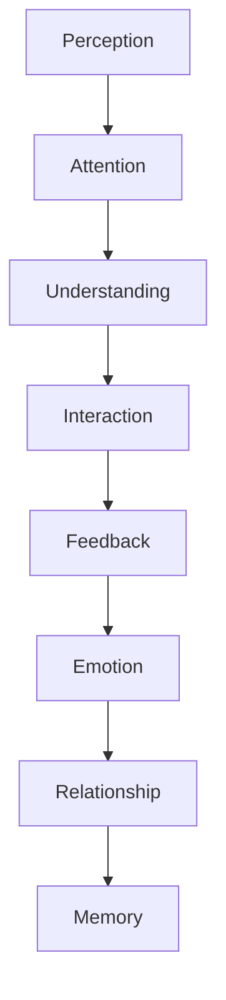

# MODULE 22 — DESIGN LANGUAGE SYSTEM

---

## 0. Relationship to Module 4

Module 4 (Product Experience Design System) already defines BeaconVie's concrete visual system: the dusk color tokens, the Fraunces/Karla/IBM Plex Mono type pairing, the spacing/radius/elevation scale, the component library, and the Constellation Thread motion signature. This module does not restate those values. It exists one layer above them: **why those specific choices communicate what BeaconVie is**, and how that same communicative logic must extend consistently into every module built since (Companion, Memory, Journal, Discovery, Reports, Premium, Community, Notifications, Settings, Trust Center).

Where Module 4 answers "what is the token," this module answers "what does this token mean, and why must every future screen, in every future module, keep meaning it." Think of Module 4 as the alphabet; this module is the grammar that makes the alphabet speak consistently.

---

## 1. Design Goals

**Business Goals**: a visually and emotionally consistent product is a trust-compounding asset (Module 2) — inconsistency, even subtle, reads as carelessness in a product whose entire value proposition is "we pay careful attention to you."

**Relationship Goals**: design is the Companion's body language — every screen should feel like the same person is present, whether the user is drawing a tarot card, reading a Report, or adjusting a privacy setting.

**Emotional Goals**: reduce anxiety, invite reflection, never compete for attention — the same three goals stated in Module 4's Experience Principles, restated here as the test every future design decision, in any module, must pass.

**Accessibility Goals**: a design language that only works for some users has failed at being a language at all — accessibility (Module 4, Section 12) is not a layer added after the visual system, it's a constraint the visual system was designed to satisfy from the start.

**AI Goals**: the interface must never let the Companion's presence feel like "a chatbot with a nice paint job" — every AI-facing visual decision (Section 12) exists to make the relationship, not the technology, visible.

**Brand Goals**: BeaconVie should be recognizable by feel before a user consciously registers a color or word — the dusk palette, the Constellation Thread, and the calm pacing established in Module 4 are the brand's fingerprint, and this module's job is ensuring that fingerprint never gets diluted as new modules are built.

**Consistency Goals**: the single hardest goal to sustain over 20+ modules built by different teams over time — this module exists specifically because consistency doesn't survive by accident past a certain product size; it needs a stated, referenceable discipline.

**Trust Goals**: visual consistency is itself a trust signal — a product that looks and behaves the same way everywhere is implicitly telling the user "we're paying the same careful attention everywhere," which is exactly the claim this entire Bible makes about Memory (Module 10) and should therefore also be true of design.

---

## 2. Design Philosophy

**Design should disappear**: the goal of every visual decision is that a user stops noticing the interface and simply experiences the relationship — a design element that draws attention to its own cleverness has failed, however impressive it looks in isolation.

**Calm over excitement**: BeaconVie never tries to feel exciting the way a game or a social app does — its emotional register is closer to a quiet room at dusk (Module 4's brand-emotion anchor) than to anything designed to spike engagement.

**Meaning over decoration**: every visual element must be traceable to a reason (Module 4's color-scarcity rule is the clearest existing example — gold appears only for genuine Insight moments) — decoration for its own sake is treated as noise, not polish.

**Consistency over novelty**: a new module never gets to invent a new visual language to feel "fresh" — it inherits Module 4's system and extends it only where a genuinely new need exists (as Modules 12–16 did for card reveals, chart wheels, and number displays, each staying within the existing token system rather than introducing a parallel one).

**Emotion over entertainment**: the product aims to make someone feel something true about their own life, never to entertain them the way media does — motion, color, and copy are all calibrated against this distinction throughout Module 4 and are restated here as the underlying test.

**Humanity over technology**: nothing in the interface should look like it's showing off what AI can do — the AI's presence (Section 12) is felt through care and memory, never through visual spectacle.

**Timeless over trendy**: the dusk palette and Fraunces/Karla pairing (Module 4) were chosen specifically to avoid the visual clichés of the current AI-product moment (Module 4, Section 3's explicit rejection of both the cream/terracotta and near-black/neon defaults) — this module's job is ensuring future redesigns resist the pull toward whatever is fashionable at the time, in favor of what still communicates calm and trust ten years from now.

---

## 3. Design Language Lifecycle



**Perception**: the first, pre-conscious registration of the interface — color, type, spacing (Module 4's tokens) — before the user reads a single word.

**Attention**: what the design draws the eye toward first — governed by Module 4's color-scarcity rule (gold draws attention only to genuine Insight) and the singularity principle (Modules 8/9: one recommendation, one focal point, never several competing for notice).

**Understanding**: the user correctly interprets what they're looking at — a Memory Card reads as a memory, an Insight Card reads as something worth pausing on, because the same visual grammar is used consistently everywhere it appears (Module 4's shared-component rule).

**Interaction**: the user acts — taps, types, scrolls — and the interface responds at the calm, considered pace established across Module 4's motion timing.

**Feedback**: the interface confirms what happened, honestly and proportionately (Section 14) — never over-celebrating a routine action, never under-acknowledging a significant one.

**Emotion**: the felt result of all of the above working together — calm, understood, cared for.

**Relationship**: repeated over many sessions, this emotional consistency becomes the felt texture of the relationship itself (Module 9).

**Memory**: and, closing the loop, the user's own accumulated experience of a consistently calm, trustworthy interface becomes part of why they trust the product's claims about literally remembering them (Module 10) — design consistency and Memory's trust claim reinforce each other.

---

## 4. Visual Identity

**Brand personality**: a wise, curious friend with time for you (Module 4, Section 3) — restated here as the filter every visual decision in every future module must pass through: would a wise, unhurried friend present this information this way?

**Visual personality**: warm-dark, quiet, precise — never loud, never cluttered, never performing sophistication through complexity.

**Color philosophy**: color is meaning, not decoration (Module 4, Section 4) — this module's contribution is making explicit that this rule must survive contact with every new module's specific needs (Section 5).

**Typography philosophy**: a warm serif for the Companion's voice, a clean sans for structure, a monospace for precise data (Module 4, Section 4) — this three-way division is itself a communicative device: it tells the user, without a word, whether they're reading something the Companion said, something structural, or something exact (Section 6).

**Shape philosophy**: soft, rounded, never sharp or zero-radius (Module 4, Section 4's radius scale) — sharp corners read as clinical/corporate, which this product must never feel like (per the standing rejection of "enterprise software," "banking," "healthcare dashboard" registers).

**Light**: the interface's default state is dusk-dark (Module 4), evoking the specific quality of evening light — warm, low-contrast, safe — rather than the harsh brightness of midday.

**Shadow**: minimal, soft, used sparingly (Module 4's `shadow-sm` only) — heavy shadow stacking reads as busy and effortful, contradicting the calm register.

**Depth**: expressed through subtle background-lightness steps (canvas → surface → surface-raised, Module 4) rather than dramatic z-axis layering — depth should be felt, not performed.

**Contrast**: kept moderate and warm (Module 4's off-white text on dusk canvas, never stark white on black) — enough for legibility and accessibility (Section 16), never so stark it feels alarming.

**Whitespace**: generous throughout (Module 4's spacing scale) — density is never used to convey information richness; density conveys clutter, and this product should never feel cluttered.

**Grid**: consistent 4px-based spacing rhythm (Module 4) applied identically whether the screen is Dashboard, a Report, or Settings — a user should never be able to tell, from spacing alone, which team built a given screen.

**Rhythm**: the alternating canvas/surface background pattern (Module 4, Section 7) gives every screen a legible, calm scroll rhythm without needing hard divider lines.

---

## 5. Color Language

Module 4, Section 4/16 defines the concrete tokens (`color.bg.canvas`, `color.accent.insight`, etc.). This section defines what each communicates:

**Primary colors** (the dusk canvas and warm off-white text): communicate safety and calm — the product's resting emotional state, present on every screen regardless of module.

**Neutral colors** (the border/text-secondary tones): communicate structure without demanding attention — used for anything that needs to be legible but not emphasized.

**Semantic colors**: `color.accent.insight` (gold) communicates *this moment is genuinely meaningful* — and only this; `color.accent.reflection` (dusty plum) communicates *this is a space for your own writing/thinking* (Journal); `color.accent.trust` (sage) communicates *this action succeeded, safely*; `color.accent.caution` (muted rust) communicates *pay attention here*, deliberately never using an alarming bright red, because even a warning in this product should stay within its calm register.

**Backgrounds/Surfaces**: the canvas → surface → surface-raised progression communicates *how close to the "front" of the product this content sits* — a modal or sheet (surface-raised) reads as more immediate/foregrounded than the ambient Dashboard (canvas).

**AI colors**: the Companion has no dedicated "AI blue" or synthetic-feeling accent color anywhere in the system — its presence is communicated through the Fraunces typeface and the standard palette, never a distinct "robot" visual signature, because the entire point is that the Companion should feel like a person present in the relationship, not a separate technological layer bolted onto it.

**Trust colors**: the sage `trust` accent appears specifically in confirmation/save states across Settings (Module 20) and the Trust Center (Module 21) — a small, deliberate visual echo reinforcing that "your action was respected" feels the same everywhere it happens.

**Success/Warning/Error**: proportionate, never alarmist — success is a quiet sage pulse (Module 4, Section 9), never a full-screen celebration; error is a calm rust color shift, never a red flash or shake (Module 4, Section 9's explicit rejection of shake-based error feedback).

**Premium**: deliberately has no distinct "premium gold" or "upgrade purple" — Premium screens (Module 17) reuse the exact same Insight-gold accent as any other genuine Insight moment, because Premium's entire value proposition is "more of what's already meaningful," not a visually separate, flashier tier (Module 17, Section 13's explicit rejection of a special activation animation).

**Community**: uses the standard palette with no distinct "social" visual register (no bright, high-saturation colors typical of social apps) — Community (Module 18) should feel like an extension of the same calm space, not a livelier, more stimulating annex.

**Memory/Journal**: Memory Cards use the gold Insight accent when something significant is surfaced; Journal uses the plum reflection accent for its own writing surface — two distinct but equally quiet accents, never competing with each other since they rarely appear on the same screen.

**Accessibility**: every color pairing is checked against WCAG AA at minimum (Module 4, Section 12) — communicating meaning through color is only valid where that meaning is also conveyed through text/shape for anyone who can't perceive the color distinction.

**Dark mode / Light mode**: dusk-dark is the default, expressive mode; the light-mode alternative (`color.bg.canvas.light`, Module 4) deliberately avoids the cream/parchment tone common to competing products, instead using a cool lavender-white — both modes must communicate the identical brand personality, only the luminance differs, never the emotional register.

---

## 6. Typography Language

**Font philosophy**: three roles, three purposes (Module 4, Section 4) — Fraunces (warmth, the Companion's spoken voice), Karla (structure, everyday UI), IBM Plex Mono (precision, numbers and data) — never a fourth typeface introduced for a new module's sake.

**Hierarchy**: established once by Module 4's type scale and reused verbatim everywhere — a Report's heading and a Settings section heading use the identical `heading-lg` token, never a module-specific variant.

**Scale/Weights**: Module 4's fixed scale is the only scale — a new module needing a "bigger" moment (e.g., Natal Chart's first chart reveal, Module 13) achieves emphasis through spacing, motion, and context, never by inventing a larger type size outside the established scale.

**Spacing**: line-height and paragraph spacing stay generous and consistent (Module 4's spacing tokens) across long-form content (Reports, Module 16) and short-form content (Notification copy, Module 19) alike.

**Reading rhythm**: long-form content (Reports, Journal entries) uses the capped 720px reading column (Module 4, Section 6) specifically to protect reading rhythm — a wider column would force the eye to travel further per line, subtly increasing reading fatigue in exactly the content type meant to feel most restful.

**Long-form reading**: Reports (Module 16) and Journal (Module 11) are this product's most text-dense surfaces and receive the most typographically careful treatment — book-like, unhurried, Fraunces used for any first-person Companion narrative voice within a Report.

**Companion conversation**: Companion messages render in Fraunces at body size specifically to feel "spoken," distinct from the user's own Karla-set messages (Module 4, Section 5) — this single typographic choice is doing significant emotional work, making every Companion message feel personally voiced rather than system-generated.

**Reports**: narrated in first-person Companion voice (Module 16, Section 5), typographically continuous with ordinary Companion messages — a Report should never suddenly read like a different, more clinical document just because it's longer.

**Journal**: the user's own writing renders in Karla (their own voice, plain and clear); any rare Companion-annotated margin note (Module 11) renders in Fraunces, visually distinguishing "what I wrote" from "what the Companion added" without needing an explicit label.

**Accessibility**: user-adjustable text size is respected throughout, including inside Fraunces-set Companion messages and Karla-set Journal entries (Module 4, Section 12) — no typeface or role is exempt from resizing.

**Localization**: Module 9, Section 23 and Module 5, Section 17 already flag that tone/personality must be carefully, non-literally localized — this module adds the typographic corollary: Fraunces and Karla must both support the full character sets of any launched language, and the emotional register the type pairing conveys in English (warmth vs. structure) must be re-evaluated, not assumed, for each new script.

---

## 7. Layout Language

**Grid**: the 4px spacing unit (Module 4, Section 4) is the sole spatial grammar across every module — nothing is ever positioned "by eye" outside this grid.

**Spacing system**: Module 4's `space-1` through `space-16` tokens are exhaustive — a new module needing a spacing value not already in that scale should be treated as a signal to reconsider the layout, not a reason to add a one-off value.

**Margins**: consistent content-column margins (Module 4, Section 6) across Dashboard, Reports, Settings, and Trust Center alike.

**Cards**: the single base content unit (Module 4, Section 5) used everywhere from a Memory Card to a Community post to a Settings toggle group — one visual grammar for "here is a discrete piece of content," never a module-specific card shape.

**Lists**: grouped by relative time where chronology matters (Module 4's Timeline pattern), used identically in Memory History, Reading History, Notification Center, and Activity History (Module 21).

**Dashboard**: the fixed structural template (Module 8, Section 4) is this product's clearest existing proof that layout consistency and daily freshness aren't in tension — the frame never changes, only the content within it.

**Reading flow**: top-to-bottom, single-column, generously spaced (Section 6) — this product never asks the eye to scan a dense grid or dashboard-style multi-panel layout for its core reflective content.

**Density**: deliberately low everywhere except the Admin module (Module 3, Section 7's stated exception, since Admin's audience is internal staff, not a user seeking calm) — density is the one layout property allowed to diverge by module, and only for that one, explicitly internal-facing reason.

**Information hierarchy**: one focal point per screen (Module 8's Dashboard singularity principle, generalized here as a product-wide layout law) — no screen in any module should present two competing primary actions or pieces of information at equal visual weight.

**Responsive principles**: structure stays constant across breakpoints (Module 4, Section 6); only density/padding and column-count adapt — no module should introduce a fundamentally different mobile-vs-desktop experience.

---

## 8. Motion Language

**Animation philosophy**: motion communicates significance — routine actions move fast and quietly; meaningful moments (a Card Reveal, a Memory Recall, an Insight forming) move slower and more deliberately (Module 4, Section 9's duration table) — this scaling of duration-to-significance is the single organizing principle of every motion decision in every module.

**Page transition**: 200–250ms fade/slide (Module 4) — identical across Dashboard, Settings, Trust Center, Community; a user should never be able to tell which module they're navigating into from the transition alone, because the transition itself is not where a module should try to differentiate.

**Micro interaction**: button press, hover, focus states are all fast and subtle (Module 4, Section 8) — never a source of delight-for-its-own-sake (no bouncing, no playful over-animation), since delight in this product comes from being understood, not from interface flourish.

**Loading**: labeled, honest, never a bare unlabeled spinner (Module 4, Section 8/10) — this rule has no exceptions anywhere in the product, including Community (Module 18) and Trust Center (Module 21), which might otherwise be tempted toward more conventional, generic loading treatments.

**Success**: a single, quiet sage-accent pulse (Module 4, Section 9) — never repeating, never a full celebratory sequence, applied identically whether the success is saving a Setting or completing a Premium upgrade (Module 17, Section 13's explicit rule against a special activation flourish).

**Failure**: a calm color shift to the caution accent, explicitly never a shake animation (Module 4, Section 9) — shaking reads as alarm, which contradicts Calm First even in error states.

**Expansion/Collapse**: standard ease timing (Module 4) for accordions (Natal Chart's Deep Dive, Module 13; FAQ, Module 5) — identical curve and duration regardless of module.

**Companion typing**: token-by-token natural-pace streaming (Module 4, Section 8), never a separate "typing…" indicator distinct from the labeled Thinking state (Module 9, Section 10's explicit rule against a redundant secondary indicator).

**Memory appearing**: the Memory Recall fade-and-rise (Module 4, Section 9) — the one animation deliberately distinct from an ordinary message appearing, so recall always visually reads as "different from ordinary conversation," restated here as a cross-module rule: this specific animation is reserved exclusively for genuine memory recall, in Companion, Dashboard, Reports, and Notifications alike.

**Notification**: no attention-grabbing animation on arrival (Module 19, Section 13) — no bouncing badge icons, consistent with this product's standing rejection of urgency-driven notification design.

**Celebration**: deliberately minimal and rare across the entire product — no confetti, no badge-unlock sequences, anywhere, in any module (a standing rule first established in Module 7's Onboarding rejection of a celebratory completion screen, generalized here as universal).

**The signature exception — Constellation Thread**: the one motion motif permitted genuine expressiveness (Module 4, Section 9), used only where content is literally being connected across time (an Insight forming, a Memory Highlight, a Report's Timeline) — its rarity across the whole product is what preserves its meaning; a per-release audit (Module 4, Section 18) should confirm it hasn't been reused decoratively in any new module.

---

## 9. Iconography

**Icon philosophy**: one rounded-stroke icon set (Module 4, Section 4), 2px stroke, rounded caps/joins, matching the soft radius system — no module introduces its own icon style, including Community's more socially-flavored content (Module 18) or Admin's more data-dense surfaces (Module 3).

**Stroke/Corner radius**: consistent 2px stroke weight and rounded terminals everywhere — a sharp-cornered or filled-solid icon anywhere in the consumer-facing product would visually contradict the soft, warm register established by every other design token.

**Filled vs. outlined**: outlined by default (matching the restrained, quiet visual register); a filled variant, if ever used, is reserved for an active/selected state only, never for decorative emphasis.

**Semantic icons**: each Discovery system (Modules 12–15) has its own small, distinct glyph (Module 5, Section 9) within the same stroke-weight/style family — distinct enough to differentiate Tarot from Natal Chart from Eastern Horoscope from Numerology at a glance, consistent enough that they clearly belong to one family.

**Animated icons**: used sparingly, matching Module 4's overall low motion budget — an icon animating on its own (rather than as part of a labeled loading state) should be rare enough to be noticed as meaningful.

**Accessibility**: every icon-only control has a text-equivalent accessible label (Module 4, Section 12) — no icon ever conveys meaning through shape alone without a screen-reader-visible equivalent.

---

## 10. Illustration Language

**Hero illustrations**: the Constellation Thread motif at varying density is this product's primary illustrative language (Module 4/5) — Landing's hero (dense, connecting on load), Dashboard's quiet ambient background, and Reports' Memory-connection moments all draw from the same visual family.

**Memory**: illustrated through the literal points-connecting motif — the clearest, most direct visual metaphor in the entire system (Module 4, Section 9).

**Companion**: has no illustrated character or avatar (Module 4, Section 4) — represented only by a small, abstract constellation glyph, deliberately avoiding a mascot, because a mascot would compete with, rather than embody, the relationship.

**Journal**: illustrated sparingly — a single soft, open-page motif for empty states (Module 4, Section 15) — the writing surface itself should otherwise carry no illustrative decoration, since Journal's entire visual philosophy is a quiet room, not a decorated one.

**Community**: uses the same abstract, celestial illustration family as everywhere else (Module 18, Section 20) — explicitly not the brighter, more literal illustration style common to social products, since Community should feel like an extension of the same calm space.

**Reports**: the Timeline visualization itself is this module's primary illustrative surface (Module 16, Section 20) — connected points along a line, a direct extension of the Constellation Thread concept applied to a full life's accumulated memory.

**Premium**: no distinct illustration style — reuses Report/Insight visual language exactly (Module 17, Section 20), reinforcing that Premium is more of the same meaningful thing, not a separately-styled sales experience.

**Onboarding**: the Companion's constellation glyph appears at its first, most significant moment here (Module 7) — establishing the visual vocabulary the rest of the product will reuse.

**Empty states**: consistently low-density constellation motifs across every module (Module 4, Section 15; Module 8, Section 12) — never a generic "nothing here" graphic borrowed from a stock icon library.

**Seasonal**: Eastern Horoscope's Five Elements/animal-year visualization (Module 14) is the one place genuine cultural-specific illustration takes priority over the house abstract style — explicitly permitted to diverge where cultural authenticity (Module 14, Section 11) outweighs visual-system uniformity, a deliberate, stated exception rather than an oversight.

**Accessibility**: every illustration includes appropriate alt text or is marked decorative (Module 4, Section 12) — ambient, non-informational illustration (like Dashboard's background motif) is marked decorative so screen readers don't announce it as content.

---

## 11. Photography & Imagery

**Image philosophy**: photography is not used in core product UI at all (Companion, Journal, Discovery, Memory) — reserved only for Landing/marketing surfaces (Module 4, Section 4), and even there restricted to natural, unposed imagery.

**Human diversity**: any photography used on Landing or in marketing must reflect genuine diversity of the actual target personas (Module 1, Section 3) — never a narrow, aspirational, homogenous cast that would contradict the product's inclusive, universal reflective-practice positioning.

**Emotion**: any photography used should convey quiet, genuine emotional states — never posed, performative happiness (the "stock photo smile"), consistent with the product's rejection of hype-driven marketing register (Module 5, Section 10).

**Backgrounds/Lighting/Cropping**: warm, natural light; unposed, candid framing — visually consistent with the dusk brand emotion even in photographic content.

**Privacy**: no user-generated photography is ever used in marketing without explicit, separate consent distinct from ordinary product consent (Module 6/18/21's standing consent-granularity principle extended here) — a testimonial's text (Module 5, Section 6) is never paired with an unconsented photo.

**Brand consistency**: photography, where used at all, should feel like a single, continuous body of work — never sourced from visually inconsistent stock libraries that would undercut the otherwise disciplined visual system.

---

## 12. AI Visual Language

**Companion presence**: felt through Fraunces typography and message-thread placement (Module 4, Section 5), never through an avatar, face, or mascot (Section 10) — the Companion's presence is textual and temporal (it shows up in the conversation, in the Memory it recalls), never a rendered character occupying screen space.

**Thinking**: a single, honestly-labeled state (Module 4/9, Section 8/10) — never a generic three-dot ellipsis or unlabeled spinner, and never a separate "typing" indicator layered on top of it.

**Reasoning**: made visible only on request (Module 9, Section 10's Source References) — the interface doesn't visualize the model's internal process at all times, since doing so would be either meaningless theater (a fake "neural network" animation) or genuinely overwhelming; transparency here is achieved through plain-language explanation, not a visualization of computation.

**Confidence**: expressed through the Reflection Engine's language ("this is just one way to read it," Module 9, Section 10), never a numeric score or progress-bar-style confidence meter — a visual confidence indicator would imply false quantitative precision about an inherently interpretive process.

**Uncertainty**: visually unremarkable — the Companion's uncertainty is communicated through its words, not through a distinct visual treatment (e.g., no dimmed or dashed-border rendering for "uncertain" messages) — over-designing uncertainty risks making it feel like a system malfunction rather than an honest, ordinary part of reflective conversation.

**Reflection**: Insight-level observations use the gold accent and the Constellation Thread motif (Module 4, Section 9) — the visual system's rarest, most meaningful signals are reserved for exactly this AI behavior.

**Memory**: the Memory Card (Module 4, Section 5) is this product's single most important AI-visual-language component — every module that surfaces a memory (Companion, Dashboard, Reports, Notifications, Trust Center) uses the identical component, never a module-specific variant, because visual consistency here is what makes the Companion's memory claims collectively verifiable (Module 21, Section 7).

**Recommendations**: a single, singular recommendation card per moment (Modules 8/9/18's standing singularity principle) — the AI never visually presents a ranked list of options competing for attention.

**Transparency**: every AI-generated visual claim (a Memory Card, an Insight Card, a Report) is paired with a path to its evidence (Module 10/16's Deep Dive pattern) — visually, this is realized as a consistent, always-present "why this?" affordance, never buried differently in different modules.

---

## 13. Component Philosophy

*(Philosophy only — implementation lives in Module 4, Section 5.)*

**Buttons**: exist to make one clear next action obvious — a screen with more than one Primary-styled button has failed this philosophy regardless of how each button is implemented.

**Cards**: the container of choice for "one discrete, considered piece of content" — their philosophical job is to give content room to breathe, never to pack information density.

**Inputs**: should feel like being asked a genuine question, not filling out a form — labels always visible, framing always plain (Module 6, Section 6).

**Dialogs**: reserved for genuinely consequential decisions — their philosophical role is interruption-when-warranted, and overusing them for routine confirmations (Module 4, Section 5) erodes their power for the moments that actually need it.

**Bottom Sheets**: the mobile-first vehicle for secondary actions that don't need a full context switch — philosophically, they should feel like a drawer opening beside the main content, not a new destination.

**Navigation**: exists to be forgotten — good navigation is navigation a user never has to think about, per Module 3's two-tap-maximum discipline.

**Menus**: minimal, used only where a genuine set of peer choices exists (Module 4's Tabs component) — never used to hide complexity that should instead be progressively disclosed (Module 3).

**Search**: a single, global, trusted tool (Module 3, Section 12) — its philosophical job is "you never have to remember where something lives, only that you told it to someone."

**Progress**: always paired with honest, specific meaning — progress indicators exist to tell the truth about waiting, never to manufacture the feeling of momentum.

**Charts**: used sparingly and only where data visualization genuinely aids understanding (Module 4, Section 4) — a chart in this product should feel like a single, calm insight, never an analytics dashboard.

---

## 14. Feedback Language

**Loading**: always labeled, honest, proportionate to actual wait time (Module 4, Section 8/14) — the single most consistently-applied rule across every module in this Bible.

**Skeleton**: shaped to match final content, no shimmer animation (Module 4, Section 14) — a static, calm placeholder communicates "this is coming" without the generic-template feel a shimmer effect implies.

**Success**: quiet, proportionate, sage-accented (Section 8) — a saved Setting and a completed Premium upgrade receive the identical, understated acknowledgment.

**Failure**: calm, specific, never alarmist (Module 4, Section 13) — the caution accent, plain language, no shake.

**Empty**: framed as invitation, never deficiency (Module 4, Section 15; Module 8, Section 12) — the low-density constellation motif communicates "not yet" rather than "nothing."

**Offline**: a persistent, calm banner (Module 4, Section 13), never a blocking full-screen error.

**Permission**: requests for permission (notification access, Community sharing consent) are explained plainly before being asked, never framed to manufacture urgency around granting them (Module 19/20/21's standing consent rules).

**Confirmation**: consequential actions get Module 4's Dialog pattern with plain consequence language — never vague ("Are you sure?") without stating what will actually happen.

**Undo**: offered where genuinely reversible (Module 20, Section 14) — stated honestly where an action is not reversible, rather than implying a safety net that doesn't exist.

**Emotion**: every feedback moment, across every category above, is calibrated to feel proportionate — the interface should never react more dramatically to an event than the event itself warrants.

---

## 15. Content Design Language

*(Voice/tone rules; full copy examples live in each module's own Content Design section, e.g., Module 4, Section 11; Module 5, Section 10; Module 9, Section 4.)*

**Titles**: plain, specific, never clickbait-adjacent ("Your Report" not "You Won't Believe What This Month Revealed").

**Descriptions**: state what something is and why it matters, briefly — never padded with marketing adjectives ("powerful," "seamless," "revolutionary" are excluded product-wide per Module 5, Section 10).

**Buttons**: name the exact action taken (Module 4, Section 11) — "Save entry," never "Submit."

**Notifications**: specific to a genuine, stated reason (Module 19) — never generic engagement bait.

**Errors**: state what happened and what to do next, without blame or excessive apology (Module 4, Section 11).

**Warnings**: calm and specific (Module 4, Section 11) — a destructive-action warning states the actual consequence, never a vague "are you sure?"

**AI messages**: first-person, warm, curious, one genuine question at a time (Module 9, Section 4) — the Companion's voice is the most consistently and carefully specified content register in the entire Bible, and every other module's AI-adjacent copy (Notifications, Reports) must match it exactly, since they're literally the same voice.

**Trust messages**: plain, human, never legalistic (Module 21, Section 11) — the Trust Center's entire content philosophy is "explain this the way you'd explain it to a friend who asked."

**Privacy messages**: identical register to Trust messages — Module 20's Settings copy and Module 21's Trust Center copy should be indistinguishable in tone from each other, since they're addressing the same underlying relationship of control.

**Companion voice**: the through-line connecting every AI-authored surface in the product (Companion chat, Discovery interpretations, Report narratives, Notification copy) — one voice, applied consistently, is what makes the Companion feel like a single, continuous relationship rather than a collection of separately-authored features.

---

## 16. Accessibility Language

**Color contrast**: WCAG AA minimum everywhere (Module 4, Section 12), verified per-token including the Insight-gold accent's marginal cases on light-mode surfaces (a specific, flagged verification item since Module 4's own QA review, Section 18 there).

**Motion reduction**: `prefers-reduced-motion` disables the Constellation Thread and slow Card Reveal easing in favor of immediate, still-labeled state changes (Module 4, Section 12) — applied identically in every module that uses these signature animations (Companion, Discovery, Reports).

**Screen reader**: every icon-only control labeled; every color-coded meaning also conveyed through text or shape (Section 5's Accessibility note) — applied without exception across all 21 preceding modules' components.

**Keyboard**: full operability everywhere, visible focus rings using the Insight-gold border-focus token (Module 4, Section 12) — a focus ring that reuses the product's most meaningful accent color is itself a small, deliberate act of respect toward keyboard-dependent users, not an afterthought.

**Large text**: user-adjustable, respected inside every typographic role (Fraunces, Karla, IBM Plex Mono) without exception (Module 4, Section 12).

**Touch targets**: minimum 44×44px everywhere (Module 4, Section 12).

**Cognitive accessibility**: the entire Design Philosophy (Section 2) is, in a real sense, a cognitive-accessibility discipline — one focal point per screen, plain language, low information density, and consistent, predictable patterns all reduce cognitive load for every user, not only those who identify as needing accessibility accommodation; this module treats cognitive accessibility as inseparable from the calm design philosophy already established, not a separate checklist item bolted onto it.

---

## 17. Brand Consistency

| Module | How it stays visibly, unmistakably BeaconVie |
|---|---|
| **Landing** (5) | The Constellation Thread hero, the memory-first headline register, the dusk palette introduced at first contact |
| **Dashboard** (8) | The fixed structural template, the singular daily recommendation, the same Card component used everywhere else |
| **Companion** (9) | Fraunces-set messages, the honest Thinking state, the Memory Card whenever recall occurs |
| **Journal** (11) | The quiet, undecorated writing surface, Karla for the user's own words, rare Fraunces-set Companion annotations |
| **Memory** (10) | The Memory Card and Timeline components, reused identically in every module that surfaces memory |
| **Reports** (16) | First-person Companion-voice narrative, the Timeline visualization, the progressive sectioned reveal |
| **Community** (18) | The same abstract illustration family and calm palette as every private-relationship surface, deliberately resisting brighter social-app conventions |
| **Notifications** (19) | The Companion's own voice, never a marketing register; category-specific accents matching their in-product equivalents |
| **Settings** (20) | Plain language, immediate visible effect, the same Card/List/Dialog components as everywhere else |
| **Trust Center** (21) | The strictest application of "never legalistic," reusing Module 4's standard components rather than a bespoke "legal page" treatment |
| **Premium** (17) | Deliberately *no* distinct visual register — reuses Report/Insight visual language exactly, the clearest possible proof that this module's consistency discipline holds even under commercial pressure |

**Why this table matters**: it is the practical, checkable evidence that Modules 5–21 already followed this Design Language's principles before this module existed to name them explicitly — this module's job going forward is making sure the next twenty modules, built by people who weren't present for these decisions, keep it that way.

---

## 18. Technical Specification

**Design Tokens / Spacing Tokens / Typography Tokens / Elevation Tokens / Radius Tokens / Motion Tokens**: all already fully specified in Module 4, Section 16 — this module introduces no new tokens, only the naming discipline that any new token proposed by a future module must be justified against this module's communicative principles (Sections 4–9) before being added to the shared token set, preventing token-set sprawl as the product grows.

**Theme Engine**: a single token-driven theme (dusk default, light alternate, Module 4) — any future theme variant (e.g., a hypothetical seasonal theme) must be evaluated against Section 2's Timeless-over-trendy principle before being considered, since a rotating-theme feature would directly contradict this module's core communicative goal of a stable, recognizable visual identity.

**Dark Mode / Light Mode**: both already specified (Module 4); this module's addition is the explicit rule that both modes must be validated, on every new component, for identical emotional register (Section 5) — not just identical contrast ratios.

**Localization**: Section 6's typographic localization requirements, plus the standing rule (Module 5/9) that tone must be re-evaluated, never literally translated, per language.

**Frontend integration**: components consume the Module 4 token set directly (CSS custom properties or equivalent) — no module-level hardcoded values, ever; this is the single most important, testable engineering rule this module contributes (Section 21).

---

## 19. Design Reasoning Engine

```
function evaluateDesignDecision(proposedChange, module):
    context = getModuleContext(module)  # e.g., Companion, Journal, Trust Center
    purpose = statePurpose(proposedChange)  # what is this trying to communicate?

    emotion = mapToEmotionalRegister(purpose)
    # must resolve to one of: calm, warm, considered, trustworthy —
    # never excited, urgent, competitive, or performative

    visualDecision = selectFromExistingTokens(emotion)  # Module 4's token set first
    if visualDecision requires a new token:
        justify(visualDecision, against=DesignPhilosophy)  # Section 2
        # a new token is only added if it cannot be achieved with the existing set
        # AND it passes every principle in Section 2

    interaction = defineInteractionBehavior(visualDecision)  # Section 8's motion rules
    relationship = confirmConsistencyWith(existingModules)  # Section 17's table

    return { visualDecision, interaction, relationship }
```

**Context → Purpose → Emotion → Visual Decision → Interaction → Relationship**: this pipeline exists to make explicit what has, until now, been implicitly true across Modules 4–21 — every visual decision in this Bible can be traced back through this exact reasoning chain, and this module's real function is making that chain a required, auditable step for every future decision, not just a retrospective description of past ones.

---

## 20. UX Specification

**Desktop/Tablet/Mobile**: Module 4, Section 6's layout system applies without exception across every module — this module adds no new responsive rules, only the discipline that a new module's responsive needs must be satisfiable within the existing system before a new breakpoint behavior is introduced.

**Responsive**: structure constant, density/padding adaptive (Section 7) — restated here as the one responsive principle every module, present and future, must follow.

**Navigation**: Module 3's two-tap-maximum rule and Global Navigation structure — unchanged, restated here as this module's navigation contract.

**Reading flow**: single-column, generously spaced, top-to-bottom (Section 6/7) — the default assumption for any new text-heavy module.

**Consistency**: Section 17's table is the living checklist any new module should be measured against before launch.

**Accessibility**: Section 16, applied without exception.

---

## 21. QA Checklist

- **Visual consistency**: spot-check a sample of screens across at least five different modules (e.g., Dashboard, Companion, Reports, Settings, Trust Center) side by side — do they visibly belong to the same product?
- **Accessibility**: full contrast, motion-reduction, screen-reader, and keyboard audit (Section 16) across every module, not just the newest one.
- **Typography**: verify no module has introduced a typeface, weight, or scale value outside Module 4's defined set.
- **Spacing**: verify no module uses a spacing value outside the 4px-based token scale.
- **Motion**: verify the Constellation Thread motif's per-module usage count stays rare (Module 4, Section 18's flagged risk) — an explicit, numeric per-release audit, not just a design-review impression.
- **Dark mode / Light mode**: verify both themes are implemented for every new component, with identical emotional register, not just identical contrast compliance.
- **Performance**: verify token-driven theming doesn't introduce runtime performance regressions as the token/component set grows.
- **Localization**: verify typography and tone hold up (Section 6) in at least one non-English test locale before wider rollout.
- **Trust**: verify Section 17's brand-consistency table remains accurate as new modules ship — any drift here should be treated as a design-system defect, not a stylistic choice left to individual module teams.

---

## 22. Future Expansion

**Spatial UI / AR / VR**: any future spatial interface must still communicate the same calm, warm, human register (Section 2) — the temptation in spatial computing toward spectacle and immersion is directly in tension with this product's Design Philosophy, and any exploration here should be led by that tension explicitly, not treated as a neutral technical opportunity.

**Voice UI**: extends Module 9's Voice Companion Future Expansion — the Design Language's contribution here is ensuring a voice interface's *pacing and tone* (warm, unhurried, one genuine question at a time) carries over from the visual Companion's established personality, rather than defaulting to a generic voice-assistant cadence.

**Wearables**: any future glanceable surface (a notification on a watch, say) must still pass the Section 15 content-design bar (specific, genuine, never generic) even in a radically compressed format.

**Ambient computing**: a longer-horizon idea (BeaconVie's presence felt without an explicit screen interaction) — would need entirely new design thinking, but the same underlying question (does this reduce or add anxiety, does this feel like a wise friend or an intrusive system) governs it identically.

**Adaptive themes**: explicitly cautioned against per Section 18's Theme Engine note — a system that changes its visual identity based on mood, time, or engagement data would risk exactly the loss of recognizable, stable brand identity this module exists to protect; any adaptive-theme exploration should be treated as a serious departure requiring Founder/Design-Director-level sign-off, not a routine feature addition.

**AI-generated visuals** (e.g., a dynamically AI-generated illustration per user): a plausible but risky direction — would need extremely tight constraints (still within Module 4's palette/style, still passing every principle in Section 2) to avoid the visual inconsistency an unconstrained generative approach would almost certainly introduce; not recommended without a much more mature token-and-constraint system than currently exists.

---

## 23. Final Decisions

**Chosen Design Language**
A single, disciplined visual and emotional grammar — built on Module 4's concrete dusk palette, Fraunces/Karla/IBM Plex Mono type system, and Constellation Thread motion signature — extended by this module's explicit communicative principles (color as meaning, motion as significance, one focal point per screen, Companion voice as the connective tissue across every AI-authored surface) so that every module built from here forward inherits, rather than reinvents, BeaconVie's visual identity.

**Rejected Alternatives**
- Allowing each module (Community, Premium, Trust Center, etc.) to develop its own visually distinct sub-brand suited to its specific content type — rejected because it would fragment the product into a collection of features rather than one continuous relationship, directly undermining Module 1's entire thesis.
- A visually "louder" or more differentiated Premium tier — rejected identically to Module 17's own standing decision, restated here as a Design Language principle, not just a monetization one.
- Rotating or seasonal visual themes to keep the product feeling "fresh" — rejected per the standing Timeless-over-trendy principle; freshness in this product comes from the relationship deepening, never from the interface changing its own identity.
- A distinct "AI-flavored" visual register (synthetic colors, robotic iconography, an avatar) for anything Companion-related — rejected in favor of the Companion's presence being carried entirely by typography, voice, and Memory transparency, since a visually distinct "AI layer" would undercut the entire premise that the Companion is a relationship, not a feature.

**Trade-offs**
Refusing to let any module develop its own visual sub-identity (even where a module's content type, like Community, might seem to invite a livelier register) costs the product some of the differentiation and "fresh feature" excitement a more visually varied product might generate at launch or in marketing — accepted because that variation would compound, module by module, into exactly the fragmented, feature-collection feeling this Bible has worked from Module 1 onward to avoid.

**Reasons**
Every decision in this module exists to make one thing durable across a product that will keep growing past these 22 modules: that BeaconVie communicates, through design, the same thing it communicates through strategy, memory, and conversation — that it is paying careful, consistent, honest attention, everywhere, all the time.

---

**This concludes the numbered module sequence (1–22) as specified. Any future module should be evaluated first against this Design Language before its own visual decisions are finalized.**
