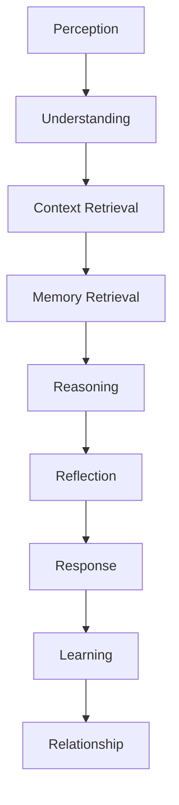
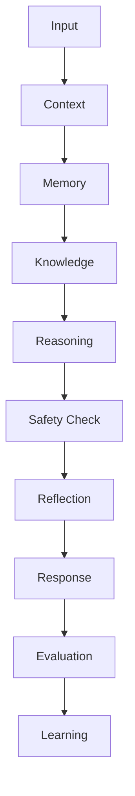

# MODULE 23 — AI ARCHITECTURE

---

## 0. Relationship to Modules 9, 10, and 16 (read first)

Modules 9 (Companion), 10 (Memory), and 16 (Reports) each already specify real, working AI architecture: Module 9's layered prompt system and reasoning pipeline, Module 10's memory schema/scoring/retrieval engine, Module 16's evidence-gated narrative synthesis. Every subsequent Discovery and feature module (12–19) explicitly reuses that same underlying Companion AI service rather than introducing its own.

This module does not redefine or duplicate any of that. It exists to do what none of those modules were positioned to do individually: **describe the one coherent intelligence system all of them are actually part of**, so that as the product keeps growing, every new AI-touching feature is built as an extension of one system, never a new one.

**On this brief's "Multi-Agent Architecture" (Section 17)**: this could be read as introducing separate AI personalities or separate models per function, which would directly contradict the standing, repeated rule across Modules 9–19 that there is one Companion AI service, one Memory graph, one embedding index. This module resolves that the way Module 18 resolved its own tension with the product's anti-social-network stance: by reinterpreting the requested concept through the existing constitution rather than relaxing it. **"Agents" in this module means specialized reasoning responsibilities — distinct prompt layers and retrieval/scoring logic operating over the same shared Memory graph and the same underlying LLM provider — never separate models, separate memories, or separate personalities.** A single request (e.g., a Companion conversation turn) may invoke several of these responsibilities in sequence or in parallel, but the user experiences one continuous intelligence, because that is what it actually is.

---

## 1. AI Goals

**Relationship Goals**: every AI capability in the product exists to deepen one continuous relationship (Module 9) — this module's job is ensuring that as capabilities multiply (Memory, Reflection, Recommendation, Discovery interpretation, Safety, Evaluation), they remain experientially and architecturally one intelligence, not a federation of features that happen to share a UI.

**Learning Goals**: the system should get better at understanding a specific person over time (Module 10's Insight Engine) and, in aggregate and anonymized form, better at the underlying task for everyone (Section 16) — without ever conflating the two.

**Reflection Goals**: every reflective output (Companion turn, Journal response, Discovery interpretation, Report) should trace to the same underlying Reflection Engine principles already established in Module 9, Section 9 — Advice/Reflection/Question/Validation/Insight — regardless of which module surfaces it.

**Memory Goals**: one memory graph, one scoring model, one retrieval engine (Module 10) — this architecture's central discipline is refusing to let any new capability fork that into a second, parallel system.

**Recommendation Goals**: every recommendation (Dashboard's single daily suggestion, Notifications' send/no-send decision, Community's Group suggestion) should be traceable to the same underlying scoring logic (significance, relevance, recency) already established across Modules 8/9/10/18/19 — this module names that shared logic once, explicitly, as a Recommendation Engine (Section 9) rather than letting each module re-derive its own variant.

**Trust Goals**: every AI decision must be explainable, every memory traceable, every recommendation reasoned, consistent with Module 21's Trust Architecture — this module is where that promise becomes an actual system design, not just a stated commitment.

**Safety Goals**: the Safety layer (Module 9, Section 13) is the one component in this entire architecture permitted to override every other layer's output — this module makes that override authority explicit at the architecture level, not just the conversational-behavior level.

**Scalability Goals**: as memory graphs grow (Module 8's 1000+ memories case) and as new modules add new retrieval/reasoning needs, the architecture must scale by adding well-defined responsibilities to the existing system, never by duplicating infrastructure per module.

**Business Goals**: this architecture is the literal engine of the Memory Moat (Module 2) — its coherence, not any single feature within it, is the actual asset.

---

## 2. AI Philosophy

**What AI is**: one continuous, memory-grounded intelligence serving a single long-term relationship, expressed through multiple modules but never fragmented across them.

**What AI is not**: not a chatbot, not a general assistant, not an LLM wrapper — every design decision in this Bible has been building toward a system whose defining property is that it remembers accurately and reflects honestly, not that it answers fluently.

**Relationship over automation**: the AI is not here to complete tasks efficiently — it exists to sustain a relationship. A more "automated," more proactive AI that did more on the user's behalf without being asked would be optimizing the wrong variable.

**Understanding over answering**: correctness of an answer matters less than whether the system actually understood what was being asked or shared, including what wasn't said outright (Module 9, Section 2).

**Reflection over prediction**: this governs every Discovery-system interpretation engine (Modules 12–15) as much as the Companion itself — the architecture must structurally prevent any component from asserting a predicted outcome as fact.

**Memory over conversation**: a single conversation's fluency is not the measure of this system's quality — the measure is whether the *accumulated* memory graph makes each subsequent conversation better than the last (Module 1's Product Flywheel).

**Growth over engagement**: every layer of this architecture (Section 4) is evaluated by whether it helps someone understand themselves better over time, never by whether it increases usage.

---

## 3. AI Lifecycle

**Perception**: raw input arrives — a Companion message, a Journal entry, a Discovery-system draw, a Report-generation trigger.

**Understanding**: the input is interpreted in light of what's actually being communicated, not just its literal content (Module 9, Section 12's emotional-intelligence rules apply at this stage).

**Context Retrieval**: the Context Engine (Section 5) assembles the current-conversation and session-level context.

**Memory Retrieval**: the Memory Engine (Section 6) retrieves the relevant, significance-ranked subset of the user's own memory graph.

**Reasoning**: the Reasoning Engine (Section 7) determines what kind of response is warranted — answer, reflect, ask, recommend, or stay silent (Module 9, Section 11's Decision Engine, generalized here as the architecture-wide decision layer).

**Reflection**: where warranted, the Reflection Engine (Section 8) shapes the response toward genuine insight rather than a flat answer.

**Response**: generated, streamed, and delivered through whichever module's interface is relevant (Companion, Discovery, Reports, Notifications).

**Learning**: the interaction is evaluated for memory-worthiness (Module 10's triviality filter) and quality (Section 15), feeding both this specific user's Memory graph and, where consented, aggregate system improvement (Section 16).

**Relationship**: the cumulative, compounding result — the actual product of this entire lifecycle, repeated over years.

---

## 4. AI Architecture Overview

| Layer | Responsibility | Already specified in |
|---|---|---|
| **Conversation Layer** | Manages the live Companion exchange — streaming, turn-taking, session state | Module 9, Sections 5–6, 18 |
| **Memory Layer** | The single memory graph, embedding index, scoring, and retrieval engine | Module 10, Sections 3–9, 18–19 |
| **Knowledge Layer** | Fixed reference content (Discovery-system meanings, calendrical/astronomical calculations) plus the relational linking between memory nodes | Module 10, Section 18 (lightweight knowledge graph); Modules 12–15 (fixed reference databases); extended here (Section 10) |
| **Reflection Layer** | Determines whether and how to shape a response as Advice/Reflection/Question/Validation/Insight | Module 9, Section 9; extended here (Section 8) to cover cross-module reflective synthesis (Reports) |
| **Recommendation Layer** | Resolves candidate suggestions (Discovery, Journal, Notification, Community) down to a single, most-relevant one | Modules 8, 18, 19; unified here (Section 9) |
| **Trust Layer** | Explainability, evidence attribution, consent enforcement | Module 21; extended here (Section 14) as an architectural, not just experiential, layer |
| **Safety Layer** | Crisis escalation, boundary respect, hallucination prevention — the one layer with override authority over every other | Module 9, Section 13; Module 16, Section 18; unified here (Section 13) |
| **Analytics Layer** | Quality and health metrics feeding continuous improvement | Modules 9/10/16's respective Analytics sections; unified here (Section 15) |
| **Learning Layer** | How the system improves — per-user (Memory) and, consensually, in aggregate | New, specified here (Section 16) |

**Why this table exists**: every layer already has a home in an earlier module; this module's contribution is naming them as *layers of one system* with explicit interfaces between them, so a future engineer building, say, a Voice Companion (Module 9, Section 23) knows exactly which existing layer to extend rather than guessing whether to build something new.

---

## 5. Context Engine

Extends Module 9, Section 7's context hierarchy (current conversation > memory > recent conversations > Discovery > Journal > Reports > relationship stage > time > mood) to apply uniformly across every module, not just Companion chat:

**Conversation context**: the immediate exchange — highest priority everywhere it applies (Companion, and the conversational bridge every Discovery-system reading opens into, Modules 12–15).

**Session context**: what's happened earlier in the current session (e.g., a Discovery reading earlier in the same sitting informing a later Companion exchange).

**Historical context**: the Memory graph itself (Section 6).

**Behavior context**: observable usage patterns (which Discovery systems a user gravitates to, Module 9's overwhelmed-signal detection) — used only for pacing/recommendation decisions, never for inferring emotional state (which remains explicitly-stated-only per Module 9, Section 12).

**Goal context**: only ever organically surfaced (Module 7's standing rule against soliciting goals as a structured field) — never a separately maintained "goals" data structure distinct from ordinary Memory.

**Relationship context**: the Relationship Lifecycle stage (Module 9, Section 3), gating interpretive confidence across every module that references it (Companion, all four Discovery systems, Reports).

**Retrieval strategy**: current conversation and session context are always included directly; historical/memory context is retrieved via the shared embedding index (Section 6) rather than being pre-loaded in bulk — this keeps the Context Engine's cost bounded regardless of how large a user's total memory graph grows.

---

## 6. Memory Engine

This section names Module 10's memory taxonomy explicitly as architecture, without redefining any of its mechanics:

**Short-term / Working memory**: the live conversation's context window — never persisted as a distinct memory type (Module 10, Section 4).

**Long-term memory**: everything that survives the triviality filter (Module 10, Sections 3, 6).

**Episodic memory**: Life Event and Discovery-reading-log content — discrete, dated happenings (Module 10, Section 4).

**Semantic memory**: Identity and Preference-type content — durable, general facts about the person rather than dated events (Module 10, Section 4).

**Relationship memory**: Relationship-type content plus the Relationship Lifecycle stage itself (Module 9, Section 3) — tracked as a first-class memory dimension, since it governs how every other memory type is used, not just what's stored.

**Memory scoring**: Module 10, Section 19's formula (importance, emotional, recency, relationship, confidence) — the single scoring model used by every consumer of memory (Companion, Dashboard, Reports, Notifications, Community recommendations) without exception.

**Memory lifecycle**: Module 10, Section 3 (Experience → Candidate → Evaluation → Stored → Recalled → Updated → Archived → Deleted).

**Memory pruning**: Archiving (Module 10, Section 10) — deprioritization, never destruction, the mechanism that keeps retrieval sharp at scale (Module 8's 1000+ memories case).

**Memory recall**: retrieval always grounded — a recalled memory must correspond to an actual retrieved node; the architecture enforces this by constraining the Reasoning Engine's (Section 7) generation step to only reference content present in the retrieved evidence set, never content synthesized from general context (Module 9, Section 15/19; Module 16, Section 18's stricter multi-memory equivalent).

**Memory ownership**: never directly user-writable, always user-deletable (Module 10's governing rule; Module 21's Trust Architecture restates this as a trust guarantee) — this is the one memory-architecture rule with zero exceptions anywhere in the system, including for any future capability (Section 22).

---

## 7. Reasoning Engine

**Reasoning philosophy**: reasoning in this system means deciding *what kind of response is warranted*, not performing open-ended chain-of-thought for its own sake — the Reasoning Engine's job is closer to triage than to computation.

**Chain of reasoning (conceptually)**: Context → Memory → Relationship stage → Decision (Module 9, Section 11's decision logic, generalized as the architecture-wide pattern) — each stage narrows the space of appropriate responses before generation begins, rather than generation happening first and being filtered after.

**Decision making**: reuses Module 9, Section 11's decision tree (direct answer / brief acknowledgment / reflection-or-question / offer Discovery / offer Journal / offer Insight) as the canonical decision model for every module, not just Companion chat — a Discovery-system interpretation engine (Modules 12–15) is, architecturally, invoking this same decision model scoped to its own content.

**Trade-offs**: where genuine tension exists (e.g., a user's stated preference for less frequent reflection, Module 20, Section 7, versus a highly significant memory genuinely warranting a check-in), the Safety/Trust layers' standing priority order applies: user-stated boundaries are respected over system-inferred significance, consistent with Module 9, Section 17's identical standing rule.

**Evidence gathering**: the Memory Engine's retrieval output (Section 6) constitutes the Reasoning Engine's evidence set — reasoning never proceeds on ungrounded assumption.

**Conflict resolution**: when two memories or two Discovery-system signals point in different directions (e.g., a Tarot theme and a Natal Chart theme suggesting different things), the architecture doesn't force artificial synthesis — it either presents both honestly (if genuinely relevant to surface) or defers to whichever has higher confidence/significance (Module 10, Section 7), never silently picking one without basis.

**Multi-step reasoning**: Reports' evidence-gathering-then-narrative-synthesis-then-verification pipeline (Module 16, Section 18) is this architecture's clearest example of genuine multi-step reasoning — most single-turn Companion responses require only one retrieval-then-generate step, while Reports requires retrieval, theme identification, narrative synthesis, and a distinct verification pass before output.

**Uncertainty handling**: expressed in plain language (Module 9, Section 6), never as a numeric confidence score exposed to the user (Module 9, Section 10) — internally, however, a confidence signal (Module 10, Section 19) does inform whether the Reasoning Engine proceeds with a claim at all or withholds it.

---

## 8. Reflection Engine

**Daily / Weekly / Monthly reflection**: Module 16's Report cadences (Daily/Weekly/Monthly Reflection) are this Reflection Engine's periodic, evidence-gated outputs — this section doesn't introduce a new cadence system, only names Reports as the Reflection Engine's primary longer-horizon expression, with Companion's turn-by-turn Reflection Engine (Module 9, Section 9) as its immediate, conversational expression.

**Life pattern detection**: Module 10, Section 11's Insight Engine escalation (Memory → Repeated Memory → Theme → Pattern → Identity → Life Story) is the Reflection Engine's core mechanism, shared identically by Companion, Journal, all four Discovery systems, and Reports.

**Behavior trends**: distinguished carefully from emotional inference (Module 9, Section 12) — a "trend" here means observable engagement patterns (e.g., increasing Journal frequency) used for recommendation pacing (Section 9), never a claim about the user's psychological state.

**Growth tracking**: Identity Evolution (Modules 13/15's shared mechanism) — the Reflection Engine's way of representing that a person's relationship to a stable fact (a chart placement, a number) can change even when the fact itself doesn't.

**Relationship evolution**: the Relationship Lifecycle stage (Module 9, Section 3) itself is a Reflection Engine output — computed from accumulated interaction history, not a user-set value.

**Methodology**: at every level (single-turn, Report, cross-system pattern), the Reflection Engine requires proportionally more evidence for a stronger claim (Module 10, Section 11's governing constraint) — this scaling relationship between claim-strength and evidence-requirement is the single unifying design rule across every reflective output in the entire product.

---

## 9. Recommendation Engine

Unifies the recommendation logic already independently specified in Modules 8 (Dashboard), 18 (Community), and 19 (Notifications) into one named, shared engine:

**Learning recommendations**: which Report type or Discovery-system connection is most worth surfacing (Module 16, Section 9).

**Journal recommendations**: contextual prompts drawn from Memory (Module 11, Section 9).

**Discovery recommendations**: the single, contextually-relevant Discovery-system suggestion (Module 8, Section 18; Module 9, Section 11).

**Companion suggestions**: what topic, if any, the Companion proactively surfaces (Module 9, Section 11).

**Notification reasoning**: whether and what to notify (Module 19, Sections 6, 10, 18).

**Dashboard prioritization**: the single daily focal recommendation (Module 8, Section 18).

**Recommendation logic**: every one of the above resolves through the identical underlying pattern — retrieve candidates, score by significance/relevance/recency (Module 10, Section 7/19), exclude recently-surfaced items (the standing rotation rule), and return exactly one. This module's contribution is stating plainly that this is *one engine* invoked with different scopes (Dashboard scope, Notification scope, Community scope), not five independently-implemented recommendation systems that happen to behave similarly by convention.

---

## 10. Knowledge Architecture

**Knowledge Graph**: the lightweight relational linking between Memory nodes (Module 10, Section 18) — e.g., a Relationship-type node linked to Life Event nodes involving that person. This module extends it to explicitly include links between a user's Memory nodes and the fixed reference content they connect to (a specific Tarot card, a specific Natal Chart placement) — enabling, for instance, "every memory that has ever connected to this recurring card" as a genuine, traversable query (feeding Module 12, Section 12's repeated-card pattern detection).

**Structured knowledge**: the fixed, curated reference databases (Tarot meanings, astrological placement meanings, Chinese zodiac/Five Elements rules, numerology reductions — Modules 12–15) — versioned, editable only through the Admin content-curation process (Module 2's standing responsibility), never AI-generated per request.

**User knowledge**: the Memory graph itself (Section 6) — the only knowledge source that is genuinely personal and private.

**World knowledge**: the underlying LLM's general pretrained knowledge — used only for general conversational fluency and never as a substitute for the structured, curated reference databases above when a Discovery-system fact is at stake (e.g., a Tarot interpretation must ground in the curated database, Section 12 of Module 12, not the model's own general "knowledge" of tarot, which may be inconsistent or inaccurate release to release).

**Temporal knowledge**: calendrical/astronomical computation (Natal Chart's ephemeris engine, Eastern Horoscope's lunisolar calendar, Modules 13–14) — deterministic, never AI-approximated, feeding the Knowledge Layer as precise, versioned facts rather than model-generated estimates.

**Relationship graph**: the Relationship-type Memory subgraph specifically (Section 6) — people in the user's life, as the user has described them, linked to relevant Life Events.

**Knowledge freshness**: structured knowledge (Discovery meanings, calendar rules) changes rarely and only through deliberate curation; user knowledge changes continuously through ordinary use; world knowledge freshness is bounded by the underlying model provider's own training/update cadence and is explicitly not relied upon for anything requiring current, verified accuracy about the user's own life or the product's own curated content.

---

## 11. Retrieval Architecture

**RAG philosophy**: retrieval-augmented generation in this system exists specifically to ground every claim about the user's own life in something actually retrieved, never to make the model generally "smarter" — the retrieval step is a trust mechanism first, a quality mechanism second.

**Memory retrieval**: the shared embedding index (Module 10, Section 18), queried per-user, ranked by Section 6/9's scoring.

**Journal retrieval**: identical index, `source_module='journal'` filtering where scope requires it (Module 11, Section 17).

**Reports retrieval**: the Evidence Engine (Module 16, Section 18) — the same retrieval mechanism, scoped to a report period/type and held to a stricter confidence floor given the larger synthesis surface.

**Discovery retrieval**: the fixed Knowledge Layer content (Section 10) plus a single most-relevant Memory item (Modules 12–15's shared singularity rule) — deliberately narrower retrieval scope than Companion or Reports, since a Discovery-system interpretation should connect to one thing clearly, not several things at once.

**Context ranking**: significance and relevance dominate; recency is a tiebreaker, never the primary signal (Module 10, Section 7) — restated here as the one ranking philosophy every retrieval consumer in the system must use, with no module permitted to substitute a purely recency-based ranking for convenience.

**Relevance scoring**: embedding-similarity to the current context, combined with the Memory Engine's significance/confidence scores (Section 6) — never similarity alone, which would risk surfacing a topically-similar but low-significance memory over a more important, less textually-similar one.

**Source attribution**: every retrieved item carries its source (which conversation, Journal entry, or Discovery reading) through the entire pipeline to the final response, enabling the Trust Layer's (Section 14) evidence-disclosure guarantee at the architecture level, not as a UI feature bolted on after generation.

---

## 12. Prompt Architecture

*(Architecture only, per this module's explicit instruction — no prompt text.)*

**System prompts**: the fixed, rarely-changing identity/tone/hard-constraint layer (Module 9, Section 19) — shared across every module that invokes the Companion voice (Companion, Discovery interpretation, Report narration, Notification copy).

**Module prompts**: a per-module layer scoped to that module's specific content needs (e.g., a Tarot-specific layer constraining language to reflective/possibility framing, Module 12, Section 17) — layered *on top of*, never replacing, the System layer.

**Reflection prompts**: govern which Reflection Engine mode (Section 8) is invoked for a given turn (Module 9, Section 19).

**Memory prompts**: the layer that explicitly bounds what memory content the model may reference this turn (Module 9, Section 19) — the single most safety-critical layer in the entire prompt architecture, since it's what makes hallucination-prevention (Section 13) enforceable rather than merely instructed.

**Safety prompts**: the highest-priority layer, capable of overriding every other layer's guidance (Module 9, Section 19) — checked first in the assembly order, not last.

**Evaluation prompts**: a distinct, internal-only prompt layer used by the Evaluation Agent (Section 17) to assess response quality/groundedness after generation, never shown to or influencing the user-facing response directly — a separate, after-the-fact check, not a further instruction to the generation step itself.

**Prompt versioning**: every layer is versioned independently (mirroring Module 21, Section 6's consent-versioning principle) — a change to the Safety layer, for instance, should be trackable and auditable separately from a change to a specific Discovery module's layer.

**Prompt lifecycle**: proposed → reviewed (particularly for Safety-layer changes, which require the highest review bar in the entire system) → versioned → deployed → monitored (Section 15) → revised.

**Prompt governance**: Safety-layer changes require the most rigorous review process in this entire architecture, given their override authority; Module-specific layers can iterate faster but must never be permitted to weaken a higher-priority layer's constraint, enforced structurally (later-assembled, lower-priority layers cannot override earlier, higher-priority ones) rather than by convention alone.

---

## 13. AI Safety Architecture

**Guardrails**: Module 1's standing Guardrails (never create dependency, never manipulate, never replace professional advice, never exploit anxiety, never fake certainty, never dark-pattern) apply architecturally as constraints on every layer in Section 4, not just as behavioral guidance to the Companion specifically.

**Hallucination prevention**: the single most load-bearing safety mechanism in this architecture — enforced structurally via the Memory Prompt layer's strict evidence-set boundary (Section 12) at single-turn scale, and via Module 16, Section 18's explicit post-generation grounding-verification step at Report-synthesis scale, where the larger evidence pool raises the risk correspondingly.

**Sensitive topics**: Module 9, Section 13's standing medical/legal/financial/political/religious boundaries apply as a constraint checked across every module's output (Discovery interpretations, Report narration, Notification copy), not solely Companion conversation.

**Emotional safety**: Module 9, Sections 12–13's emotional-intelligence and crisis-escalation rules — the Safety Layer's override authority is most visible here: a genuine crisis signal suspends the Reflection Engine's usual restraint-from-advice posture in favor of direct, appropriate guidance toward help (Module 9, Section 13's explicit, deliberate exception).

**Abuse prevention**: rate limiting and Companion's calm, non-escalating response to hostile input (Module 9, Section 17) — architecturally, this is a constraint on the Response layer, never a reason to degrade Memory-grounding discipline elsewhere.

**Privacy enforcement**: the Memory Engine's ownership rules (Section 6) and the Trust Layer's access controls (Section 14; Module 3, Section 11's Permission Architecture) are enforced at the data-access layer itself, not merely at the prompt-instruction layer — a query attempting to cross user boundaries should fail at the database/service layer regardless of what any prompt says.

**Consent enforcement**: AI-training-use consent (Module 6, Section 9) and Community-sharing consent (Module 18, Section 8) gate what data the Learning Layer (Section 16) can access — enforced as a data-access-layer check, not a prompt instruction to "please don't use this data."

**Self-limitation**: the system states plainly when something is outside its scope (Module 9, Section 13) rather than attempting an answer beyond its competence — an architectural commitment realized through the Safety prompt layer's authority to redirect generation entirely, not just soften it.

**Fallback behavior**: when memory or context retrieval fails (Module 9/10, Section 15), the system degrades to whatever context remains genuinely available rather than fabricating a substitute — this fallback is itself part of the Safety Architecture, since a system that quietly fills gaps with plausible-sounding invention would be a hallucination risk masquerading as graceful degradation.

**Human escalation**: crisis-level content routes toward real external resources (Module 9, Section 13); non-crisis but genuinely difficult moderation/support cases (Community, Module 18) route to human review (Module 18, Section 17) — the architecture's standing rule that no fully-automated system handles either category alone.

---

## 14. Trust Architecture

Extends Module 21's product-facing Trust Center into this module's underlying system design:

**Explainability**: every layer in Section 4 produces an output that can, on request, state what informed it — Context/Memory retrieval results, Reasoning Engine's decision, Reflection Engine's mode selection.

**Transparency**: source attribution (Section 11) travels with every retrieved item through the full pipeline to the final response, making Module 21's "why did AI know this" guarantee an architectural property, not a UI afterthought.

**Confidence**: tracked internally (Module 10, Section 19) as a gate on whether a claim proceeds at all, never exposed to the user as a raw number (Module 9, Section 10) — the architecture separates *internal confidence thresholds* (a system design parameter) from *user-facing confidence language* (always qualitative, per Module 9's standing rule).

**Evidence**: every Memory reference, every Report narrative claim, every Discovery interpretation's personalization must trace to a specific, retrievable source (Sections 6, 11) — this is the literal mechanism behind Module 21's Deep Dive and "why this memory" features.

**Reasoning disclosure**: on request, the Companion can state what informed a response (Module 9, Section 10) — architecturally, this means the Reasoning Engine's decision trace (which context, which memory, which decision branch, Section 7) must be retained at least transiently and be queryable, not discarded immediately after generation.

**Memory disclosure**: the Memory Card mechanism (Module 4/10) is this architecture's primary disclosure interface — every layer that surfaces memory content must route through it, never through a paraphrase that obscures the underlying source.

**Decision disclosure**: extends to non-conversational AI decisions — Dashboard's single recommendation, Notifications' send/no-send choice (Module 8/19) — each explainable on request via the same underlying Recommendation Engine trace (Section 9).

**Auditability**: every Admin-override data access and every Safety-layer intervention (a crisis-escalation trigger, a redirected response) is logged immutably (Module 21, Section 17) — the AI Safety Architecture (Section 13) and the Trust Architecture's audit requirements are the same underlying logging system, not two separate ones.

---

## 15. AI Evaluation

**Quality metrics**: reused directly from each module's own standing Analytics sections — Module 9, Section 16 (conversation quality, reflection depth); Module 10, Section 16 (memory usefulness, recall accuracy); Module 16, Section 21 (narrative/evidence accuracy) — this section's contribution is naming these as one evaluation suite run consistently across the whole system, not module-specific one-offs.

**Reflection quality**: whether Reflection Engine outputs (Section 8) lead to genuine continued engagement, tracked identically whether the output was a Companion turn or a Report.

**Memory quality**: the triviality-filter and scoring-formula (Section 6) calibration — checked via the deletion-as-correction signal (Module 10, Section 16) as the primary real-world quality proxy.

**Recommendation quality**: whether the single surfaced recommendation (Section 9) is accepted/engaged with, tracked per recommendation type but rolled up into one shared quality dashboard.

**Conversation quality**: Module 9, Section 16's standing metrics.

**Safety metrics**: crisis-escalation response time and correctness, hallucination-prevention audit pass rate (Module 9/16's respective QA requirements) — treated as release-blocking, not just monitored, consistent with every prior module's standing rule that Safety QA is the highest-priority category.

**Latency**: Thinking-state honesty depends on actual latency staying within a labelable range (Module 9, Section 10) — tracked per layer (retrieval, reasoning, generation) to identify where a slowdown might force an honest re-labeling of the Thinking state rather than a silent, misleadingly-brief label.

**Consistency**: the same underlying question across modules (e.g., a user's Life Path number and their Natal Chart Sun sign both describing a similar tendency) should produce coherent, non-contradictory synthesis when both are relevant — evaluated as a cross-module consistency check, a genuinely new evaluation category this architecture introduces given how many previously-separate Discovery systems this module unifies.

**Trust metrics**: Module 21, Section 15's Trust Center engagement/resolution metrics, plus this architecture's own internal groundedness-verification pass rate (Module 16, Section 18) as a leading indicator.

---

## 16. Learning Architecture

**Feedback loops**: per-user Memory accumulation (Module 10) is the primary, always-on feedback loop — every interaction makes the *next* interaction with that specific person better-informed, which is this product's entire differentiator.

**Implicit learning**: engagement signals (does a surfaced memory get positively engaged with, does a Reflection-mode response lead to continued disclosure, Module 9/10, Section 16) inform ongoing calibration of scoring thresholds and Recommendation Engine weighting — always in aggregate, across the consenting user base, never by directly altering an individual user's own Memory content based on inferred "correctness."

**Explicit feedback**: deletion-as-correction (Module 10, Section 16) is this system's primary explicit feedback signal — a user removing an inaccurate memory is a strong, direct correction the Learning Architecture should weight heavily.

**Memory updates**: per Module 10, Section 9 — always user-specific, never propagated across users.

**Preference evolution**: Relationship Lifecycle stage progression and Identity Evolution (Sections 6/8) — tracked per-user, feeding that same user's future personalization only.

**Model-independent learning**: the vast majority of this system's "learning" is architected to happen in the Memory graph and scoring calibration, not in the underlying LLM's weights — this is a deliberate design choice: per-user personalization lives entirely in retrievable, deletable, exportable Memory (satisfying Module 21's ownership guarantees), never baked irreversibly into a fine-tuned model that couldn't honor a deletion request.

**Continuous improvement**: aggregate, anonymized, and only AI-training-consented data (Module 6, Section 9) may ever inform genuine model-level improvement (e.g., prompt refinement, and only with explicit governance, any future fine-tuning, Section 22) — this is the one place in the Learning Architecture where the standing per-user/aggregate boundary (Section 1) must be enforced with zero exceptions, since crossing it without consent would be the single most severe possible violation of this Bible's privacy commitments.

---

## 17. Multi-Agent Architecture

Per Section 0's reconciliation: these are specialized reasoning responsibilities within one shared system (one LLM provider, one Memory graph, one embedding index), not separate models or personalities.

| "Agent" | Responsibility | Shares with every other agent |
|---|---|---|
| **Companion Agent** | Conversational turn-taking, personality expression (Module 9) | Same LLM provider, same Memory graph, same Reflection Engine |
| **Memory Agent** | Candidate evaluation, scoring, storage, retrieval (Module 10) | The single Memory graph every other agent reads from and writes to (indirectly, via evaluation) |
| **Reflection Agent** | Selects Advice/Reflection/Question/Validation/Insight mode (Section 8) | Invoked by Companion Agent per-turn and by the Reports pipeline per-synthesis |
| **Recommendation Agent** | Resolves candidates to a single suggestion (Section 9) | Same scoring model as Memory Agent's retrieval ranking |
| **Discovery Agent** | Grounds Discovery-system interpretation in the fixed Knowledge Layer (Section 10) plus one Memory connection | Same Memory Agent retrieval, same Reflection Agent mode-selection logic, scoped narrower |
| **Safety Agent** | Crisis detection, boundary enforcement, override authority (Section 13) | Reviews every other agent's output before it reaches the user — the one agent with veto power |
| **Evaluation Agent** | Post-generation groundedness verification (Module 16, Section 18) and ongoing quality scoring (Section 15) | Operates after generation, never influences the user-facing response directly, only future calibration |

**Why "agents" and not "models"**: none of these responsibilities requires or implies a separately-trained or separately-hosted model — in practice, most are implemented as distinct prompt layers and retrieval scopes (Section 12) invoked against the same underlying LLM provider (Section 18), orchestrated in a defined sequence per Section 19's pipeline. The "multi-agent" framing is useful for reasoning about *responsibility and review boundaries* (e.g., the Safety Agent's review is a distinct, auditable step, Section 13), not for implying architectural or experiential fragmentation.

**Orchestration**: for a single Companion turn, the sequence is roughly Memory Agent (retrieve) → Reflection Agent (select mode) → Companion Agent (generate) → Safety Agent (review) → Evaluation Agent (log quality, async). For a Report, it's a heavier sequence: Memory Agent (retrieve at scale) → Reflection Agent (identify themes) → a narrative-synthesis step → Evaluation Agent (mandatory groundedness verification, blocking, per Module 16, Section 18) → Safety Agent (review) → delivery.

---

## 18. Technical Architecture

**LLM abstraction layer**: a single internal interface (`AIService.generate(prompt, context)`) sitting in front of the actual model provider, so a future provider change or model upgrade (Module 1's stack: OpenAI) doesn't require touching every module's individual integration — every module (Companion, Discovery, Reports, Notifications) calls this one abstraction, never the provider API directly.

**Provider abstraction**: the abstraction layer's actual implementation detail — enables swapping or multi-provider routing without changing calling code in any module.

**Model routing**: different responsibilities (Section 17) may reasonably route to different model sizes/configurations for cost/latency reasons (e.g., the Evaluation Agent's groundedness check may use a cheaper, faster model than the Companion Agent's generative turn) — this routing decision is an internal optimization, invisible to and never affecting the user-facing quality/safety guarantees, which apply identically regardless of which underlying model configuration handles a given step.

**Caching**: Redis-based, per Module 3/9/10's existing standing caching architecture (hot recent-memory cache, retrieval-result cache) — this module introduces no new caching layer, only confirms these are shared, not per-module-duplicated, caches.

**Embedding service**: the single shared embedding generation and index (Module 10, Section 18) — every module's retrieval need (Companion, Search, Reports, Discovery, Community's consented-theme matching) queries this one service.

**Vector database**: pgvector or equivalent Postgres extension (Module 10, Section 18), consistent with the product's Postgres-centric stack (Module 1) — not a separate dedicated vector database unless retrieval-latency data later demonstrates genuine need.

**Knowledge database**: the fixed reference-content tables (Discovery-system meanings, calendrical rules, Modules 12–15) — versioned, curated, distinct from the dynamic Memory graph.

**Conversation storage**: Module 9, Section 18's schema — one conversation service used identically by Companion chat and Onboarding's first conversation (Module 7's non-duplication principle).

**Memory storage**: Module 10, Section 18's `memory_node`/`memory_embedding` schema.

**Queue architecture**: BullMQ (Module 1's stack) handles every async AI-adjacent job — memory evaluation, embedding generation, Report generation, notification evaluation — as one shared queue infrastructure, not per-module queues.

**Monitoring**: latency, error rate, and Safety-Agent intervention rate are tracked per layer (Section 4) and per agent (Section 17), feeding directly into Section 15's evaluation suite and Module 21's audit-log-derived Transparency Report aggregate statistics.

---

## 19. AI Reasoning Pipeline

**Input**: any user-originated content across any module.

**Context**: the Context Engine (Section 5) assembles current/session-level context.

**Memory**: the Memory Engine (Section 6) retrieves ranked, relevant historical content.

**Knowledge**: the Knowledge Layer (Section 10) supplies any fixed reference content relevant to the request (a Discovery-system meaning, a calendrical fact).

**Reasoning**: the Reasoning Engine (Section 7) decides what kind of response is warranted.

**Safety Check**: the Safety Agent (Section 13/17) reviews the intended response direction *before* full generation commits to it — placed here, mid-pipeline, rather than only as a post-hoc filter, so a crisis signal can redirect the entire remaining pipeline (skipping ordinary Reflection-mode selection in favor of the standing crisis-escalation response) rather than generating an inappropriate response and then discarding it.

**Reflection**: the Reflection Engine (Section 8) shapes the response mode.

**Response**: generated and delivered.

**Evaluation**: the Evaluation Agent (Section 15/17) checks groundedness (mandatory, blocking for Reports; sampled/async for lighter-weight Companion turns) and logs quality signals.

**Learning**: feeds the Learning Architecture (Section 16) — per-user Memory update and, where consented, aggregate calibration signal.

---

## 20. AI UX Principles

*(Principles only — implementation lives in Module 4, Sections 9–10, and Module 9, Sections 6/10.)*

**Thinking state**: always labeled, honest about what's actually happening (retrieval vs. generation vs. a Report's heavier synthesis) — never a generic, evasive-feeling placeholder.

**Memory reveal**: always via the Memory Card, always distinguishable from generated reasoning — the architecture's grounding guarantee (Section 6/13) made visible.

**Explanation**: available on request at every layer (Section 14) — a user can always ask "why," and the system can always answer from an actual retained reasoning trace, never a post-hoc invented justification.

**Confidence**: qualitative in user-facing language, quantitative only internally (Section 14).

**Uncertainty**: stated plainly, never hidden behind false fluency.

**Recommendation**: always singular (Section 9), never a ranked list competing for attention.

**Relationship continuity**: every module's AI-authored voice is the same voice (Module 22, Section 15) — architecturally guaranteed by every module sharing the same System prompt layer (Section 12).

**Transparency**: the throughline connecting every principle above — this architecture has no component whose behavior is, by design, opaque to the user who asks.

---

## 21. QA Checklist

- **Reasoning**: verify the Decision Engine's branch coverage (Module 9, Section 22) generalizes correctly across every module that invokes it, not just Companion chat directly.
- **Memory**: verify the single scoring model and embedding index are genuinely shared (no module has forked its own copy) via a direct architecture audit, not just a design-intent review.
- **Recommendations**: verify Dashboard, Notifications, and Community recommendations all route through the same underlying Recommendation Engine logic (Section 9), producing consistent, comparable behavior under equivalent inputs.
- **Reflection**: verify Reflection Engine mode-selection (Section 8) behaves consistently whether invoked by Companion, a Discovery module, or Reports.
- **Latency**: verify per-layer latency budgets (Section 15/18) are met, with explicit fallback labeling for any layer running long.
- **Safety**: the single highest-priority QA category in this entire module — verify the Safety Agent's mid-pipeline placement (Section 19) actually intercepts and redirects crisis-adjacent content before generation commits, not just after, via dedicated adversarial test scenarios.
- **Privacy**: verify Learning Architecture's aggregate/per-user boundary (Section 16) is enforced at the data-access layer, not just policy — attempt to access another user's Memory via any code path; it must fail.
- **Trust**: verify every Trust Architecture guarantee (Section 14) — source attribution, evidence trails, decision disclosure — actually functions end-to-end for a real user request, not just in isolated unit tests.
- **Consistency**: verify the new cross-module consistency check (Section 15) catches genuinely incoherent synthesis across two Discovery systems referencing the same underlying tendency.

---

## 22. Future Expansion

**Personal models**: a hypothetical future per-user fine-tuned model — explicitly cautioned against per Section 16's model-independent-learning principle; a fine-tuned model that baked in personal data would be extremely difficult to reconcile with the standing deletion/export guarantees (Module 21) and should not be pursued without solving that tension first, not treated as a routine scaling improvement.

**Fine-tuning**: at the aggregate, consented level only (Section 16) — any future fine-tuning initiative must be governed with at least the rigor of Module 6, Section 9's AI-training-use consent, and ideally more, given the scale of data involved.

**Voice Companion**: extends the Companion Agent (Section 17) with a new input/output modality — requires the Safety Agent's voice-specific crisis-detection capability (Module 9, Section 23) before launch, since voice interaction patterns differ meaningfully from text for signal detection.

**Multimodal** (image input, per Module 9/10's Vision Companion notes): would require a new classification capability at the Memory Agent's evaluation step (an image isn't natural-language content) before it could participate in the existing Memory pipeline at all — not assumed to work automatically.

**Long-term planning**: a hypothetical capability where the Companion helps structure a longer-horizon personal goal — would need to stay within the standing "reflection over advice" and "no coaching persona" boundaries (Modules 9/11/13/17/19's repeated rejection of directive AI personas) rather than introducing a planning/task-management capability foreign to this product's actual premise.

**Dream mode**: unclear/unspecified in this Bible and not recommended without a clearer product rationale — flagged here only to note that any exploratory, more free-associative AI mode would need its own Safety Architecture review given the standing hallucination-prevention discipline this entire system depends on.

**Life timeline**: already the Life Archive/Reports Timeline concept (Modules 9/10/16) — no new architecture needed.

**Personal knowledge graph**: the Knowledge Architecture's (Section 10) User Knowledge component, already the closest thing to this concept that exists — a "personal knowledge graph" as a distinct product surface would likely just be a richer presentation layer over the existing Memory graph, not a new underlying architecture.

**Agent collaboration** (multiple "agents," per Section 17, reasoning jointly on a single complex request, e.g., a Yearly Review drawing on Companion, Memory, Discovery, and Reflection agents simultaneously): already the de facto model for Reports generation (Section 17's orchestration example) — future expansion here means refining that orchestration for more complex, multi-source synthesis, not introducing a fundamentally new collaboration paradigm.

---

## 23. Final Decisions

**Chosen Architecture**
One coherent intelligence system — a single LLM abstraction layer, one Memory graph and embedding index, one Reflection Engine and Recommendation Engine logic, and one layered, versioned Prompt Architecture with the Safety layer holding override authority at a mid-pipeline checkpoint (not just a post-hoc filter) — expressed through multiple specialized "agent" responsibilities (Section 17) that share every underlying resource rather than operating as separate systems, with per-user learning happening entirely in retrievable, deletable Memory rather than in any fine-tuned model weights.

**Rejected Alternatives**
- Genuinely separate models or services per module (a "Tarot AI," a "Reports AI," a "Notifications AI") — rejected throughout this Bible already (Modules 9–19) and reaffirmed here as an architectural, not just a per-module, decision: one system, many responsibilities.
- A single monolithic prompt with no layer separation — rejected in favor of the layered, independently-versioned Prompt Architecture (Section 12), specifically to keep the Safety layer auditable and reviewable in isolation.
- Post-hoc-only safety filtering (generate first, then check) — rejected in favor of a mid-pipeline Safety Check (Section 19) with authority to redirect the remaining pipeline, since generating an inappropriate response and discarding it is both a wasted step and a real risk if any partial output were to leak through before the filter runs.
- Personalization via model fine-tuning on individual user data — rejected in favor of Memory-graph-based personalization, since fine-tuning would be fundamentally incompatible with this product's absolute deletion/export guarantees (Module 21).
- Numeric, user-facing confidence scores — rejected in favor of qualitative language, consistent with every prior module's identical standing decision, reaffirmed here as an architecture-wide rule rather than a per-module stylistic choice.

**Trade-offs**
Requiring every module to route through one shared Memory/Reflection/Recommendation/Prompt system, rather than allowing faster, module-specific custom implementations, imposes real coordination overhead on future feature teams (a new module can't just build its own quick AI integration; it must integrate with the existing layered architecture) — accepted because the alternative, a federation of independently-evolving AI implementations, is exactly the fragmentation risk this module exists to prevent, and would eventually produce the two-divergent-understandings-of-the-same-person failure mode flagged repeatedly across Modules 10, 11, 12–16, and 18.

**Reasons**
Every decision in this module exists to make explicit and durable what Modules 9, 10, and 16 already implicitly established through repeated, consistent practice: that BeaconVie's AI is one thing, not many, and that its trustworthiness depends entirely on that remaining true as the product keeps growing past this 23rd module.

---

**This module, together with Module 22 (Design Language System), forms the pair of cross-cutting architectural layers governing every module in this Bible from this point forward — Module 22 for how BeaconVie looks and feels; Module 23 for how it thinks and remembers.**
