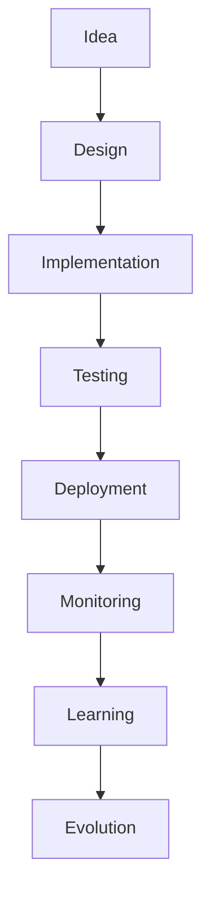
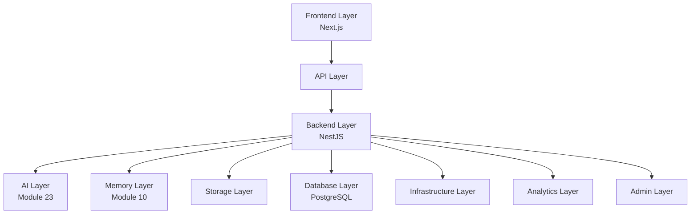
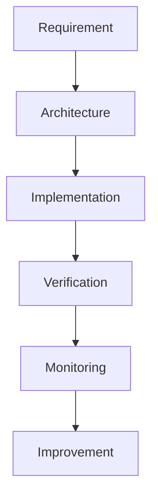

# MODULE 24 — ENGINEERING ARCHITECTURE

---

## 0. Relationship to Prior Modules

Every product module (5–21) already specifies its own schema, API endpoints, queues, and caching needs. Module 23 already specifies the AI-specific technical architecture (LLM abstraction, embedding service, vector database, model routing). This module does not restate any of that. It exists to specify the **platform-level architecture those specs all sit inside** — the frontend/backend structure, the database and storage strategy at the whole-system level, the event/queue infrastructure as one coherent system rather than per-module descriptions, and the reliability, scalability, observability, testing, and deployment disciplines that make a 22-module product operable, maintainable, and trustworthy at scale (10 million users, per the stated requirement).

Where Module 23 answers "how does the AI think," this module answers "how does the whole system run, stay up, stay fast, stay correct, and stay changeable without breaking."

---

## 1. Engineering Goals

**Scalability**: the platform must support growth from thousands to 10 million users without a fundamental architecture rewrite — achieved by keeping services stateless, data horizontally partitionable, and AI/compute costs modeled per-user from day one (Module 2's cost-scaling concern).

**Reliability**: the Companion relationship (Module 9) is a daily habit for retained users — an unreliable platform breaks trust in a way a feature outage in a transactional app wouldn't, since a missed conversation or a lost Journal entry is a broken promise about memory, not just an inconvenience.

**Maintainability**: 22+ product modules built over time, by teams who won't all have the full history in their heads — the architecture must make correct extension easy and incorrect shortcuts (a duplicated memory store, a bypassed Safety layer) structurally difficult, not just discouraged by convention.

**Developer Experience**: a clear, consistent module/service boundary structure (Section 6) so a new engineer can find where a given responsibility lives without tribal knowledge.

**Performance**: every latency-sensitive experience this Bible has designed around (honest Thinking states, Module 4/9; natural-pace streaming) depends on the platform actually delivering the latency those UX decisions assume — performance is a UX commitment as much as an engineering one.

**Security**: protecting Personal Content (Module 21's data classification) is this platform's highest-stakes engineering responsibility, given what that content actually contains.

**AI Integration**: the platform must support Module 23's AI Architecture as a first-class citizen — not bolted onto a conventional CRUD backend, but designed from the ground up around async memory pipelines, embedding retrieval, and streaming generation.

**Business Continuity**: the Memory graph (Module 10) is this business's core asset (Module 2) — its durability, backup integrity, and disaster-recovery posture are board-level business risks, not merely an engineering concern.

---

## 2. Engineering Philosophy

**Engineering supports Product**: every architectural decision is justified by what it enables for the user experience already specified in Modules 1–23, never by what's technically interesting to build.

**Architecture over shortcuts**: a shortcut that works today but creates a second, divergent data path (e.g., a module caching its own copy of Memory data instead of querying the shared service) is rejected even under deadline pressure, because it recreates exactly the fragmentation risk Module 23 was built to prevent.

**Consistency over speed**: a slower-to-ship but consistent implementation (reusing existing patterns, Section 20) beats a faster, bespoke one — consistent with this Bible's repeated preference for shared systems over module-specific ones (Modules 9, 10, 18, 23).

**Modularity over duplication**: services and modules have clear, single-responsibility boundaries (Section 6); shared concerns (Memory, AI, auth) live in one place, consumed by many, never copy-pasted.

**Observability over guessing**: every service emits enough signal (Section 16) that an engineer can answer "what happened and why" without needing to reproduce an issue locally first.

**Automation over manual work**: deployment, testing, and monitoring are automated by default (Sections 17–18) — manual, undocumented operational steps are treated as technical debt, not a reasonable trade-off.

**Resilience over optimism**: every external dependency (LLM provider, payment provider, email/push services) is assumed to fail sometimes, and the platform is designed to degrade gracefully (Section 14) rather than assuming it won't happen.

---

## 3. Engineering Lifecycle

**Idea**: a new product need (a new module, or an extension to an existing one) is scoped against the existing Platform Architecture (Section 4) — the first question is always "which existing service/layer does this extend," per Section 2's modularity principle.

**Design**: a lightweight architecture review confirms the proposed design reuses shared services (Memory, AI, Auth) correctly and doesn't introduce a parallel system — this is the engineering-side equivalent of Module 23's "does this create a second understanding of the same person" check.

**Implementation**: built against the module/service boundaries in Section 6, with tests (Section 17) written alongside, not after.

**Testing**: the full pyramid (Section 17) — unit, integration, contract, E2E, and, where AI is involved, evaluation tests (Module 23, Section 15) — runs before merge.

**Deployment**: through the standard environment pipeline (Section 18) — no direct-to-production changes outside this pipeline, even for urgent fixes (which use an expedited, but still pipelined, path).

**Monitoring**: the deployed change is observed (Section 16) against both technical health and product-quality signals (Module 9/10/16's respective Analytics sections) — a technically healthy deploy that degrades reflection quality is still a failed deploy.

**Learning**: incidents and monitoring signals feed back into architecture decisions — this is the engineering-side equivalent of Module 23's Learning Architecture, applied to the platform itself rather than the AI's understanding of users.

**Evolution**: the platform's architecture itself is revisited periodically (Section 22) as scale and requirements change, always evaluated against Section 1's goals rather than incidental technical fashion.

---

## 4. Platform Architecture

| Layer | Responsibility | Detailed in |
|---|---|---|
| **Frontend Layer** | Rendering, client state, user interaction | Section 5 |
| **Backend Layer** | Business logic, orchestration, domain services | Section 6 |
| **API Layer** | The contract between Frontend and Backend, and any future external consumer | Section 7 |
| **AI Layer** | LLM abstraction, Memory/Reflection/Recommendation/Knowledge/Evaluation services | Module 23, Section 18 (not restated here) |
| **Memory Layer** | The shared Memory graph and embedding index | Module 10 (not restated here) |
| **Storage Layer** | Object storage for files/exports/backups | Section 10 |
| **Database Layer** | Relational data, the source of truth for most domain data | Section 9 |
| **Infrastructure Layer** | Compute, networking, environment provisioning | Section 15/18 |
| **Analytics Layer** | Product and technical metrics pipeline | Section 16 |
| **Admin Layer** | Internal tooling, audited override access (Module 3, Section 11) | Referenced, not re-specified |

**Why this diagram matters**: it's the single picture that shows every module's individual technical spec (Modules 5–21) has a home in one of these ten boxes — no module's technical architecture should require a box this diagram doesn't already contain; if one does, that's a signal the Platform Architecture itself needs to evolve deliberately (Section 22), not be silently worked around.

---

## 5. Frontend Architecture

**Next.js architecture**: server-rendered-first for content-heavy, reading-oriented surfaces (Reports, Journal, Landing, Module 1's Tech Stack) with client-side hydration for interactive surfaces (Companion chat, Dashboard's resolved recommendation).

**Feature modules**: one frontend module per product module (Companion, Journal, Discovery, Reports, Community, Settings, Trust Center) — each owns its own routes and screen-level components, but all consume the same shared component library (Module 4, Section 17's atomic-design structure) and the same design tokens (Module 4/22) — no feature module defines its own visual primitives.

**Component organization**: Module 4, Section 17's atoms → molecules → organisms → templates structure, applied uniformly; this module adds the rule that a component belongs in the shared library the moment a second feature module needs it — a component used by only one module can start there, but must graduate to shared status on first reuse, preventing silent duplication of near-identical components across modules (a specific, named risk Module 4, Section 17 already flagged for Memory Card, Insight Card, Report Timeline, and AI Message).

**Routing**: file-based routing per feature module, with a shared, consistent URL structure reflecting Module 3's Information Architecture (e.g., `/companion`, `/journal`, `/reports/:id`) — navigation depth mirrors Module 3's two-tap-maximum rule at the routing level too, not just the visual-navigation level.

**State management**: server state (Memory, Companion conversation, Reports) is never duplicated into long-lived client state beyond what's needed to render the current screen — the client treats the backend as the source of truth and re-fetches rather than caching aggressively in ways that could drift from what Memory actually contains (a specific safeguard against the Memory Card ever showing stale, inaccurate content).

**Caching**: short-lived, screen-scoped caching only (e.g., a Dashboard payload cached for the duration of a session) — no client-side cache is allowed to persist across sessions in a way that could show outdated Memory content after a deletion (Module 10's deletion-is-immediate guarantee must hold at the client layer too).

**Localization**: locale-aware routing and content loading (Module 5/9's tone-localization requirements), with Fraunces/Karla font-loading validated per supported script (Module 22, Section 6).

**Theme system**: consumes Module 4/22's token set directly via CSS custom properties — dusk default, light alternate — switchable in Settings (Module 20) and persisted per-account, not per-device.

**Accessibility**: built into the shared component library (Module 4, Section 17) so every feature module inherits correct accessibility behavior by default, rather than each module re-implementing it.

**Performance**: Core Web Vitals targets (Module 5, Section 13) apply platform-wide, not just to Landing — SVG-first illustration assets (Module 4/22), font-display strategies to avoid layout shift, and code-splitting per feature module to keep initial load lean even as the product's total surface area grows.

---

## 6. Backend Architecture

**NestJS architecture**: a modular monolith at current scale (Module 1's Tech Stack) — organized into clearly-bounded NestJS modules mirroring the product's own module boundaries (Companion, Memory, Journal, Discovery, Reports, Community, Notifications, Settings, Trust/Privacy, Premium/Billing, Admin), each with its own controllers, services, and repositories, but deployed as one application until genuine scaling data justifies splitting a specific module out (Section 22's microservices note).

**Module boundaries**: each backend module owns its own domain data and exposes a clear service interface to other modules — e.g., the Companion module never queries the Memory module's database tables directly; it calls `MemoryService.retrieve(...)`, enforcing Module 10/23's single-source-of-truth principle at the code-boundary level, not just by convention.

**Application services**: orchestrate a use case across multiple domain services (e.g., "generate a Report" orchestrates Evidence retrieval, Theme identification, Narrative synthesis, and Verification, per Module 16, Section 18) — application services contain workflow logic, never business rules themselves.

**Domain services**: contain the actual business rules of a single bounded module (e.g., Memory's significance-scoring formula, Module 10, Section 19) — kept independent of any specific API shape or delivery mechanism, so the same domain logic could serve a future non-web client (Module 9's Voice Companion) without rewriting the rule itself.

**Repositories**: the only layer that talks to the database directly — every domain service depends on a repository interface, never raw SQL/ORM calls scattered through business logic, keeping the Database Layer (Section 9) swappable in principle and consistently testable in practice.

**CQRS readiness**: the architecture doesn't adopt full CQRS at current scale (unnecessary complexity for the actual read/write patterns involved) but keeps read-heavy paths (Dashboard aggregation, Module 8; Memory retrieval, Module 10) architecturally separable from write paths (Memory evaluation, Report generation) so a future move toward read-replica-backed query services is possible without a rearchitecture.

**Background jobs**: BullMQ-based, one shared queue infrastructure (Section 11) — every module's async need (memory evaluation, embedding generation, Report generation, notification evaluation, export/deletion orchestration) is a job type within this one system, never a per-module bespoke background-processing mechanism.

**Permission system**: enforces Module 3, Section 11's Permission Architecture at the service layer — every request carries an authenticated identity and role; domain services check entitlement/permission before executing, never relying on the frontend to have hidden a button as the actual access control.

**Validation**: input validation happens at the API boundary (Section 7) using a consistent schema-validation approach across every endpoint — malformed input never reaches domain logic.

**Error handling**: a consistent, typed error taxonomy (validation error, not-found, permission-denied, conflict, upstream-service-failure) mapped to consistent API error responses (Section 7) — every module's errors surface through the same shape, so frontend error-handling code (Module 4's Error Experience patterns) can be genuinely shared rather than reimplemented per module.

---

## 7. API Architecture

**REST philosophy**: resource-oriented REST for the vast majority of the API surface (matching every module's already-specified endpoint shapes, e.g., `GET /dashboard`, `POST /companion/message`) — GraphQL or RPC-style APIs are not introduced unless a specific, demonstrated need arises (e.g., a future third-party developer API, Module 2's Future Expansion), since REST's simplicity matches this product's actual integration needs today.

**Versioning**: a URL-path version prefix (`/v1/...`) from day one, even before a breaking change is anticipated — retrofitting versioning onto an unversioned API under real usage is far more disruptive than starting with it.

**Authentication**: every non-public endpoint requires a valid Access Token (Module 6, Section 7) — enforced by shared middleware, not per-controller checks that could be forgotten.

**Authorization**: layered on top of authentication — the Permission Architecture (Section 6) check happens after identity is established, per-resource (e.g., can this user access this specific Memory node, not just "is this user logged in").

**Idempotency**: write endpoints that could be retried by a flaky client (e.g., Journal entry creation, Section 6's autosave) accept an idempotency key to prevent duplicate creation on retry — directly supporting Module 11's "nothing written is ever lost" guarantee without risking duplicate entries.

**Pagination**: cursor-based pagination for any list endpoint that could grow unbounded (Memory Timeline, Journal history, Community Feed, Module 18's explicit paginated-not-infinite design) — offset-based pagination is avoided since it degrades at scale and doesn't match the deliberately-bounded, non-infinite-scroll UX this product has repeatedly chosen.

**Filtering/Sorting**: consistent query-parameter conventions across every list endpoint (`?type=`, `?since=`, `?sort=`) — a frontend engineer building a new module's list view shouldn't have to learn a new filtering convention per endpoint.

**Rate limiting**: applied per-user and per-IP at the API gateway/middleware level (Module 6, Section 10's Authentication-specific rate limiting generalized here as a platform-wide default on every endpoint, tuned per-endpoint sensitivity).

**Error responses**: a consistent JSON error shape (`{ error: { code, message, details } }`) across every endpoint, mapping directly to Section 6's typed error taxonomy — frontend error-handling logic is written once against this shape, not per-module.

**Consistency**: every module's API (already individually specified in Modules 5–21) follows these conventions — this section is the checklist a new endpoint is reviewed against before it ships.

---

## 8. AI Platform Integration

This section states, briefly, how the AI Layer (Module 23) plugs into the Platform Architecture (Section 4) — the AI-internal design itself is not restated here.

**LLM abstraction, Memory service, Embedding service, Recommendation service, Reflection service, Knowledge service, Evaluation service**: each is a NestJS module (Section 6) like any other backend module, consumed by product-facing modules (Companion, Discovery, Reports, Notifications) through the same service-interface discipline — the AI Layer is not architecturally special or separately deployed at current scale; it's a set of backend modules whose domain logic happens to involve an LLM provider and a vector index, following the identical module-boundary rules as Memory, Journal, or Billing.

**Explain boundaries**: the Companion backend module calls `AIService.generate(...)`, `MemoryService.retrieve(...)`, `ReflectionService.selectMode(...)` — it never constructs prompts or calls the LLM provider directly, keeping Module 23's layered Prompt Architecture (Section 12 there) enforceable at the code level, since only the AI Layer's own services are allowed to touch prompt assembly and the provider API.

---

## 9. Database Architecture

**PostgreSQL**: the primary datastore (Module 1's Tech Stack) for all structured, relational data across every module — chosen for the same reason Module 1 originally specified it: strong relational integrity across Memory ↔ Companion ↔ Journal ↔ Discovery references, which a document store would make harder to guarantee.

**Schema philosophy**: one logical schema per backend module (Section 6), with foreign-key relationships crossing module boundaries only where a genuine, stable relationship exists (e.g., `memory_node.source_id` referencing a `journal_entry.id`) — modules don't reach into each other's tables directly in application code (Section 6's repository rule), but the database itself can still enforce referential integrity where appropriate.

**Normalization**: standard third-normal-form modeling for transactional data (Account, Settings, Subscription); the Memory graph (Module 10) and embedding tables intentionally denormalize certain derived fields (significance/confidence scores) for retrieval-performance reasons, a deliberate, documented exception rather than an oversight.

**Indexes**: every foreign key and every field used in a standing query pattern (e.g., `memory_node(user_id, status, significance_score)` for retrieval ranking, Module 10, Section 7) is indexed deliberately, reviewed as part of any new query pattern's design, not added reactively only after a production slowdown.

**Partitioning strategy**: as the Memory/Conversation/Journal tables grow toward the 10-million-user scale requirement, partitioning by `user_id` range or hash is the planned strategy — chosen because nearly every query in this system is already scoped to a single user (Module 3's Permission Architecture ensures this structurally), making user-based partitioning a natural fit with minimal cross-partition query need.

**Migration strategy**: additive, backward-compatible migrations by default (add a column, don't rename in place) with a documented multi-step process for genuinely breaking schema changes (dual-write, backfill, cutover, cleanup) — given how much of this product's value is a years-long accumulated Memory graph, a migration strategy that risks data loss or corruption is treated as an unacceptable risk, not a normal engineering trade-off.

**Consistency**: strong consistency (standard Postgres transactional guarantees) for all writes affecting Memory, Journal, Settings, and billing state — this product does not adopt eventual consistency for anything touching the user's core trust surface (Module 21), even where it might offer a performance advantage elsewhere.

**Transactions**: multi-step writes that must succeed or fail together (e.g., Report generation's evidence-linking plus narrative storage, Module 16, Section 17) are wrapped in database transactions — a partially-written Report or a Memory node without its embedding reference is treated as a correctness bug, not an acceptable edge case.

**Soft delete**: used deliberately and narrowly — Memory nodes marked `status='deleted'` are immediately excluded from all retrieval (satisfying Module 10's immediate-deletion guarantee at the query level) while a short-lived soft-delete window supports the accidental-deletion undo capability (Module 20, Section 14) before a scheduled hard-delete pass permanently purges the row, consistent with Module 21, Section 9's honest disclosure that deletion is real but not always instantaneous at every storage tier (including backups, Section 10).

**Auditing**: the `audit_log` table (Module 21, Section 17) is append-only at the database level (no UPDATE/DELETE grants on that table for any application role), enforcing immutability as a database-level guarantee, not just an application-level convention.

---

## 10. Storage Architecture

**User files**: currently minimal (avatar images, if uploaded, Module 4, Section 4's optional profile photo) — stored in Cloudflare R2 (Module 1's Tech Stack), never inline in the database.

**Media**: Discovery-system illustration assets (Modules 12–15) are static, versioned application assets, not per-user storage — no per-user media generation occurs anywhere in the current product scope.

**Memory**: the Memory graph itself lives in PostgreSQL (Section 9), not object storage — "Memory" in a storage-architecture sense refers only to any large binary artifacts that might one day accompany it (e.g., a future voice-memory recording, Module 9/10's Future Expansion), which would land in R2, referenced by ID from the relational `memory_node` row.

**Reports**: generated narrative text lives in PostgreSQL (Module 16, Section 17); a future printable/exportable Report artifact (PDF, Module 16, Section 22) would be generated on-demand and stored transiently in R2 with a short expiry, never persisted as a redundant, potentially-stale copy of the underlying narrative.

**Exports**: full data-export packages (Module 6/20/21) are compiled on-demand into R2 with a time-limited, authenticated download link, then purged — exports are never left indefinitely accessible, since they represent a temporary, complete copy of a user's most sensitive content.

**Backups**: automated, encrypted PostgreSQL backups (Section 9) on a defined schedule (e.g., continuous WAL archiving plus periodic full snapshots), retained per a documented policy that balances disaster-recovery need against the honest deletion-timeline disclosure already made in Module 21, Section 9.

**Encryption**: at rest for all object storage (R2's native encryption) and all database storage (Section 13), consistent with Module 21's Personal Content classification.

**Lifecycle**: exports and generated report artifacts have short, automatic expiry (above); backups follow a defined retention/rotation policy; avatar/media assets persist for the life of the account and are deleted as part of the standard account-deletion cascade (Section 11).

---

## 11. Event Architecture

**Domain events**: significant state changes within a module (e.g., `MemoryNodeCreated`, `JournalEntryCompleted`, `SubscriptionRenewed`) are published internally to trigger cross-module reactions — e.g., `JournalEntryCompleted` triggers the Memory module's evaluation pipeline (Module 11, Section 17) without the Journal module needing to know anything about Memory's internals.

**Application events**: coarser-grained events driving user-facing side effects (e.g., a completed Report triggering a Notification, Module 16 → Module 19) — modeled the same way, keeping Notifications' module boundary (Section 6) intact rather than having Reports directly call a Notification-sending function.

**Notifications**: the Notification Engine (Module 19, Section 17) subscribes to relevant domain/application events rather than being polled by every other module — this is the concrete mechanism behind Module 19's "genuine memory-based reason" trigger requirement: a notification's existence is always traceable to a specific event, never a scheduled sweep guessing at relevance.

**Background processing**: BullMQ workers consume queued jobs (memory evaluation, embedding generation, Report generation, export/deletion orchestration, notification evaluation) — one worker pool architecture, horizontally scalable independently of the main API servers (Section 15).

**Queues**: organized by responsibility (a `memory-evaluation` queue, a `report-generation` queue, a `notification` queue, a `data-export` queue) rather than one undifferentiated queue, so that a slow, heavy job type (Report generation) can't starve a latency-sensitive one (memory evaluation feeding an active Companion conversation).

**Retry strategy**: exponential backoff with a bounded maximum retry count per job type — a job that fails repeatedly (e.g., a persistent LLM provider outage) eventually routes to a dead-letter queue rather than retrying indefinitely and masking a real upstream problem.

**Dead-letter queues**: failed jobs land here for manual/automated investigation rather than being silently dropped — critical for anything touching Memory writes or deletion/export orchestration, where a silently-dropped job would be a genuine data-integrity or trust failure (Module 21).

**Event consistency**: events are published only after their triggering database transaction commits (the transactional-outbox pattern, or equivalent) — preventing the scenario where an event fires (e.g., triggering a notification) for a write that ultimately rolled back.

---

## 12. Caching Architecture

**Redis**: the platform's single shared caching layer (Module 1's Tech Stack), used consistently across every module rather than each module introducing its own caching mechanism.

**Session caching**: Access Token validation and refresh-token lookups (Module 6, Section 7) — low-latency, high-frequency reads.

**Memory caching**: the hot recent-memory cache (Module 10, Section 18) supporting low-latency Companion retrieval within an active session.

**API caching**: short-TTL caching for read-heavy, low-volatility endpoints (e.g., a computed Natal Chart or Numerology profile, which never changes barring an explicit birth-data correction, Modules 13/15).

**Search caching**: query-result caching for repeated identical searches within a short window (Module 3, Section 12).

**Recommendation caching**: Dashboard's resolved daily payload (Module 8, Section 17) cached per-user for the duration of a day, invalidated immediately on any new memory-worthy event.

**Invalidation strategy**: event-driven invalidation (Section 11) is preferred over TTL-only expiry wherever correctness matters (e.g., Dashboard cache must invalidate the moment a new Memory node is created, not merely expire after a fixed interval) — TTL-only expiry is reserved for genuinely low-stakes, easily-recomputed data (e.g., Discovery-system static reference content, which rarely changes and tolerates brief staleness with no user-facing consequence).

---

## 13. Security Architecture

**Authentication**: JWT Access Token (in-memory client-side) + rotated HttpOnly Refresh Token (Module 6, Section 7) — restated here only to confirm this platform-wide security baseline applies to every API surface, not Authentication alone.

**Authorization**: enforced at the service layer (Section 6) per Module 3, Section 11's Permission Architecture — never solely at the frontend (a hidden button is not access control).

**Session management**: per-device, independently revocable sessions (Module 6, Section 7; Module 20, Section 16's Devices control).

**Encryption**: TLS in transit everywhere; at-rest encryption for all Personal Content database tables and all object storage (Section 10; Module 21, Section 9).

**Secrets management**: API keys (LLM provider, payment provider), database credentials, and encryption keys are stored in a dedicated secrets-management service (never in source code or plain environment files committed to version control), with access scoped per-service and rotated on a defined schedule.

**Audit logging**: the immutable `audit_log` (Section 9; Module 21, Section 17) covers every Admin-override access and every consent change, at the database level, not just the application level.

**Privacy enforcement**: row-level or application-layer enforcement ensuring a query can never cross user boundaries (Section 9) — this is treated as a security property, not merely a privacy one, since a cross-user data leak would be both.

**Defense in depth**: no single control is relied upon alone — authentication, authorization, rate limiting, input validation, encryption, and audit logging each independently reduce risk, such that a failure in any one layer doesn't expose Personal Content on its own.

---

## 14. Reliability Architecture

**Fault tolerance**: every external dependency (LLM provider, payment provider, email/push service) has a defined failure behavior, matching each module's own already-specified Error Experience (Module 4, Section 13; Module 9, Section 15; Module 16, Section 14) — this section's contribution is confirming those behaviors are implemented consistently via shared platform-level resilience patterns, not reimplemented ad hoc per module.

**Retry**: bounded, exponential-backoff retry for transient failures (a brief LLM provider timeout, a momentary database connection blip) — applied consistently via shared middleware/utility, not per-service copy-pasted retry logic.

**Circuit breaker**: for the LLM provider specifically, given its centrality to nearly every module — if the provider is failing at a high rate, the circuit breaker trips to a fast-fail/fallback state (Module 9, Section 15's "degrade to current-conversation-only context" pattern) rather than letting every request queue up waiting on a failing dependency, which would cascade into a platform-wide slowdown.

**Graceful degradation**: Module 9/10's standing rule that memory/context failures degrade quality honestly rather than fabricating a substitute (Module 23, Section 13) is the product-level expression of this platform-level reliability pattern — restated here as an engineering requirement, not just an AI-behavior one.

**Fallback**: static fallback content (a Discovery system's plain traditional meaning, Module 12/13's identical pattern) when the AI Layer is unavailable — every AI-dependent module has a defined, tested non-AI fallback, never a blank or broken state.

**Health checks**: every backend service exposes a health endpoint checked continuously by the deployment infrastructure (Section 18), feeding automatic instance replacement if a service becomes unhealthy.

**Recovery**: documented runbooks for the highest-impact failure scenarios (database primary failure, LLM provider extended outage, queue backlog) — recovery time objectives are set deliberately conservative for anything touching Memory write durability, given the business-continuity stakes (Section 1).

---

## 15. Scalability Architecture

**Horizontal scaling**: stateless API and worker instances scale out behind a load balancer — session state lives in Redis/the database, never in-process, so any instance can serve any request.

**Vertical scaling**: reserved for the database primary specifically (Postgres benefits from vertical scaling before horizontal partitioning becomes necessary, Section 9) — used as a near-term lever before partitioning work is needed.

**Queue workers**: scale independently of API servers (Section 11) — a surge in Report-generation demand doesn't need to provision additional API capacity, and vice versa.

**Stateless services**: every backend service (Section 6) is designed stateless from day one, specifically to make horizontal scaling a configuration change, not an architecture change, when the 10-million-user requirement demands it.

**Database scaling**: read replicas for read-heavy paths (Memory retrieval, Dashboard aggregation) once read volume justifies it; partitioning (Section 9) as the longer-term strategy for write-volume and storage-size scaling.

**AI scaling**: LLM request volume is the platform's most directly cost-correlated scaling dimension (Module 2's cost-modeling concern) — model routing (Module 23, Section 18) and aggressive caching of anything cacheable (static Discovery content, Section 12) are the primary levers before considering more expensive infrastructure scaling for the AI Layer itself.

**Storage scaling**: R2 (Section 10) scales natively; the database is the more deliberate scaling concern given its relational-integrity requirements (Section 9).

**Future readiness**: every scaling lever above (read replicas, partitioning, worker pool scaling) is chosen specifically because it can be adopted incrementally, without a full-platform rewrite, when the 10-million-user scale requirement is actually approached — this module does not over-engineer for that scale prematurely (e.g., it does not adopt microservices or multi-region infrastructure now, Section 22), consistent with Section 2's "architecture over shortcuts, not architecture over actual need" balance.

---

## 16. Observability

**Logging**: structured (JSON) logs from every service, correlated by a request ID that follows a single user action across every service it touches (API → domain service → AI Layer → queue job) — enabling an engineer to trace one Companion turn's full path end-to-end.

**Metrics**: latency, error rate, and throughput per service and per endpoint (Section 7), plus AI-specific metrics (Module 23, Section 15 — per-layer latency, Safety Agent intervention rate, groundedness-verification pass rate) feeding one unified metrics platform, not a separate AI-only monitoring silo.

**Tracing**: distributed tracing across the request-ID-correlated path above, essential given how many services a single Companion turn or Report generation touches (Module 23, Section 19's multi-stage pipeline).

**Alerting**: threshold- and anomaly-based alerts on the metrics above, with the Safety Agent's intervention rate and any groundedness-verification failure treated as the highest-priority alert category in the entire platform, mirroring every prior module's standing rule that Safety-related QA is release-blocking and monitoring-critical.

**Dashboards**: one platform health dashboard (uptime, latency, error rate) and one product-quality dashboard (Module 1's North Star metric, Module 9/10/16's respective quality KPIs) — kept visually and organizationally distinct so a technically "green" platform doesn't obscure a declining product-quality signal, and vice versa.

**Performance monitoring**: Core Web Vitals (Module 5, Section 13) tracked continuously in production, not just at launch, since regressions can creep in as new modules add weight to shared pages (Dashboard, Section 5).

**Business monitoring**: Module 1/2's North Star and supporting KPIs, Module 17's Premium-vs-free retention differential — surfaced on the same platform observability stack used for technical metrics, since this Bible has repeatedly insisted product health and technical health are inseparable concerns.

**AI monitoring**: Module 23, Section 15's full evaluation suite, operationalized here as continuously running, alerting infrastructure rather than a periodic manual review.

---

## 17. Testing Architecture

**Unit tests**: cover domain service logic (Section 6) in isolation — Memory's scoring formula (Module 10, Section 19), the Reasoning Engine's decision branches (Module 9/23), each independently verifiable without a live LLM call.

**Integration tests**: verify a module's repository/service layer against a real (test) database and real (test) Redis instance — catching issues unit tests with mocked dependencies would miss.

**Contract tests**: verify the API layer's request/response shapes (Section 7) stay consistent with what the frontend expects — particularly important given the number of feature modules (Section 5) independently consuming shared endpoint conventions.

**E2E**: full user-journey tests (Onboarding through Activation, Module 7; a full Companion conversation reaching a Memory-referencing turn) run against a staging environment (Section 18) before every release.

**Performance tests**: latency benchmarks for every AI-dependent path (Companion turn, Report generation) run regularly, not just at launch, to catch gradual regressions as the Memory graph and codebase grow.

**Load tests**: simulate realistic concurrent usage patterns at multiples of current scale, specifically validating the horizontal-scaling assumptions in Section 15 before they're needed under real production load.

**Security tests**: automated scanning for common vulnerability classes (injection, broken access control) plus a specific, dedicated test asserting cross-user data access is impossible (Section 9/13) — this specific test is treated as release-blocking for any change touching the Memory or Journal modules.

**AI evaluation tests**: Module 23, Section 15's quality suite (groundedness verification, reflection-mode-selection correctness, Safety Agent intervention correctness) run as part of the standard test suite for any AI-Layer change, not as a separate, less-rigorous track.

**Regression tests**: a maintained suite covering every previously-identified bug class, run on every release — with particular weight given to any prior hallucination or memory-leak incident, since these are the failure modes this entire Bible treats as most severe.

---

## 18. Deployment Architecture

**Environment strategy**: four environments — Development (local/ephemeral, per-engineer), Testing (CI-run, ephemeral per-branch), Staging (persistent, production-like, used for E2E/load testing before release), Production (the live platform).

**Development**: engineers run a local stack (or a lightweight cloud dev environment) with seeded, synthetic test data — never production data, given the sensitivity of Personal Content (Module 21).

**Testing**: CI pipeline runs the full test suite (Section 17) against an ephemeral environment per pull request, gating merge on passing results.

**Staging**: a persistent, production-configuration-matching environment used for final E2E, load, and manual QA verification before a release is promoted — staging data is synthetic or anonymized, never real user Personal Content, consistent with Module 21's privacy standards extending into the engineering process itself.

**Production**: the live platform, deployed only via the pipeline below, never via direct manual changes.

**Configuration management**: environment-specific configuration (API endpoints, feature flags per Module 16's tier-gating) is externalized from code, versioned, and reviewed like code — never hardcoded per environment in a way that risks a staging configuration accidentally reaching production.

**Secrets**: managed per Section 13, injected into each environment via the secrets-management service, never stored in configuration files directly.

**Rollback**: every deployment is reversible to the immediately-prior known-good version within minutes — a database migration accompanying a release is designed to be backward-compatible during the rollback window (Section 9's additive-migration default exists specifically to make this possible).

**Release strategy**: staged rollout (a small percentage of production traffic first, expanding as health metrics, Section 16, confirm no regression) for any change touching the AI Layer, Memory Layer, or Safety Architecture specifically — these are treated as higher-risk release categories warranting more cautious rollout than, say, a Settings-page copy change.

---

## 19. Engineering Reasoning Engine

**Requirement**: a product need, always traced back to a specific module in Modules 1–23 — engineering work in this platform is never undertaken without a clear product-level justification (Section 2's "engineering supports Product" principle).

**Architecture**: designed against Section 4's Platform Architecture — extending an existing layer/service wherever possible (Section 2's modularity principle), introducing a new one only when genuinely justified.

**Implementation**: built per Section 6's module-boundary discipline, with tests alongside (Section 17).

**Verification**: the full testing pyramid, plus a specific check that no shared system (Memory, AI, Auth) was duplicated or bypassed.

**Monitoring**: deployed changes are observed (Section 16) against both technical and product-quality signals.

**Improvement**: monitoring signals and incidents feed back into future Requirement/Architecture decisions, closing the loop — the same Idea→Evolution cycle as Section 3, expressed here as the specific reasoning chain any individual engineering decision should be able to justify itself against.

---

## 20. Engineering Principles

**Consistency**: one way to do a given kind of thing (paginate a list, handle an API error, cache a result) across the whole platform — a new engineer should be able to predict the pattern for a task they haven't done before in this codebase yet, because it matches every other instance of that pattern.

**Simplicity**: the least complex architecture that satisfies the actual current requirement (Section 15's "future readiness without premature complexity" balance) — complexity is justified by demonstrated need, never anticipated need alone.

**Modularity**: clear, single-responsibility module boundaries (Section 6) — the single most important structural principle protecting this platform from the fragmentation risk named repeatedly across Modules 10/18/23.

**Reuse**: a new module's first design question is always "what already exists that this should extend" (Section 3's Idea stage) — building new when reuse was possible is treated as technical debt incurred on day one.

**Documentation**: every module's own technical specification (already present in Modules 5–21) plus this platform-level architecture together constitute the system's documentation — kept current as the source of truth, not left to drift from actual implementation.

**Ownership**: each backend module (Section 6) has a clear owning team/engineer, responsible for its correctness and its adherence to the shared platform conventions in this module.

**Automation**: testing (Section 17), deployment (Section 18), and monitoring (Section 16) are automated by default — any manual operational step is treated as a gap to close, not an accepted steady state.

**Maintainability**: every principle above ultimately serves this one outcome — a platform that can keep growing past Module 24 without accumulating the kind of inconsistency that eventually makes change slow, risky, and expensive.

---

## 21. QA Checklist

- **Architecture review**: does a proposed change extend an existing service/layer (Section 4/6) or does it introduce a parallel system? The latter requires explicit, documented justification and sign-off.
- **Security review**: does the change maintain the cross-user data isolation guarantee (Section 9/13)? Is any new secret or credential handled per Section 13?
- **Performance review**: does the change meet the latency budget for its layer (Module 23, Section 15)? Has it been load-tested if it touches a high-traffic path?
- **Reliability review**: does the change have a defined failure/fallback behavior (Section 14)? Is it covered by a health check?
- **Scalability review**: does the change preserve statelessness (Section 15)? Does it avoid introducing a new scaling bottleneck?
- **Testing review**: does the change have unit, integration, and (if applicable) AI-evaluation test coverage (Section 17)?
- **AI review**: if the change touches the AI Layer, has it been checked against Module 23's Safety Architecture and hallucination-prevention guarantees specifically?
- **Privacy review**: does the change respect Module 21's data classification and consent-enforcement rules?
- **Documentation review**: is the change reflected in the relevant module's own technical specification, keeping documentation and implementation in sync?

---

## 22. Future Expansion

**Microservices**: not adopted now (Section 6's modular-monolith choice) — a specific module (most likely the AI Layer, given its distinct scaling/cost profile, Section 15) would be the first reasonable candidate to extract once its resource needs genuinely diverge from the rest of the platform, evaluated against real operational data, not adopted speculatively.

**Edge computing**: a plausible future latency optimization for globally-distributed users (Module 2's Internationalization strategy) — worth revisiting once user geographic distribution data justifies it.

**Multi-region**: closely tied to Module 21, Section 22's flagged Cross-region Privacy gap — genuine multi-region deployment would need to solve data-residency requirements at the same time, not as a separate initiative, since the two are deeply coupled.

**Event sourcing**: an interesting fit conceptually for the Memory Lifecycle (Module 10, Section 3, which is already event-like in structure) — not adopted now given the added operational complexity, but flagged as worth revisiting if Memory's audit/history requirements (Module 21) grow more demanding than the current append-friendly, soft-delete-based schema (Section 9) can satisfy.

**Serverless**: a plausible fit for bursty, independent workloads (e.g., Report generation, Section 11) — worth piloting for specific job types once the queue-worker architecture's cost/scaling profile is better understood at real production load.

**Offline-first**: Journal's editor already implements local-first drafting (Module 11, Section 17) — a broader offline-first architecture across more of the product is a plausible future direction, particularly for markets with less reliable connectivity (Module 2's Internationalization strategy), but would require careful reconciliation with Memory's server-side-authoritative model.

**Plugin architecture**: relevant only alongside Module 2's Future Expansion API/partner-integration ideas — not needed for the current, fully first-party product surface.

**AI-native infrastructure**: as LLM-serving infrastructure matures industry-wide, this platform should periodically re-evaluate whether a more specialized AI-serving layer (beyond the current abstraction-over-a-single-provider model, Module 23, Section 18) offers meaningful cost or latency benefit — an ongoing watch item, not a current commitment.

---

## 23. Final Decisions

**Chosen Architecture**
A modular-monolith NestJS backend with clear, single-responsibility module boundaries mirroring the product's own module structure, PostgreSQL as the single relational source of truth with user-based partitioning as the planned scaling strategy, one shared BullMQ queue infrastructure and one shared Redis caching layer used identically by every module, REST APIs with consistent versioning/pagination/error conventions, and a deployment pipeline (Dev → Test → Staging → Production) with staged rollout specifically for any change touching the AI, Memory, or Safety layers — engineered to reach the stated 10-million-user scale through incremental, well-understood levers (read replicas, partitioning, worker-pool scaling) rather than premature architectural complexity.

**Rejected Alternatives**
- Microservices from day one — rejected as premature complexity (Section 20's simplicity principle) given current scale; the modular-monolith's clear internal boundaries (Section 6) already provide the maintainability benefit microservices are usually reached for, without the operational overhead of distributed-systems complexity this product doesn't yet need.
- A document-store (NoSQL) primary database — rejected per Module 1's original Tech Stack rationale, reaffirmed here: this product's core value depends on relational integrity across Memory/Companion/Journal/Discovery references that a document model would make harder to guarantee correctly.
- Eventual consistency for Memory/Journal/Settings writes — rejected in favor of strong transactional consistency, given the trust stakes (Module 21) of ever showing a user a Memory Card that doesn't accurately reflect what was actually stored.
- Per-module bespoke caching/queue implementations — rejected in favor of one shared Redis and one shared BullMQ infrastructure, consistent with this entire Bible's repeated preference for shared systems over module-specific ones.
- Instantaneous, guaranteed-complete deletion across every storage tier including backups — rejected as an honest-but-unachievable claim; the chosen model (immediate exclusion from active queries, backup-purge on the next rotation cycle) is disclosed plainly (Module 21, Section 9) rather than overstated.

**Trade-offs**
Choosing a modular monolith over microservices means the entire platform currently scales and deploys as one unit, which will eventually become a real constraint as specific modules' resource needs diverge (most likely the AI Layer) — accepted because that constraint is well understood, reversible (Section 22's extraction path), and far cheaper to live with today than the distributed-systems operational overhead microservices would impose on a team and product at this stage of maturity.

**Reasons**
Every decision in this module optimizes for the same outcome Section 1 opened with: a platform that can scale to 10 million users while keeping the Memory graph correct, the Companion's Safety guarantees intact, and the whole system understandable to the engineers who have to extend it — consistent with, and never in tension with, the Privacy & Trust (Module 21), Design Language (Module 22), and AI Architecture (Module 23) already established as this Bible's other cross-cutting layers.

---

**Modules 22, 23, and 24 together form the three cross-cutting architectural layers governing every product module in this Bible: Module 22 for how BeaconVie looks and feels, Module 23 for how it thinks and remembers, and Module 24 for how it runs, scales, and stays correct.**
