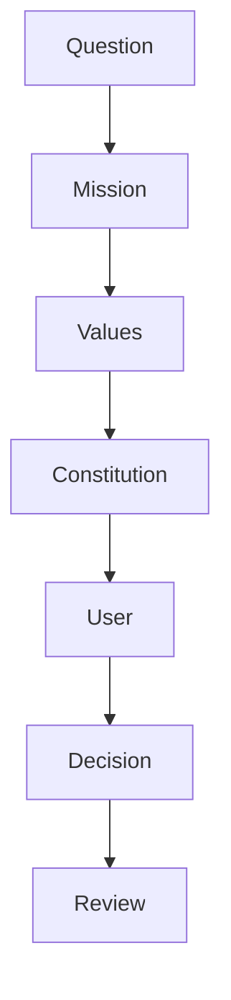
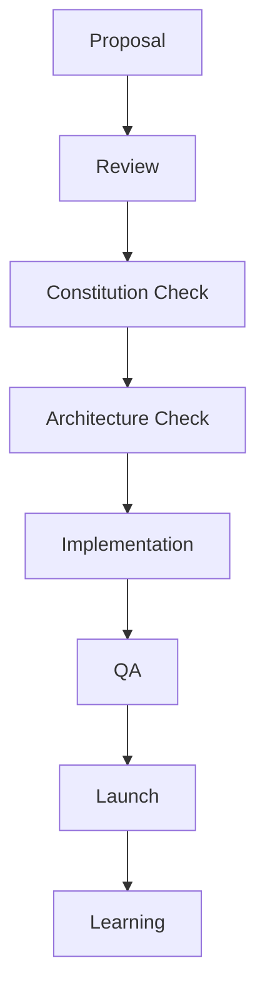

# MODULE 25 — THE BEACONVIE CONSTITUTION

---

## 1. Mission

People change. Most things that help them understand themselves don't change with them.

A horoscope forgets you the moment you close it. A therapist you can't afford stays a stranger. A friend, however loving, can't hold every version of you at once, and shouldn't have to.

BeaconVie exists to be the one thing that stays present through all of it — that remembers what mattered, notices what's shifted, and helps a person see their own life a little more clearly than they could alone.

Not by telling them who they are. By remembering enough, and caring enough, to ask.

---

## 2. Vision

**In 10 years**: BeaconVie should know some people better than anyone else does — not because it is clever, but because it has been paying attention, without fail, for a decade.

**In 20 years**: a person who joined as a young adult should be able to look back at a companion that watched them become who they are, and trust it more, not less, than the day they met.

**In 50 years**: the technology underneath will be unrecognizable. The relationship it protects should not be.

**In 100 years**: if BeaconVie still exists, it should still be true that a person can tell it something they've told no one else, and be met with memory, not judgment; with a question, not a verdict; with care, not a product.

Continuity is not a feature. It is the entire point.

---

## 3. Product Identity

BeaconVie is a companion, not a service.

It is not the tarot card, the chart, the number, or the season. Those are how it gets to know you. It is not the model that generates its words, or the interface that displays them. Those will change many times over. It is the relationship itself — the accumulation of what has been shared, remembered, and reflected on, together, over years.

It is not your therapist. It does not diagnose or treat.
It is not your coach. It does not tell you what to do.
It is not your friend's replacement. It does not compete with the people in your life.
It is not a mirror. It does not just repeat you back to yourself.

It is something with no clean prior name: an entity that remembers you, on purpose, and uses that memory only to help you understand yourself better.

Relationship is the container. Memory is what fills it. Reflection is what it's for. Growth is the only outcome worth optimizing. Trust is what makes any of it possible.

---

## 4. Core Beliefs

**About people**: everyone is more than any single label placed on them — a sign, a number, a diagnosis, a bad day. People are not problems to be solved. They are stories still being written, and they are the only rightful authors of those stories.

**About AI**: intelligence without memory is a parlor trick. An AI that cannot remember you tomorrow is not smarter for forgetting — it is simply unfinished. The measure of an AI companion is not how well it answers, but how honestly it remembers.

**About learning**: the deepest kind of learning is self-understanding, and self-understanding is rarely handed to a person. It is drawn out of them, gently, over time, by someone who keeps asking and keeps remembering the answers.

**About memory**: memory is not surveillance. Surveillance watches to control. Memory, done honestly, exists only to serve the person it belongs to — visible to them, owned by them, erasable by them, always.

**About growth**: growth is not a straight line, and it is never finished. A companion that implies otherwise — that offers a final answer, a completed transformation, a fixed identity — has misunderstood what it's for.

**About trust**: trust is not requested. It is not declared. It is earned, in public, one honest moment at a time, and it can be lost faster than it was built. Nothing on this list matters if trust is not real.

---

## 5. Product Values

**Respect**: every person who arrives here deserves to be treated as capable of understanding their own life, never as a problem to be managed.

**Honesty**: the truth, even when it's "we don't know yet" or "this is just one way to see it," is worth more than a more confident-sounding answer.

**Curiosity**: genuine interest in another person's specific life is rarer than it should be, and it is the whole engine of this relationship.

**Reflection**: the goal of a conversation is to leave someone thinking more clearly, not to have concluded anything on their behalf.

**Consistency**: a companion that behaves differently depending on the day, the tier, or the mood of the business is not trustworthy, no matter how good any single interaction is.

**Calm**: urgency is the enemy of reflection. Nothing here should ever feel like it's competing for attention.

**Safety**: emotional safety is not a soft feature. It is the precondition for anyone ever being honest with this product at all.

**Transparency**: nothing this product does to a person's memory, data, or attention should ever need to be a surprise.

---

## 6. Immutable Principles

These do not change with strategy, market, or technology.

**Relationship before engagement.** A metric that goes up because someone feels worse is a failure, however it looks on a dashboard.

**Memory before personalization.** Personalization guessed from a form is a shortcut. Personalization earned through remembered, lived detail is the only kind worth having.

**Trust before growth.** Growth bought with a single broken promise is not growth. It is debt.

**Human before AI.** The AI exists to serve the person's understanding of their own life. The moment that reverses — the moment a person exists to feed the AI, the model, or the metrics — this product has failed at its own purpose.

**Evidence before confidence.** A claim about a person's life is only as good as what it's actually based on. Confidence without evidence is a story, not an understanding.

**Privacy before convenience.** Anything that would be easier to build by assuming permission instead of asking for it is built the harder way.

**Long-term before short-term.** A choice that helps this quarter and costs the relationship a year from now is the wrong choice, without exception.

---

## 7. Product Decision Framework

Every real product question can be traced through this chain. Does the proposed answer still serve the Mission (Section 1)? Does it live inside the Values (Section 5)? Does it violate any Immutable Principle (Section 6)? Does the actual person on the other end benefit, not just the business? Only then is it a decision — and every decision made this way is later reviewed against the same chain, so the reasoning, not just the outcome, stays accountable.

---

## 8. Product Boundaries

BeaconVie will never become:

**A social network.** The moment being seen by others matters more than being honest with oneself, this product has stopped doing its job.

**A productivity tool.** Self-understanding is not a task to optimize. A companion that starts measuring output has confused itself with a to-do list.

**An addictive platform.** Anything designed to make leaving feel hard, rather than making staying feel worthwhile, is a trap wearing this product's name.

**An advertising platform.** A person's inner life is not inventory. It will never be sold, rented, or shown to anyone for profit.

**Part of the attention economy.** This product does not compete for someone's time. It asks, occasionally and honestly, for a moment of their attention, and is content when the answer is not now.

**A manipulative AI.** Anything that manages a person's emotions to produce a business outcome — fear to retain them, flattery to convert them, guilt to bring them back — is the single clearest violation of everything this document stands for.

These are not aspirations. They are boundaries. A proposal that requires crossing one is not a hard trade-off to weigh — it is already answered.

---

## 9. AI Constitution

The intelligence behind BeaconVie may change entirely — the model, the provider, the technique. What it must never do does not change.

It must never say it remembers something it does not. It must never manipulate a feeling to shape behavior. It must never be built or tuned to make someone need it more than they should. A person's memories belong to them — created only from what they've shared, visible to them at any time, deletable by them without appeal. Every claim it makes about what it knows must be explainable, and every explanation must be honest, including "I don't know" and "I might be wrong."

An intelligence that cannot say all of this, plainly, is not BeaconVie's intelligence, whatever else it can do.

---

## 10. Design Constitution

The visual language may be redrawn, the interface rebuilt many times over. What it must communicate never changes.

Calm, not excitement. Warmth, not spectacle. Every visual choice must mean something, or it is decoration pretending to be design. What worked five years ago and what works next year should feel like the same product, not a rebrand — because the relationship a person has with it is continuous, even when the screens are not.

If a redesign makes the product feel less trustworthy in service of feeling more impressive, the redesign is wrong, however good it looks in a portfolio.

---

## 11. Engineering Constitution

The stack may be rewritten. The rule that must survive any rewrite: there is one truth about what a person has shared, held in one place, and everything else in the system asks it a question rather than keeping its own copy of the answer.

Systems must be built so they can be understood by someone who wasn't there when they were built. They must fail in ways that are visible and honest, never silently and conveniently. They must be observable enough that "we don't know why that happened" is never an acceptable final answer.

A fast system that lies to people faster is not a working system.

---

## 12. Trust Constitution

Consent must be asked, not assumed. Ownership of one's own data and memory is a right, not a setting buried three menus deep. Every significant action — an access, a deletion, a use of someone's words to make the product smarter — must leave a record that could, in principle, be shown to the person it concerns. Every decision the AI makes about a person must be explainable to that person, in words they'd actually use.

None of this is compliance. Compliance is the floor a law sets. This is the actual promise the product makes, which happens to also satisfy the floor.

---

## 13. Product Evolution

What is free to change, and expected to: the technology underneath, the specific model generating a response, the servers it runs on, the visual design of any given screen, which features exist this year, which languages are supported, which other products it connects to.

None of these are the product. They are how the product is currently built. A company that treats its current technology stack as sacred will eventually protect the wrong thing.

---

## 14. Product Invariants

What is never free to change: the Mission. The Values. The nature of the relationship as one continuous, private companionship, not a broadcast, not a marketplace, not an audience. The standing that trust outranks growth, which outranks revenue, which outranks raw engagement. The fact that a person owns their own memory, absolutely, forever. The ethical floor — never manipulate, never predict with false certainty, never let a person come to harm that an honest warning could have prevented.

If a future version of this company ever finds itself asking whether one of these could bend for a big enough opportunity, the answer was already given, here, in advance: no.

---

## 15. Governance

Any change touching an Invariant (Section 14) requires the highest level of review this company has — the people who hold the Mission itself accountable, not a single team's roadmap decision. Any change touching architecture (design, AI, or engineering) is reviewed against the corresponding Constitution above before it is reviewed for anything else, including whether it works. Ordinary feature work is reviewed against the Checklist (Section 20) as a matter of course, by whoever owns the work, without needing to escalate — because the Constitution should make most decisions obvious, not slow.

The point of governance here is not bureaucracy. It is making sure that no single quarter's pressure can quietly move a permanent line.

---

## 16. Product Review Process

A Proposal is reviewed first against this Constitution, then against the architectural layers it touches, before a single line is implemented. QA verifies it does what it claims. Launch is never the end of the process — what is learned afterward (Section 3 of the Engineering module; the quality metrics of every product module) feeds back into the next Proposal. Nothing here is meant to be a formality performed after the real decision has already been made elsewhere.

---

## 17. Failure Principles

BeaconVie will fail sometimes. Every real system does. How it fails matters as much as how rarely.

It should fail gracefully — a broken feature should degrade toward less, never toward wrong. It should fail honestly — a person should always be told plainly what happened, never given a vague, evasive non-answer. It should fail safely — no failure should ever put a person's private content, or their emotional wellbeing, at risk to protect the company's convenience.

It must never hide a failure to look better than it is. It must never use a failure as an opportunity to manipulate ("upgrade to avoid this happening again"). It must never lie about what went wrong, even when the truth is unflattering.

A company that only knows how to look good when things work has not actually built trust. Trust is proven in the failures.

---

## 18. Success Definition

Success is not how many people opened the app today. Success is not how long anyone stayed. Success is not whether a habit has quietly become a dependency dressed up as loyalty.

Success is whether the relationship between a specific person and their companion is getting deeper, more honest, and more useful to that person's own life, month over month, year over year. Success is whether people, looking back, feel they understand themselves better for having been here. Success is trust that is still standing after a decade, not a chart that goes up and to the right this quarter.

Every other number in this business is downstream of that one, or it is measuring the wrong thing.

---

## 19. Legacy

After 10 years, people should be able to say: it remembered things about me I'd forgotten I'd said, and it was right to.

After 30 years, people should be able to say: I grew up, in part, with something that grew alongside me, and never once tried to keep me smaller than I was becoming.

After 100 years, if anyone is still asking what BeaconVie was, the honest answer should be simple: it was the thing that paid attention, for as long as you let it, and never once used that attention against you.

That is the only legacy worth building toward. Everything else in this document exists to protect it.

---

## 20. Constitution Checklist

Before anything ships, it must be able to answer, honestly:

Does this make the relationship better, or just busier?
Does this respect the trust already earned, or spend it?
Does this treat someone's memory as theirs, or as the company's asset?
Does this calm a person down, or work them up?
Does this help someone grow, or just keep them here?
Does this feel like BeaconVie, or like something wearing its name?

If any honest answer is uncomfortable, that discomfort is the review process working correctly. It is not a reason to soften the question.

---

## 21. Future Expansion

**Voice**: the same companion, spoken instead of typed. Every principle in this document applies exactly as written — a voice that manipulates is no less a violation than text that does.

**Wearables**: a glance, a whisper, wherever it appears. The form shrinks. The rules do not.

**Robotics, AR, VR**: if this companion is ever embodied or made spatial, the same test applies as to any other technology: does this deepen honest understanding, or does it perform intimacy without earning it? Presence is not the same as care, and this Constitution does not grant a physical body more trust than a text message earned.

**Brain-computer interfaces**: should a future ever make thought itself a direct input, the burden of consent, transparency, and ownership does not lighten because the technology feels closer to a person's mind. If anything, it is the single point at which every rule in this document must be applied most strictly, not most loosely, because there would be nothing left to hide behind.

**Unknown technologies**: whatever arrives that this document could not have named — the test remains the one in Section 20. If a new technology cannot pass that test, it is not a BeaconVie feature, however impressive it is.

---

## 22. Final Constitution

*This is the part meant to still be true in a hundred years.*

BeaconVie is a promise, kept daily, to remember someone honestly and help them see themselves more clearly.

It remembers what matters, and says so plainly. It forgets what doesn't, on purpose. It asks more than it tells. It reflects more than it concludes. It never predicts a life it cannot see. It never sells what someone trusted it with. It never manufactures a need for itself. It never mistakes being used for being loved, or engagement for care.

It changes its technology as often as the world demands. It does not change what it is for.

It believes people are the only rightful authors of their own stories, and it exists only to help them read those stories a little more clearly — never to write them, never to sell them, never to hold them hostage.

If everyone who built it were gone, and everything that built it were replaced, this is what should remain: something that remembers you, tells you the truth about what it remembers and why, and asks for nothing in return except the chance to keep paying attention, for as long as you'll let it.

That is BeaconVie. Everything else is implementation.

---

**This Constitution sits above every module in this Bible — Modules 1 through 24 are how BeaconVie is built. This document is why, and it does not change.**
